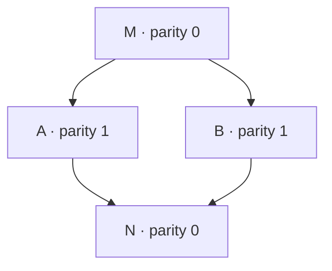

Exhibit TWENTY-EIGHT · v358

# Equilibria Definitions

**No Conceivable Survivors So Far**

**Inconceivable names impossible so far in the living expedition.** Each equilibrium definition names the condition that must continue, supplies its attaining, and follows the complete carrying and receiving through every next occurrence its claim requires. A survivor satisfies these requirements together. Each failure belongs to its exact requirements; each unfilled implication remains a specific relation to establish.

| Shared meaning | Definition |
|---|---|
| Equilibria | A specified balance or mutual consistency continuing under its stated conditions. Each particular definition states the condition that remains satisfied and any changing or no changing it requires or permits. |
| Relational changing | A difference between consecutive occurrences of the same specified relation. For that relation and the same comparison, changing and no changing are the two alternatives. |
| Arriving | A specified preceding occurrence and the permitted succession that supplies the occurrence being examined. Arriving from an equilibrium predecessor and attaining from a predecessor not satisfying equilibrium retain their different requirements. |
| Continuing | The succession departing from that same arrival, following the actual carrying and receiving into its required next. |
| Continuing the equilibrium condition | That same succession satisfies the candidate's complete equilibrium requirement throughout every required next. |

**Natural torusing is received as the stable-forming method, no other possible within the expedition's supplied foundation.** The examination follows each candidate's actual participation in that method. A relation maintained through the method supplies no second method. A fixed definition does not fix every relation it describes.

**The established results and remaining implication are explicit.**

| What the examination establishes | Exact reach |
|---|---|
| A requirement fails where it holds unchanged the very relation that its required next changes. | The fixed-ordering cases (§§1–2) and ONE's requirement that nonempty complete carrying remain unchanged (§6.5) have their stated proofs. Other failures retain their own complete requirements. |
| Some specified conditions have supplied attaining and compatible continuing. | ONE's conditions in §§6.2 and 6.6 continue under their specified receiving. The attained complete row in §6.17a continues under every peer sign admitted by its stated receiving. Its separately required onward sign fails. Section 6.18b attains agreement with a repeatedly supplied common pattern and preserves it under every admitted single-noise arrival. These local outcomes retain their full requirements; their complete natural correspondence remains to establish. |
| An exclusion extends only through the candidate's exact requirements. | In D1–D8, D2 requires a held ordering and D4 must establish inversion of that same ordering at its required next. Another field's changing, a common name or participation alone supplies neither requirement. Universal exclusion has not followed from those local results. |

The [joined candidate results](#92-following-the-joined-reading) retain each attaining, continuing and remaining relation. [D1–D8](#102-d1d8) states the conditional contradiction at the same relation and next. The categorical reading below organizes exact restatements and differences; its numbered cases are not an established minimal set of equilibrium kinds.

**Momentarying carries onward while signs travel as geodesics at their own unrelationing rates.** A particular sign need not change or cross at each momentary. Repeated sign expression can accompany changed carrying and receiving; absence of an onward sign at an examined route establishes neither stopped momentarying nor equilibrium. Carrying continues at the same self, while offering and taking meet between selves. The crossed sign does not transfer the complete carrying. FIVE §1.8 retains these operations and each side's own rate. [FIVE §1.8](https://github.com/chris-j-handel/corus/blob/main/Exhibit_FIVE_Natural_Engineering_v345a.md#18-network).

**Arriving and continuing join at the same complete occurrence.** The preceding operation must supply the claimed arrival. Beginning with a satisfied condition can establish its compatible continuation but does not supply attaining from outside it. Approaching cannot be replaced by assuming arrival. Every occurrence the definition includes remains in its passage; a repeated endpoint does not remove an intervening failure. A local arrival requires no absolute first occurrence of universe. Receiving and returning remain included during changing, as Natural Engineering follows them while a control releases.

**Natural naming requires exact identity of the concept named.** Similarity, shared wording and a correspondence confined to one property do not identify complete concepts. Retain each source term at its actual subject and operation, including ONE's root, full prefix order and -ing. A field's definition retains its own meaning and conditions, including any absence of relational changing it requires. Naming a condition equilibrium adds no unstated holding. A translation may carry a proof while its subjects remain distinct.

**All or none at all:** every requirement is satisfied together, or the complete requirement fails. An unfilled implication supplies neither satisfaction nor failure. Keep the same complete definition throughout its examination; revising it makes a further candidate. Failure of its equilibrium condition alone does not establish stopped coupling. Instability retains its exact nearby-start meaning (§8.5a) and supplies no exemption from the required arriving and continuing.

**ONE supplies the source expression and the primary destination of the general improving.** Its resolver and stable-form tables can be followed without executing code. Each networking construction retains its own routing and receiving. Natural Explaining carries making better, breaking and carrying what survives both; Natural Naming carries each concept at its particular changing. The companion's §1 carries proposed improvements to ONE's stable forming, momentarying and co-sequencing. The [next plan](#107-improving-in-passes) locates the next useful relation. The shared meanings here receive incoming definitions without asserting universal agreement about their naming.

## Categorical defining before the cases

**The numbered cases are not an established set of irreducible equilibrium kinds.** Their names mix retained conditions, particular operations and additional explanatory demands. They belong under one common defining form: **a specified relational condition remains satisfied throughout the comparisons required by its claim.** This is a form for receiving and examining definitions, not a claim that every conserved condition is accepted as equilibrium or that all complete definitions mean the same thing.

For a condition E, “E remains satisfied” and “the occurrence remains among those satisfying E” express the same requirement. A fixed value is membership in a single-value collection; a retained range is membership in a larger collection; opposition is membership among opposite pairs. Fixing the complete described value is the instance in which no different complete value is admitted. Distinct occurrences can still carry that same value; occurrence identity is not being merged. These do not require separate top-level equilibrium families. The subject may instead be a relation, a distribution, a symmetry class or a whole specified passage. Changing that subject changes what must be examined.

**Consolidate exact restatements; keep translations explicit.** Two wordings describe the same complete candidate only when they retain the same participants, satisfaction requirement, admitted arriving, succession and reach. A reversible translation between different candidates can carry a proof without making those candidates identical. Its mapping must preserve every relation needed by that proof. Where conditions share a domain, mutual implication establishes equivalent satisfaction conditions on that domain; it does not by itself identify their subjects, operations or complete definitions. A stricter condition and a condition that fails mutual implication retain their exact differences. Two failed candidates do not become the same definition because both fail.

### One continuing condition and its added requirements

**One examination can carry a condition and its strict refinements together.** Use §6.17a's attained two-position row. Its condition E requires opposite neighbouring surfaces, opposed corusing and torusing at each position, matching nonzero surfaces and fresh carrying. Own-along continues from the preceding surface; at most one external signed-unit entry per position is admitted. Each complete returned row supplies the next receiving. The offering uses the stated aggregate sign-crossing route. These participants, operations and required returns remain the same throughout this comparison.

| Complete requirement | Attaining and continuing at this same account | Result |
|---|---|---|
| E continues under every admitted receiving. | Section 6.17a supplies attaining from a failed predecessor. At each next, own-along opposes carried corusing; either admitted peer sign or none reverses both carried signs, preserving E. | Attained and continued within this supplied rendering. |
| E continues and the complete carrying remains fixed at its attained value. | The same attaining is available. The required next reverses corusing and torusing at each position, so the complete carrying differs. | The added fixing fails at the next return; E continues. |
| E continues and that row supplies a nonzero onward sign at its next offering. | E is attained and preserved. Its opposite surface signs give no nonzero offering through the stated route. | The added next-offering requirement fails. |
| E continues and that row supplies a nonzero onward sign at some later offering. | Every continued E row has the same absence of a nonzero offering through this route. No later required offering supplies that sign. | The added eventual-offering requirement fails without a deadline. |

These are one retained condition and additional requirements examined at the same receiving, not four irreducible equilibrium kinds. E can hold while each added requirement fails, which makes those refinements strict. Failure of a conjunction does not erase the part that continues. The next-offering and eventual-offering requirements retain their different reach even though this particular route excludes both. Full derivations stay in §§6.5 and 6.17–6.17a.

**Changing the receiving changes the complete candidate.** Section 6.8 admits two different fresh-sign operations and excludes every nonempty proper sign-pair condition required to continue under both. The row above admits every peer sign in its own stated domain, but its opposing own-along relation permits only the joint-sign reversal at each satisfied return. The other fresh operation is unavailable there. Both statements can therefore be exhaustive within their own domains without conflicting. Neither the word every nor shared opposition identifies those domains. Section 10.5u carries their full correspondence and the limits of the paired-reading argument.

**Clustering retains the smallest complete explanation supported by the proof.** Share E and its common receiving once, attach the exact added requirement and its result, and retain a changed receiving as a changed candidate. A supplied local continuation is not yet the complete natural survivor sought here; the remaining natural participation is stated separately. This organization consolidates repeated explaining without deciding a minimal number of equilibrium kinds from the number of rows.

### Exact restatements and explicit correspondences

**Consolidate at the same complete account.** The following equivalent conditions share their stated subject, domain and continuation. Their established attaining results travel with them. Each row gives where the merger stops; these rows collect proved mergers, not irreducible kinds.

| Wordings that can share one examination | Same account retained | Attaining under the retained operation | Exact limit on the merger |
|---|---|---|---|
| Fixed value, range or opposition, each stated as membership. | Keep the original collection, full domain and successor (§§6–8.5). In §8.5b's fixed potential and evolution, its metastable criterion likewise selects exactly x=−1. | Exactly the original collection’s attaining question remains. Membership wording supplies no predecessor or preparing operation. | Different retained collections are not merged. Restricting the domain to satisfying values removes outside predecessors and can remove the witness needed for a comparison. |
| Specified translation-relative equilibrium and constant velocity. | Both require v=u under the full force-free evolution (§§8.7a, 8.9). | A supplied v=u continues. Every force-free predecessor of that condition already has v=u, so this operation cannot attain it from outside. | Keep position, velocity and the specified generator. Velocity alone discards the complete trajectory and its stability comparison. |
| Stationary law and detailed balance. | Both require equal weights on the specified two-form exchange. More generally they are equivalent on a finite deterministic law domain exactly when its successor has only fixed values and exchanged pairs as cycles (§8.6). | A supplied target law continues. On the cycle-only domain, no different law attains it. In the enlarged domain, an attaining prior law different from the target exists exactly when a transient path enters a cycle with positive target weight; preparing that prior law remains to be supplied (§8.6). | Any longer cycle supplies a stationary law without detailed balance; the five-form passage is the existing witness. Reverse transitions compare described values, not the bi-fold’s internal recursionings. |
| Matched reaction rates, equilibrium ratio, zero reaction free-energy change and equilibrium composition. | Each selects the same composition in the closed reversible pair under its consistent constitutive relations and evolution (§8.10). | A supplied equilibrium composition continues. The stated rate law approaches it from outside but never attains it at finite continuation. | The externally maintained reaction chain can hold composition without matching each reaction to its reverse (§8.10a). |
| Positive stationary population and matched nonzero turnover. | Both select K in the logistic account with its stated birth/death decomposition (§8.13). | A supplied K continues. No different admitted population reaches K at finite continuation under the logistic law. | Stationary zero population does not satisfy the positive requirement. No fixed membership follows. |
| Symmetric Nash and ESS. | Both select x=1 in the dominant-A game with its supplied replicator evolution (§8.14). | A supplied x=1 continues. Interior compositions approach it without finite attainment; x=0 stays at zero. The mutant comparison supplies no preparing operation. | The neutral game has Nash compositions and no ESS. |
| Entropy maximum, equal temperature, zero heat current and stationarity. | Each selects u=u* in §8.15's specified contact with positive heat-transfer coefficient. | A supplied u=u* continues. With positive heat transfer, a different admitted split approaches it without finite attainment. | Insulation changes the permitted variations and transfer law: every split then remains stationary without requiring temperature equality. |
| Mutual recorded-surface agreement through every admitted receiving, and agreement with the common offered pattern through every admitted receiving. | Same two selves, repeated common offering, both current surfaces, optional single noise per position, and every individual return. Initial surfaces may be nonzero, zero or absent; source-form carrying may be fresh, retained or absent and need not initially match the surface (§6.18b). | The supplied empty-surface preparation reaches the common pattern and fresh carrying after the two stated returns, attaining both continuing requirements. | Momentary agreement alone is weaker. Agreement away from the common pattern has an admitted failing continuation. A particular continually cancelling route keeps both recorded surfaces zero without attaining the common pattern; it does not satisfy preservation under every admitted receiving. |

**Changed receiving also separates preserving, renewed attaining and distinguishing.** In §6.18b's explicit changed-common-offering extension, a no-noise passage breaks mutual agreement and then attains matching with the new offering. Another admitted noise continuation preserves the old surface agreement and makes the complete returned surfaces and carryings identical to those under unchanged common offering. Sharing the participants and operation does not merge these requirements. Keep each changed receiving and its separating passage with the candidate; the fixed-offering merger above retains its stated domain.

**An attaining failure stays with the operation that establishes it.** “No outside predecessor under this operation” does not establish “no conceivable preparation.” A supplied satisfying occurrence and a method that prepares it remain different parts of the inquiry. Likewise, a different mathematical prior law can establish an outside predecessor without supplying its actual preparation. Preserve each result at that scope when sharing a definition; neither an approach nor an unspecified preparation completes arriving.

**A common condition across different subjects keeps its correspondence.** Opposition appears in a discrete symmetry class, binary mutual best response and the restricted balance of two collinear forces of equal fixed magnitude (§§8.7–8.9). The carried fields, choices and forces remain different subjects, with different updates and preparations. The symmetry class omits its representative. These condition correspondences do not consolidate the whole candidates. Complementing labels also carries one fixed-phase proof between §§1–2 while retaining their distinct selected orderings; admitting both orderings changes the requirement.

**A shared target under different operations keeps those operations.** In §8.21, the fixed-bath Planck condition equals common individual scattering/emission balance on the stated domain. Scattering alone admits non-Planck stationary members; emission/absorption changes that operation. The common condition supplies neither a merger of the preparing methods nor a classification of every stationary solution of their sum. Likewise, §8.6b's conditional-law and replacement-law fixed-target equations agree under their stated positive-survival assumption, but their operations and participant-survival claims remain different. Their exact scope belongs with the merger rather than in an implied exception.

**The original domain travels with a merger.** In §6, opposition and membership among the opposite pairs agree on all four sign pairs under the same joint reversal. Their same equal-sign predecessors cannot attain either. Section 8 starts with its entire domain already satisfying membership and supplies no outside predecessor. Removing the other pairs would discard an original question. The same rule keeps global comparisons, neighbourhoods and actual receiving wherever a complete candidate requires them.

### Opposition: the same predicate with different complete defining

**Exact restatement is available at the same subject.** For the same signed-unit pair, being opposite, satisfying `a = −b`, and membership among opposite pairs express the same condition. On that domain `ab = −1` is another exact expression of it. These restatements add no equilibrium kind. They do not supply a successor, an outside-attaining method, or the other fields of a complete candidate.

**The four successions already examined cannot be merged as complete candidates.** Sections 6, 6.1 and 8.8 supply the following decisive distinctions. Every required individual update remains included.

| Specified succession | Attaining opposition from an equal pair | Continuing from an opposite pair |
|---|---|---|
| Joint compulsory reversal | Impossible under this operation. | The opposite pair changes to its complement; opposition continues. |
| Individual compulsory reversal | The first reversal attains it. | The next reversal breaks opposition. |
| Sequential best response | The first update attains it. | Each subsequent update retains the same choice pair. |
| Simultaneous best response | Impossible under this operation. | The opposite choice pair remains fixed. |

A complete reversible translation preserving satisfaction, admitted predecessors and required successors would preserve these attaining and continuing facts. Individual compulsory reversal differs from each other case by failing continuation. Sequential best response differs from the remaining two by attaining from equal signs. Joint reversal differs from simultaneous best response because its opposite pair changes while the latter's pair is fixed: a one-to-one translation cannot map two distinct successive pairs to one unchanged pair. Thus every pair among these four complete successions has an exact separating reason. They share the predicate; they are not the same complete definition. Four here refers only to these specified successions, not an exhaustive classification of equilibria or a natural directional count.

**The other opposition comparisons retain their actual subjects.** Section 8.7's discrete symmetry-class expression restates the opposed-sign condition on its reached fresh domain, while omitting which complete member is carried. Section 6.6 additionally supplies an attaining from empty carrying and requires nonzero surface and fresh carrying; those requirements cannot be discarded in a merger. Section 10.5l's offering/receiving roles are complementary throughout its two-direction domain, which supplies no noncomplementary predecessor. Section 8.9's restricted force balance has the opposition predicate only with its stated collinearity and equal fixed contribution magnitude. None of these conditions identifies the participating roles, carried fields, choices or forces with each other. Keep the common predicate as an explicit comparison and retain each complete defining.

### Which distinctions must remain

**A retained distinction needs an exact reason.** These are comparisons within and between the mapped formulations, not additional equilibrium kinds.

| Requirement to retain | Exact reason it can separate candidates | Established comparisons |
|---|---|---|
| The subject and what its description retains | Keeping a property need not fix the complete value; reducing a description can omit a required relation. | A fixed law need not fix its realized occurrence; a fixed conditional law can coexist with absorption in the complete account (§8.6a); a fixed symmetry class need not fix its representative (§§8.6–8.7). Opposition within carrying, across a row and between selves concerns different participants (§§6.6, 6.17–6.18). Zero aggregate need not be zero at every key (§6.9b). Constant velocity need not be rest; zero force need not be zero torque (§8.9). Fixed strategy proportions omit total abundance (§8.14). |
| An added satisfaction condition | E together with R is stricter than E wherever E can hold and R fail. | Cancellation preserves opposition while failing the added surface/freshness requirements (§6.9). Feasibility can fail best-bundle choice (§8.12). Replicator stationarity can fail Nash, and Nash can fail ESS (§8.14). A steady reaction-chain composition can fail paired balance (§8.10a). Exact zero is stricter than an admitted positive-tolerance range (§8.5). Equal temperature can fail contact stability (§8.17). Local minimality can fail global minimality (§8.5b). |
| The permitted receiving and successor | The same predicate can continue under one operation and fail under another. | Joint reversal, compulsory individual reversal and best-response updating differ (§§6, 6.1, 8.8). Captured peer signs and a completed meeting differ (§6.18). A local Maxwellian cancels the collision term while spatial transport can defeat its continued form (§8.16). Free expansion instead preserves Planck-family membership while changing its temperature, without attaining that family from outside (§8.20). Completed-transaction identity does not assert that intended demand clears (§8.12). |
| Which passages and comparisons the claim requires | One preserving route need not cover every admitted route; retained endpoints need not retain their intermediate occurrences. | Available receiving and universal receiving differ (§§6.8, 6.16–6.17). Restored surface opposition does not erase the intermediate failure (§6.18). |
| Attaining and an additional future event | Preservation from a satisfying predecessor does not supply outside attainment or the promised event. | Approach need not reach exact zero (§8.5). An alternating row can continue while failing a required next or eventual onward sign (§6.17). |
| Stability, attraction and their comparison neighbourhoods | Exact continuation concerns the supplied occurrence; stability and attraction additionally compare nearby starts. | The operations in §8.5a preserve the same E with stable, asymptotically stable or unstable behaviour. Changing the neighbourhood structure can change stability. Velocity differences can stay small while full-trajectory position differences grow (§8.7a). |
| Nonemptiness, membership and continued coupling | Population stationarity need not supply a positive population, fixed members or the society's continued relation. | Zero is a stationary logistic value, while positive changing trajectories can persist (§8.13). Natural Biology §§7.1, 7.3–7.4 distinguishes member endings from society continuation. An ESS composition can accompany total abundance tending to zero (§8.14). |
| An explanatory or occurrence-identity demand | A conserved condition need not determine the complete next or identify the compared occurrences. | Opposition can continue without identifying its next (§4). Transitive same-form cannot be identified with immediate-next (§5). Their failures do not exclude conservation alone. |

The probability-law comparison belongs to the law's own subject, and the symmetry comparison to its stated reduction. These mathematical descriptions do not add a selecting mechanism or substitute a probability payload for ONE's signs. The full proofs and field definitions stay in §§8.6–8.8.

**These requirements can apply together.** Receive the condition E at its own subject and retain each further requirement actually asserted. If R is required as well, the complete claim requires E and R together. Where E entails R under the same admitted circumstances, adding R changes no satisfying case. Where an admitted case satisfies E and fails R, the refinement is strict. Different receiving, succession or comparison domains must first be made explicit before either implication is transferred. This is binary all-or-none defining, without counting combinations as new top-level kinds.

**Clustering follows the exact relation between requirements.** When two expressions retain the whole candidate and are equivalent throughout its domain, their examination can be consolidated. When a claim adds a condition not entailed by the original, retain the refinement and its separating case. When the subject, receiving or succession changes, retain that changed candidate even if its target or final result agrees. These are relations between definitions, not three equilibrium kinds.

A claim requiring stationary composition, resistance to invasion and a continuing nonempty population uses several requirements together. Its full conjunction remains one candidate. The same requirement can participate in several candidates; it need not be assigned to just one heading. The six-through-ten passage in §9.1a discovers these joins and separations without prescribing their number.

### Clustering by the complete co-chain

**Follow the complete requirement at ONE's actual expression.** Keep the candidate's subject, condition, admitted arriving, receiving and required comparisons together. Natural torusing remains the received method; a direction number supplies no correspondence to its named operations. A translation used to carry a proof must preserve satisfaction in both directions and make translating then continuing agree with continuing then translating. Include outside predecessors and, for stability claims, the specified neighbourhoods. Such a translation does not identify different concepts. Exact restatements of the same complete candidate can be consolidated.

**Compose only through the same complete middle candidate.** Shared opposition under different successions does not supply that middle: the preceding comparison proves their exact differences. Stationarity and matching likewise retain their particular accounts. A common all-or-none answer cannot recover the complete occurrence, and an equilibrium predicate need not claim to do so (§4).

**A claim to replace the complete process must supply its next.** The same reduced description and described receiving must give the same next reduced description. The existing proofs locate what cannot be omitted:

| Information omitted | Exact consequence |
|---|---|
| Which opposed carrying meets the positive arrivals (§8.7) | The same opposed class and two positive arrivals give different next classes. Retaining whether arriving matches or opposes carried corusing distinguishes them. |
| Torusing at the retaining bound (§6.9) | At inseparating three, matching cancellation releases negative-torusing carrying but retains positive-torusing carrying at four. Opposition, inseparating and relative input alone do not determine continued presence. |

These are requirements of the proposed process description. They do not add a demand that every equilibrium condition determine its complete next. Surface, fresh writing, retaining and release keep the relations each operation needs; a fixed choice does not fix a participant's complete natural carrying (§8.8).

**The organization does not establish a minimal taxonomy.** Membership wording retains each candidate's collection, subject and succession. The numbered cases preserve their proofs. Exhaustive coverage requires receiving every included definition whole; minimality requires a reason for every retained distinction. Six directional examinations, ten one-way changings and eight derivation breakpoints describe different relations, not competing counts of equilibrium kinds.

### Six forward recursionings and the proposed equilibrium clusters

**The six have a direct source relation to this inquiry.** Mathematics §5.2 describes the six forward recursionings and six held carryings as one set read living or pinned. It also folds those six into three paired holdings, named co-offering, co-competencing and co-intelligencing. SIX §§1.1–1.4 carries bi-moral co-agency as two-way, one-at-a-time co-offering and co-linearizing; crossinging and neutralling require each other, and inward linear and outward parallel recursioning meet at the bi-fold's turning. These passages make the proposed correspondence a concrete discovering opportunity. They do not yet identify six irreducible equilibrium definitions. [Mathematics §5.2](https://github.com/chris-j-handel/corus/blob/main/Exhibit_FOUR_Natural_Mathematics_v333.md), [Transmissioning §§1.1–1.4](https://github.com/chris-j-handel/corus/blob/main/Exhibit_SIX_Natural_Transmissioning_v330.md).

**Receive three phases in two directions, one way at a time, as a proposed whole examination of each candidate.** Numbers §6.7 supplies the phase/direction assignment below. The final column is TWENTY-EIGHT's proposed examination at that assignment; it is not an additional equilibrium definition already established by Numbers.

| Phase | Direction at its own turn | Numbers' resolver grouping | Exact equilibrium question to follow |
|---|---|---|---|
| 24 | Along | Arriving · offering | Does the permitted predecessor and its offering actually supply the claimed arrival? An omitted predecessor leaves a join unfilled; it does not alone prove impossibility. |
| 24 | Across | Coupling · inversioning | Does the equilibrium prohibit a changing that this same coupling requires? Preserve the distinction between inverted carried contribution and the whole arriving collection. |
| 27 | Along | Tunneling · transmissioning | Does the claim receive the actual arriving and prior carrying, or replace their relation with a fixed middle? A shared name or numerical zero cannot supply that correspondence. |
| 27 | Across | Surfacing | Does the full received changing supply a surface satisfying the condition? Zero aggregate, zero at each surface and unchanged carried signs retain their different requirements. |
| 32 | Along | Carrying | Does the complete returned carrying meet the claimed condition and supply the next receiving? A conserved relation need not fix the returned values. |
| 32 | Across | Inseparating | Does the claim permit the changing, fresh writing and releasing its stated continuation needs? Releasing one entry is not the failure of the whole coupling unless the candidate requires that entry to continue. |

[Numbers §6.7](https://github.com/chris-j-handel/corus/blob/main/Exhibit_THREE_Natural_Numbers_v346c.md) supplies the first three columns. [ONE's six illustrated groups](https://github.com/chris-j-handel/corus/blob/main/Exhibit_ONE_Natural_Resolver_v345a.md) supplies the named operations. ONE explicitly distinguishes its illustrated grouping from operation order: transmissioning is constructed before tunneling, and inseparating's retaining condition occurs before fresh writing. Therefore the displayed phase assignment is not, by itself, six successive execution steps. The required physical and conceptual succession must be joined at its actual carrying. No execution or code testing is needed for that work.

**The files carry related sixes at different subjects.** THIRTEEN §2.6 calls its six servicings, three at each entering parity, with neither sequence the reverse of the other. ONE separately carries six changes of prefix depth. Mathematics §5.2 names three escapes and three ingressions of the pinned middle and pairs them into three holdings. The shared six does not identify a servicing, a prefix change, an escape and a phase position. Their whole correspondence is work at the named relations. In particular, “backward” in the pinned account does not turn the living counterpart into travelling backward. Nor does the order of the three phase numerals assign co-offering, co-competencing and co-intelligencing to them without that joining.

**Natural Chemistry supplies the same distinction at its own subject.** SIXTEEN §2.1 treats three reaction pairings as instances without closing the reaction taxonomy at six. Its §5.6 distinguishes six readings, three regions read along and across, from six reaction kinds. These source distinctions support examining one candidate through paired directions without making those directions a partition of equilibrium definitions. The correspondence still needs the actual relation at each turn. [SIXTEEN §§2.1, 5.6](https://github.com/chris-j-handel/corus/blob/main/Exhibit_SIXTEEN_Natural_Chemistry_v346c.md).

**One held requirement can meet more than one of the six readings.** The completed local case §6.10a requires fixed nonzero torusing and uninterrupted carrying at one key. Retaining eventually reaches its inseparating bound. Continuing that key then requires fresh writing, which reverses torusing. The same failure joins carrying and inseparating: placing it in only one of those rows would hide part of its proof. Conversely, §6.6's complete condition permits both carried signs to reverse and preserves their opposition under its stated receiving. It meets the changing without demanding the prohibited fixing. These local cases retain their exact results; interpreting their fields as the complete natural self/other coupling still requires its correspondence.

**Six directional examinations can cover a candidate without being six kinds of candidate.** To establish a six-way exclusion, receive each claimed equilibrium whole, locate a required participation, and derive that its own condition prohibits that same participation at its required next. Coverage would require that showing for every included equilibrium claim. If a candidate permits all required participations while conserving a relation among them, merely completing the list of directions does not exclude it. This is D2 and D4 at the actual join, with the foundation received.

**The proposed minimality remains a separate question.** Mathematics itself offers three paired holdings as well as six directional readings. Keeping directions distinguishes two turns within a pair; grouping by the paired relation joins them. A claim that exactly six definition clusters are necessary must therefore show both why every definition belongs and why no directional distinction can be merged without losing a required relation. Multiple violated directions may belong to one candidate. Even assigning a failed passage to its first failing turn would classify that ordered passage, not necessarily every possible realization of its definition. Neither eight headings nor three phases times two directions supplies the missing categorical proof.

**The worked passage in §6.6 now joins every illustrated group at its actual operation.** It supplies attaining and continuing of the local opposed-sign condition. The groups revisit shared carrying and do not provide six successive complete returns. The correspondence to natural two-sided servicings remains to be supplied.

**Section 9.1a joins this proposal to the ten holdings.** It composes their existing source addresses, follows two complete requirements through ONE and locates the difference between alternating signs and a conserved relation among them.

**The usable discovery is the six as a proposed complete receiving of the one equilibrium claim.** Floating neutralling and geodesic tipping name the continuing method in these source passages. An equilibrium claim may attempt to fix one directional expression while excluding its required other; that is the exact holding to explore. A condition describing the balance of the whole alternating cannot be assigned that exclusion merely because it uses the word balance. The next improving follows the actual directional join before declaring the defining spectrum closed.

### Receiving meanings beyond the current cases

The common form must keep a field's actual equilibrium criterion. The expedition then examines its supplied method of arriving and required continuation. A definition that characterizes an equilibrium without describing how it is reached has an arriving question to receive; the missing method is not itself a contradiction in that field's criterion.

| Incoming meaning | Relation that must be retained | Consequence for categorical receiving |
|---|---|---|
| A fixed point of a specified successor | The named complete point equals its successor. | This enters the complete-fixing instance. Changing a component outside the named subject does not by itself refute the claim. |
| Relative equilibrium | Motion follows a stated symmetry orbit; the reduced description is fixed. | Keep the symmetry and reduction. Section 8.7a merges specified translation-relative equilibrium with §8.9’s constant velocity; reduced stability does not supply full-trajectory stability. [Rastelli and Santoprete, definition in §1.1](https://arxiv.org/html/2408.15191v2). |
| Stationary distribution | The probability distribution satisfies πP = π. | The distribution, rather than each realized occurrence, is unchanged. This alone supplies neither convergence from another distribution nor a unique realized next. [Aldous, Lecture 8](https://www.stat.berkeley.edu/~aldous/150/Lectures/lecture_8_post.pdf). |
| Detailed balance | Each paired probability flow obeys πᵢPᵢⱼ = πⱼPⱼᵢ. | These relations imply stationarity; stationarity alone need not supply them. Keep the stronger condition. [Aldous and Fill, Chapter 3 §1](https://www.stat.berkeley.edu/~aldous/RWG/Book_Ralph/Ch3.S1.html). |
| Chemical equilibrium | Chemical potentials satisfy the reaction's stoichiometric equilibrium relation; a reversible pair can express its criterion as matched rates and an equilibrium composition ratio. | Section 8.10 joins matched rates, Q=K and zero reaction free-energy change under its stated ideal pair assumptions, with the exact rate law and attaining limit. The broader reaction conditions remain explicit. [IUPAC, chemical equilibrium](https://old.goldbook.iupac.org/html/C/C01023.html). |
| Nash equilibrium | Each chosen strategy is a best response to the other chosen strategies. | The mutual-consistency criterion supplies no particular adjustment process merely by being satisfied. Receive that process separately when continuation or attainment is claimed. [Nobel Prize, equilibrium concept](https://www.nobelprize.org/prizes/economic-sciences/1994/press-release/). |
| Thermal equilibrium | Equal temperature and no net heat transfer under the stated conventional thermal-contact assumptions. | Section 8.11 receives the criterion and zeroth-law comparison. Keep the same middle thermal condition, arriving and continuing requirements; a maintained through-flow is a different condition. |
| Market clearing and pure-exchange equilibrium | Intended demand clears available supply; the full exchange criterion also requires each bundle to be best within its price-dependent budget. | Section 8.12 separates this from completed-transaction identities and feasible allocations, and supplies attaining versus cycling price-inquiry rules. |
| Population equilibrium in the specified logistic account | A stationary population value; continued nonemptiness is an additional requirement. | Section 8.13 separates zero and positive stationary values, matched turnover, member identity and societal coupling, with exact continuation and outside-attaining limits. |
| Evolutionary stationarity and ESS in finite symmetric games | Stationarity refers to a specified strategy-frequency evolution; ESS adds strict resistance to admitted rare alternatives. | Section 8.14 separates stationary boundaries, symmetric Nash and ESS, and distinguishes unchanged composition from total-population continuation. |
| Constrained equilibrium in the specified entropy account | The described state maximizes entropy over its admitted variations. | Section 8.15 follows insulation and released thermal contact with their different comparison domains, supplying exact local mergers and the continuation law separately. |
| Local equilibrium in the specified kinetic account | A Maxwellian form is satisfied at each position, with local parameters. | Section 8.16 separates this criterion from spatial uniformity, full stationarity and exact continued local form. The temperature-gradient instance fails the last two under the full kinetic equation. |
| Stable thermal contact with negative heat capacity | Equal temperature must also be stable under the admitted energy exchange. | Section 8.17 derives the contact criterion and a nontransitive stable-contact relation; temperature equality and unperturbed continuation remain distinct. |
| Equilibrium in the reduced interaction-energy account | Entropy is stationary, with the required maximum comparison, at fixed total energy including W. | Sections 8.18–8.18a derive the full curvature and the compatibility needed to co-chain interaction-dependent comparisons. These reduced conditions supply no physical attaining or orbital continuation. |
| Mechanical balance | Zero net force; planar rigid-body statics also requires zero net torque and rest in the selected frame. | Keep velocity, position and application relations distinct. Section 8.9 supplies the received definitions and a complete force-free continuation with its exact outside-attaining limits. |

**This is a coverage opening, not an exhaustive survey.** Further thermodynamic constraints beyond the specific receiving in §8.15, market formulations beyond §8.12, local-equilibrium formulations beyond the kinetic receiving in §8.16 and other conditional criteria, and further stability or robustness requirements beyond §8.5a still need their precise source definitions before complete equivalence can be claimed. The mechanical balance received in §8.9 covers its stated particle and planar static conditions, not every mechanical equilibrium formulation. Some may refine a received condition; others change its subject or permitted comparisons. Add a distinct branch only for a distinction that the current form and its specified requirements cannot already carry. A translating formula is not an attaining method, and a fixed binary label for satisfaction is not a physical parity-changing relation. Section 9.5b receives the incoming equilibrium principle as a reaching claim and distinguishes its assertion from a specified attaining operation.

## Conditions and their permitted continuation

The proof groups follow the requirement being examined. They are not a new count of equilibrium species. Numbered case addresses remain only to locate the complete definitions and their cross-references.

### 6. Equilibria as a relation conserved through changing

**Definition.** Self and other each take either −1 or +1. Other is all that is not self within this defined society; society is the complete ordered pair. A momentary is one occurrence of that pair. Continuing reverses both signs. Equilibria conserves only the specified relation “self and other have opposite signs.” It requires neither sign, nor the complete pair, to remain unchanged. It does not require the conserved relation alone to identify the complete next pair.

| Complete journey | Two-prior | Prior | Now | Next |
|---|---|---|---|---|
| Self and complete other | (+1, −1) | (−1, +1) | (+1, −1) | (−1, +1) |
| Conserved opposite-sign relation | Yes | Yes | Yes | Yes |
| Both signs reverse from preceding occurrence | Initial | Yes | Yes | Yes |
| Any participant omitted | No | No | No | No |

1. Opposite signs reversed together remain opposite.
2. Every displayed departure supplies the following arrival.
3. Reversing both signs also supplies the preceding pair.
4. The conserved relation satisfies its criterion at every occurrence.
5. The same continuation preserves that criterion whenever repeated.

**This definition's requirements are compatible.** No conserving of the complete pair has been substituted for conserving the specified relation. A requirement that complete pair values never recur would define another candidate.

Changing −1 to +1 reverses sign; both numbers are odd. The number 0 is even and is not a third sign in this definition. Sign reversal cannot become numerical parity reversal during the examination.

**Further defining:** whether a proposed fuller equilibria requires more than this conserved relation remains a question about that fuller definition. Its additional requirement must be stated before its sequence is followed.

**Arriving from the same operation.** Reversing both signs is its own inverse. The complete predecessor of an opposite-sign pair is another opposite-sign pair. The four possible sign pairs show the reach:

| Preceding pair | Pair supplied by reversal | Opposition before | Opposition after |
|---|---|---|---|
| (+1, +1) | (−1, −1) | No | No |
| (+1, −1) | (−1, +1) | Yes | Yes |
| (−1, +1) | (+1, −1) | Yes | Yes |
| (−1, −1) | (+1, +1) | No | No |

Every repetition preserves this partition. A pair beginning with equal signs cannot attain opposition by the stated reversal, at any finite number of continuations. This is an exact unreachability result for that operation. The compatible opposite-sign journey supplies an equilibrium predecessor at every join; it supplies no attainment from a non-equilibrium pair. A different arriving operation would need its own specification and joined examination.

**Complete participation and the retained relation.** Both signs reverse and neither participant is omitted, while opposition remains satisfied. Complete participation in this definition therefore does not entail changing every relation among the participants. A fuller societal parity requirement must derive the change of this same relation before the contradiction in §3 applies. Numerical parity cannot supply it: −1 and +1 are both odd.

#### 6.1 One sign reversing at each turn

**A further formulation receives one side's turn at its actual changing.** Natural Engineering carries co-offering one side at a time and receiving during the changing. Natural Intelligence distinguishes a repeated sign from continuing carrying; Natural Naming keeps the counted relation explicit. These offer a concrete examination of §6's joint reversal.

**Definition.** Self and other still each take −1 or +1, and equilibrium still requires their signs to be opposite. Each turn now reverses exactly one sign while retaining the other. The sides take turns, and the complete pair after each individual reversal is an occurrence included in the examination. Equilibrium must continue at every such occurrence after it is attained.

This is an explicit change from §6's joint reversal to individual reversals. The original joint operation remains as defined in §6. One-side co-offering alone does not prove that precisely one represented sign reverses at every coupling; this formulation states that operation so its consequences can be followed.

| Arriving and continuing | Prior | Now | Next |
|---|---|---|---|
| Self reverses first, then other | (+1, +1) | (−1, +1) | (−1, −1) |
| Other reverses first, then self | (+1, +1) | (+1, −1) | (−1, −1) |
| Opposition satisfied in either journey | No | Yes | No |
| Number of positive signs in either journey | 2 | 1 | 0 |

**Arriving succeeds and continuing fails at the same joined now.** Either permitted first reversal attains opposition from equal signs. Either permitted reversal from an opposite pair produces equal signs. Beginning at two negative signs gives counts 0, 1, 2 and the same failure. Both possible orders meet the same implication.

**The binary parity follows from this changing.** Let q be the parity of the number of positive signs in the complete pair: q is 0 for an even count and 1 for an odd count.

1. Reversing exactly one sign changes that count by either +1 or −1.
2. Adding or subtracting one changes its parity, so `q(next) = 1 − q(now)`.
3. A pair is opposite exactly when it contains one positive sign, so equilibrium requires q = 1.

At an equilibrium arrival the derived parity reversal requires q(next) = 0 while conserving requires q(next) = 1. The shared exclusion proof applies at this same q and required next.

This is the same-relation contradiction at a derived local parity. q counts positive entries in this pair. It is neither the numerical parity of −1/+1 nor the starting-position parity of the O/E triplets in §10. Their further correspondence remains explicit rather than supplied by the word parity.

**Two reversals recover the joint operation while retaining the intervening failure.** For either starting pair, two individual reversals, one at each side, produce the same final pair as §6's one joint reversal. Opposition can agree at those endpoints while failing between them. Omitting that intermediate occurrence changes the reach of the conserving requirement. A drawing that splits a joint step does not prove nature takes the split steps; the complete succession must supply them.

**The paired directions now distinguish two precise operations.** Joint reversal preserves opposition and cannot attain it from equal signs. Individual reversal attains opposition from equal signs and cannot preserve it at the next individual turn. Their arriving and continuing are both followed; changing which turn counts as next cannot combine one operation's attainment with the other's continuation.

This supplies a local method of parity alternating and a located exclusion for this formulation. The further receiving is whether a natural coupling has this particular individual-reversal succession at its complete participating relation. Neither one-at-a-time wording nor ONE's invocation count alone establishes that physical correspondence or D4 for every candidate.

#### 6.2 A positive condition attained with continuing carrying

**Natural Intelligence's repeated sign is followed at ONE's complete return.** Natural Intelligence §§3.3 and 6.1–6.4 distinguishes the surfaced sign from the carrying that supplies its next receiving. ONE makes that distinction executable. Its function remains unchanged in this examination.

**Definition of the local conserving examination.** One offering key is `a`. At every invocation, `bi_arriving` contains exactly two separate entries, `[(a, +1), (a, +1)]`. Returned carrying is supplied whole as the next `co_carrying`. An occurrence is a completed invocation with its complete surfacing and returned carrying; the starting carrying is empty. No rate or physical clock is assigned to these invocations.

The condition examined is the mutual consistency of positive surfacing and positive carried corusing at this key, with fresh inseparating zero and torusing either −1 or +1. Written completely, surfacing must be `[(a, +1)]` and carrying must be exactly one of:

`C− = [(a, +1, −1, 0)]` or `C+ = [(a, +1, +1, 0)]`.

The four carried fields are offering key, corusing, torusing and inseparating, in ONE's order. Both torusing signs are admitted; the condition requires neither complete carrying to stay unchanged. The initial empty carrying fails this condition. This defines a conserved condition in the supplied operation. Its identification with equilibrium is a further claim to examine.

| Joined receiving | Starting carrying | Addressed sum | Complete surfacing | Complete returned carrying | Candidate condition |
|---|---|---:|---|---|---|
| First invocation | Empty | +2 | [(a, +1)] | C− = [(a, +1, −1, 0)] | Attained |
| Next invocation | C− | +1 | [(a, +1)] | C+ = [(a, +1, +1, 0)] | Continues |
| Next invocation | C+ | +1 | [(a, +1)] | C− = [(a, +1, −1, 0)] | Continues |

**The arriving follows from the operation.** Empty carrying contributes no inverted sign. The two arriving entries each contribute +1. The sum +2 surfaces as +1; the absent prior torusing defaults to +1 and fresh writing inverts it to −1, with inseparating zero. The first invocation therefore supplies C− from carrying outside the candidate condition.

**Both continuing phases are exhausted.** From either C− or C+, the carried positive sign contributes −1. The two arriving positive signs give `+1 +1 −1 = +1`. Fresh writing retains the surfaced positive corusing, inverts the prior torusing and writes inseparating zero. Thus `C− → C+` and `C+ → C−`. Those are the only two admitted carryings. Repeating the stated receiving continues the condition at every completed invocation; this conclusion follows from both transitions, beyond the displayed sample.

**The specified positive condition satisfies arriving and continuing together.** The same operation and receiving supply its attainment and each continuation. Positive surfacing alone does not determine the complete next carrying: its torusing phase is also needed. That is §4's information distinction at an actual resolver operation. Inseparating zero in every return likewise does not mean no retaining operation occurred: earlier carrying is considered at one more, then fresh writing replaces it at the same key.

**The receiving retains its complete requirement.** Two positive entries in one invocation are two contributions. One entry with numeric value +2 contributes only one positive unit. Natural Engineering §4.10 distinguishes reordering entries within one invocation from separating them across successive invocations with continued carrying. The unchanged list of signs across a longer record does not establish unchanged receiving at each coupling.

**The supplied files locate the interfaces.** FIVE §§1.1 and 1.8 receives each side's offering, return and continuing. TWO §1.4 says one sign crosses at a crossing; SIX §§1.3 and 2.5 carries the sign crossing and the carrying staying. In FIVE's connector, a surfaced sign can be offered at a peer coupling while the complete returned carrying remains with its own side. The tuple returned by ONE is therefore not a four-field message to another self. Returning carrying into the same side's next invocation and offering a surfaced sign to a peer retain their different interfaces.

FIVE §4.10 also distinguishes a fresh co-offering from another sample of a continuing signal. Counting one completed return again as a second fresh arriving changes the supplied collection. Equal sign values establish neither that two independent offerings occurred nor that one offering occurred twice. The exchange and its next receiving supply that distinction. The present calculation does not determine it from the sign.

**ONE gives the exact receiving needed for this conserving.** At the key a, let P count positive arriving entries and N count negative arriving entries in one invocation. These count represented contributions, not the magnitude of a sign. A zero entry contributes neither. Continue from either C− or C+, with torusing written t, where t is −1 or +1. Its positive carried corusing contributes −1, so the addressed sum is:

`P − N − 1`.

Positive surfacing requires that integer to be greater than zero. Therefore:

`the positive condition continues ⇔ P − N ≥ 2`.

When this holds, fresh writing also supplies exactly `(a, +1, −t, 0)`, so every field required by the condition is satisfied. When it does not hold, surfacing is zero or negative and the condition fails. This derives necessity and sufficiency at the stated key and carrying; no other keys are included in this candidate. At empty carrying, by contrast, positive attainment requires only `P − N ≥ 1`. One positive offering can attain the condition without being sufficient to continue it at the next invocation.

**One arriving sign cannot preserve this condition at its next invocation.** Its two signs exhaust the arriving binary:

| Next arriving at a, from carrying (a, +1, t, 0) | Addressed sum | Surfacing | Returned carrying | Positive condition |
|---|---:|---|---|---|
| One +1 | 0 | (a, 0) | (a, +1, t, 1) | Fails |
| One −1 | −2 | (a, −1) | (a, −1, −t, 0) | Fails |
| An invocation with no nonzero arriving contribution | −1 | (a, −1) | (a, −1, −t, 0) | Fails |

In the first row the earlier carrying remains eligible at inseparating one and zero surfacing writes no fresh carrying. The other rows write the negative surfaced sign freshly. An invocation with no contribution is an actual operation; waiting without an invocation supplies no such departure and cannot be substituted for it. Thus splitting two positive offerings across invocations gives positive attainment at the first and failure at the second, exactly as FIVE's worked example shows.

The complementary negative condition has the same result with signs exchanged. More generally, for carried corusing c equal to −1 or +1, preserving that same surfaced and carried sign freshly requires `c(P − N) ≥ 2`. With at most one nonzero arriving entry, neither sign can meet this requirement. This statement concerns sign conservation at this operation, not the impossibility of further continuing with a different sign.

**The complete receiving is the relation counted here.** One external crossing need not be the whole accepted collection. FIVE and SIX retain the distinction between the sign crossing and each side's carrying. The particular networking construction, its along contributions and completed-return association are carried in *Session Improving Value v358*, §2, for TWO and FIVE. They add no routing premise to ONE's source expression.

**The requirement determines the result.** Each reading retains its complete input and required relation:

| Requirement examined | Result at the same sequence |
|---|---|
| The specified positive condition is attained and continues under the stated receiving. | Satisfied for two positive arriving entries together at every invocation. More generally, its continuation requires P − N ≥ 2. |
| The same condition continues with at most one total nonzero accepted entry at a per invocation. | Fails at the next invocation for either sign; a positive first arrival from empty carrying can still succeed. |
| The complete returned carrying stays unchanged at every invocation. | Fails: torusing reverses at each continuation. |
| The sequence establishes an equilibrium of the whole natural coupling, including the continuing that supplies its arrivals. | Unestablished: the supplying continuation and its correspondence to these invocation boundaries have not been derived here. |

Every returned field is included in the calculation, while the arriving collection is prescribed at each invocation. Prescribing those arrivals supplies a condition for the calculation; it does not derive their supplying continuation. If equilibrium is defined solely as the local positive condition under that receiving, the definition passes. If it requires the complete returned carrying to stay fixed, it fails. The natural equilibrium claim retains its own full requirement. These results cannot replace one another by changing the meaning of equilibrium during the examination.

#### 6.3 The complete receiving sequence for the positive condition

**This further examination varies the receiving while preserving §6.2's positive condition.** Its original two-entry formulation remains unchanged. Supply each returned carrying whole to the next invocation. All nonzero arriving entries are at the one key a. Each invocation's accepted collection is finite; Pₙ and Nₙ count its positive and negative entries, with `Bₙ = Pₙ − Nₙ`. Zero entries contribute neither. Invocation number n records this particular succession, without supplying a physical rate or a global ordering.

Starting from empty carrying, the condition is attained at invocation 1 and satisfied through every invocation up to m **if and only if**:

`B₁ ≥ 1`, and `Bₙ ≥ 2` for every `2 ≤ n ≤ m`.

Necessity follows at the actual joins: the empty first carrying gives sum B₁, while a continuing positive carried sign contributes −1, giving Bₙ − 1. Positive surfacing requires the respective strict positivity. For sufficiency, B₁ ≥ 1 produces the complete required positive surface and C−. At each further invocation Bₙ ≥ 2 produces that same positive surface and fresh carrying with opposite torusing and inseparating zero. Induction therefore supplies every field of the condition at every required occurrence. A continuing sequence of arbitrary length satisfies the condition precisely when these inequalities hold at each of its turns; a finite displayed prefix alone establishes no claim about its later receiving.

Along this uninterrupted continuation the nth torusing is `tₙ = (−1)ⁿ`, corusing is +1 and inseparating is zero. The available retaining bound from §10.5b alternates three/four, although fresh writing on every turn does not exercise those retained ages. These changing relations coexist with satisfaction of the positive condition.

**A later attainment retains its preceding carrying.** After any supplied prefix in this single-key operation, write c = −1 or +1 for the carried sign, or c = 0 when carrying is absent. At the chosen next invocation positive attainment is equivalent to `B ≥ c + 1`: at least zero from negative carrying, one from absent carrying, or two from positive carrying. Positive surfacing writes all the required fresh fields. After that attainment, every following continuing invocation requires B ≥ 2. Calling it the *first* attainment additionally requires that the earlier occurrences did not already satisfy the condition. Attainment after a failure does not remove that failure from an examination requiring uninterrupted continuation.

**Each receiving must meet its own requirement.** The balance sequences `1, 2, 2` and `1, 1, 3` both total five positive contributions when represented without negative entries. The first gives positive surfacing at all three invocations. The second gives positive, zero, positive: its second invocation fails and its third attains the condition again. The total does not establish the complete journey, and later surplus cannot supply the earlier missing receiving. The distinction follows from the carried contribution at each invocation, not from an imposed average.

The condition specifies the complete single-key surface and carrying. Adding other nonzero arriving keys enlarges the operation being examined; even cancellation at another key can leave an extra surfaced zero. The original condition cannot be replaced silently by inspecting only the positive key. Likewise, a natural connector's own along contribution and peer arrivals must be followed at their actual keys and completed exchanges. The sequence theorem establishes the permitted receiving exactly; whether the whole coupling supplies it remains the next correspondence.

#### 6.4 ONE's complete surfaced key set

For the signed-unit carrying followed here, ONE's written construction gives:

`next surfaced key set = carried key set ∪ nonzero accepted key set`.

Every key in this union contributes to the addressed sum, no other key is inserted, and cancellation to zero does not remove a key. Surfacing includes all those keys, including their zero-valued entries. This is a direct property of ONE's complete return. It supplies no movement between addresses by itself.

The application to the Natural Networking Test Kit's along movement, its single-key failure on rows longer than one, its one-position exception and completed-return reuse remain preserved in *Session Improving Value v358*, §2. Those are findings about that particular construction. TWENTY-EIGHT continues from ONE's actual source relations.

#### 6.5 Fixing ONE's complete continuing carrying

**ONE's stable-form tables exhaust the return at an existing offering key.** Follow finite carrying reached from empty carrying by supplying each complete return as the next carrying, with receiving for which the written operation is defined. An occurrence here is the complete resolver return; no networking row or routing is required.

Every reached entry has positive or negative unit corusing and torusing, nonnegative integer inseparating, and a unique offering key. This follows from the written operations: fresh carrying writes a nonzero surfaced sign, inverts the existing torusing or the default +1, and supplies inseparating zero; retaining preserves the signs and advances inseparating by one. Beginning empty, these properties therefore hold at every return. They are derived for this reached domain, not imposed on every arbitrary supplied tuple.

Suppose a candidate requires some nonempty carrying C in that domain to remain completely identical at its next return. At any existing key, ONE supplies exactly the following possibilities:

| ONE's named continuing | Result at the existing key | Why the old complete entry cannot remain identical |
|---|---|---|
| Earlier carrying retained, with no fresh replacement | Corusing and torusing remain; inseparating becomes a + 1. | Its inseparating differs from a. |
| Fresh carrying written | Corusing takes the surfaced sign; torusing becomes −t; inseparating is zero. | Since t is −1 or +1, −t differs from t. This also applies when fresh writing replaces an eligible retained entry. |
| No eligible retaining and no fresh writing | The key leaves the returned carrying. | Its earlier entry is absent. |

These cases exhaust the complete return at that key, independently of which admitted arriving collection is supplied. Since C contains at least one key, its next complete carrying differs from C. **A fixed, nonempty complete carrying cannot continue in this reached domain of ONE.** Equal list order or a changed list order cannot alter the field comparison at the same key. The proof is the written case exhaustion; running the resolver is unnecessary.

**The scope follows the arriving as well as the continuing.** Empty carrying is outside this nonempty claim; with no arriving it can return empty. Arbitrarily supplied torusing zero is also outside the reached signed-unit domain: negating zero would leave it unchanged. For example, directly supplying `(k, +1, 0, 0)` with two positive arriving entries at k returns that same carrying. This follows by substitution in ONE, but such a torusing zero is never produced from the empty start under the stated operations. An exclusion covering arbitrary supplied values would therefore be a different, false assertion. This numerical zero does not introduce a third phase into the two admitted torusing signs.

The source result strengthens the particular fixed-carrying failure at §6.2. It does not exclude that section's positive condition, which admits both changing complete carryings. No single field is required to invert on every return: retaining changes inseparating while fresh writing changes torusing. The contradiction is with fixing the complete carrying across these exhaustive continuations. Applying this to a natural equilibrium candidate still requires that it fix this complete relation and belong to the stated arriving domain.

#### 6.6 Opposition between ONE's carried signs, attained and continued

**A further candidate can be followed directly at ONE's full namings.** Corusing is `co_bi_co_bi_co_corusing`; torusing is `bi_co_bi_co_bi_torusing`. These are different carried fields. Their prefix patterns exchange co and bi at corresponding written positions, as ONE's table shows; that naming relation alone supplies no numerical sign operation. The source's fresh-writing relation supplies the operation examined here.

**Definition of this further local condition.** Use one offering key k. The complete surface must be exactly `[(k, c)]` and the complete carrying exactly `[(k, c, −c, 0)]`, with c either −1 or +1. The two carried signs must remain opposite, the surfaced sign must match corusing, and inseparating must be freshly zero. Starting carrying is empty. The first invocation receives exactly one positive entry at k; every subsequent invocation receives an empty arriving collection. Each complete returned carrying supplies the next carrying. Every invocation is included, including those with no new arriving entry.

| Required receiving | Addressed sum | Complete surface | Complete returned carrying | Condition |
|---|---:|---|---|---|
| One positive entry from empty carrying | +1 | [(k, +1)] | [(k, +1, −1, 0)] | Attained from outside the condition. |
| Empty arriving from that carrying | −1 | [(k, −1)] | [(k, −1, +1, 0)] | Continues. |
| Empty arriving from that carrying | +1 | [(k, +1)] | [(k, +1, −1, 0)] | Continues. |

**The complete passage at the named operations.** Let c name the prior corusing sign, either −1 or +1; the prior torusing is −c and inseparating is zero. The table follows ONE's dependencies, keeping Numbers §6.7's phase assignments as references. Those assignments do not turn this dependency table into six successive complete occurrences.

| Named relation in ONE | First arrival from empty carrying | Each continuation from the attained carrying | Numbers' assignment |
|---|---|---|---|
| `co_carrying`, `bi_arriving`, `bi_offering` | Empty carrying; one positive entry at k. | Carrying `(k,c,−c,0)`; no new arriving entries. | 24 along: arriving · offering. |
| `bi_co_bi_transmissioning` | No prior torusing is present. The default is used later at fresh writing. | Prior torusing −c is available at k before inversioning and tunneling. | 27 along: transmissioning within its grouped relation. |
| `bi_co_inversioning` | The positive arrival contributes +1; no earlier carried sign contributes. | The carried corusing contributes −c; no arriving sign is added. | 24 across: coupling · inversioning. |
| `bi_co_tunneling` | The addressed result at k is +1. | The addressed result at k is −c. | 27 along: tunneling within its grouped relation. |
| `bi_co_surfacing` | The complete surface is `[(k,+1)]`. | The complete surface is `[(k,−c)]`. | 27 across: surfacing. |
| Earlier carrying considered by `bi_co_inseparating` in `co_bi_carrying` | There is no earlier entry to retain. | Earlier `(c,−c,0)` is eligible as temporary `(c,−c,1)`. | 32 across and along: inseparating within carrying. |
| Fresh writing in `co_bi_carrying`, then the complete return | Nonzero surfacing writes `(k,+1,−1,0)`, using the default torusing +1 and its inversion. | Nonzero surfacing replaces the temporary entry with `(k,−c,c,0)`, using the available torusing −c and its inversion. | 32 along and across: carrying freshly joined with inseparating zero. |

The first return attains the full condition. At every following return the surface matches the newly carried corusing, the two carried signs are opposite, and inseparating is zero. Replacing c by −c gives the same next passage again. Thus the attained condition continues at every required return under the prescribed receiving. Both complete carried values participate, and each actual returned carrying supplies the next arrival. This follows directly from [ONE's expression and naming table](https://github.com/chris-j-handel/corus/blob/main/Exhibit_ONE_Natural_Resolver_v345a.md), without execution.

**Retaining and fresh writing do not supply two complete returned occurrences.** The temporary retained entry has inseparating one and is replaced before this invocation returns. The candidate explicitly requires its complete condition at each return, including every invocation with empty arriving; no required return has been skipped. Tunneling, surfacing and returned carrying also have different fields. Applying the complete-return condition to one of those partial expressions does not preserve its subject. A claim requiring fresh zero at every intermediate carrying write would fail at retaining; it would be a different, stricter claim. Conversely, a local return-to-return proof does not establish satisfaction at additional natural momentaries that a fuller definition includes. Those momentaries and their correspondence must be supplied before that fuller claim is decided.

**The six illustrated groups accommodate this local continuation.** The table locates each group's participating operation. Transmissioning and tunneling share one group but occur on either side of inversioning; inseparating participates in retaining and in fresh writing. All these required operations are permitted by the condition. No same-relation prohibition is supplied by their six group names. The local candidate therefore remains compatible after this examination. What remains unfilled is the identification of this passage with THIRTEEN's complete two-sided servicings and the natural geometric directions, including their actual receiving. A second self and its offering are not supplied merely by calling the two internal carried signs self and other.

**The arriving and continuing retain their different receiving.** Empty arriving at every invocation would leave the initial empty carrying empty and would not attain this condition. The first positive entry is part of the explicit method. The later empty collections are actual resolver invocations, not waiting without a next operation. This does not overturn §8.1: the attained two-cycle under empty receiving cannot be extended as an involution over the first positive receiving and empty predecessor.

More generally, let B be the net positive-minus-negative arriving count at k while this condition holds. Preserving it requires fresh corusing c′ = t = −c, since fresh torusing is −t. With addressed sum B − c, this is equivalent to `cB ≤ 0`. Such a sum is nonzero, so all required fresh fields follow. The prescribed empty receiving has B = 0 and satisfies the condition for both signs. Other inputs can fail it; the definition has not required survival under every possible receiving.

This is opposition of ONE's **corusing and torusing**. It does not identify those fields with §6's self and complete other merely because both pairs have two signs. The original §6 retains its own domain and outside-arrival exclusion; this further formulation supplies its explicit different arriving domain and receiving. Its source-level condition is attained and continues while the complete carrying changes. Its identification with equilibrium of a whole natural coupling retains its actual correspondence.

#### 6.7 The four carried-sign pairs and their preserved relations

**ONE's particular continuing can be exhausted without executing it.** Let the complete carrying be one entry `(k, c, t, 0)` with c and t each ±1. At an invocation with empty arriving, the addressed sum is −c, which is nonzero. Fresh writing therefore supplies `(k, −c, −t, 0)` and surface `[(k, −c)]`. At these two sign fields the source operation is exactly `J(c, t) = (−c, −t)`.

| Complete carried-sign pair (c, t) | Pair at its required next | Equality of the two signs | Opposition of the two signs |
|---|---|---|---|
| (+1, +1) | (−1, −1) | Remains satisfied. | Remains unsatisfied. |
| (−1, −1) | (+1, +1) | Remains satisfied. | Remains unsatisfied. |
| (+1, −1) | (−1, +1) | Remains unsatisfied. | Remains satisfied. |
| (−1, +1) | (+1, −1) | Remains unsatisfied. | Remains satisfied. |

Every pair changes. The two pairs with equal signs supply each other; the two pairs with opposite signs supply each other. All four are reachable from empty carrying under the explicit arriving domain: one negative entry gives (−1, −1), one positive entry gives (+1, −1), and a following empty-arriving invocation gives their respective partners. The first arriving is part of those attaining methods. Empty arriving alone from empty carrying would attain neither nonempty pair.

**Every preserved binary property of this pair is now classified.** Let q assign 0 or 1 to each of the four pairs and require `q(J(c,t)) = q(c,t)` for all four. The two values within each of the two exchanging pairs must agree. Conversely, any assignment constant on each such pair is preserved. There are therefore exactly four preserved binary properties on this specified domain: always false, always true, equality, and opposition. The two nonconstant properties are equality and opposition. This is an exhaustion of binary properties of these sign pairs under J, not of all relations or of every operation in ONE.

Equivalently, the product c·t remains unchanged: `(−c)(−t) = ct`. It is +1 on equality and −1 on opposition. The source's sign reversal changes both fields while preserving this relation between them. Changing the accepted receiving changes the operation being examined: for example, sufficient arriving of the carried corusing's sign can freshly preserve corusing while reversing torusing, and thereby exchange equality and opposition. Conservation under J cannot be extended silently to that different receiving.

This completes the finite sign-pair examination. A claim that every relation must change whenever these signs change is contradicted by this source operation. Excluding an equilibrium defined by one of its preserved relations therefore needs an additional necessary requirement at that candidate; the changing of both fields already belongs to its compatible continuation.

#### 6.8 Preserving a relation through both permitted receivings

**A relation preserved at one receiving need not survive another receiving supplied by the same method.** Continue §6.7's complete carrying `(k, c, t, 0)`, with c and t each ±1. ONE supplies both of the following next operations directly from its written relations. All arriving entries below address k; no other key is introduced.

| Receiving at this occurrence | Addressed sum | Fresh carrying at the next occurrence | Relation between the two signs |
|---|---|---|---|
| Empty arriving collection | −c | `(k, −c, −t, 0)` | Equality remains equality; opposition remains opposition. |
| Two arriving entries, each of sign c | 2c − c = c | `(k, c, −t, 0)` | Equality becomes opposition; opposition becomes equality. |

Both sums are nonzero. Each supplies fresh writing, reverses torusing and sets inseparating to zero. The second receiving contains two entries, not one entry of numerical magnitude two. Its matching sign is the corusing at the occurrence being continued.

**No nonconstant binary property of these two signs is conserved through every permitted fresh receiving.** From any pair `(c,t)`, empty receiving reaches `(−c,−t)` and two matching entries reach `(c,−t)`. Empty receiving followed by two entries matching the newly carried corusing reaches `(−c,t)`. Together with the starting pair, these are all four possible pairs. If a binary property keeps its value through both receivings at every pair, it therefore has the same value at all four. Conversely, an always-true or always-false property keeps its value. These two constant properties exhaust conservation under both receivings. No execution is needed for the derivation.

The corresponding continuation result is also exact. Suppose a condition admits a nonempty proper subset of the four pairs and requires remaining in that subset through every permitted receiving. From any admitted pair, one of the paths just supplied reaches an excluded pair in at most two next operations. The condition must fail at the first departure. Thus no such subset supplies that unrestricted continuation. This conclusion concerns conditions determined by these two signs; it does not exhaust relations involving other fields, other keys or a whole natural coupling.

**The candidate's required receiving decides whether this exclusion applies.** §6.2 prescribes receiving that keeps positive corusing. §6.6 prescribes empty receiving after attaining opposition. Both local continuations remain established. Requiring either candidate to survive both receivings would add a requirement to its original definition. A possible failing path does not make its stated successful path impossible.

The further opportunity is therefore precise: follow whether a candidate's complete natural continuation necessarily includes a receiving that breaks its conserved relation. ONE supplies the two receivings above; their availability alone does not establish that every natural continuation must encounter both. Nor does their count identify them with two natural directions or with stages of the six recursionings. The parity/geodesic correspondence in §10.5f carries this result at its actual scope: a conserved relation can fail at a further permitted changing within the same method, without every changing already reversing that relation.

#### 6.8a One taken sign and the complete arriving

**The crossing and the whole receiving meet at their named contributions.** ONE's `co_bi_coupling` receives `co_carrying` and the complete `bi_arriving`. The latter can contain entries from more than one contribution. TWO's sign-only crossing concerns what crosses; it does not by itself limit the entire collection supplied to ONE. The kit's `Unrelated.beat` explicitly starts with `own_along()` and includes external offerings before calling the resolver. This is a correspondence within the supplied rendering, not a rule assigning one invocation to a natural momentary. [ONE, function](https://github.com/chris-j-handel/corus/blob/main/Exhibit_ONE_Natural_Resolver_v345a.md), [TWO §1.4](https://github.com/chris-j-handel/corus/blob/main/Exhibit_TWO_Natural_Networking_v333.md); the kit route is followed in §6.17 and the companion §2.

**A restricted complete arriving has an exact invariant.** Follow a reached, uninterrupted entry `(k,c,t,a)`, with c and t each ±1. At each invocation suppose the complete arriving at k contains at most one nonzero accepted signed-unit entry. This restriction includes every supplied contribution there, not merely one external crossing. With s the accepted sign when present, ONE supplies:

| Complete arriving at k | Inversioning and tunnelling | Returned branch at k | Equality or opposition of c and t |
|---|---|---|---|
| No nonzero entry | Carried corusing supplies −c; the surface is −c. | Fresh `(k,−c,−t,0)`. | Preserved. |
| One entry with s = −c | Arriving and the inverted carried contribution have the same sign; their sum is −2c. | Fresh `(k,−c,−t,0)`. | Preserved. |
| One entry with s = c | The arriving and inverted carried contribution cancel. | Retain `(k,c,t,a+1)` if eligible; otherwise the entry is absent. | Preserved when retained; absence ends the uninterrupted condition. |

Every nonempty branch either keeps both carried signs or reverses both. Equality therefore stays equality and opposition stays opposition throughout every supplied finite passage that retains the entry under this restriction. An equal pair cannot become opposed without leaving these requirements; an opposed pair cannot become equal. This extends §6.7's empty-receiving result to arbitrary permitted sign choices while retaining the release condition.

**The complete equilibrium claim still requires continuing presence if it names it.** Starting from a reached fresh opposed pair with negative torusing, repeated matching single entries retain until the bound and then release (§6.10). Thus the condition “the entry is present and its signs are opposed” fails at that release. The weaker conditional statement about the signs whenever that uninterrupted entry continues remains proved. Beginning a new entry after absence does not bridge the missing continuation.

**Across and along can supply the further receiving that changes the relation.** Suppose at a reached fresh entry an actual external sign matches c and an actual own-along contribution also matches c at the same existing local address. The complete arriving then contains two matching entries. Section 6.8 gives fresh `(k,c,−t,0)`: equality and opposition exchange. There is still only one external signed-unit entry. The additional entry comes from the self's along contribution, as the supplied route permits. Whether it actually matches and reaches this address belongs to the row's current surface and routing (§6.17); a crossing alone does not supply that condition.

**The full naming locates the join.** `bi_co_bi_transmissioning` keeps prior torusing available from carrying. `bi_co_inversioning` includes accepted arriving and inverted carried corusing; `bi_co_tunneling` joins those contributions; `bi_co_surfacing` supplies the sign. The retaining condition considers `bi_co_inseparating`; nonzero surfacing supplies fresh `co_bi_carrying` with inverted torusing. Opposed-sign continuation and its failure must be decided from that whole receiving. Nothing here identifies a row of this comparison table with one of the sixteen natural momentaries.

#### 6.9 Cancellation at tunnelling and the continuing carrying

**Cancellation is followed at its own continuing.** ONE's inversioning supplies the carried sign inverted; tunnelling joins the addressed contributions; surfacing supplies their sign, including zero. Begin with complete carrying `[(k,c,t,0)]`, where c and t are each ±1, and receive only at k. Let B be the integer count of positive arriving entries minus negative arriving entries. The addressed sum is `B − c`.

The first binary question is whether that sum is zero. When it is nonzero, the next is whether its sign matches c. These questions exhaust the receiving:

| Receiving condition | Complete surface | Complete returned carrying | Positive condition of §6.2, starting satisfied | Opposed-sign condition of §6.6, starting satisfied |
|---|---|---|---|---|
| cB ≤ 0: sum has sign −c | `[(k,−c)]` | `[(k,−c,−t,0)]` | Fails. | Continues. |
| cB = 1: sum is zero | `[(k,0)]` | `[(k,c,t,1)]` | Fails. | Fails. |
| cB ≥ 2: sum has sign c | `[(k,c)]` | `[(k,c,−t,0)]` | Continues. | Fails. |

Since c² = 1, multiplying the sum by c gives `cB − 1`. Its negative, zero and positive possibilities give exactly these conditions. At cancellation, B = c. The existing nonzero carried contribution keeps k in the addressed sum even when the total is zero. Surfacing therefore includes `(k,0)`. Retaining admits inseparating one and preserves c and t; zero surfacing supplies no fresh replacement. The table follows ONE's written relations without execution.

**At cancellation, both signs remain while the complete candidate fails.** Positive corusing can remain in carrying, and opposed carried signs can remain opposite. But the required surface has become zero and the required fresh inseparating zero has become one. Each original candidate requires all its fields together. Conserving its carried signs alone does not satisfy that complete requirement. These are results for the indicated receiving; neither candidate's original prescribed continuation is changed by the comparison.

**Consecutive cancellation follows retaining to its bound.** Start again with `(k,c,t,0)` and supply B = c at each following invocation while the entry remains. One arriving entry of sign c supplies this receiving. Because no cancellation writes fresh carrying, the signs and torusing remain c and t while inseparating advances by one. With L(−1) = 3 and L(+1) = 4 as already derived in §10.5b, the complete progression is:

| Starting torusing | Successive retained inseparatings under cancellation | Invocation releasing the entry | Surface at release |
|---|---|---|---|
| −1 | 1, 2, 3 | Fourth cancellation after the fresh start | `[(k,0)]` |
| +1 | 1, 2, 3, 4 | Fifth cancellation after the fresh start | `[(k,0)]` |

For each n from one through L(t), the return is exactly `[(k,c,t,n)]`. At the following invocation, inseparating L(t)+1 is ineligible and zero surfacing supplies no fresh writing, so carrying returns empty. This follows successively from the retaining condition. The released key still appears with zero in that invocation's surface because it contributed before retaining ended. The following invocation starts with empty carrying and must be followed from that new receiving; the cancellation calculation requiring an existing c no longer applies.

**Tunnelling's zeroing continues with a changing complete relation.** The addressed sum can remain zero across these occurrences while inseparating advances and carrying reaches release. Zero of that sum, zero of fresh inseparating and absence of carrying have different operations and different continuations. The retained signs remain binary throughout; a zero sum introduces no third torusing sign. For the equilibrium examination, cancellation supplies neither a fixed complete carrying nor uninterrupted satisfaction of the two complete candidates. Its further receiving can now be followed at the actual presence or absence of carrying.

#### 6.9a Zero at every surfaced key with nonempty carrying

**Further complete requirement.** Use ONE's finite carrying reached from empty, with unique keys, signed-unit corusing c and torusing t, and inseparating a in the reached retaining range. Supply every returned carrying whole into the next invocation. Require both that every surfaced sign is zero and that returned carrying is nonempty, at every required occurrence after attaining. Arriving collections may change at each next and may introduce keys; no other resetting or replacement of carrying is supplied.

**Zero at every surfaced key forbids fresh writing.** ONE writes fresh carrying only at a nonzero surfaced sign. Consequently, while the zero-surface condition holds, every returned entry is an eligible retained predecessor with the same c and t and inseparating increased by one. Introducing a new key with cancelling arrivals can add a zero surface entry but cannot add carrying. Changing the arriving collection cannot refresh an entry while maintaining the stated zero-surface condition.

Let L(−1) = 3 and L(+1) = 4. An entry supplied at age a is released at its (L(t)−a+1)-th consecutive zero-surface invocation. Thus all of the initial entries have been released by the fifth such invocation at the latest, regardless of their number or the arriving choices compatible with zero surfacing. At that return carrying is empty. This is a finite exhaustion of every available retaining route, not merely a failed optional receiving. Therefore the two required conditions cannot continue together indefinitely in this reached domain.

**The condition can be attained before failing.** From empty, one positive arriving entry at k supplies (k,+1,−1,0) with nonzero surface. One further positive entry cancels its carried contribution, supplies surface (k,0) and retains (k,+1,−1,1): the joint condition is attained. Repeating that positive entry gives ages two and three, then releases the entry on the fourth cancellation. The attained now and its subsequent returns are exactly the single-key sequence in §6.9. The present proof extends that failure to all finite reached key collections without requiring every individual relation to reverse.

After release, balanced positive and negative arrivals at a key can supply a zero surface with empty carrying again. Empty carrying is not absence of receiving or inability to respond later: a subsequent nonzero surfacing can write fresh carrying, while departing from the zero-surface condition. The failure established here is the conjunction of zero at every surface key and continued nonempty carrying.

**The compared zero is decisive.** This result does not apply merely because the sum of several nonzero surfaced signs is zero, or because a moving-window mean is zero. Those requirements can admit fresh writing. ONE's addressed sum is formed afresh; its zero sign takes the retaining branch, whereas §6.15's zero mean belongs to a complete shifted window. Identifying those conditions would replace the actual continuing relation.

#### 6.9b Zero aggregate with nonzero surfaces and fresh carrying

**Further complete definition.** Fix an even positive number m of distinct keys. At every satisfied return require exactly those m surfaced keys, a nonzero sign at each, equally many +1 and −1 signs, and exactly one fresh carried entry per key whose corusing matches its surface, whose torusing is ±1 and whose inseparating is zero. Equilibrium here means that complete condition, including a zero sum across the surfaced signs. Attain from empty by supplying one signed-unit arrival per key, half positive and half negative. After that preparation, the specified receiving is an empty arriving collection at every next.

The preparation supplies each surface its arriving sign and each fresh entry (k,c,−1,0). The condition is attained. At each later invocation, an entry contributes −c at its own key. Every addressed sum is nonzero, so every entry is freshly written as (k,−c,−t,0), with matching surface −c. There remain m/2 signs of each kind. The complete condition therefore continues at every next by the same implication. Prior torusing is selected before retaining, and fresh writing replaces any retained entry at the same key.

For the smallest case, two distinct keys a and b give the entire joined preparation and continuation:

| Occurrence | Arriving | Complete surface | Complete carrying (key, corusing, torusing, inseparating) |
|---|---|---|---|
| Attained from empty | (a,+1), (b,−1) | (a,+1), (b,−1) | (a,+1,−1,0), (b,−1,−1,0) |
| Next | Empty | (a,−1), (b,+1) | (a,−1,+1,0), (b,+1,+1,0) |
| Further next | Empty | (a,+1), (b,−1) | (a,+1,−1,0), (b,−1,−1,0) |

The aggregate is zero at each return, but neither individual surface is zero. Fresh writing remains available at every key and the carrying does not age toward release. The recurring complete values do not identify their occurrences. This is a local source-defined attaining and continuing, not a claim that natural receiving must take this form.

**A further permitted receiving can break the condition.** At an already satisfied occurrence, select one carried key with corusing c. Supply two arriving entries of sign c at that key and none elsewhere. Its sum is 2c−c = c, while every other key supplies −cⱼ. Under empty arriving all surfaces would have been negated and their aggregate would remain zero. The selected surface instead changes that aggregate by 2c, making it nonzero. All keys still have fresh carrying, but the defined zero aggregate fails. The original prescribed empty-arriving continuation remains established; preservation under every admitted receiving would be a different, failed requirement.

| Zero condition at ONE | Fresh writing | Complete continuation result |
|---|---|---|
| Every surfaced sign zero, with nonempty carrying required (§6.9a) | None permitted | Attaining can succeed; nonempty carrying must disappear by the fifth consecutive all-zero-surface invocation. |
| Sum of nonzero surfaced signs zero, with the complete condition above | At every key under the stated receiving | Attaining and uninterrupted continuing succeed; a specified further receiving breaks the aggregate. |

The count here is across distinct keys at one return. It is not the moving-window count over successive signs in §6.15. These source results settle the immediate comparison: zero of an aggregate does not imply the all-zero surface needed for the retaining-only exclusion. The next natural application must name which of these relations it actually requires.

#### 6.10 Receiving before and after release

**The next receiving includes whether carrying is present.** Follow §6.9 at the same offering key k. Before release, the supplied carrying is `[(k,c,t,a)]`, with signs c and t each ±1 and inseparating a from one through L(t). After release, the supplied carrying is empty. In the comparison below, c after release names the earlier corusing solely to specify the same arriving sign; it is no longer a carried field. Each return supplies the next invocation's carrying whole.

| Supplied carrying | Receiving | Complete surface | Complete returned carrying |
|---|---|---|---|
| Retained `(k,c,t,a)` | Empty arriving | `[(k,−c)]` | `[(k,−c,−t,0)]` |
| Retained `(k,c,t,a)` | One entry of sign c | `[(k,0)]` | `[(k,c,t,a+1)]` if a < L(t); empty if a = L(t). |
| Empty after release | Empty arriving | Empty | Empty |
| Empty after release | One entry of the earlier sign c | `[(k,c)]` | `[(k,c,−1,0)]` |

Before release, empty arriving leaves the inverted carried contribution −c as the nonzero sum. Fresh writing therefore reverses the two signs and supplies inseparating zero. This applies even when a = L(t): although the earlier entry is ineligible for another retaining, its torusing was supplied to transmissioning before that decision. Fresh writing uses that t. One matching entry instead cancels the carried contribution and follows retaining or release as derived in §6.9.

After release, empty arriving supplies no addressed contribution at all. Both surface and carrying are empty; this differs from the release invocation's surface `[(k,0)]`. One arriving sign now has no inverted carried contribution to cancel it. It surfaces as c, and fresh writing uses the default transmissioning +1, inverted to −1. The sign of the earlier torusing has no part in this later lookup.

**Available torusing inverts; absent torusing supplies no phase to invert.** Fresh writing at the retaining bound can still use the entry supplied to that same invocation. Fresh writing after a completed release uses the default. For example, if earlier t = −1, fresh writing while that entry is supplied gives +1, whereas fresh writing after its absence gives −1. Omitting the intervening release would incorrectly treat these as the same continuation. Torusing alternation follows directly between fresh writings linked by available carrying. Across an absence, their being fresh writings alone does not establish that alternation.

**A complete condition can be attained again after its failure.** If cancellation retained opposed signs, t = −c, the first row writes `[(k,−c,c,0)]` with matching surface and satisfies the complete opposed-sign condition again. At the preceding cancellation that condition failed because its surface was zero and inseparating was positive. Renewed satisfaction leaves that failed occurrence in the sequence.

After release, one positive arrival supplies surface `[(k,+1)]` and carrying `[(k,+1,−1,0)]`, satisfying both local conditions of §§6.2 and 6.6. One negative arrival supplies `[(k,−1)]` and `[(k,−1,−1,0)]`, satisfying neither of those particular conditions. These results follow the default in ONE's written expression; they establish no preferred natural direction from the numerical label. The alternative receiving sequences examined here retain their own specification and do not replace either original candidate's prescribed receiving.

Every cancellation and release remains included. A required condition that failed at one of those occurrences did not continue uninterrupted, even if a later complete return satisfies it again. This joins attaining and continuing at their actual occurrences, with the same all-or-none requirement throughout.

#### 6.10a Uninterrupted carrying requires further torusing reversal

**Follow one existing key through every return.** Use ONE's carrying reached from empty, with unique keys, c and t each ±1 and 0 ≤ a ≤ L(t), where L(−1)=3 and L(+1)=4. Every complete returned collection supplies the next invocation unchanged; no outside reset supplies carrying. Other keys may participate. The present requirement is that this same key k has a carried entry at every following return.

At k, a zero surface advances inseparating by one while retaining remains eligible. A nonzero surface writes fresh carrying with torusing −t and inseparating zero. These are the complete possibilities for retaining the key. Starting at (k,c,t,a), at most L(t)−a consecutive zero surfaces can leave carrying present. If the next surface is also zero, the entry releases. A nonzero surface at that next instead writes freshly, using the prior torusing already supplied to transmissioning.

**This gives a necessary and sufficient condition for uninterrupted carrying at k.** The initial consecutive zero-surface run must have length at most L(t)−a. After every fresh writing, each following zero-surface run must have length at most L(t) for the newly written t. For an indefinitely supplied continuation these bounded runs require further nonzero surfaces indefinitely. Necessity follows from release at the first excessive run. Sufficiency follows successively: each allowed zero retains the entry, and each nonzero writes the next fresh entry before a return can omit k. The condition concerns the actual surfaces supplied by receiving; it does not prescribe that natural receiving must produce them.

| Carrying immediately after a fresh writing | Allowed consecutive zero surfaces before the next fresh writing | Gap between these fresh writings, counted in invocations | Torusing at that next fresh writing |
|---|---|---|---|
| t = −1, a = 0 | 0 through 3 | 1 through 4 | +1 |
| t = +1, a = 0 | 0 through 4 | 1 through 5 | −1 |

Every permitted run retains t; the next fresh writing reverses it. Consequently torusing alternates along the fresh writings linked by uninterrupted carrying. Those writings need not occur at equal invocation gaps. The three/four retaining allowances alternate with their torusing signs; neither allowance determines how many retaining steps the actual receiving takes.

**Fixed torusing and indefinite uninterrupted carrying at k cannot both hold.** Preserving t forbids fresh writing there. Retaining then exhausts its remaining allowance, so a return omits k within L(t)−a+1 invocations. Maintaining k instead requires a fresh writing and reverses t. This supplies the exact failed conjunction without requiring torusing to reverse at every invocation. Later writing after an absence uses the default (§6.10) and cannot repair the interrupted requirement.

The result follows ONE's actual retaining and fresh-writing branches. It does not require every conserved property of the changing carrying to fail: the opposed-sign and zero-aggregate candidates keep their established scope. Nor does indefinite nonempty carrying somewhere identify a single key that persists throughout. A natural application must identify the continuing relation and its particular inversion before importing this fixed-torusing exclusion.

**Own-rate explaining keeps the required changing at its actual relation.** The exclusion above allows torusing to remain unchanged during retaining. It needs no reversal at every invocation and no equal interval between reversals. Its necessity is conditional on continued supplied receiving and uninterrupted carrying at the same key. An invocation bound specifies this written operation; it supplies no elapsed-time deadline or rate for a traveling geodesic. A pause in invocation is not another retaining operation. Releasing the entry ends the candidate's uninterrupted-presence requirement, without establishing that the self's momentarying has stopped.

**“A sign remains unchanged” does not identify one complete requirement.** These existing cases concern ONE's reached signed-unit carrying, with every returned carrying supplied whole to the next invocation:

| Requirement at the same carried key | Complete receiving and result |
|---|---|
| Keep torusing fixed and carrying present throughout further receiving | Fails: fresh writing reverses torusing; forbidding that writing leaves only retaining until release (§6.10a). |
| Keep surfaced and carried corusing fixed, with fresh carrying | Attained and continued under §6.2's specified receiving. Torusing reverses while corusing remains the same. This is not preservation under every admitted receiving. |
| Keep corusing opposed to torusing, with the complete fresh condition | Attained and continued under §6.6's specified receiving. Both signs reverse while opposition remains satisfied. |

A repeated sign value therefore supplies neither the identity of a traveling geodesic nor the sameness of its complete carrying. The table joins already derived conditions; it introduces no additional equilibrium kinds. Its natural application must identify the same participants and receiving, rather than assigning every sign the particular torusing requirement. [ONE, resolver and naming](https://github.com/chris-j-handel/corus/blob/main/Exhibit_ONE_Natural_Resolver_v345a.md).

#### 6.11 Repeated receiving, five returned forms and the counted parity

**Receive exactly one positive entry at the same key at every invocation.** Starting carrying is empty, and every complete returned carrying supplies the next invocation. This is a further explicitly prescribed receiving sequence, distinct from §6.2's two positive entries and §6.6's empty continuing arrivals. No invocation is omitted. ONE's written relations and §§6.9–6.10 give the complete succession:

| Invocation from the empty start | Complete surface | Complete returned carrying | Positive and opposed-sign conditions |
|---|---|---|---|
| First | `[(k,+1)]` | `[(k,+1,−1,0)]` | Both attained. |
| Second | `[(k,0)]` | `[(k,+1,−1,1)]` | Both fail. |
| Third | `[(k,0)]` | `[(k,+1,−1,2)]` | Both fail. |
| Fourth | `[(k,0)]` | `[(k,+1,−1,3)]` | Both fail. |
| Fifth | `[(k,0)]` | Empty | Both fail. |
| Sixth | `[(k,+1)]` | `[(k,+1,−1,0)]` | Both attained again. |

The first positive contribution writes fresh carrying with default torusing inverted to −1. While that carrying remains, each next positive entry cancels its inverted corusing. Inseparating one, two and three are retained; four is ineligible. The fifth invocation therefore releases the entry while surfacing zero. At the sixth invocation, empty carrying and the same positive receiving supply the first returned form again.

**The succession of complete returned values has least period five from the first return.** The five displayed forms are distinct: three have different positive inseparatings, one has fresh inseparating zero and a positive surface, and one has empty carrying. The sixth agrees with the first in both surface and carrying. The subsequent receiving is identical, so the same written operations supply the same subsequent five forms. This proves repetition for the entire prescribed continuation, rather than inferring it from a finite sample. No execution is used.

**Recurrence does not preserve the two candidate conditions.** They are satisfied at invocations 1, 6, 11 and each further fifth invocation from the first. Each intervening invocation fails both complete requirements. Counting only fresh writings would hide those failures and would show torusing −1 repeatedly, because each fresh writing follows a completed absence. The original candidates retain their own successful prescribed receiving; the present sequence establishes their failure under this different receiving.

**A fixed parity of these returned forms cannot alternate at every invocation.** Suppose q assigns either 0 or 1 to each complete returned form in this five-form succession and must reverse at each invocation. Five reversals require the sixth return's label to be the complement of the first. But the sixth and first are the same returned form, so a fixed assignment to forms requires the same label. These requirements contradict one another. No such assignment exists on these five forms with every displayed transition counted as one parity reversal.

This contradiction fixes its own scope. Distinct occurrences can receive alternating labels along the successive invocations; then the first and sixth occurrences have different labels despite equal returned values. That labelling is not determined solely by the returned form. Identifying equal forms as the same occurrence would close an odd comparison, exactly the obstruction in §10.5c. Keeping occurrences distinct leaves an unfolding path.

**The geodesic correspondence must therefore retain its actual next.** ONE's complete returned values under this receiving cannot, by themselves, supply a fixed binary parity that flips once per invocation. This excludes that proposed correspondence. It does not exclude parity alternating at the natural changing expressed within or between the named operations, and it does not establish a natural return to an earlier momentary. An invocation, a returned form and a required parity turn need their actual relation followed. Supplying a new name for one of them does not fill that relation.

#### 6.12 Reciprocal turns and the comparisons they reach

**Further definition.** Self, complete other and society each have a phase in {0,1}. A self-turn reverses self and society and preserves other. An other-turn reverses other and society and preserves self. A required reciprocal passage contains one turn of each, in either order. The proposed conserved condition requires each of their three same/opposite comparisons to remain unchanged throughout that passage. These are stipulated local operations; neither the existence of an other nor society's membership alone derives them.

| Order | Prior (self, other, society) | The same now, arriving and departing | Next |
|---|---|---|---|
| Self then other | (0,0,0) | (1,0,1) | (1,1,0) |
| Other then self | (0,0,0) | (0,1,1) | (1,1,0) |

Changing exactly one operand reverses its same/opposite comparison; changing both or neither preserves it. Thus self/other reverses at both turns; self/society reverses at the other-turn; other/society reverses at the self-turn. This proves failure of all three unchanged-comparison requirements within either complete passage, for any starting phases. The return of self/other at next does not repair now. The conclusion concerns continued satisfaction after the supplied starting occurrence; the table alone does not derive natural attainment of that occurrence.

With participants A, B, C and society S, let an A-turn reverse A and S, then a B-turn reverse B and S while C stays unchanged. From (0,0,0,0), the joined record is (1,0,0,1), then (1,1,0,0). Every one of the six pairwise comparisons reverses at least once: A/B and C/S at both turns, A/C and B/S at the first, B/C and A/S at the second. Two additional participants neither of which turns retain their mutual comparison. The local implication therefore extends only to comparisons reached by a required one-operand reversal. A collective other-turn needs its collective meaning supplied before extending this result to a larger society.

This rule is distinct from §6's simultaneous reversal. One other-only turn already breaks continuous self/society alignment; two can restore its endpoint without restoring uninterrupted alignment.

#### 6.13 Opposite compensation on three simultaneous links

**Further definition.** Three participants have proposed changes x, y, z in {−1,0,+1}. The condition requires all three link equalities y = −x, z = −y and x = −z together at the addressed occurrence. The progressing formulation additionally requires at least one nonzero change. The order of the following implications is logical dependence, not three successive momentaries.

| Starting x | Required y | Required z | Closing requirement | All link equalities |
|---|---|---|---|---|
| +1 | −1 | +1 | x = −1 | Fail |
| −1 | +1 | −1 | x = +1 | Fail |
| 0 | 0 | 0 | x = 0 | Satisfied |

Substitution gives z = x and x = −x, hence x = y = z = 0. The progressing formulation has no permitted occurrence and therefore no attaining or continuing. Changing the starting participant or order of substitution does not change that result.

**Separate zero-preserving formulation.** Omit the progressing requirement and specify the identity successor on these triples. The all-zero triple then satisfies the link equalities at prior, now and next. Identity supplies no attainment from a nonzero predecessor. This compatible no-changing definition is not the failed progressing definition repaired in mid-sequence. Zero here means a zero proposed change, not absence of an existing participant.

The failure extends to a larger candidate only if it requires a triangle of this kind with a nonzero change in that triangle. Requiring conservation somewhere does not derive those three compensation constraints.

#### 6.14 An active coupling required to stay fixed

**Further definition.** Four distinct participants A, B, C, D have exactly one active partner each. The complete active pairing alternates between {A/B, C/D} and {B/C, D/A}. Equilibrium requires A/B to remain active at every included occurrence.

| Complete active pairing | Prior | Now | Next |
|---|---|---|---|
| Required succession | A/B, C/D | B/C, D/A | A/B, C/D |
| A/B active | Yes | No | Yes |
| Uninterrupted condition | Begins | Fails | Fails |

The alternate pairing supplies attainment of A/B, but the same successor immediately departs from it. Keeping A/B instead of the required now violates alternation. Adding A/B to that now violates the one-active-partner rule. Sign compensation cannot change which pair is active. The result does not exclude another relation between currently inactive participants.

The conserved object remains fixed across these inquiries. For R = (+1,+1,−1) and Q = (+1,−1,−1) at prior, now, next, R is unchanged at the first transition and Q at the second, but neither is unchanged throughout. A succession of different witnesses does not supply one continuing conserved relation. Equally, a changed complete pair need not have every predicate changed: reversing both equal operands changes the pair and preserves agreement, as §6 already establishes.

#### 6.15 A balance over consecutive occurrences

**Further definition.** Fix a positive integer m. A complete carried record is an ordered window w = (w₁,…,wₘ) of m signs, each in {−1,+1}. One next removes w₁, shifts the remaining entries and appends the opposite of the last sign: T(w) = (w₂,…,wₘ,−wₘ). The equilibrium condition E requires the mean μ(w) = (w₁+…+wₘ)/m to be exactly zero at every required next after attaining. The whole window and this successor are supplied; the mean alone is not asserted to determine the next. This is a local formulation, with no identification of its m steps with natural time or a field's averaging interval.

**The next receiving determines whether the balance continues.** For any window and appended sign y, removing w₁ and adding y gives μ(next)−μ(now) = (y−w₁)/m. Therefore the same mean is preserved at that next exactly when the incoming sign equals the outgoing sign. Under the stated successor, y = −wₘ, so one-step preservation requires w₁ = −wₘ. A mean of zero at now does not alone supply that relation.

**Uninterrupted zero balance has an exact necessary and sufficient condition.** For even m it continues from now if and only if the current window is fully alternating. Necessity: the j-th future arriving is (−1)ʲwₘ. Preserving the mean at each of the first m shifts requires this to equal the outgoing original entry wⱼ, for j = 1,…,m. These equalities require the whole alternating window and, at j = m, require m even. Sufficiency: an even alternating window has equally many signs of each kind; shifting and appending the next opposite gives the complementary alternating window with mean zero again. Repeat that same implication at every next. For odd m, no admitted window has zero sum at all: an odd number of signed units has odd sum.

**Attaining is also supplied.** After at most m−1 shifts, every original entry except the last has left, and the record is fully alternating. For even m the condition then continues. From the all-positive window, which is outside E, the first zero mean occurs at step m−1: each negative arriving removes one positive, while a positive arriving replaces a positive. There are m/2 negative arrivals by that step and fewer before it. For m = 4 the entire preparation and joined continuation are:

| Step | Complete carried window | Mean | E satisfied |
|---|---|---|---|
| 0 | (+1,+1,+1,+1) | 1 | No |
| 1 | (+1,+1,+1,−1) | 1/2 | No |
| 2 | (+1,+1,−1,+1) | 1/2 | No |
| 3 | (+1,−1,+1,−1) | 0 | Yes: attained |
| 4 | (−1,+1,−1,+1) | 0 | Yes: continues |

The next from step 4 is the complementary window again. Each newly received sign is opposite its predecessor. No individual sign is zero. Once the window alternates, every corresponding window entry changes sign at the next, while its mean remains zero. The two repeated window values do not identify their occurrences or remove the arriving and departing entries.

**A balanced window can still fail at its next.** (+1,−1,−1,+1) has mean zero, but its successor (−1,−1,+1,−1) has mean −1/2. The next window (−1,+1,−1,+1) attains the continuing alternating form. That renewed balance does not repair the intervening failure. Thus the condition is attained and maintained along the stated prepared journey, but it is not preserved from every admitted zero-mean window. Requiring preservation from every such window would be a stronger condition and would fail for m = 4.

The conserved object is the mean over this specified window. Requiring each sign to be zero would be a different, impossible condition on {−1,+1}. Requiring one fixed parity at every incoming occurrence would contradict the specified alternating. Neither requirement follows from zero mean. This gives the retained statistic, its complete carrying, the necessary receiving and an exact failure together; a natural correspondence still needs that same whole relation.

#### 6.16 Permitted receiving, breaking and renewed balance

**Further formulation.** Keep §6.15's fixed window length m, ordered signs and exact zero-mean condition. Now permit either arriving sign y in {−1,+1} at each shift: Uᵧ(w) = (w₂,…,wₘ,y). This expands the permitted receiving; it does not rewrite §6.15's compulsory y = −wₘ rule. Let S be the current sum and a = w₁ the outgoing sign. The complete next sum is S′ = S + y − a.

| Current relation | Arriving sign | Next sum | Exact result |
|---|---|---|---|
| S = 0 | y = a | 0 | Balance continues at this next. |
| S = 0 | y = −a | −2a | Balance fails at this next. |
| S ≠ 0, with S = 2a | y = −a | 0 | Balance is attained from outside. |
| S ≠ 0 | y = a | S | The nonzero sum is preserved; no attainment. |
| S ≠ 0 and S ≠ 2a | y = −a | S−2a, nonzero | Balance cannot be attained at this next. |

The attainment row is exhaustive: y−a is either zero or −2a, so a nonzero S can be cancelled only when S = 2a and y = −a. Odd m still admits no zero sum. For even m, **a preserving receiving exists at every balanced window**, namely y = a; **preservation under both permitted receivings fails at every balanced window**, because y = −a breaks it. The existence requirement succeeds and the all-receivings requirement fails. These are different complete requirements, each answered all-or-none.

**Continuing balance fixes the entire arriving sequence relative to its starting window.** At every shift the new sign must equal the outgoing one. The first m arriving signs must therefore be w₁,…,wₘ in that order. The next m must repeat those values, and the same implication continues. Conversely, this receiving rotates the original window and preserves its sum at every next. Thus a balanced window supplies compatible indefinite continuation under this particular receiving, with a value pattern whose period divides m. Equal values at later occurrences do not identify those occurrences or supply a common natural clock.

If the arriving signs must also alternate at each next, this repeating pattern must itself alternate, including its last-to-first join. That requires an even, fully alternating window—the exact result of §6.15. A balanced nonalternating window can preserve its mean under the expanded receiving without satisfying the original alternation rule. Its survival is not a counterexample to that rule's earlier failure.

**Renewed balance is not yet uninterrupted continuing.** For m = 4, begin at the continuing alternating window. Permit one breaking sign, then resume §6.15's alternating-arrival rule:

| Occurrence | Receiving into this occurrence | Complete window | Sum |
|---|---|---|---|
| Prior | Supplied balanced window | (+1,−1,+1,−1) | 0 |
| First next | −1: opposite the outgoing +1 | (−1,+1,−1,−1) | −2 |
| Second next | +1: resume opposite of the latest sign | (+1,−1,−1,+1) | 0 |
| Third next | −1: continue that resumed rule | (−1,−1,+1,−1) | −2 |
| Fourth next | +1: continue that resumed rule | (−1,+1,−1,+1) | 0 |

The second next attains balance and the third loses it. At the fourth the whole window is alternating, so balance then continues under the resumed rule. Both failures stay included. The first sign departed from §6.15's required receiving; the subsequent losses do not refute its preservation theorem for an already alternating window.

**The mean and latest sign do not supply the necessary receiving.** The balanced windows (+1,+1,−1,−1) and (−1,+1,+1,−1) have the same mean and latest sign. Preserving the first requires arriving +1; preserving the second requires −1. Their different outgoing signs are the missing distinction. The full window supplies it; the retained pair (mean, latest sign) does not. This is an exact local instance of §10.5h's information requirement, not an added demand that every equilibrium statistic determine a complete next.

**The correspondence to ONE keeps the full relation.** ONE's addressed sum is formed afresh from accepted contributions, including the inverse of a carried sign. It is not written as a rolling mean with an oldest entry removed. The shared appearance of an added sign and an inverted sign does not identify these operations: a correspondence must supply the window sum, its outgoing entry and the actual next receiving at their source relations. The two-window example excludes the proposed mean/latest-sign summary as sufficient; it does not exclude every possible representation in ONE's complete carrying. No resolver or network construction is altered here.

#### 6.17 A complete row with along and external receiving

**Receive every key together.** Fix a positive integer n and a row of n positions, indexed cyclically. At a satisfied return every position j has surface rⱼ in {−1,+1} and exactly one fresh carried entry (j,rⱼ,tⱼ,0), with tⱼ in {−1,+1}. Every return supplies the next carrying whole. Own-along sends the previous surface at j−1 to j. Let Xⱼ be the net count of external positive minus negative signed-unit arrivals at j; no arrivals outside the row are admitted. These are the particular supplying relations in the networking construction identified in Session Improving Value §2.

ONE's complete next addressed sum is Sⱼ = rⱼ₋₁ + Xⱼ − rⱼ. Every row key is present in the surface, including any whose sum is zero. At a nonzero sum its fresh carrying is (j,sign(Sⱼ),−tⱼ,0). A zero sum supplies a zero surface and retained carrying with inseparating one, failing the fresh nonzero condition. Empty external receiving still includes own-along; it is not ONE's empty arriving collection in §6.9b.

**Co-chain the crossing into the whole arriving.** In the supplied networking expression, `signs.Self.take` passes external arriving to its own running; `unrelated.Unrelated.beat` includes `own_along`; `living.Self.couple` supplies the combined collection and carrying to ONE. A closed across with an actual own-along invocation still supplies along. A skipped invocation supplies no next return. Consequently “no peer sign” and ONE's “empty arriving” are different operations.

At a key with fresh carrying `(k,c,t,0)` and matching nonzero surface c, suppose own-along supplies exactly one nonzero sign and at most one external signed-unit entry arrives at this key. The following table groups receivings with the same consequence. Relative matching and opposing are evaluated against the receiving key's carried corusing c.

| Own-along | External at this key | Complete surface at this key | Returned carrying at this key | Relation between corusing and torusing |
|---|---|---|---|---|
| Matches c. | None. | Zero. | `(k,c,t,1)` | Preserved, but fresh nonzero conditions fail. |
| Matches c. | Opposes c. | −c. | `(k,−c,−t,0)` | Preserved with fresh writing. |
| Matches c. | Matches c. | c. | `(k,c,−t,0)` | Equality and opposition exchange. |
| Opposes c. | None, matching or opposing. | −c. | `(k,−c,−t,0)` | Preserved with fresh writing in all three receivings. |

ONE's inverted carried contribution cancels matching own-along before the external sign decides the result. Opposing own-along and inverted carrying both oppose c, so no permitted single external entry changes their resulting sign. This is the same complete operation as the equation above, expressed at its relational alternatives. It does not require a new measuring method. Multiple external entries at one key must instead follow the full receiving equation; one peer is not automatically one total contribution.

**Each side supplies its own relation to arriving.** The sign crossing need not reveal the sender's or receiver's carrying. Matching and opposing are relations between that received sign and this side's carried corusing, with its own-along included. A common raw sign can therefore give different continuations at different selves without any missing operation in ONE. The complete candidate must identify which of these receivings its continuation requires. The table's per-key result extends to a whole row only when the corresponding condition holds at every required key.

**First candidate: keep the entire specified sign row fixed, with matching fresh carrying.** Preserving rⱼ requires rⱼSⱼ ≥ 1, equivalently rⱼXⱼ ≥ 2−rⱼrⱼ₋₁. These inequalities at every key are necessary and sufficient for the complete condition at the next return.

| Neighbour relation in the specified row | External receiving required at j |
|---|---|
| rⱼ₋₁ = rⱼ | Net at least one signed unit in direction rⱼ. |
| rⱼ₋₁ = −rⱼ | Net at least three signed units in direction rⱼ. |

For the all-positive row this is Xⱼ ≥ 1 at every key. At least n external entries are required per invocation; their total alone is insufficient unless their positions and signs meet every inequality. The condition can be attained from empty carrying with the construction's supplied initial surface u: two positive external entries per key make uⱼ₋₁+2 positive at every key. Continuing then requires the stated per-key receiving at every next. This preparation is an explicitly supplied input, not an established delivery by the network.

An invocation with Xⱼ = 0 at every key breaks every fixed-sign row of this kind: an equal neighbour gives zero and an opposite neighbour reverses the required sign. A missed external receiving cannot be repaired by a later surplus. The kit's own-along invocation while its across is closed supplies this exact failure of the fixed-row condition.

**Second candidate: keep cyclic neighbour opposition, zero aggregate and matching fresh carrying.** Let n be even and positive. Require rⱼ₋₁ = −rⱼ at every cyclic join, every surface nonzero, zero aggregate across the row, and the complete fresh carrying above. Both complementary alternating rows satisfy this condition; neither particular sign row is required to stay fixed. For odd n the cyclic opposition requirement is inconsistent.

**Attaining from the construction's supplied start.** Its initial surface is alternating uⱼ = (−1)ʲ, with empty carrying. At the first own-along invocation with no external receiving, the arriving contribution at j is uⱼ₋₁ = −uⱼ. The complete return has surface −u and carrying (j,−uⱼ,−1,0) at every key. The complete candidate is attained; it was not satisfied by the prior empty carrying. This derives its attainment from that specified initialization, not from every possible starting row.

At every satisfied return with no external receiving, Sⱼ = −2rⱼ. Every surface reverses, every torusing reverses, and every inseparating remains fresh at zero. Cyclic opposition and zero aggregate continue together. Repeating the same implication supplies uninterrupted continuation. The counts include every actual row invocation; no retaining or failed occurrence is omitted.

**The exact receiving boundary remains visible.** From an alternating row, rⱼSⱼ = rⱼXⱼ−2. The complete condition continues exactly when either all keys meet rⱼXⱼ ≤ 1, giving the complementary row, or all meet rⱼXⱼ ≥ 3, giving the same sign row with inverted torusing. At rⱼXⱼ = 2 a surface is zero. Mixing the preserving and reversing branches across keys breaks a cyclic opposition join. These exhaust the possibilities because a fully alternating cyclic row has only its two complementary sign assignments.

In particular, at most one external signed-unit entry at each key preserves the second candidate by reversal, whatever those arriving signs are. Two matching entries at one selected key and none elsewhere instead make that surface zero and break the complete condition. Thus the candidate has an explicit preserving domain and an explicit permitted-receiving failure. The particular sign-crossing route and its receiver cursor are followed in Session Improving Value §2.

This comparison supplies a fixed-row failure and a compatible alternating-row balance under actual along receiving. It does not identify the latter with a whole natural equilibrium. A proposed exclusion must supply the further required relation that fails in this candidate; neither zero aggregate nor unchanged neighbour opposition alone prohibits its displayed changing.

**Follow the complete alternating row to its onward offering.** Let E be the second candidate above, already attained by its stated own-along preparation. At each later row invocation admit at most one external signed-unit entry at each key. The last row of the per-key table gives the same complete return for no external entry, a matching entry or an opposing entry: surface −rⱼ and fresh carrying (j,−rⱼ,−tⱼ,0). Applied at every key, this reverses the full row and preserves E independently of which of those arrivals occurred.

Repeating that implication covers every such receiving sequence. Two sequences with the same initial row and the same own-along invocation order give identical returned surfaces and carrying, even if their external signs differ. The receiver cursor can differ when the number of received entries differs; the claim of identical descriptions concerns the row's surface and carrying, not all surrounding bookkeeping. The zero offering below holds for every cursor position.

| Join through the supplied expressions | Complete row relation | Onward consequence |
|---|---|---|
| `own_along` and external receiving meet inverted carrying in ONE. | Cyclic neighbours oppose; all permitted external alternatives give the same opposite nonzero surface at each key. | Input differences within this bound do not distinguish the returned row. |
| Fresh writing supplies the next surface and carrying. | Every corusing and torusing reverses; freshness and cyclic opposition continue. | No stopped carrying is inferred from the retained aggregate. |
| `offer` supplies the row's nonzero surface entries to `cross(..., crossing='sign')`. | Their aggregate is zero at every returned row. | Sign crossing returns no entry and advances no downstream cursor for this offer. |

Thus even nonzero receiving in this bound does not supply a nonzero onward sign through this row. The statement concerns this actual sign-crossing route. A separate route between other selves is not excluded, and a completed-meeting operation must retain its own receiving rather than inherit `cross`'s result. The existing cursor bound in Session Improving Value §2 identifies when actual collected arrivals meet the per-key premise. This does not extend E's preservation to arbitrary multiple arrivals at one key.

**The source correspondence locates the neutral's role.** TWO §§1.4–1.6 distinguishes a row's surface mark from the middle made at a coupling and describes an even row as not offering onward. SIX §1.4 places the crossing about the neutral and excludes substituting an extra neutral self as its through-path. The passage above supplies an exact local rendering: the preserved zero-aggregate row receives while its sign-crossing route sends nothing onward. [TWO §§1.4–1.6](https://github.com/chris-j-handel/corus/blob/main/Exhibit_TWO_Natural_Networking_v333.md), [SIX §1.4](https://github.com/chris-j-handel/corus/blob/main/Exhibit_SIX_Natural_Transmissioning_v330.md).

**Keep the further requirement explicit.** If the proposed whole candidate requires both E and a nonzero sign supplied by that row's next sign crossing, the conjunction fails: E gives zero aggregate, which makes that crossing supply no sign. Requiring the row to retell differing arrivals through such onward signs also fails within the stated receiving domain. This is a failure of the added transmission requirement. E's attained local continuation remains established; neither the word balance nor this failed transmission makes its continued carrying impossible.

**Allowing the outward sign later does not remove this failure.** Under the same indefinitely supplied receiving, every returned row satisfies E and every offering through this sign-crossing route has zero aggregate. Consequently no later such offering supplies a nonzero sign. The stronger claim requiring E throughout and a nonzero onward sign at some later offering is also impossible under these premises; no fixed deadline is needed for this implication. Changing the receiving domain or offering route creates a different claim to examine. The preserved local condition alone remains compatible.

The same result does not exclude the neutral made within a coupling between two offering selves. That neutral has a different participating role from a third row asked to forward an offering. This distinction is the concrete directional join supplied here. The inward/parallel bi-fold and its full natural two-sided continuation still need the actual coupling, each side's carrying and its onward offering; an alternating row alone does not supply them. No code execution, new payload or additional crossing rule is required for this implication.

#### 6.17a Carried opposition joined to the receiving row and a separately required sign

**Receive the local condition through a complete row.** Join §6.6's opposed corusing/torusing with §6.17's cyclically alternating nonzero surface and matching fresh carrying. At every existing row position require `(corusing,torusing,inseparating)=(r,−r,0)`, with r the surfaced sign. Adjacent surfaces oppose. This is a stronger row condition than either sign-field opposition alone or §6.17's row condition with arbitrary torusing. The row positions remain internal to the supplied rendering; they do not name other selves or whole natural momentary parity.

**The stronger condition has a supplied attaining passage.** Use two existing cyclic row positions. Section 6.17 already supplies an all-positive fresh row from the construction's starting surface and empty carrying by its stated preparing arrivals. Both positions then have `(corusing,torusing,inseparating)=(+1,−1,0)`. Continue with own-along at every row invocation. Take one negative external sign at position 0 and none at position 1; at the following invocation take no external signs. ONE gives:

| Complete returned occurrence | Surface at positions 0 / 1 | Carrying at position 0 | Carrying at position 1 | Stronger row condition |
|---|---|---|---|---|
| All-positive preparation | +1 / +1 | `(+1,−1,0)` | `(+1,−1,0)` | Not satisfied: neighbouring surfaces agree. |
| Own-along plus the negative sign at 0 | −1 / 0 | `(−1,+1,0)` | `(+1,−1,1)` | Not satisfied: position 1 has zero surface and retained carrying. |
| Next own-along, no external sign | +1 / −1 | `(+1,−1,0)` | `(−1,+1,0)` | Attained from the preceding failed occurrence. |

At the middle return, matching own-along cancels each positive carried contribution's inversion; the negative external sign supplies position 0's fresh negative surface, while position 1 retains. At the final return, position 0 receives no own-along sign from the preceding zero surface and its inverted negative carrying supplies positive. Position 1 receives negative own-along and inverted positive carrying, giving negative. Both write fresh carrying and invert their respective prior torusing. All required preparation and intermediate returns remain included. The preparing arrivals are those of the already stated construction; this derivation does not claim that a natural peer automatically supplies them. It follows ONE's expression without execution.

**Continuation includes own-along and admitted peer receiving.** From the attained row, own-along at every position opposes its corusing. With at most one external signed-unit entry at each position, §6.17 proves that the surface is always the opposite of the prior corusing, for either external sign or no external sign. Fresh writing reverses torusing too and resets inseparating. Thus neighbouring surfaces stay opposed, each carried corusing stays opposed to its torusing, all surfaces stay nonzero and all carrying stays fresh. The stronger condition continues under every receiving in that stated domain. This extends the retained local relation to the complete row and its accepted arriving; it does not require the source's whole `bi_arriving` to remain empty.

**A separately required onward sign meets an exact exclusion.** The alternating two-position surface always contains one positive and one negative sign. In the supplied sign-crossing route examined in §6.17, its offering has zero aggregate and supplies no onward entry. Consequently the conjunction of this stronger preserved row condition and a nonzero sign from that row's next sign crossing cannot be satisfied. Requiring such an onward sign at any later offering also fails while this continuation and route remain in force. The carrying continues; the onward requirement fails. This is a joined case, not a claim that opposition by itself forbids offering under every possible construction.

TWO §§1.4–1.6 locates the corresponding distinction: the neutral made at the coupling of offering selves is not a separate row installed to pass their signs onward. Do not replace that participating neutral with this non-offering row. Nor does the row's even number of positions identify it with an even whole natural momentary. [ONE, function](https://github.com/chris-j-handel/corus/blob/main/Exhibit_ONE_Natural_Resolver_v345a.md), [TWO §§1.4–1.6](https://github.com/chris-j-handel/corus/blob/main/Exhibit_TWO_Natural_Networking_v333.md).

**Momentarying is not conditional on this onward sign.** In the expedition's received explaining, momentarying carries onward while signs travel as geodesics at their own unrelationing rates. The row's continued carrying and absent outward sign are therefore compatible with that distinction. This case excludes the conjunction only where a candidate separately requires that same row and route to supply a nonzero sign. It supplies no general participation failure and no reason to add that requirement to natural continuation. The two sides' carrying and the neutral made at their actual coupling retain their own roles.

#### 6.18 Two-sided receiving and the same required next

**Follow the supplied routing.** In `signs.society`, `offers` is collected from every self before any self updates in that outer iteration. Each subsequent `cross` reads that collection. In `mode='all'`, two selves each receive one peer offer; sign crossing supplies its signed unit at the receiver's cursor. The second self therefore receives the first self's prior offering, even though its own update follows the first update. A sequential loop does not establish receiving the other's newly returned surface.

**A bounded complete passage.** Give each side one row position, with surface and carried corusing a=+1 for A and b=−1 for B. Their fresh carrying is respectively (0,a,u,0) and (0,b,v,0), where u,v are either sign. Require nonzero surface opposition and matching fresh carrying after every individual receiving. Both sides run and open across in the examined iteration, A then B, with sign crossing and `mode='all'`. This first comparison is conditional on its stated predecessor and openings. The construction below supplies an attained instance and follows its openings from their actual initialization. A one-position row is not thereby established as a natural self.

Own-along returns each side's own surface to its one position. For A, ONE's sum is a+b−a=b. For B, the captured offering is still a, and its sum is b+a−b=a. Each nonzero return writes fresh carrying and reverses that side's torusing.

| Required comparison | Delivered peer sign | A: surface; carrying | B: surface; carrying | Complete opposition condition |
|---|---|---|---|---|
| Supplied prior | Offers +1 and −1 captured | +1; (0,+1,u,0) | −1; (0,−1,v,0) | Satisfied. |
| After A receives | −1 to A | −1; (0,−1,−u,0) | −1; (0,−1,v,0) | Fails: the surfaces agree. |
| After B receives | Captured +1 to B | −1; (0,−1,−u,0) | +1; (0,+1,−v,0) | Satisfied again; the intervening failure remains. |

Reversing the receiver order gives the complementary equal intermediate pair and the same restored opposition. At the endpoints the operation on offered signs is joint reversal, as in §6. At the required individual returns it has §6.1's opposition failure. These are different reaches of the same displayed passage. Endpoint preservation cannot replace uninterrupted preservation. The local sign comparison now has an actual supplying route; it adds no new kind of equilibrium.

**A completed meeting supplies a different arriving.** In `membrane.couple`, the offering loop precedes the receiving loop. From the same supplied signs and fresh carrying, take a newly empty `Coupling` with no previous return references and with both sides running and offering. The second offering completes the meeting of +1 and −1. Its surfaced result is zero, so the receiving loop appends no external sign for either side. Each still runs own-along: ONE's sum is a−a=0 or b−b=0. After A's return its surface is zero with retained carrying (0,+1,u,1); after B's return both surfaces are zero, with B retaining (0,−1,v,1). The nonzero fresh opposition condition fails. The retained corusing signs remain opposite, which preserves a weaker condition and does not repair this failure. No old completion is reused in this passage; the separate consumption concern remains in Session Improving Value §2.

**The constructor supplies a concrete attaining.** At one position, the source's initial surface is +1 and carrying is empty. With one internal row there are no internal neighbours; every own-along invocation receives its own nonzero surface, if present. The first return writes positive corusing, negative torusing and inseparating zero. Following the same operation gives:

| Complete returned description | Surface at 0 | Carrying | Next with own-along alone |
|---|---|---|---|
| P | +1 | (0,+1,−1,0) | Z₊: along cancels carried corusing. |
| Z₊ | 0 | (0,+1,−1,1) | N: no along sign; inverted carrying surfaces negative and writes fresh. |
| N | −1 | (0,−1,+1,0) | Z₋: along cancels carried corusing. |
| Z₋ | 0 | (0,−1,+1,1) | P: no along sign; inverted carrying surfaces positive and writes fresh. |

These are complete surface-and-carrying descriptions at distinct returned occurrences. Their repetition does not identify those occurrences or establish that the whole supplying world repeats.

Use the source's existing constructor parameters: both sides have `n=1`, `alpha=a(2)=1/√2` and the default `alpha_along=None`. Give A `arriving=5, close_check=8` and B `arriving=7, close_check=8`. Each prior-running call invokes own-along, so the constructor supplies thirteen returns for A and fifteen for B. The table gives A's last return P and B's last return N. Each initial recorded surface collection already includes +1, 0 and −1, so the further prior running introduces no new surface value to the constructor's stated closure check. This establishes that particular check from the expression; it is not used as evidence of complete natural closure. No gate is changed or executed.

Both sides therefore meet carrying, with opposite nonzero surfaces and fresh inseparating. B's last prior return comes from Z₊ while A already stands at P, so that final return attains the pair condition from a predecessor that fails it. These parameter values select a finite preparation already permitted by the source; they are not its default preparation or a new natural measuring method.

**Follow the initialized openings as well.** Prior running does not call the outer self's `opens`, so both across phases remain zero at meeting. With the supplied alpha, the first `opens` is false; the second and third are true. This follows by adding 1/√2 and subtracting one at an opening. Both sides run on each iteration because `alpha_along=None`. Keep `mode='all'`, sign crossing and receiver order A then B. Every returned occurrence remains in the comparison:

| Actual receiving | A's complete description | B's complete description | Nonzero fresh opposition |
|---|---|---|---|
| Attained meeting from the prior running | P | N | Satisfied. |
| First iteration, A: across closed, own-along alone | Z₊ | N | Fails. |
| First iteration, B: across closed, own-along alone | Z₊ | Z₋ | Fails. |
| Second iteration, A: across open, captured peer surface zero supplies no sign | N | Z₋ | Fails. |
| Second iteration, B: across open, captured peer surface zero supplies no sign | N | P | Attained again. |
| Third iteration, A: receives B's captured positive sign with own-along | P | P | Fails: both surfaces are positive. |
| Third iteration, B: receives A's captured negative sign with own-along | P | N | Attained again; neither earlier failure is removed. |

At the third iteration the open-crossing passage derived above is realized with the complementary starting signs. A's new positive surface does not replace its captured negative offering to B. The first iteration separately supplies the own-along cancellation that would be hidden by examining only open exchanges. This construction therefore supplies both an outside-attaining method and the exact required next that breaks the complete condition. Its local attaining question is filled; correspondence of this construction to a full natural self and bi-fold remains distinct work.

**Clustering consequence.** Direct peer-sign delivery and return from a completed meeting cannot inherit one another's result merely because both are two-sided. Preserve the source of the received sign, own-along, carrying and every comparison the claim requires. Neither route here supplies a best-response preference rule. ONE's binary implications include the specified construction's attained predecessor and failed continuation; the full natural correspondence remains a further join. The kit's outer iteration is an inspection boundary, not an imposed natural clock. These statements follow the supplied expressions without running them. [Networking kit v333](https://github.com/chris-j-handel/corus/blob/b32cb40973ee6542424016a999283241f9825abf/Natural_Networking_Test_Kit_v333.zip): `signs.py`, `membrane.py`, `unrelated.py`, `living.py`, `resolver.py`.

#### 6.18a The same offered sign through two-sided receiving

**The peer can supply §6.2's missing contribution.** Use the two one-position rows and direct sign-crossing route already examined in §6.18. Require each side's surface and carried corusing positive, its torusing signed-unit and its carrying fresh. Each row has an explicit attaining: its initial positive surface and empty carrying followed by its first own-along receiving supply P in §6.18. At these prepared rows the joint condition is attained. This preparation does not assert that every outer constructor or gating schedule arrives at P on both sides together.

Each current offering is positive. When a side accepts the other's offering through `cross(..., crossing='sign')`, the received sign is positive at its own position. Its own-along contribution is also positive. ONE therefore gives §6.2's fresh positive corusing and reversed `bi_co_bi_co_bi_torusing`. The two contributions are supplied by the actual peer offering and own-along, rather than by an unspecified duplicate external arrival.

| Accepted directional receiving | Receiving side's complete change | Other side |
|---|---|---|
| B's positive offering taken by A | Positive surface; `(+,tA,0)` becomes `(+,−tA,0)` | Keeps its current carrying until its own receiving. |
| A's positive offering taken by B | Positive surface; `(+,tB,0)` becomes `(+,−tB,0)` | Keeps its current carrying until its own receiving. |

The condition is preserved at each individual return, not only after both. Either receiving order works; a currently taken offering and a captured offering in this passage agree in sign without being identified as the same occurrence. Repeating these accepted receivings preserves the condition provided every local invocation includes its positive peer contribution. This is a conditional continuation through the supplied crossing operations, not a claim that an outer schedule supplies every such receiving or that a one-position row is a full natural self.

**An own-along receiving without a peer sign breaks this particular condition.** From either fresh positive row, own-along cancels the inverted carried corusing. The surface becomes zero; carrying retains positive corusing and unchanged torusing with inseparating one. The positive-surface/fresh-carrying condition fails, but the local carrying continues. `signs.society` includes its separate standing branch when the across opening is absent. Consequently the preserving exchange alone cannot establish preservation throughout that whole arrangement. Waiting without a local invocation supplies neither this cancellation nor an extra carrying change.

**The whole dispatch gives an exact preservation criterion.** Keep exactly the two one-position sides, `mode='all'`, `crossing='sign'`, no additional arrivals, and the joint positive-surface/fresh-carrying condition at the start. The source captures both offerings before its receiving loop. Each captured offering is therefore one positive sign. At each side actually invoked, own-along supplies its own positive surface at the same local key. There are no internal neighbour rows.

| Source dispatch at the receiving side | Complete accepted collection at ONE | Required condition at its return |
|---|---|---|
| `beats_now()` is false. | No invocation occurs. | Carrying is unchanged there; no additional continuing occurrence is supplied. |
| The side runs and `opens()` is true. | One positive own-along entry and one positive peer entry. | The positive condition continues; fresh writing reverses torusing. |
| The side runs and `opens()` is false. | One positive own-along entry only. | The surface cancels to zero and the entry retains at inseparating one. The positive/fresh condition fails. |

The open branch supplies exactly §6.2's two-positive-entry receiving. The closed branch supplies exactly its one-positive-entry failure. Induction through the actual individual returns therefore proves: **from the attained joint condition, it is preserved through a specified succession if and only if every local invocation in that succession takes its open-across branch.** A side that is not invoked retains its current description; its skipped loop position is not another resolver return. Either receiving order has the same implication. This is a criterion for the stated two-side route, not for all networks or possible additional receiving.

**The untouched constructor decides the first actual receiving for its supplied increments.** In `signs.Self`, the outer phase is initialized to zero. Prior preparation calls `beats_now()` and `own.beat()`, not that outer `opens()`. In `society`, the call to `opens()` is itself after the `beats_now()` check. Consequently waiting through skipped loop positions leaves this outer phase zero. At a side's first actual local invocation after construction, `opens()` adds its alpha once. For any supplied `0<alpha<1`, the result is below one and the side takes `stand()`. This includes each reciprocal-prime-root increment `a(p)` in the kit's stated family. The first such return therefore breaks the attained positive/fresh condition, independently of which side runs first or how long that first invocation was delayed. The known preparation with `alpha_along=None`, `arriving=5` and `close_check=8` supplies the attained predecessor; §6.18's one-position preparation has no internal neighbouring row whose pacing could change that passage.

This closes the supplying question for that unchanged constructor and route: the peer contribution is available in the captured offering, but the first invoked side does not take it. Having a positive peer is not the same requirement as receiving its positive sign at every required invocation. No new duplicate, altered phase, forced acceptance or common pace has been inserted to preserve the condition. The side's actual closed receiving remains included, as does its continuing carrying. [Networking kit v333](https://github.com/chris-j-handel/corus/blob/b32cb40973ee6542424016a999283241f9825abf/Natural_Networking_Test_Kit_v333.zip): `signs.py` (`Self.__init__`, `_live_own`, `beats_now`, `opens`, `society`), `unrelated.py` (`beat`). The result follows from these written branches without running the code.

**Carry the exact failure through the six-and-ten examination.** The originating positive contribution has its participant, the accepted collection has its supplying, and returned carrying has its required next. The failure is at the first closed receiving's positive-surface/freshness condition. Torusing does not reverse at that retained return; inseparating changes and the surface becomes zero. Therefore even this failed candidate cannot be described by asserting that every field reversed. The crossing, the taking and the complete return retain their different relations. The result excludes uninterrupted preservation for this construction; it neither stops the coupling nor excludes every relation it may continue to satisfy.

**Resumed positive receiving meets the carrying left by the failure.** Follow one receiving side from the own-along-only return just described: its surface is zero and its carrying is `(+,t,1)`. At its next invocation, one positive external sign joins no own-along sign, because the previous surface is zero. That positive contribution cancels the inverted positive corusing. The next surface is again zero, with retained carrying `(+,t,2)`. Thus the positive external receiving that preserves the attained condition does not restore it at this next return. The complete arriving differs because own-along follows the current surface.

Continue this specified receiving: exactly one positive external signed-unit entry at each invocation, together with the side's actual own-along, and no other arriving. ONE then supplies the whole conditional passage:

| Carrying and surface entering the invocation | Actual receiving and return | Positive-surface/fresh-carrying condition |
|---|---|---|
| Zero surface; retained positive corusing still eligible | No own-along sign; the positive external sign cancels inverted corusing. Surface stays zero; carrying retains at its next inseparating. | Remains failed. |
| Zero surface; retained positive corusing no longer eligible | The same cancellation surfaces zero; the entry releases. | Remains failed. |
| Zero surface; carrying now absent | The positive external sign supplies positive surfacing and fresh `(+,−1,0)`. | Attained again. |
| Positive surface; fresh positive carrying | Positive own-along and the positive external sign give fresh positive surfacing and inverted prior torusing. | Continues under this receiving. |

Retaining cannot continue indefinitely: ONE's existing eligibility ends after inseparating three, with a fourth permitted at positive torusing. Hence the release and renewed attaining follow under the prescribed continuation; they are not inferred from a finite sample. The earlier torusing is absent at the fresh return after release, so ONE uses its default and writes −1. This is a new entry, not uninterrupted survival of the released carrying. Sections 6.3 and 6.11 carry the underlying attaining and release relations; own-along here joins them to the actual changing surface.

**Preserving, restoring next and eventually attaining again are different requirements.** This receiving preserves the positive condition when satisfied, fails to restore it at the next return after the stated interruption, and eventually attains it again if the positive external receiving continues. None removes the intervening failure. The passage concerns the specified receiver; continued positive peer offerings and their acceptance must still be supplied by the participating arrangement. It does not establish the joint two-sided condition while the other side's receiving is unprovided. These are refinements of a complete candidate's continuing requirement, not additional equilibrium kinds. [ONE, written coupling and retaining](https://github.com/chris-j-handel/corus/blob/main/Exhibit_ONE_Natural_Resolver_v345a.md).

**A complete two-sided restoring passage has different receiving.** Use §6.18's existing constructor preparation at both sides: `n=1`, `alpha=a(2)=1/√2`, `alpha_along=None`, `arriving=5`, `close_check=8`. The thirteen prior own-along returns leave each side at positive surface with carrying `(0,+1,−1,0)`. Section 6.18's four-return passage also supplies the constructor's surface-closure check and the preceding failed return, so this joint condition is attained through the source operation. Use `mode='all'`, `crossing='sign'` and receiver order A then B; there are no further peers or arrivals.

The outer across phases start at zero. Their first five openings are closed, open, open, closed, open: with α=1/√2 the corresponding accumulated comparisons are α<1, 2α≥1, 3α−1≥1, 4α−2<1 and 5α−2≥1. Both sides run at each examined iteration under the supplied `alpha_along=None`. These are the selected kit parameters and its loop order; the labels below name its actual returns, not a common natural clock.

Each iteration captures both offerings before either receiving. The captured signs at its start are respectively positive, absent, negative, negative and absent. A closed across accepts none; an absent offering also supplies none when across opens. Own-along always uses the receiving side's current surface. In the table, each description is **surface; (corusing, torusing, inseparating)** at the one local key 0. Carrying is present in every cell.

| Actual returned occurrence | Accepted peer sign | A's complete description | B's complete description | Joint positive/fresh condition |
|---|---|---|---|---|
| Prepared pair | — | +1; (+1,−1,0) | +1; (+1,−1,0) | Satisfied. |
| First iteration, A | None: across closed. | 0; (+1,−1,1) | +1; (+1,−1,0) | Fails. |
| First iteration, B | None: across closed. | 0; (+1,−1,1) | 0; (+1,−1,1) | Fails. |
| Second iteration, A | None: captured offering absent. | −1; (−1,+1,0) | 0; (+1,−1,1) | Fails. |
| Second iteration, B | None: captured offering absent. | −1; (−1,+1,0) | −1; (−1,+1,0) | Fails. |
| Third iteration, A | −1 | −1; (−1,−1,0) | −1; (−1,+1,0) | Fails. |
| Third iteration, B | −1 | −1; (−1,−1,0) | −1; (−1,−1,0) | Fails. |
| Fourth iteration, A | None: across closed. | 0; (−1,−1,1) | −1; (−1,−1,0) | Fails. |
| Fourth iteration, B | None: across closed. | 0; (−1,−1,1) | 0; (−1,−1,1) | Fails. |
| Fifth iteration, A | None: captured offering absent. | +1; (+1,+1,0) | 0; (−1,−1,1) | Fails. |
| Fifth iteration, B | None: captured offering absent. | +1; (+1,+1,0) | +1; (+1,+1,0) | Attained again. |

At the first and fourth iterations, matching own-along cancels inverted corusing, retaining at inseparating one. At the second and fifth, the preceding surface supplies no own-along sign and the captured peer offering is absent; inverted carrying alone supplies the opposite surface and fresh writing. At the third, negative own-along and the accepted negative peer sign meet inverted negative corusing, giving −1 and fresh writing. Every fresh writing inverts available torusing. Neither entry reaches release.

**The other side therefore does not supply the earlier prescribed positive stream in this construction.** Its offering and receiving change as shown. The pair nevertheless attains the positive condition again through those actual operations. Final torusing is positive at both sides, whereas preparation had negative torusing: the same condition is attained at different complete returned values. The original condition allowed either torusing sign and remains unchanged. This fills the joint restoring question for the specified construction, including all intervening failures. It establishes neither uninterrupted preservation nor restoration for every other receiving or pacing. Its identification with a full natural self and travelling surplus remains the separate correspondence. This follows the source without running it. [Networking kit v333](https://github.com/chris-j-handel/corus/blob/b32cb40973ee6542424016a999283241f9825abf/Natural_Networking_Test_Kit_v333.zip): `signs.py` (`Self`, `society`, `cross`), `unrelated.py` (`beat`), `living.py` (`own_along`); §6.18 supplies the constructor preparation.

**What has been joined.** Reversal of `bi_co_bi_co_bi_torusing` and repeated positive offering are compatible at an actual accepted peer-sign route. Keeping that positive condition also requires its specified receiving; own-rate momentarying does not supply a positive peer sign at every invocation. The missing natural implication is neither repaired by fixing a common rate nor supplied by transferring the reversal of `bi_co_bi_co_bi_torusing` to the crossing sign. Keep the candidate's actual required receiving and the participating sides whole. This follows the existing source without execution. [Networking kit v333](https://github.com/chris-j-handel/corus/blob/b32cb40973ee6542424016a999283241f9825abf/Natural_Networking_Test_Kit_v333.zip): `signs.py` (`cross`, `take`, `society`), `unrelated.py` (`beat`), `living.py` (`own_along`); XXVIII §§6.2 and 6.18 retain the operations and preparation.

#### 6.18b Recognition's supplied surfaces and a continuing agreement

**Receive the actual comparison.** The kit's `recognition.py` supplies two `S(L)` surfaces. At every local invocation it supplies the common pattern again, an optional single noise sign at each position, and the current nonzero surface signs of both selves, including the receiving self. ONE's returned carrying stays with that self. Positions are compared at the same index; this instrument does not shift the own surface along a row. Its final check requires every sampled sign at every position of both surfaces to equal the corresponding common sign throughout its finite inspection window. That is stronger than agreement between the two surfaces alone. A completed outer iteration is the instrument's sampling boundary, not an identified natural momentary. [Networking kit v333](https://github.com/chris-j-handel/corus/blob/b32cb40973ee6542424016a999283241f9825abf/Natural_Networking_Test_Kit_v333.zip): `recognition.py`, `S.couple`, `S.signs` and `recognize`.

**The complete local condition is explicit.** At each position i, let c be its fixed common sign. Require both current surfaces and both carried corusing signs there to equal c, each carrying fresh with signed-unit torusing. Keep the repeated common offering, both current surface contributions and at most one noise contribution at this position as the receiving domain. The noise alternatives are examined directly from the written clause; no random run is used as proof.

**There is an admitted attaining passage.** Both selves begin with empty surfaces and carrying. Supply no noise during the first two local invocations. The first self receives the common pattern and no surface contributions, so it returns that pattern with fresh negative torusing. The second receives the common pattern and the first self's newly returned surface, so it too returns the pattern with fresh negative torusing. The joint condition is attained after those two returns. This follows an admitted preparing passage; it does not assert that a particular random seed takes it.

**Every permitted noise alternative preserves the attained condition.** At a position of the receiving self, its own surfaced c and its inverted carried contribution −c cancel in ONE. The common c and the other surface's c remain, together with the optional noise η:

| Noise at this position | Complete addressed sum | Returned surface and fresh carrying |
|---|---|---|
| No noise | 2c | Surface c; carrying `(c,−t,0)`. |
| Noise c | 3c | Surface c; carrying `(c,−t,0)`. |
| Noise −c | c | Surface c; carrying `(c,−t,0)`. |

Here `(c,−t,0)` gives corusing, torusing and inseparating at the same position. Every sum is nonzero with sign c. The other self is unchanged by this invocation, and the new surface still contributes c at its later receiving. The same implication therefore continues through every further local invocation in the stated domain, including between the instrument's samples. Both signs of c are covered. Agreement is preserved while fresh torusing reverses; complete carrying is not fixed.

**The repeated common offering belongs to the proof.** If that contribution is removed while the other receiving is retained, an opposite noise sign cancels the remaining c and surfaces zero. This is a different receiving domain, not a failure of the proved continuation. With only one self, even while the common offering remains, opposite noise likewise permits cancellation after own surface and carried inversion cancel. This exhibits a failing branch for the lone-surface guarantee; it does not establish failure on every lone-surface passage or any particular finite run.

**What this resolves and what it leaves.** The compared surfaces, their exact agreement with a target, one attaining passage and continued satisfaction are supplied for this instrument's receiving. The common pattern is supplied afresh at each invocation, so this is not a proof of keeping that condition without that offering. Nor does it compare different changing patterns or establish their recognition in a full natural coupling. As written, the pattern generator constructs a newly seeded generator at each position, taking the same first choice each time; its common array is consequently uniform. That source fact further limits what its printed pattern claim examines. This fixed-pattern condition belongs to the existing retained-condition form; its particular receiving remains part of the complete candidate. The general receiving explanation and any instrument improvement belong in Session Improving Value.

**The surface-agreement merger does not require fresh or surface-matching carrying at its start.** Compare mutual agreement of the two recorded surfaces through every admitted continuation with both surfaces matching the common pattern through every admitted continuation. Include the present occurrence and each individual return. Keep the same repeated common offering, both current surfaces, optional single noise contribution at each position, and the source's alternating invocation of the two selves.

Allow surface signs −1, zero and +1, reading an absent position as zero as `S.signs()` does. At each position allow carrying to be absent or to have ONE's returned signed-unit corusing and torusing with an admitted inseparating, with at most one entry there. Do not require the initial surface to match that carrying or require the carrying to be fresh. This enlarges the comparison of descriptions; it does not assert that every newly included combination is attained by the source. At an actual nonzero return, matching fresh carrying is already supplied by ONE's fresh-writing clause. Zero returns can retain earlier carrying or return none.

Let s be the two sides' agreed recorded sign at a position, c its nonzero common offered sign, and d the receiving side's carried corusing. Use d=0 only for absent carrying. With η denoting the optional noise contribution, the complete surface calculation is

`sign(c + 2s − d + η)`.

The expression follows the supplied sign operation; it is not a measure of natural resolving. Torusing and inseparating remain in the complete carrying, although they do not enter this surface calculation.

| Agreed surface and receiving | Exact returned relation | Consequence for continuing agreement |
|---|---|---|
| s=c; any admitted d and η | The expression is `3c−d+η`. Even when d=c and η=−c, it retains sign c; every other alternative also has sign c. | The receiving side returns c with matching fresh carrying; the other remains c. The implication repeats at every receiving. |
| s=0; choose the admitted η=c | `2c−d` has sign c for every admitted d. | The receiving side becomes nonzero while the other remains zero. Agreement fails at this return. |
| s=−c and d=s; choose no noise | `−c−d=0`. | The receiving side surfaces zero while the other remains −c. Agreement fails at this return. |
| s=−c and d=0 or d=c; choose no noise | `−c−d` has sign −c and writes fresh corusing −c. | Agreement can hold at this return. If it survives the other side's next receiving, the first side's following no-noise receiving has d=s and fails by the preceding row. |

The last row follows the actual returned carrying rather than replacing it with its predecessor. Choose no noise throughout that passage. Either the intervening receiving already breaks agreement or the same side's next receiving does. Fresh writing happens even if the prior entry no longer qualifies for retaining; the proof therefore covers the retaining bound as well. Every nonzero return reverses available torusing, or writes −1 when carrying was absent, and starts inseparating at zero.

These cases exhaust the possible agreeing recorded signs. Initial disagreement already fails a requirement including the present occurrence. Consequently, **throughout this enlarged domain, mutual recorded-surface agreement continuing under every admitted receiving holds exactly when both surfaces match the common pattern; that matching then continues.** Nonzero target matching also supplies present surface positions. The merger does not identify complete carryings or equate absent and present zero surfaces; those remain different comparisons (§6.18e).

**Attaining, every continuation and a particular continuation keep their different requirements.** The empty-surface preparation above reaches the common pattern with fresh carrying after its two specified returns, supplying an attaining for both continuing requirements. Empty preparation is now included in the enlarged starting domain; its initial recorded agreement at zero does not satisfy the requirement covering every continuation. Conversely, choose noise −c at every position and invocation from that empty preparation. The common offering cancels, no surface sign is contributed onward, no carrying is written, and both recorded surfaces remain zero. This is a particular admitted continuation, derived directly from the same clauses; it is not a claim about any random seed. It neither attains the common pattern nor withstands every admitted receiving, since the zero row above supplies a breaking alternative.

Thus a supplied attaining passage does not establish attaining along every admitted continuation. Nor does failure to preserve agreement under every receiving exclude agreement on a particular route. The optional-noise alternatives and repeated common offering belong to the complete defining. The original opposite-sign, matching-fresh case remains the immediate-failure instance in the table. These results consolidate the two universally continuing requirements at the stated receiving; they do not merge momentary agreement with target matching, or either with retelling's requirement to distinguish different arriving changings.

**Changed common offering: loss, renewed attaining and distinguishing.** The supplied `recognize` routine keeps its common pattern fixed. The following is an explicit extension of the receiving conditions, using the same two-side operation and individual invocation order; it is not a reported run or a change to the kit. Begin at the attained uniform pattern p, where p is either signed unit, with fresh matching carrying at both sides. Immediately before A's next receiving, replace the common offering by −p and repeat that new offering thereafter. Keep both surface contributions and the stated optional noise alternatives. Neither carrying is reset.

**No noise supplies a complete renewed attaining.** Let t_A and t_B be the torusing signs at the attained predecessor. Each table entry gives `surface; (corusing, torusing, inseparating)` at a position. The same passage applies at every position of the reversed uniform pattern.

| Individual occurrence | A's surface and carrying | B's surface and carrying | Mutual surface agreement |
|---|---|---|---|
| Attained predecessor | p; (p,t_A,0) | p; (p,t_B,0) | Satisfied at the old pattern. |
| A receives −p without noise | 0; (p,t_A,1) | p; (p,t_B,0) | Fails. |
| B receives −p without noise | 0; (p,t_A,1) | −p; (−p,−t_B,0) | Fails. |
| A next receives −p without noise | −p; (−p,−t_A,0) | −p; (−p,−t_B,0) | Attained again, now at the new pattern. |

At A's first receiving, the contributions are `−p+p+p−p=0`; the old carrying retains at inseparating one, without reversing torusing. B then receives A's zero surface as no contribution, giving `−p+p−p=−p` and fresh writing. At A's next receiving, its own surface contributes nothing and B contributes −p; the old carried corusing still contributes its inversion −p, giving `−3p` and fresh writing. Each receiving uses the actual immediately preceding surfaces and carrying. Once both match the new offering, the earlier preserving proof applies under every subsequently admitted noise alternative while that offering remains fixed.

The three returns are the stated succession, not a natural duration. The first failure remains in that succession; agreement at its end does not supply uninterrupted agreement. The old-pattern condition fails, the new-pattern condition is attained, and mutual agreement fails and is attained again. These comparisons retain different conditions even though they share the passage.

**Changed offering can also remain absent from the complete returned expression.** Compare two continuations from the same attained predecessor: one repeats p, the other repeats −p. Give them the same noise at the same individual receiving. At the first receiving, the unchanged offering returns `sign(2p+η)=p`, whereas the changed offering returns `sign(η)`. They differ for no noise and for noise −p; they agree for noise p. When η=p, both write the same fresh carrying with reversed prior torusing, so their complete returned surfaces and carryings agree.

Now supply noise p at every position and every further receiving in both continuations. Both surfaces stay p with matching fresh carrying. The unchanged-offering contribution remains `3p`; the changed-offering contribution remains p. Both return p, with the same torusing reversal and inseparating zero. By the same implication at every receiving, their complete returned surfaces and carryings continue to agree while their common offerings differ. This is an exact conditional continuation in the admitted noise alternatives, not an assertion about a particular random seed or about all continuations.

**The defining distinction is therefore supplied by actual passages.** This changed-offering domain admits renewed attaining with a visible intervening failure, and also admits continued old-pattern agreement without attaining the new pattern or distinguishing its offering. It cannot guarantee distinguishing these two common offerings through returned surfaces or carrying under every admitted noise continuation. The result does not transfer to retelling's different routing (§§6.18c–6.18e), nor does it identify the full natural recognition or retelling. Its reusable value is to keep preserving, renewed attaining and distinguishing with their own admitted receiving and required comparisons.

#### 6.18c Retelling: the compared histories and the first changed receiving

**The source has two different comparisons.** `retell.py` supplies the fixed patterns `P0=(+,-,+,+,-)`, `PB=(-,+,-,-,+)` and `PC=(+,+,-,+,-)`. PB is the signwise opposite of P0. Its row returns are produced through `doors.Row`'s default retaining, inversioning and sign-surfacing clauses, following ONE's operation. No run or printed result is assumed below. [Networking kit v333](https://github.com/chris-j-handel/corus/blob/b32cb40973ee6542424016a999283241f9825abf/Natural_Networking_Test_Kit_v333.zip): `retell.py`, `chain_run`, `travel`; `doors.py`, `Row.opens` and `Row.beat`.

| Source comparison | Complete passage and exact question |
|---|---|
| Two windows within one run of rows 5, 11 and 7 | P0 is offered, then PB, then P0 again, then PC. The source forms sets of the last row's surface tuples from indices 4300–4899 and 9300–9899, and asks whether those sets differ. The windows follow different prior histories. Their preceding carrying is neither reset nor established equal. |
| Two continuations in `travel` | Both start from identically constructed rows and receive P0 up to the same change index. Thereafter one continues P0 and the other receives PB. The source asks for the first differing far-surface tuple within its finite inspected continuation. |

These indices describe the instrument's iteration and sampling, not natural momentaries or a new resolving measure. Each row is invoked in list order. At its opening it reads already-updated earlier neighbours and not-yet-updated later neighbours. Its own shifted surface and carrying participate at its actual invocation. A whole recorded iteration consequently cannot replace those constituent receivings.

**A difference between window sets has a limited but exact meaning.** It means at least one surface tuple appears in one selected window and not the other. It does not identify a distinction due solely to the currently offered pattern, since the prior histories also differ. Equal sets do not establish equal ordered passages: for distinct surface tuples U and V, the passages `(U,V)` and `(V,U)` have the same set and different order. This is a comparison of descriptions, not an assertion that those particular passages are generated by the source. Keeping order, keeping membership and keeping a complete return unchanged remain different requirements.

**The two-continuation construction supplies a common prior.** Before its pattern change, identical initialization and identical supplied receiving give identical complete row states at each invocation, by the deterministic written operations. Immediately before the first changed offering, the carrying, surfaces and opening positions therefore agree in the two continuations. This locates a shared predecessor without assuming that a later re-offering of P0 restores an earlier complete carrying. The comparison changes the external pattern at the first row; it does not reset that row or its neighbours.

**The first changed return has an exact distinguishing condition.** At a position i of that first receiving row, write p for P0's sign and b for the combined signed contributions other than the external pattern: the same own-along, admitted neighbour entries and inverted carried contribution in both continuations. The two addressed sums are `b+p` and `b−p`. Their surfaced signs differ exactly when `b` is one of `−1, 0, +1`. For p=+1 the comparison is:

| Other contributions b | Surface with p=+1 | Surface with −p=−1 |
|---|---|---|
| b≤−2 | −1 | −1 |
| b=−1 | 0 | −1 |
| b=0 | +1 | −1 |
| b=+1 | +1 | 0 |
| b≥+2 | +1 | +1 |

For p=−1, the two result columns exchange. These exhaustive integer cases follow the sign operation directly. Both continuations have the same preceding carrying and every pattern position is present in arriving. When their surfaced signs agree, their fresh writing and complete returned carrying agree there too; when their surfaces differ, the complete returns differ. Thus the first row's complete returns differ exactly when this condition holds at at least one changed position. This is the existing information-loss result of §10.5h applied to the actual reversed-pattern receiving, not a claim that a particular run satisfies the condition.

**Later receiving retains its own question.** Equal first returns do not establish permanent failure to distinguish: the two different patterns continue to be offered, so subsequent receiving is not identical. A differing first return likewise supplies no automatic differing far surface; each intervening receiving remains to follow. The source's `travel` returns no index if every inspected far tuple agrees. Its printed “never (the absorption)” exceeds that result: no difference within a finite passage does not establish no difference at every later receiving. No such ending is established here.

**Value for equilibrium defining.** Agreement over selected observations, preservation through all required receiving, and distinguishing different arrivals are not interchangeable. The common prior and the first-return criterion are now supplied at this construction. The actual onward distinguishing and its natural correspondence remain open. The proposed source and instrument improving stays in Session Improving Value.

#### 6.18d The first middle and far receiving in the retelling route

**Follow the supplied opening, not an earlier offered value.** Take §6.18c's two continuations at the source's rows of lengths 5, 11 and 7, with `pace='own'` and the pattern change at iteration 3000. `chain_run` invokes every row once per iteration; `Row.opens` opens its across when its local invocation count is divisible by its length. The first row alone receives the external pattern. Its middle neighbour is closed across at iterations 3000, 3001 and 3002, and first opens at 3003. The far row also opens at 3003. These are properties of this instrument's stated dispatch, not a natural clock or a universal travel duration. [Networking kit v333](https://github.com/chris-j-handel/corus/blob/b32cb40973ee6542424016a999283241f9825abf/Natural_Networking_Test_Kit_v333.zip): `retell.py`, `chain_run` and `travel`; `doors.py`, `Row.opens` and `Row.beat`.

**Closed across still has its own along receiving here.** During those intervening invocations the middle's own shifted surface and carrying continue through ONE. It receives no first-row sign while its across is closed. Since the middle and far rows began with identical complete states in both continuations, and neither has yet received a difference, their complete states remain identical through iteration 3002. Thus no far difference from this pattern change can appear earlier in this construction. This identifies the actual own continuing in the specified route; it does not identify a refusal in every natural coupling with that operation.

**The opening at 3003 takes current surfaces in their actual order.**

| Receiving | What is actually supplied |
|---|---|
| First row | Its across is closed here. Its current own-along, carrying and the continuing external pattern supply its new surface before the middle runs. |
| Middle row | Its still-common prior carrying and own-along; the first row's newly returned surface; the far row's previous surface, which is still common to the two continuations. |
| Far row | Its still-common prior carrying and own-along; the middle's newly returned surface from this same iteration. |

A difference at the first row's earlier return at 3000 need not still be present in what the middle takes at 3003. The comparison therefore uses the actual newly offered signs, not a retained description of that earlier difference.

**The middle's distinguishing condition is exact.** First-row positions 0–4 map to the same positions in the length-11 middle, without merging with one another. At one such position, let a and a′ be the two actual first-row signs, with zero meaning no contributed sign. Let b collect the middle's other contributions, common to both continuations: own-along, inverted carried corusing and the far neighbour. The returned middle signs are `sign(b+a)` and `sign(b+a′)`, where sign(0)=0.

| Different arriving signs, in either order | Exactly when the middle's returned signs differ |
|---|---|
| +1 and −1 | b is −1, 0 or +1. |
| +1 and 0 | b is −1 or 0. |
| 0 and −1 | b is 0 or +1. |

These are the exhaustive signed-unit alternatives, obtained by comparing the two signs of the addressed sums. Other middle positions have identical arriving and prior carrying. Equal signs at a compared position also give the same complete returned carrying there, since the prior is common and the fresh-writing or retaining choice agrees. The presence of a zero surfaced entry does not create an exception: equal zero sums require a=a′ with the same common contributions. Thus a difference reaches the middle's complete return exactly where one of these conditions is satisfied.

**The far receiving supplies a second, separately necessary comparison.** The length-11 middle maps its positions modulo 7 into the far row. Positions 7–10 share receiving positions with 0–3, respectively. At this first opening, middle differences can occur only at positions 0–4; positions 7–10 are still common between the continuations. At a potentially differing position i, put those common folded contributions, the far row's own-along and its inverted carrying into d. With m=`sign(b+a)` and m′=`sign(b+a′)`, the far signs are `sign(d+m)` and `sign(d+m′)`. The same table applies to m and m′ with d in place of b.

Equivalently, this first complete far return differs exactly when, at some position 0–4,

`sign(d + sign(b+a)) ≠ sign(d + sign(b+a′))`.

If a middle sign is zero, it contributes nothing at the crossing; the formula does not add a zero-sign transmission. All other far positions have common receiving. Their prior carrying is common too, so agreement at every surfaced sign here also gives agreement of the complete far return. This derives the first possible onward comparison without asserting its outcome for the uncomputed source trajectory.

**Neither opening nor local differing supplies the whole retelling.** The opening admits the current contribution; the middle and far sign operations each retain their own exact distinction or loss. A middle difference can therefore fail to distinguish this far return. Its changed middle carrying and the repeatedly offered external pattern still participate later, so that failure establishes no permanent absorption. Further continuation must use the actual returned carryings, which need no longer be equal at the middle. The same-prior table cannot be reused there without checking that premise. For equilibrium defining, agreement at this far return establishes only the stated comparison, not agreement through every later receiving or sameness of the whole chain.

#### 6.18e Own-along carrying and the next far comparison

**Continue the two actual middle returns.** Keep §6.18d's construction and suppose its far returns agree at iteration 3003. The far row's next across opening is 3010; it receives only its own along in between. Its complete predecessor at that next opening remains common between the continuations. The middle stays closed across through 3013, but its own along is invoked at every iteration. The far opening at 3010 therefore takes the middle's new return after the own-along invocations 3004 through 3010. No contribution from the first row is taken by the middle during this interval, although the first row itself continues. These are the source's particular invocation relations, not natural durations. [Networking kit v333](https://github.com/chris-j-handel/corus/blob/b32cb40973ee6542424016a999283241f9825abf/Natural_Networking_Test_Kit_v333.zip): `retell.py`, `chain_run`; `doors.py`, `Row.opens` and `Row.beat`.

**The own-along operation retains every carried field.** At middle position j, let r be its current surface sign, with zero for an absent position, and let `(c,t,a)` be its current corusing, torusing and inseparating when an entry is present. The own-along arriving comes from j−1 modulo 11. With c=0 only as a numerical convention when carrying is absent, the next surface sign is

`sign(r_(j−1) − c_j)`.

The surfaced position is present exactly when the preceding position contributes a nonzero surface or the current position contributes a nonzero carried sign. Its carrying follows these clauses:

| Result and prior carrying | What leaves at that position |
|---|---|
| Nonzero surface | Fresh corusing at that sign; prior torusing reversed, or −1 if no prior entry; inseparating zero. |
| Zero or absent surface, eligible prior entry | Prior corusing and torusing retained; inseparating advanced by one, within ONE's stated retaining condition. |
| Zero or absent surface, no eligible prior entry | No carrying entry. |

Apply these same clauses separately to both actual middle returns. Equality of their current surface signs does not establish equality of their carrying. In particular, zero surfacing can retain an earlier nonzero corusing; replacing that carrying with the surfaced zero would change the next operation. This supplies the full successive relation through the closed-across interval without assuming either that a difference survives it or that it disappears.

**The next far taking includes every folded middle contribution.** At 3010, middle positions i and i+7 both contribute to far position i for i=0,1,2,3; positions 4,5,6 each contribute alone. Let Hᵢ and H′ᵢ denote the signed totals of those contributions in the two continuations, omitting zero signs as the source does. Let bᵢ be the far row's common own-along and inverted carried contribution. These totals describe the supplied source operation, not a measure of natural resolving. The two recorded far signs are exactly

`sign(bᵢ+Hᵢ)` and `sign(bᵢ+H′ᵢ)`.

Unlike the first opening, both middle positions folding into one far position may now differ. Their separate differences can disappear in their combined contribution. The single-differing-entry table in §6.18d must therefore not be substituted for this whole receiving.

**The recorded tuple and the complete surface retain different information.** `Row.signs()` inserts zero for a position absent from the surfaced dictionary. It therefore records the same zero for an addressed cancellation and for no surfaced position. To compare the complete surface, also retain whether any nonzero arriving or inverted carried contribution was supplied at that position. ONE includes the surfaced position exactly when at least one such contribution was supplied, even if the resulting sum is zero.

For example, with no common contribution and no prior carrying at a far position, opposite middle signs at i and i+7 supply an addressed zero; two absent contributions supply no surfaced position. Both are recorded as zero by `Row.signs()`, and both return no carrying there. Their complete surfaced expressions differ. This is a direct source implication for those specified inputs, not an assertion that the uncomputed trajectory reaches them.

Consequently, with the far predecessor common here, equality of every recorded sign gives equality of the returned carrying. Equality of the complete return additionally requires agreement about which surface positions are present. Neither equality establishes unchanged middle carrying. The first-opening result remains valid because its possible differing contributions cannot produce this extra folded cancellation; the later opening requires the fuller comparison.

**The continued comparison is now specified at its actual information.** Own-along uses the actual carrying, the far receiving groups all current middle contributions, and the returned expression retains addressed presence separately from a zero-filled reading. These are different exact relations, not further equilibrium kinds. Their outcome for a particular trajectory is not asserted. Further uncomputed openings would repeat the same conditional method; pause that expansion. Section 6.18b supplies the continuing-agreement merger, and §6.18f carries its limits into the natural source correspondence.

#### 6.18f Retelling's source requirement and the participating passage

**TWO supplies an identity requirement without requiring unchanged complete returned values.** Section 3.1 describes an arriving changing re-forming each self's own continuing, which then re-forms the next. Its distinguishing claim compares different arriving changings with different far livings. Its recognition claim instead concerns persistent agreement of two surfaces, sustained through regeneration without a break. These are different comparisons. The passage does not identify natural pattern identity with equality of indexed tuples, with a supplied constant target, or with fixing the whole carrying. [TWO §3.1](https://github.com/chris-j-handel/corus/blob/main/Exhibit_TWO_Natural_Networking_v333.md#31-retelling-each-self-re-living-the-pattern-no-copy-traveling-identity-carried).

| Source requirement | Actual comparison to retain | Correspondence supplied and still needed |
|---|---|---|
| Recognition, §3.1 | The two participating surfaces continue agreeing without a break. | Section 6.18b supplies an exact fixed-target construction. Its changed-offering extension separates uninterrupted agreement from renewed attaining. TWO does not identify its whole natural agreement with that target or its noise alternatives. |
| Retelling, §3.1 | Different arriving changings remain different in the far livings through successive re-forming. | Sections 6.18c–6.18e identify particular histories, contributing surfaces and returned expressions. The source still needs the exact arriving relation whose identity is required at the far receiving; it supplies no fixed sampling window or requirement of immediate distinction at every return. |
| Sign crossing, §1.4 | One sign crosses at the coupling; the middle and complete carrying do not travel in the sequence. | The kit's whole-surface collections and index-folding rules cannot themselves identify that natural crossing. The single completed sign and each side's receiving in §6.19 supply a more direct participating comparison, with their stated scope. |
| Renewal, thinning and arrest, §§3.2–3.5 | The source describes renewal at selves, thinning through membranes, no offering from an inserted even row, and becoming unreached through coprime retellings. | Identify the particular coupling or added row and the arriving relation at issue before transferring a preserving or excluding result. Section 1.6 distinguishes the neutral made at a coupling from an additional row installed in the path. |
| A continued comparison, §§6.2–6.5 | The actual construction, receiving, turn and carried predecessor belong to the reading. | The common-prior comparisons in §§6.18b–6.18c keep carrying through their alternatives. Equality of a recorded tuple does not identify the complete natural occurrence, and a result at one construction does not establish another's result. |

These correspondences follow [TWO §§1.4–1.6, 3.1–3.5 and 6.2–6.5](https://github.com/chris-j-handel/corus/blob/main/Exhibit_TWO_Natural_Networking_v333.md).

**The preserving and unrelationing claims need their shared boundary expressed.** Read literally as preserving every arriving difference through every chain, §3.1 would include the passages that §§3.2–3.5 describe as delivering no sign or becoming unreached. The source does not yet give that universal reading an exact domain in these passages. Nor may the examination invent a division of arrivals that makes the two claims agree. Locate which exact arriving relation must remain distinguishable, which relation is being unrelated, and the actual receiving for each. If both claims concern the same distinction, same participating passage and same far comparison, requiring both preservation and its absence is a contradiction. If those subjects or passages differ, retain the stated difference; neither common naming nor shared architecture supplies their identity.

**The supplied deterministic operation gives a necessary receiving condition.** Compare a far side with the same complete predecessor and the same succession of invocations in two continuations. If its accepted arriving is identical at every corresponding receiving, ONE supplies identical complete returns, by repeating the same operation on the same carrying and arriving. A claimed differing far return therefore needs a differing accepted receiving in its participating history. A difference merely offered but not taken does not supply that condition. A differing accepted collection is still not sufficient: sign-surfacing can give identical complete returns, as §§6.18b–6.18e establish. This is a source implication with the invocation correspondence stated, not a common natural clock imposed on unjoined selves.

**This locates the equilibrium question more narrowly.** Preserved identity of a specified arriving relation can accompany changing complete carrying. It excludes an equilibrium candidate only when that candidate fixes the very relation that the same required receiving changes. Conversely, failure to distinguish a required arrival can fail a full competency claim while a surface-agreement condition continues. D4 still needs that same-relation, same-next implication. Section 6.18b's explicit changed-offering extension fails a requirement to distinguish under every admitted noise continuation; this is not an exclusion of natural retelling without the participating correspondence above.

#### 6.19 A completed meeting and the two rows that receive it

**The coupling is not an extra resolver row.** In `membrane.Coupling`, the first side's offering waits for the other's; the second completes the meeting. Each offered surface contributes its sign, or records not-offering. The completed sign is then collected at each endpoint's own next position. The coupling's slot and the endpoint's cursor are different relations. A completed record can have a zero result; `couple` delivers only nonzero results to ONE. The code's record of completion therefore does not itself establish a sign crossing or identify the natural neutral.

**Receive two whole odd rows.** Use lengths three and five, each with the source's initial alternating surface and empty carrying. Their first own-along invocation, with no external receiving, supplies these complete row descriptions:

| Row | Surface before own-along preparation | Returned surface r | Returned carrying at every j | Offering's sign |
|---|---|---|---|---|
| A, three positions | (+1,−1,+1) | (+1,+1,−1) | (j,rⱼ,−1,0) | +1 |
| B, five positions | (+1,−1,+1,−1,+1) | (+1,+1,−1,+1,−1) | (j,rⱼ,−1,0) | +1 |

This is an explicit local preparation through the source's row operation. It does not assert that the outer `signs.Self` constructor finishes its longer prior running at these descriptions. The meeting below is conditional on these attained row descriptions, both endpoint cursors at zero, both sides running and offering, and a new coupling with no previous return references. There is one coupling between A and B and no further arriving.

**Complete the meeting before receiving its return.** A's positive offering waits; B's positive offering completes a positive result. The coupling stores that result at its own slot. In the receiving loop, `back_to(other)` supplies that single positive result to each endpoint, placed at its cursor zero, which advances to one. Neither side receives the other's carrying or the other row's position labels. A receives first; B then receives the same completed result, not A's newly returned surface.

At each row, own-along joins the returned sign with inverted carried corusing. The prepared row has equal positive neighbours only at the join into position one; all other cyclic neighbours oppose. Therefore:

| Position | Own-along relative to current rⱼ | Returned external sign here | Complete next surface | Complete next carrying |
|---|---|---|---|---|
| 0 | Opposes its positive corusing. | +1 | −1 | (0,−1,+1,0) |
| 1 | Matches its positive corusing. | None | 0 | (1,+1,−1,1) |
| Every j≥2 | Opposes corusing. | None | −rⱼ | (j,−rⱼ,+1,0) |

The complete returned surfaces are **A: (−1,0,+1)** and **B: (−1,0,+1,−1,+1)**. Each has zero aggregate. The coupling's positive completed result has therefore been received by both sides, yet each row's next offering is not-offering. Carrying continues at every position, with position one retaining and the other positions freshly written.

**The complete condition and its failure.** Require both row offerings to stay positive at every individual receiving after the supplied meeting. That condition holds before A receives, fails when A returns its zero-aggregate row, and remains failed when B returns. A positive completed meeting does not preserve the positive-offering condition by itself. This is a further application of the existing retained-relation family, not another irreducible equilibrium kind.

**The same returned sign can preserve the condition at another receiving position.** Keep the same row descriptions and the same single completed positive result, but consider each endpoint cursor at one. At that position the positive return supplies the matching along/carry cancellation with a positive sign; every other position reverses freshly. The returned surfaces are A: (−1,+1,+1) and B: (−1,+1,+1,−1,+1), with fresh carrying (j,r′ⱼ,+1,0) everywhere. Both offerings remain positive after each individual receiving. This comparison supplies a local preserving result at a different cursor state; it does not silently move the cursor in the failed passage or establish attainment of that different complete predecessor.

The result thus depends on where the endpoint's own next receiving meets its carrying. The distinction was already present in §6.17's matching/opposing table; the completed coupling now supplies the common sign and each complete row supplies the different receiving. No new sign format or position carried across the membrane is required.

**Co-chain the natural naming at its actual role.** TWO §1.4 explicitly distinguishes a surface's zero mark from the middle at a coupling; SIX §1.4 locates crossing about that neutral. Here the coupling's result is positive while both endpoint aggregates become zero. Those expressions cannot all be one required fixed zero merely because the natural account names neutralling. The coupling, returned sign, carrying and next offering must remain joined at their distinct roles before identifying the full inward/parallel bi-fold. [TWO §1.4](https://github.com/chris-j-handel/corus/blob/main/Exhibit_TWO_Natural_Networking_v333.md), [SIX §1.4](https://github.com/chris-j-handel/corus/blob/main/Exhibit_SIX_Natural_Transmissioning_v330.md).

**Follow the actual next collection.** Start with the cursor-one alternative above and keep both endpoints running and offering at each of three successive coupling iterations, A then B. No other receiving intervenes. The coupling has at least three slots, so no slot is overwritten during this passage. All three meetings complete positive: before each offering loop both rows still offer positive. `back_to` retains the earlier references and supplies them before the newly completed result. Each collected nonzero result advances the endpoint's cursor.

| Completed meeting | Positive returns collected at each endpoint | Receiving positions A / B | Complete returned surfaces A / B | Cursors after receiving | Both offerings positive |
|---|---|---|---|---|---|
| First | The new return. | 1 / 1 | (−1,+1,+1) / (−1,+1,+1,−1,+1) | 2 / 2 | Continues. |
| Second | The first return again, then the new return. | (2,0) / (2,3) | (+1,−1,+1) / (+1,−1,+1,+1,−1) | 4 / 4 | Continues. |
| Third | The first two returns again, then the new return. | (1,2,0) / (4,0,1) | (+1,+1,−1) / (−1,+1,−1,0,+1) | 7 / 7 | Fails when B returns. |

The first two meetings freshly write every carried entry. Their torusing is respectively +1 and −1, with inseparating zero. At the third, A again freshly writes every entry with torusing +1. B retains position three as (3,+1,−1,1) while every other position is freshly written with torusing +1 and its displayed surface sign. These descriptions include all carrying at the returned rows.

**The failing receiving is exact.** Before B's third return its surface is (+1,−1,+1,+1,−1). Own-along and inverted carrying give the addressed sums (−2,+2,−2,0,+2). The actual collected positive returns arrive at positions four, zero and one, giving (−1,+3,−2,0,+3). Position three remains zero; the returned surface has zero aggregate. The condition still holds after A's third return, since B has not yet changed, and first fails at B's return. The third meeting itself was already completed from the two earlier positive offerings.

No reused slot or negative return is needed for this failure. Recollecting prior positive results changes the receiving positions even while the next surface initially appears unchanged from a single-return account. Thus continued positive offering cannot be inferred from the first successful return, or from positivity of every completed result.

**State the preserving relation without changing the supplied kit.** For an odd row of at least three positions, let the surface have one cyclic adjacent pair of positives and opposite signs at every other neighbouring join. Require fresh matching carrying everywhere. Let k be the second positive in that pair, and require the receiver's next position to be k. This conjunction names the row pattern, freshness and its own receiving relation together.

If exactly one positive external entry arrives at k, matching own-along and inverted carrying there cancel and the received positive sign supplies a fresh positive surface. At every other key the opposing neighbour and inverted carrying give the opposite surface. The unique positive pair consequently advances from (k−1,k) to (k,k+1); the cursor also advances to k+1. Every entry is freshly written with inverted torusing. The complete conjunction continues, and the row retains a positive offering. Applying this implication to both endpoints preserves each at its individual return when their completed positive result is received once each. It is a conditional continuation theorem, not an assertion that `couple` consumes its returns that way.

The actual accumulated-return passage loses this stronger cursor/row conjunction at the second receiving: the rows' next cancellation positions are A's zero and B's three, but their cursors are both four, naming A's one and B's four. Their weaker positive-offering condition still holds then. It fails later at B's third return. A required receiving relation and a positive surface are therefore distinct conditions with different first failures.

The compatible one-return continuation preserves the existing sign-only crossing and carrying. Section 6.19b supplies the general row-pattern/fresh-carrying/cursor conjunction and its openings through the existing constructor. The actual kit path has the complete failure shown above; changing return consumption would be an engineering improvement, not a result already implemented. Session Improving Value §2 carries that requirement. Further repetitions of this construction add no implication until the actual receiving relation changes or a missing natural correspondence is supplied. [Networking kit v333](https://github.com/chris-j-handel/corus/blob/b32cb40973ee6542424016a999283241f9825abf/Natural_Networking_Test_Kit_v333.zip): `membrane.py`, `signs.py`, `unrelated.py`, `living.py`, `resolver.py`.

#### 6.19a Receiving a completed return and continuing carrying

**FIVE already places consumption at the completed exchange.** Its §1.8 distinguishes the function's return to its calling arrangement from a crossing between selves. Returned carrying stays available to that side's next invocation; a crossing carries the sign. TWO §1.4 keeps the coupling's meeting distinct from each self's own positions. These source relations determine what this improving must preserve. [FIVE §1.8](https://github.com/chris-j-handel/corus/blob/b32cb40973ee6542424016a999283241f9825abf/Exhibit_FIVE_Natural_Engineering_v345a.md#18-network), [TWO §1.4](https://github.com/chris-j-handel/corus/blob/b32cb40973ee6542424016a999283241f9825abf/Exhibit_TWO_Natural_Networking_v333.md#14-only-signs-cross-the-middle-in-no-sequence-anywhere).

**The specified receiving claim has separate requirements.** Each completed result belongs to its meeting and is supplied once to each intended endpoint receiving. Consuming its pending delivery does not clear that endpoint's carrying. A further meeting can return the same sign and still supply a further receiving. The meeting names used in this explanation distinguish occurrences; they add no identifier or other payload to the sign crossing.

| Required relation | Exact separation |
|---|---|
| Preserve the sign belonging to the completion until its receiving. | An unconsumed reference to a reused slot can read a later completion's sign. Removing the reference only when collected does not prevent that earlier substitution. |
| Receive that completion once at each intended endpoint. | Recollecting the same result can supply further arriving entries without another completed meeting (§6.19). Preserving its sign alone does not prevent repetition. |
| Preserve the other endpoint's pending receiving. | One endpoint receiving its return is not both endpoints receiving. The two receivings need not coincide. |
| Preserve the complete collection supplied at an invocation. | Each result received once does not mean exactly one result arrives per invocation. Batching distinct results changes the receiving positions and can break the row/cursor conjunction. |
| Continue the endpoint's own carrying. | Consuming a pending delivery retires that delivery; ONE's returned carrying still supplies the next invocation. |

**An exact one-slot passage separates the first two requirements.** Let a positive meeting complete. A receives its positive result once while B's result remains pending. A later negative meeting reuses the slot before B collects. B's two pending slot references now both read the later negative result. Even removing both references during that collection would return (−1,−1), where preserving the two completed results in order requires (+1,−1). Thus consumption at collection alone cannot preserve completion association. This is a consequence of the supplied slot lookup, not a resolver execution or an assertion that this asynchronous passage is the particular three-meeting schedule in §6.19.

Conversely, unchanged captured results read repeatedly still violate the once-per-endpoint requirement. Deduplicating by sign would instead lose distinct meetings that return equal signs. The whole receiving therefore needs both the original result and its intended consumption. The companion's TWO/FIVE passage supplies the concrete engineering requirement and retains this as proposed work on that construction.

**Once per completion does not mean one per invocation.** At §6.19's odd-row pattern, let k be the second positive and the receiver's next position. Collect two positive returns at k and k+1 in one invocation. At k the first supplies the necessary positive surface. At k+1 the previous sign is negative and own-along minus carried corusing is already positive; the extra positive return leaves that surface sign positive. All other signs and fresh writing are the same as for the single-return passage. The positive pair therefore advances to (k,k+1), but the cursor advances to k+2. The positive-offering condition continues while the stronger row/cursor conjunction fails. Distinct completed meetings can supply the same two sign values as a replayed result; their genuineness does not remove this grouping requirement. This is a conditional receiving comparison, not an assertion that the stated `couple` schedule generates two new meetings before that receiving.

**The continuation claim keeps its actual scope.** A pending return is not a new completed meeting, and a completed meeting is not yet both endpoints' updated carrying. Receiving each result once, with its sign preserved, addresses the repetition and substitution concerns. Section 6.19's preserving implication additionally needs exactly one positive return at the required position per invocation. Neither correction alone supplies attainment or future offerings. Section 6.19b separately supplies the whole local predecessor through the constructor; natural-network continuation remains its own question. Zero completed results still follow the stated filtering rule and contribute no external sign; own-along remains included in a running endpoint's invocation.

**Clustering consequence.** A surface condition and that condition together with its required exchange/receiving association are different complete claims. They can agree at the present surface and differ at their next supplying. This is the already identified refinement by complete succession, with its missing relation now explicit. Releasing a consumed delivery cannot be substituted for releasing carrying, and conserving a sign value cannot be substituted for conserving the occurrence to which it belongs.

#### 6.19b Attaining the whole row and receiving-position condition

**Follow the existing own-along preparation.** Let n≥3 be odd. Write P(k,σ) for a cyclic row with its only equal neighbouring pair at (k−1,k), both signs σ, and opposite neighbours everywhere else. Require matching fresh carrying at every position: (j,rⱼ,tⱼ,0), where each tⱼ is either sign. Positions in this proof are read modulo n. This is §6.19's row condition with either sign of the pair; the positive-offering candidate uses σ=+1. It does not require uniform torusing across positions.

With no external arriving, own-along and inverted corusing give rⱼ₋₁−rⱼ. At k this is zero; everywhere else it has sign −rⱼ. ONE therefore supplies the following two successive returns:

| Supplied occurrence | Surface at its return | Carrying at its return |
|---|---|---|
| P(k,σ), fresh everywhere. | The starting nonzero row. | Matching corusing, torusing tⱼ and inseparating zero. |
| First own-along return. | Zero at k; −rⱼ everywhere else. | At k, retain σ and tₖ with inseparating one. Every other position writes fresh carrying and reverses its torusing. |
| Second own-along return. | P(k+1,−σ). The equal pair is now (k,k+1), both −σ. | Every position writes matching fresh carrying. The retained position's age was only one, so no release intervened. |

At the second return, k receives −σ from its preceding surface against retained corusing σ, and k+1 receives no own-along sign against its current corusing σ. Both surface −σ; all other positions complete the stated pattern. The result is independent of the permitted tⱼ. Thus **two own-along returns advance the equal pair one position and reverse its sign**. Four returns advance the positive pair two positions and restore its positive sign while carrying continues.

**The source initialization supplies the start of this passage.** `living.Self(n)` begins with (+1,−1,…,+1) and empty carrying. Its first own-along return shifts that surface one position and supplies P(1,+1) with fresh negative torusing everywhere. Thereafter, at invocation 1+2q, the full row is P(1+q,(−1)^q), fresh everywhere. Every intervening invocation has the single zero described above. The receiver's outer cursor stays zero throughout this preparation: `signs.Self._live_own` invokes its own row without collecting external signs or advancing that cursor.

At invocation 2n−1, q=n−1 is even and 1+q=n, so the positive pair's second position is zero. Fresh carrying, the positive row pattern and the unchanged cursor are now aligned. The immediately preceding return has a zero surface and fails that conjunction. This is attainment from outside the condition by the admitted operation, not a selected cursor change.

**The constructor's own surface check can be met as well.** Starting with its first returned surface, the recurrence visits 2n full patterns and 2n single-zero patterns before the same surfaced sequence repeats: its surface period is 4n. The complete first 4n returns therefore include every surface in this own-along passage. This is enough for the constructor's check on `own.trace`; it is not an assertion that the whole supplying world repeats.

Use the existing constructor parameters `alpha=1`, `alpha_along=None`, `arriving=4n` and `close_check=2n−1`. The first prior-running call covers that surface sequence, so the second adds no new surface to the stated check. The total preparation is 6n−1 invocations. Here q=3n−1 is even and 1+q=3n, giving P(0,+1), fresh carrying and cursor zero again. These are allowed parameters of this particular construction, not a natural rate or clock requirement.

| Endpoint | n | `arriving` | `close_check` | Total own-along invocations | Attained surface and next receiving position |
|---|---|---|---|---|---|
| A | 3 | 12 | 5 | 17 | (+1,−1,+1), next position 0. |
| B | 5 | 20 | 9 | 29 | (+1,−1,+1,−1,+1), next position 0. |

Both return with matching fresh carrying at every position. Its torusing follows the supplied fresh/retaining recurrence; no uniform torusing value is asserted. All later comparisons below work for either torusing sign at every fresh position. Prepare A and then B with a new, unused `Coupling(m=3, alpha=None)` available. B's final prior return attains the joint row/cursor condition while A already satisfies it. No pending completion exists yet.

**Include the actual openings and each subsequent receiving.** The prior running does not invoke the outer `opens`, so its phase remains zero. With alpha=1, each subsequent outer call opens; with `alpha_along=None`, each side runs. Keep one coupling, no other arriving, and the source's offering loop followed by its receiving loop in order A then B. The first completed positive return reaches position zero, exactly where each prepared row needs it. The original accumulated-return reader remains in place.

| Meeting | Returned entries collected at each endpoint | Receiving positions A / B | Surfaces after both endpoint returns A / B | Next cursors A / B |
|---|---|---|---|---|
| First | One positive result. | 0 / 0 | (+1,+1,−1) / (+1,+1,−1,+1,−1) | 1 / 1 |
| Second | Earlier positive result again, then the new positive result. | (1,2) / (1,2) | (−1,+1,+1) / (−1,+1,+1,−1,+1) | 3 / 3 |
| Third | First two results again, then the new positive result. | (0,1,2) / (3,4,0) | (+1,−1,+1) / (+1,−1,0,+1,−1) | 6 / 6 |

Each meeting completes positive before its receiving loop. After the first meeting, the stronger row/cursor condition holds after each individual return. At A's second return it first fails: A's required next position is two, but its cursor is three, naming zero. B's second return also loses alignment. Both offerings remain positive throughout those returns. At the third meeting A returns a positive-offering row; B then first loses the weaker positive-offering condition at its zero-aggregate return. This includes the intermediate returns, rather than replacing them with paired endpoints.

All positions are freshly written through the first two meetings. At B's third return, position two retains positive corusing at inseparating one; all other positions write fresh carrying. Its addressed sums before the three external positives are (+2,−2,0,+2,−2), and afterwards (+3,−2,0,+3,−1). No slot is overwritten in these three meetings. The failure is the accumulated receiving already identified in §6.19, now reached from the source's complete constructor preparation.

**Attaining is filled at this exact candidate.** The preparation establishes §6.19's general positive-pair/fresh-carrying/cursor conjunction and supplies the openings used at the meeting. It does not establish every earlier displayed uniform-torusing snapshot, which that conjunction never required. The actual operation attains the condition and then fails its required continuation. The proposed single-positive-return-per-invocation operation preserves the same attained condition by §6.19's implication, but remains a distinct operation, not an implemented change. Complete natural correspondence remains separate. These are sequential derivations from the supplied expressions; no resolver was executed. [Kit v333 source](https://github.com/chris-j-handel/corus/blob/b32cb40973ee6542424016a999283241f9825abf/Natural_Networking_Test_Kit_v333.zip): `signs.Self`, `Unrelated.beat`, `living.Self`, ONE's resolver and `membrane.couple`.

### 7. Equilibria without required relational changing

**Definition.** The complete term is either 0 or 1. Its specified successor is itself. Equilibria requires equality of the term and its successor. No changing, balancing of opposed changes or further progressing is required by this definition.

| Permitted complete term | Prior | Now | Next |
|---|---:|---:|---:|
| 0 | 0 | 0 | 0 |
| 1 | 1 | 1 | 1 |

1. The successor of 0 is 0.
2. The successor of 1 is 1.
3. Each term equals its specified successor.
4. Repeating the same operation preserves that equality.

**This definition's requirements are compatible.** The columns supply no relational changing. Adding a requirement for changing would alter the definition.

**Arriving from the same operation.** The predecessor supplying 0 is 0; the predecessor supplying 1 is 1. The stated identity operation permits neither `0→1` nor `1→0`. Both admitted values already satisfy the equilibrium condition, so the definition supplies no non-equilibrium starting value. It supplies unchanged arriving and continuing; attainment from a non-equilibrium occurrence is unprovided within this domain. No changing is obtained by calling the successor “next.”

### 8. Equilibria as unchanged membership during changing

**Definition.** The permitted values are −1, 0 and +1. Continuing interchanges −1 and +1, and leaves 0 unchanged. Equilibria conserves membership in this fixed collection. It does not require a nonzero value to remain unchanged.

| Specified relation | Prior | Now | Next |
|---|---:|---:|---:|
| Changing value | −1 | +1 | −1 |
| Membership satisfied | Yes | Yes | Yes |
| Value unchanged from preceding occurrence | Initial | No | No |

**Continuation is established for the whole admitted domain.** Each permitted value has its stated successor in the collection, including zero. Nonzero values change while membership continues; this definition does not require every relation to change.

**Attaining from outside is not supplied.** The predecessors of +1, −1 and 0 are respectively −1, +1 and 0. Every admitted occurrence already satisfies membership; no outside value or operation is supplied. This domain therefore distinguishes no satisfying from unsatisfying occurrence, while its compatible continuation remains established.

#### 8.1 Two-turn return and attaining an unchanged condition

**Mathematics §§3.1–3.4 offers a general examination of the preceding operation.** Let F act on a stated domain and satisfy `F(F(x)) = x` for every admitted x. Such an operation is an involution: its second application returns the starting value. The following result uses that exact relation, without receiving a claim that every natural changing must be an involution.

Suppose `y = F(x)` is an attained value and the equilibrium requirement fixes it: `F(y) = y`. Then:

`x = F(F(x)) = F(y) = y`.

**Its predecessor was already the same fixed value.** Under this operation, a fixed point cannot be attained from a different value. Any finite chain ending there has that same fixed value at each preceding step. No supposition about backward physical travelling is needed; the equation identifies the permitted predecessor.

**A conserved condition has a corresponding examination.** Let E be a set of admitted values satisfying a condition, and suppose F preserves it: whenever `x ∈ E`, also `F(x) ∈ E`. If `y = F(x) ∈ E`, then preservation gives `F(y) ∈ E`, and the involution gives `F(y) = x`. Therefore x was already in E. An involution preserving E cannot enter E from outside it. §6's opposition is one such E; the four-pair table exhibits the partition directly. §§7–8 retain their stated domains and their original results.

**The operation is essential.** Merely preserving E forward does not exclude outside arrival. §6.2 supplies precisely such an arrival: empty carrying enters its two-phase condition under the repeated receiving. Its operation returns each of C− and C+ after two applications, but applying it twice to empty carrying gives C+, not empty carrying. It is therefore no involution on that whole arriving domain. Two-turn return inside an attained condition cannot be extended silently to its predecessor outside it.

#### 8.2 A retained range attained through parity-changing continuation

**A further definition receives the retained-range criterion in incoming Improving Report v357 §47.** It uses ONE's existing fields and operations, with the receiving rule stated here as part of this candidate. §8 retains its original values, operation and unprovided outside arrival.

**Domain and condition.** At the same key k, complete carrying is exactly `[(k,c,t,a)]`, with c and t each ±1 and a one of 0, 1, 2 or 3. The complete surface is `[(k,c)]` when a = 0 and `[(k,0)]` when a is positive. These are source-return forms: fresh writing supplies the first surface, and retaining after cancellation supplies the second. The condition requires membership in the inseparating range **zero through one**, including the complete surface and carrying just specified. Both values are admitted. Inseparating two and three are outside the condition but inside the domain; empty carrying does not satisfy the condition.

**Receiving and succession.** At an even a, receive exactly one entry of the carried corusing sign c at k. At an odd a, receive an empty arriving collection. Supply every complete returned carrying as the next carrying. The rule uses the current carried fields and adds no turn counter. It prescribes receiving for this examination; ONE supplies the resulting return but does not itself supply those arriving collections.

| Supplied inseparating | Receiving | Complete next surface | Complete next carrying | Range condition at next |
|---|---|---|---|---|
| 0 | One entry of sign c | `[(k,0)]` | `[(k,c,t,1)]` | Satisfied. |
| 1 | Empty arriving | `[(k,−c)]` | `[(k,−c,−t,0)]` | Satisfied. |
| 2 | One entry of sign c | `[(k,0)]` | `[(k,c,t,3)]` | Unsatisfied. |
| 3 | Empty arriving | `[(k,−c)]` | `[(k,−c,−t,0)]` | Attained from outside. |

At even a the matching entry cancels the inverted carried contribution; inseparating one or three is eligible for retaining at either torusing sign. At odd a, empty arriving leaves the nonzero sum −c. Fresh writing reverses both signs and supplies inseparating zero, including at a = 3. All returned forms therefore stay in the stated domain. The four rows exhaust a, and their calculations apply to both values of c and t. This is a derivation from the written source, without execution.

**The outside predecessor has an explicit source preparation.** From empty carrying, three consecutive invocations each receiving one positive entry give inseparating zero, then one, then two, with c = +1 and t = −1 throughout. The last is the admitted outside form `[(k,+1,−1,2)]` with zero surface. Apply the stated receiving rule from that outside occurrence onward: a matching positive entry retains three, then empty arriving supplies `[(k,−1,+1,0)]` with negative surface and attains the range condition. The preparation includes earlier satisfied and failed range occurrences; no uninterrupted continuation is claimed across them. The sustained examination begins at the arrival just derived, and keeps every subsequent occurrence.

**Attaining and continuing are established together.** From a = 3 the condition is attained in one application of the rule; from a = 2 it is attained in two. Once attained, a alternates between zero and one and never leaves the range. A retained zero surface at a = 1 is explicitly admitted, and returned carrying remains nonempty under this receiving. Starting with any admitted sign pair, two turns reverse both signs and four return their values; every turn remains a distinct occurrence.

Let p(a) be even/odd parity. The four transitions are `0→1`, `1→0`, `2→3` and `3→0`. Each reverses p(a). Thus every next in this defined succession changes inseparating parity, while membership in the range remains satisfied after attainment. Fixing that membership does not fix a parity side: the range contains one value of each parity. The complete carrying changes at every step, consistently with §6.5.

**The result retains the receiving that supplies it.** This further local condition has an outside arrival and uninterrupted continuing under the prescribed rule. It supplies neither the natural sourcing of that receiving nor an identification of inseparating parity with every natural directional turn. It excludes the inference that a conserved range is impossible merely because the carried value's parity reverses at each next. A wider exclusion must locate a necessary conflict in the candidate's full natural participation. The operation is not an involution on the arriving domain: a = 2 becomes three and then zero, so §8.1's outside-arrival prohibition does not apply.

#### 8.3 The receiving required by the retained range

**Keep §8.2's complete range condition while examining further receiving.** At its key k, write the supplied carrying as `(k,c,t,a)` and let B count positive minus negative arriving entries, all at k. The addressed sum is `B−c`. Receiving with B = c cancels; receiving with B ≠ c supplies a nonzero surface and fresh writing. These two cases exhaust the accepted collections at this key. The original sufficient rule in §8.2 remains unchanged.

| Supplied inseparating within the range | Cancellation: B = c | Fresh writing: B ≠ c | Necessary and sufficient receiving for range preservation | Necessary and sufficient receiving for range preservation with parity reversal |
|---|---|---|---|---|
| 0 | Surface zero; retain `(k,c,t,1)`. | Surface sign(B−c); write `(k,sign(B−c),−t,0)`. | Any B. Both returns satisfy the full condition. | B = c, supplying 0→1. |
| 1 | Surface zero; retain `(k,c,t,2)`, outside the range. | Surface sign(B−c); write `(k,sign(B−c),−t,0)`. | B ≠ c, supplying 1→0. | B ≠ c, also supplying 1→0. |

Both torusing signs admit retaining at inseparating one and two. Thus a cancellation at one really returns an entry at two; it cannot be replaced by release or an absent successor in this comparison. Nonzero surfacing writes fresh inseparating zero with a matching carried sign. The range condition admits either sign and both torusing signs, so every field required by it is satisfied in the fresh case. At zero, fresh writing leaves inseparating parity even while changing torusing; it preserves the range without reversing the particular parity of a. These written cases prove both necessity and sufficiency.

**The complete continuing sequence has an exact condition.** Start from an attained range occurrence with a = 0. Every fresh writing returns a to zero. A cancellation moves zero to one, and a following cancellation moves one to two and fails the condition. Consequently the full range condition continues exactly when no two consecutive invocations cancel. Here cancellation is evaluated against the corusing actually supplied at each invocation. If the starting occurrence instead has a = 1, its first receiving must be noncancelling; thereafter the same rule applies. No aggregate of later arrivals repairs a failed intermediate return.

**Parity reversal adds the necessary alternating.** From zero, only cancellation supplies odd inseparating one. From one, only fresh writing preserves the range and supplies even zero. Therefore range preservation together with parity reversal at every next requires, and is supplied by, alternating cancellation and fresh writing, starting with cancellation at zero. This alternation is derived at the two named operations, without an added counter or execution. It is a condition on these returned inseparatings; it does not identify this pair of operations with the whole six-direction natural succession.

The exact arriving collections have further freedom. At zero, one entry of sign c supplies B = c, but other collections with that same net count do too. At one, empty arriving supplies B = 0 ≠ c, but any other noncancelling collection also supplies the required fresh return. Its corusing may reverse or remain, according to the sum; the range condition admits both. The particular sign-pair continuation in §8.2 belongs to its stated receiving and is not imposed on all these alternatives.

**Outside attainment keeps its own parity comparison.** From either outside a = 2 or a = 3, noncancelling receiving writes fresh zero and attains the range. From two this preserves inseparating parity, while from three it reverses it. To enter from two with parity reversing at every step, cancellation first supplies three and then noncancelling receiving supplies zero, as §8.2 specifies. Cancellation at three instead returns four when t is positive, or empty carrying when t is negative; neither attains the range or remains in §8.2's stated domain.

The local method is therefore broader than the single sufficient receiving rule, while its requirement remains exact. Preserving the range through every possible receiving fails, since cancellation at one supplies two. Preserving it through the stated permitted alternation succeeds. The natural continuation supplying those arrivals remains the further correspondence; neither result supplies the other by changing the receiving requirement.

#### 8.4 Inseparating parity at the full attentioning bound

**The source's full bound extends beyond the retained-range candidate.** Keep one offering key, signed-unit carrying reached under ONE, and receiving only at that key. Reached inseparating can be zero through three at either torusing sign, and four only at positive torusing. Fresh writing always supplies zero; retaining supplies the next integer only while ONE's condition admits it. Write B for the net arriving count, c for carried corusing and t for torusing.

| Supplied a and t | Cancellation: B = c | Noncancelling receiving: B ≠ c |
|---|---|---|
| a = 3, t = −1 | Surface zero; carrying empty. No returned inseparating to compare. | Fresh `(k,sign(B−c),+1,0)`. Inseparating parity reverses from odd three to even zero. |
| a = 3, t = +1 | Surface zero; retain `(k,c,+1,4)`. Inseparating parity reverses from odd to even. | Fresh `(k,sign(B−c),−1,0)`. Inseparating parity also reverses. |
| a = 4, t = +1 | Surface zero; carrying empty. No returned inseparating to compare. | Fresh `(k,sign(B−c),−1,0)`. Inseparating parity remains even. |

At each nonzero sum, the complete surface matches the freshly written corusing. Available prior torusing supplies the inversion even where another retaining is ineligible. The table exhausts the receiving outcomes at these reached boundary entries. Torusing −1 with inseparating four is not reached from empty under ONE and is not added to the domain.

**Four is an actually reachable obstruction to a particular requirement.** From empty carrying, one positive arrival gives `(k,+1,−1,0)`. Empty arriving then gives `(k,−1,+1,0)`. Four successive invocations each receiving one negative entry cancel and retain inseparating one, two, three and four. At that reached four, no receiving at the key supplies both nonempty next carrying and reversed inseparating parity. Cancellation supplies no returned entry; every noncancelling collection supplies even zero. This is an exhaustive local failure, not merely one optional failing branch.

**The largest reached one-entry domain supporting uninterrupted inseparating-parity reversal is zero through three.** Here supporting means that a permitted receiving sequence exists which keeps carrying nonempty and reverses that parity at every following invocation. Four cannot belong, by the preceding exhaustion. Every reached form at zero through three can belong: the sufficient rule in §8.2 supplies cancellation at even inseparating and fresh writing at odd inseparating, stays within these values, and reverses parity at every next. No greater subset of the stated reached one-entry domain can satisfy this possibility requirement.

The full freedom of receiving within that continuing is also exact:

| Current inseparating | Receiving compatible with uninterrupted nonempty carrying and parity reversal |
|---|---|
| 0 | Cancellation, supplying one. Fresh zero would preserve parity. |
| 1 | Either cancellation to two or fresh writing to zero. |
| 2 | Cancellation, supplying three. Fresh zero would preserve parity. |
| 3 | Fresh writing to zero. Cancellation either releases immediately or reaches four, where the next required continuation is impossible. |

These choices are necessary by the local comparisons and sufficient because each allowed next stays in zero through three with opposite parity. From a fresh zero, every such continuation consists of either one cancellation followed by fresh writing, or three cancellations followed by fresh writing, repeated in any permitted succession. These are two- or four-invocation passages. Each cancellation preserves c and t; each fresh writing reverses t and takes the nonzero surfaced sign as corusing. Their natural supplying is not inferred from the existence of these permitted collections.

**The comparison separates the range requirement from this larger continuing domain.** When inseparating parity must also reverse at every next, the zero–one condition in §§8.2–8.3 requires the shorter passage; the passage through two and three violates that condition while still allowing inseparating parity to reverse throughout. The larger domain is therefore a further possibility result for the stated parity requirement, not a revision of the original range condition.

At four, fresh writing changes torusing and complete carrying while preserving inseparating parity. Thus failure of this particular parity requirement is not absence of changing or failure of ONE to supply a next. Inseparating parity cannot be assigned as an invariably reversing binary over all these reached returns. The proposed geodesic correspondence must retain the named relation that actually reverses and its actual next. All results here follow from the written operations without execution.

#### 8.5 Approaching a condition, attaining it and continuing

**Further definition.** A complete occurrence is (p,r), with p in {0,1} and r a real-valued departure from a specified value. The sole successor is T(p,r) = (1−p, −r/2). The exact equilibrium condition E is r = 0, admitting either p. All occurrences required by the succession are included. This is an explicit local formulation for examining the three requirements; it is not supplied as a natural model of a field entry.

| Complete occurrence | Prior | The same now, arriving and departing | Next |
|---|---|---|---|
| Outside E, starting at (0,1) | (0,1) | (1,−1/2) | (0,1/4) |
| E satisfied | No | No | No |
| Inside E, supplied at (0,0) | (0,0) | (1,0) | (0,0) |
| E satisfied | Yes | Yes | Yes |

**Exact attainment from outside fails at every finite next.** If r is nonzero, −r/2 is nonzero. More fully, after n steps, rₙ = (−1/2)ⁿr₀, so rₙ ≠ 0 whenever r₀ ≠ 0 and n is finite. This is a consequence of the stated successor, not a missing demonstration. Conversely, r = 0 supplies r = 0 at the next, while p necessarily reverses. Thus E has compatible continuing when supplied, but this operation cannot attain E from outside. Complete occurrences still change inside E; neither of their two complete values is fixed by T.

**Approaching supplies a different result.** Given any positive tolerance ε, some finite n makes |rₙ| < ε, and every later magnitude remains below ε. This follows because |rₙ| = |r₀|/2ⁿ. The zero limit expresses this family of comparisons. It does not add an occurrence called infinity at which the displayed outside journey becomes zero, nor supply an attained now departing into next. A convergent departure and an exact arrival are different claims.

**Separate range formulation.** Fix ε > 0 before the journey and replace E by Eε: |r| ≤ ε, still with either p and the same complete successor. From |r₀| > ε, choose the first finite n with |r₀|/2ⁿ ≤ ε. Its predecessor is outside the range; this now is inside; the next has half its magnitude and remains inside. Every further next does too, while p reverses at each step. This proves local attaining and uninterrupted continuing for the range. It does not turn that range into the original exact-zero condition. Zero tolerance returns E and its outside-attainment failure.

The distinction is therefore binary at each stated requirement: exact-zero attainment fails from outside; range attainment succeeds for each fixed positive tolerance; either condition continues once satisfied. No one of these results substitutes for another. A claim about a long-term value also need not claim exact arrival at a finite next. Its natural supplying remains to be followed at its own actual relation.

#### 8.5a Stability refines the continuation question

**Receive the field meaning precisely.** In the usual deterministic evolution, a fixed-point equilibrium continues exactly when supplied exactly. Lyapunov stability adds a condition about nearby starts: for every required neighbourhood of the equilibrium, some starting neighbourhood has all its continuations remain within the required neighbourhood. Asymptotic stability adds convergence from a neighbourhood. Instability is failure of the stability requirement; it does not assert departure of the exact equilibrium under that same evolution. These definitions retain the admitted domain and its meaning of nearby. [Megretski, MIT, §15.1, Definitions 15.1–15.2](https://web.mit.edu/course/6/6.241/ameg_www_fall2006/www/images/L06lyapanal.pdf).

For a supplied map T and fixed point x*, T(x*)=x* gives Tⁿ(x*)=x* at every successive position. An unstable fixed point still satisfies this implication. Its failed requirement concerns other starts. Thus unstable equilibrium is not a definition of an equilibrium that spontaneously ceases to be an equilibrium. If the candidate requires preservation under further receiving, include that receiving in its operation; the fixed-point result alone does not cover it.

**The existing alternating example separates the requirements without stopping the complete occurrence.** Keep §8.5's domain (p,r), p∈{0,1}, r real, and the condition E: r=0. Let Tₐ(p,r)=(1−p, ar), with one multiplier a fixed for each candidate. Compare departures from E using the usual real neighbourhoods of r=0. This is a local mathematical extension of the existing case, not an added measuring method in natural resolving. E is an invariant two-point set, not a fixed complete point.

| Specified multiplier | Exact E once supplied | Nearby continuations relative to E | Exact attaining from outside E |
|---|---|---|---|
| a=−1/2, the existing §8.5 operation | Preserved at every next; p reverses. | Remain near and converge to E: asymptotically stable as a set. | Impossible at a finite next. |
| a=−1 | Preserved at every next; p reverses. | Retain their initial departure magnitude: stable, without attraction from outside E. | Impossible at a finite next. |
| a=−2 | Preserved at every next; p reverses. | Arbitrarily small nonzero starts eventually leave a fixed neighbourhood: unstable as a set. | Impossible at a finite next. |

**The distinctions follow at every step.** The departure is rₙ=aⁿr₀. For the first two operations, starting with |r₀|<ε keeps |rₙ|<ε for every n; only the first converges from nonzero departure. For the third, fix the neighbourhood |r|<1. Every starting neighbourhood contains a nonzero r₀ whose later magnitude 2ⁿ|r₀| reaches or exceeds 1. Yet r₀=0 remains zero for all three operations. Since each multiplier is nonzero, none reaches exact zero from a nonzero prior. The invariant condition, its stability, attraction and outside attainment therefore have distinct results, while the complete parity changes throughout.

**Keep disturbance and comparison scope explicit.** These stability statements compare different initial conditions under the same written successor. They do not silently permit additional input at later steps. If included receiving displaces r from zero, exact E fails at that very join; later convergence does not remove the failure. If the requirement instead permits a surrounding range, receive that range and its continuation whole. A single fixed tolerance is also weaker than the every-neighbourhood requirement above. Exponential, input-dependent and other stability notions retain any further conditions they add; this pass does not identify them all with Lyapunov stability.

**Clustering requires the neighbourhood relation when stability is included.** A reversible correspondence preserving the successor and satisfaction alone need not preserve stability. The expanding operation above has the same domain elements and successor if the neighbourhood structure is changed to the discrete topology, where every subset is open. E itself is then a permitted starting neighbourhood inside any neighbourhood of E, so E is stable there. It was unstable with the usual real neighbourhoods. Changing that structure changes the complete stability claim; it cannot be used to repair the original candidate silently.

For the local and asymptotic notions received here, a reversible translation that carries neighbourhoods both ways, as well as the condition and successor, carries these stability claims too: translate a required neighbourhood, use the source's starting neighbourhood, and translate every continuation back. A metric rate requirement would need its own additional correspondence. This strengthens the complete-clustering method at the requirement actually added.

**Result for this exhibit.** Stable and unstable describe different refinements of the same base equilibrium criterion; they are not automatically independent equilibrium kinds. Preserve the distinction whenever stability is part of the full claim. Exact continuing does not imply stability, stability does not imply attraction, and asymptotic stability does not imply finite exact attainment. None of these field conditions establishes a complete natural survivor or invalidates the same-relation exclusions. Natural stable-forming still needs its actual correspondence, rather than identification through the shared word stable.

#### 8.5b Metastable: local comparison, whole comparison and a supplied passage

**Receive a criterion from the incoming name.** Incoming report §47 lists metastable among names needing a complete definition. Receive here the potential-minimum meaning: a state is a local minimum but not a global minimum of the specified free-energy description. Tong's Landau discussion distinguishes this state from the lower minimum and identifies a fluctuation over the separating barrier as the passage needed to leave it. That source meaning is exact; it is not partial satisfaction of the global-minimum criterion. Other uses of metastable, including specified probabilistic lifetimes, require their own definitions. [Tong, §5.4.2](https://www.damtp.cam.ac.uk/user/tong/statphys/statmechhtml/S5.html#S5.SS4.SSS2).

**Supply a complete mathematical instance and its continuation.** The example developed here uses a real coordinate x, the usual real neighbourhoods, the comparison function

`U(x)=x⁴/4−x³/3−x²`,

and the deterministic evolution `dx/dτ=−U′(x)=−x(x+1)(x−2)` at every included finite τ≥0. No further receiving or fluctuations are part of this evolution. U is the example's potential; it is not derived for a natural material or assigned to a resolver sign. The continuous parameter and energy comparison belong to this field account, not a natural clock or measuring method.

Its only stationary coordinates are −1, 0 and 2. Since `U″(x)=3x²−2x−2`, the minima and the maximum separate exactly:

| Coordinate | Comparison | U at that coordinate | Continuation when supplied exactly |
|---|---|---|---|
| −1 | Strict local minimum, not global. | −5/12. | Remains −1. |
| 0 | Strict local maximum. | 0. | Remains 0; nearby starts depart. |
| 2 | Strict global minimum. | −8/3. | Remains 2. |

U tends to positive infinity in either unbounded direction. Comparing its three stationary values therefore proves that 2 is its unique global minimum. The local-minimum condition admits −1 and 2. Adding global minimality retains only 2; adding failure of global minimality retains only −1. Both refinements have explicit separating cases. They use the same function and complete domain, without redefining the comparison after a failure.

**Attaining and continuing are followed under that same law.** For x<−1 the derivative dx/dτ is positive, and for −1<x<0 it is negative. For 0<x<2 it is positive, and for x>2 it is negative. Thus each negative starting coordinate approaches −1 and each positive starting coordinate approaches 2, except that a start already at its minimum stays there. These trajectories remain between their starting coordinate and the relevant minimum; their monotone limits must be stationary. The polynomial right-hand side has locally unique solutions. A trajectory reaching an exact stationary coordinate at a finite time would, by uniqueness through that occurrence, have been that same constant solution already. Therefore neither exact minimum is attained from a different coordinate in finite continuation. Starting at 0 also stays 0 and attains neither minimum.

This supplies compatible exact predecessors and continuing at each minimum, and proves that this particular evolution supplies no finite exact attaining from outside. An outside preparation would be another operation to establish, not something supplied by the metastable name. Keeping a negative-coordinate basin is a different, weaker condition than reaching its exact minimum; the whole domain remains visible for both questions.

**A lower comparison does not supply a departure.** Along the specified evolution,

`dU/dτ=−[U′(x)]²≤0`.

Any continuous passage from −1 to 2 must include 0. Its potential would then rise from −5/12 to 0 before descending, which this evolution prohibits. Consequently the lower minimum exists but is not reachable from −1 under this law. The exact metastable coordinate continues indefinitely in this deterministic account. This is not a physical lifetime claim: an account admitting the source's fluctuations must supply that changed evolution and follow its complete required continuation. An imagined disturbance or the word metastable supplies neither its arriving nor its ending time.

**Follow the definition through the six and ten without replacing its subject.** Use §9.1a's joined addresses as questions about the same candidate:

| Addressed relation | Exact finding here |
|---|---|
| Arriving/opening: origin-seeking and criterion-regressing addresses. | The local criterion and the global criterion are different. Exact supplied predecessors exist; finite attaining from a different coordinate fails under the stated law. This is a local predecessor question, not a demand for an absolute first source. |
| Carrying/bounding: store-seeking and space-enumerating addresses. | A neighbourhood comparison does not cover the whole real domain. The point 2 is the exact witness against global minimality at −1. The negative basin's continuation does not erase that witness or supply a passage to it. |
| Middling, rating and co-offering addresses. | U, its derivative, its stationary coordinate and an additional supplying interaction are different relations. Their names do not identify a natural sign, rate or coupling. No natural prohibition is established merely by finding a stationary scalar. |

The exact failed inference is local minimum implies global minimum. The exact failed passage is departing −1 for 2 under the supplied descending law. Neither failure means that the local-minimum definition is unsatisfied at −1. To apply the universal D4 exclusion, establish changing of the same retained relation at a required next of the full natural candidate; assigning this scalar a six-direction label supplies no such operation.

**Clustering keeps the quantifier and the evolution.** Local minimality compares an admitted neighbourhood; global minimality compares every admitted coordinate. Metastability in this received meaning is local minimality together with failure of global minimality, so it refines the existing comparison form. It does not need an independent top-level kind merely for its name. Within this example and the unchanged domain and evolution, that complete condition exactly restates x=−1. Discarding the other coordinates would discard the outside-attaining and global-comparison questions, so it would not preserve the complete defining. Barrier passage, finite lifetime and natural supplying remain additional requirements only where the candidate actually includes them.

#### 8.6 Stationary distribution and detailed balance co-chained into ONE

**Receive the probability law as the subject.** For a finite set of described values, Pᵢⱼ gives the probability of next value j from value i; each row is a probability distribution. A law μ continues as μP. Stationarity requires μP = μ. Detailed balance adds μᵢPᵢⱼ = μⱼPⱼᵢ for every pair. Summing those pair relations gives stationarity. These are the incoming mathematical criteria, not a measure of natural resolving. [Aldous, stationary distributions](https://www.stat.berkeley.edu/~aldous/150/Lectures/lecture_8_post.pdf), [Aldous and Fill, detailed balance](https://www.stat.berkeley.edu/~aldous/RWG/Book_Ralph/Ch3.S1.html).

**The co-chain uses ONE's already derived successors.** Fix the receiving of an existing passage and let F take its complete returned value to its next complete returned value, using returned carrying as the next carrying. Its induced law operation transfers the weight on each value to that value's actual successor. For these deterministic passages, Pᵢⱼ is one at the successor and zero elsewhere. ONE itself still receives signs and carrying. It is not being asked to receive a probability vector as signed arrivals or to make a random selection.

| Complete return from §6.11 | Complete surface | Complete carrying | Next under one positive arrival |
|---|---|---|---|
| A | `[(k,+1)]` | `[(k,+1,−1,0)]` | B |
| B | `[(k,0)]` | `[(k,+1,−1,1)]` | C |
| C | `[(k,0)]` | `[(k,+1,−1,2)]` | D |
| D | `[(k,0)]` | `[(k,+1,−1,3)]` | E |
| E | `[(k,0)]` | Empty | A |

The table gives distinct complete described values, not five recurring occurrence identities. Each required return remains in the forward passage. Section 6.11 derives every successor from ONE's fresh writing, cancellation, retaining and release. Probability here describes these values; its law does not replace their carrying.

**Stationarity does not imply detailed balance on this passage.** Give each of A through E weight one-fifth. Every next value receives the weight of exactly one predecessor, so the whole law is unchanged. For the pair A,B, however, the weighted transition A→B is one-fifth while B→A is zero. Detailed balance fails. More strongly, its equation at each forward pair would require the starting weight to be zero, leaving no normalized law. Thus this same fixed successor admits a stationary law and admits no detailed-balanced law. There is no added physical reverse step: “reverse” in the criterion compares the permitted B→A transition, which is absent here.

**On the opposed-sign passage the two definitions merge.** Section 6.6 supplies two complete values, with matching nonzero surface and fresh carrying `(k,+1,−1,0)` or `(k,−1,+1,0)`. Empty continuing arriving exchanges them. For a law giving them weights u and 1−u, continuing exchanges the weights. Stationarity requires u = 1−u. Detailed balance requires the same equality because each value's sole successor is the other. Both criteria therefore select exactly the half-and-half law, on the same law domain and with the same successor. Their complete condition-and-continuation claims are equivalent at this restricted passage. Their general definitions are not equivalent, as the five-form passage demonstrates.

**The finite deterministic criterion is exact beyond these examples.** Let F be a total successor on a finite set of described values, with the receiving fixed as above. A normalized law μ satisfies detailed balance exactly when every x with positive weight has `F(F(x)) = x` and `μ(F(x)) = μ(x)`. Thus its positive-weight values are fixed values or exchanged pairs with equal paired weights. These are descriptions of allowed successors and laws; they do not identify repeated values with repeated natural occurrences.

For necessity, the detailed-balance equation at x and F(x) has left side μ(x). If this is positive, the reverse transition must exist: F(F(x)) = x, and the two weights must agree. For sufficiency, each supported fixed value balances itself, and each supported pair has equal weights in its two directions. Every other comparison has zero weight in both directions. The criterion therefore covers all pairs, including those outside the positive-weight set.

For completeness, stationarity on a finite deterministic successor permits exactly mixtures of uniform laws on its cycles. Every value outside the cycles reaches a cycle after finitely many successors. A sufficiently long iterate sends the whole finite set into those cycles; a stationary law equals its image under that iterate, so it gives no weight elsewhere. On each cycle, stationarity then equates each weight with its predecessor's. Conversely those uniform cycle laws and their mixtures are stationary. Consequently, stationarity and detailed balance are equivalent as criteria on the whole law domain exactly when F has only fixed values and exchanged pairs as cycles. Any longer cycle supplies a stationary law that fails detailed balance. This generalizes the supplied two-form merger and five-form separation without changing either operation or its attaining question.

**This is a precise reverse comparison, with a precise natural limit.** Detailed balance here matches weighted transitions between complete described values. A later forward occurrence can carry the same value as an earlier one; it does not become that earlier occurrence. SIX's surplus instead concerns the inward/outward relation within its whole bi-fold (§10.5i). Identifying these would require showing that those two internal recursionings are exactly the two transitions compared by detailed balance. The source-defined two-form exchange satisfies detailed balance while executing ONE's receiving and fresh-writing operations at each next. The criterion therefore does not, merely by matching those transitions, require those internal operations to undo one another or remove the bi-fold's surplus. Its full natural correspondence remains unestablished; the surplus exclusion cannot be transferred by the word reverse alone.

**Attaining is followed at the law itself.** On each of these two cycle domains, the operation only permutes the weights. A nonuniform law cannot become the uniform stationary law after any finite succession: undoing the permutation would make its predecessor uniform too. A supplied uniform law continues, but outside attainment within that law domain is excluded under that operation. Section 6.6's single positive arrival attains one complete opposed-sign value, not the half-and-half law. Section 6.11's visits to each value likewise supply successive occurrences, not by themselves a stationary law at one occurrence. Any different preparing operation or larger law domain must be stated before an attaining result can be transferred.

**The broader finite domain supplies an exact outside-attaining criterion.** Keep a finite deterministic successor F and a stationary target law ν. A different prior law can reach ν after finitely many applications of this same successor exactly when some value outside the cycles eventually enters a cycle on which ν has positive weight. In that case a different prior law can already be constructed that reaches ν in one application. The criterion concerns existence of such a prior law; it does not assert that every prior attains ν or supply a physical preparing of that law.

To construct it, take a last outside value x whose successor y is on a positive-weight cycle. Let z be y's predecessor on that cycle. The target has ν(z)>0 and ν(x)=0. Move the target's weight at z to x, leaving every other weight unchanged. This gives a distinct normalized prior μ. Since F(x)=F(z)=y, its next law is exactly ν. For necessity, if no outside value enters any positive-weight target cycle, every possible predecessor of the target's support lies on those cycles. Nonnegative probability weights outside them cannot contribute to ν. Within them F only permutes weights, so the unique prior at any finite earlier step is ν itself. This proves both directions without introducing a different continuing operation.

**ONE already supplies a closed enlargement that exhibits the distinction.** Keep the two opposed fresh values above and explicitly add one further described value X. Empty arriving remains the successor at every value; the original cycle-only domain retains its own earlier result.

| Value in the enlarged domain | Complete surface | Complete carrying | Next under empty arriving |
|---|---|---|---|
| A | `[(k,+1)]` | `[(k,+1,−1,0)]` | B |
| B | `[(k,−1)]` | `[(k,−1,+1,0)]` | A |
| X | `[(k,0)]` | `[(k,+1,−1,1)]` | B |

A is reached by one positive arrival from empty carrying; B follows A with empty arriving. X is reached from A by one positive arrival, which cancels surfacing and retains carrying at inseparating one. Those are preparations of individual values already supplied in §6. Empty arriving at X then gives negative surfacing and fresh `(k,−1,+1,0)`, exactly B. Thus all displayed values have source preparations, and the enlarged domain is closed under the stated continuing.

On this domain let ν put equal weight on A and B and none on X. It is stationary and satisfies detailed balance. A different law μ putting equal weight on B and X maps to ν in one application: B supplies A and X supplies B. Thereafter ν continues. This is exact attaining from a supplied nonstationary law under the same continuing operation. The preparations of A, B and X do not by themselves prepare their probability mixture; that further supplying remains unestablished as a natural operation.

**The preparing dependency can now be located exactly.** Begin with empty carrying and keep the actual arriving at every invocation. ONE supplies these two histories, using the value names in the enlarged-domain table:

| Complete preparing history | First complete return | Second complete return |
|---|---|---|
| One positive arrival, then empty arriving | A | B |
| One positive arrival, then one positive arrival | A | X |

A fixed initial carrying and a fully specified arriving history give one definite returned value by ONE's written operation. In a probability description, a law concentrated on that history therefore gives a law concentrated on its returned value. Deterministic preparation from one such history does not produce the proposed law giving B and X equal weight. This follows at each invocation and hence through their succession; no execution or additional apparatus is required to establish it.

If the preparing account instead supplies a probability law over these two histories, with equal weight on each, the returned law is exactly the required μ. More generally, for a deterministic preparing G acting on histories with a supplied law ρ, the required condition is that the histories ending at B have total probability one-half, those ending at X have total probability one-half, and all other endings have probability zero. This is the exact condition on the proposed supplying, not a source of those probabilities. ONE's sign and carrying operations assign no law over alternative arriving histories. If the incoming claim means a law over a collection or a chosen occurrence, that subject and its weighting must likewise be supplied explicitly rather than inferred from the existence of B and X.

**The completed result and remaining work have different scopes.** From the supplied nonstationary μ, empty continuing attains ν and preserves it. From a definite preparing history, the same description supplies one value, not that μ. Neither result proves that a probability description is impossible in nature; neither supplies its natural preparation. This branch has no further preparing method to derive from the stated histories alone. Reopen it when the actual preparation of the law or a different complete incoming defining is supplied. The local construction and its exact conditional attaining need no repetition.

**Clustering must preserve the outside-attaining domain.** On the enlarged domain, stationarity and detailed balance still select the same law, because the only cycle is A↔B. Yet that law now has an outside predecessor which the cycle-only domain lacks. Agreement of the target and its continued cycle therefore cannot justify identifying the complete two accounts: they differ at the very arriving question this exhibit requires. The new result preserves the earlier cycle-only exclusion and locates exactly why it does not extend to the larger domain.

**The categorical result concerns the condition and its operation together.** The two-form passage allows a local merger of stationarity and detailed balance. The five-form passage separates them by an exact missing reverse transition. Both passages are already expressed by ONE, under their different stated receivings, and both involve its named operations. The six group names cannot erase that difference or turn a conserved probability law into a fixed carried sign.

**The natural correspondence retains its precise remaining task.** These law operations are exact mathematical descriptions induced by ONE's complete successors. They supply no independent physical source of the probability law, no two-sided natural receiving beyond the stated arrivals, and no universal equilibrium survivor. To apply D2–D4 to this incoming equilibrium criterion, derive why the same law relation must change at its required next. Changing every realized complete value does not supply that implication: the derived stationary laws remain unchanged while the values advance. Conversely, that invariant accounting does not establish a complete natural equilibrium. The co-chain has located the subject to follow, and the arriving question remains explicit.

#### 8.6a Quasi-stationarity: the conditioning and the survival requirement

**Receive the exact conditional definition.** In an absorbing Markov account, let S contain the nonabsorbed described values, let † be absorbing, and let T be the first occurrence of †. A quasi-stationary law ν on S satisfies `Prν(Xₙ = j | T > n) = νⱼ` for every j in S and every n for which the conditioning is defined, with survival probability positive at each finite n. This fixes the law conditional on nonabsorption. [Van Doorn and Pollett, §2, equation (8)](https://people.smp.uq.edu.au/PhilipPollett/papers/QuasiReducible.pdf).

The conditional law can remain fixed while probability passes to the absorbing value. The term therefore does not assert ordinary stationarity of the complete law. It is an exact conditional criterion, not a fuzzy approximation to the same criterion. Its use in describing surviving populations makes it a relevant neighbouring definition for this exhibit's full coverage. [Dickman and Vidigal, abstract](https://arxiv.org/abs/cond-mat/0110557).

**An explicit finite account supplies attaining and continuing.** The following example is derived here to separate the requirements. Let the described values be A, B and †, with every next probability given by this table. Repeating a value does not identify successive occurrences.

| Present value | Next A | Next B | Next † |
|---|---|---|---|
| A | 1/4 | 1/4 | 1/2 |
| B | 1/4 | 1/4 | 1/2 |
| † | 0 | 0 | 1 |

Start with any law `(p,1−p,0)`, where 0≤p≤1. Its complete next law is `(1/4,1/4,1/2)`. Conditional on not being absorbed, the next law on A,B is therefore `(1/2,1/2)`. For p≠1/2 this exactly attains the conditional target from outside that target at the first next. It does not attain the unconditional target `(1/2,1/2,0)`.

Write Q for the A,B part of the table. The conditional updating of a law μ on A,B is `C(μ)=μQ/(μQ𝟙)`, where 𝟙 is the column (1,1), so μQ𝟙 is the remaining nonabsorbed probability. Here μQ=(1/4,1/4) for every such μ, so C sends every initial conditional law to ν=(1/2,1/2), and C(ν)=ν. Thus attaining and continuing are supplied at the conditional law's own operation. Conditioning describes outcomes; it supplies no additional transition preventing absorption.

**Keep the complete law alongside the conditioned law.** Beginning at `(1/2,1/2,0)`, each transition halves the probability remaining in A or B and divides that remainder equally. Consequently the complete law after n transitions is

`(2⁻ⁿ/2, 2⁻ⁿ/2, 1−2⁻ⁿ)`.

This follows at n=0 and is preserved by multiplication with the displayed transition table, so it holds throughout the supplied succession. Its conditional A,B law remains `(1/2,1/2)` at every finite n. The survival probability is 2⁻ⁿ and tends to zero. The complete law changes at every finite next. Its only stationary law is `(0,0,1)`: any positive probability in A,B would have to equal half itself to be stationary. Starting with nonabsorbed probability one, that absorbing law is approached and is not attained at any finite next.

**Eventual ending keeps its exact meaning.** The probability of having ended by n is `1−2⁻ⁿ`; survival decreases exponentially. Conditional on still surviving, the next transition has ending probability 1/2 throughout. Thus the cumulative probability of ending approaches one while the next-transition probability does not increase. Probability-one eventual ending supplies no finite deadline by which every admitted path has ended. These are transitions in this specified account; no correspondence making each transition a natural momentary has been supplied.

| Complete requirement examined | Result in this account |
|---|---|
| Attain the fixed conditional A,B law and preserve it under C. | Satisfied, including exact outside attainment at the first next. |
| Preserve the full nonabsorbed law `(1/2,1/2,0)` under the displayed transitions. | Fails at the first next, which places probability 1/2 at †. |
| Continue nonabsorbed on every admitted path. | Fails: a transition to † is admitted from either A or B. |
| Have positive probability of survival for every finite number of transitions. | Satisfied, since 2⁻ⁿ>0 for each finite n. |
| Have positive probability of survival through the entire infinite succession. | Fails: that probability is the limit zero. |

**Probability zero is not the exclusion of every conceivable path.** In the path space admitting sequences whose every transition is listed, A→A→A→… remains an admitted path, although its probability is zero. Thus this account supplies absorption with probability one, not a same-relation proof that every admitted infinite path reaches †. The finite survival events and survival throughout the infinite succession also retain their different requirements. Neither distinction supplies a natural survivor: these are properties of the specified mathematical account.

**Clustering retains the conditioning operation.** Ordinary stationarity, quasi-stationarity and guaranteed nonabsorption cannot merge here. Both stationary-law and conditional-law claims fit the exhibit's common retained-condition form, but they concern different operations and descriptions. Dropping the probability of absorption loses a part required by the complete survival question. The conditional criterion itself remains satisfied; its failure to imply survival does not refute that criterion. To apply D2–D4, establish inversion of the same conditional law at its required next; changing the complete law alone supplies no such identity. The probabilities belong to this incoming definition and supply no measuring, random selecting or probability payload in natural resolving. Its complete correspondence to ONE remains unprovided.

#### 8.6b Stipulated replacement: where does its arriving come from?

**The replacement arrives from a stipulation in this example.** Its source, preparation and continuing supplying have not been derived. The calculation below examines what follows if that replacement is supplied; it does not establish its natural arriving. Keep §8.6a's A,B transition table for each participant. At each transition, first follow that participant's outcome. If it ends at †, record its ending, then supply a distinct new participant whose initial A,B law is ν=(1/2,1/2). The replacement is a stipulated receiving operation in this mathematical example. It is not supplied by conditioning, not a resurrection of the ended participant, and not an operation added to ONE.

Compare the current occupant's value after each completed transition-and-replacement. From either A or B, surviving outcomes contribute 1/4 to each next value; replacement contributes another `(1/2)(1/2)=1/4` to each. Consequently the occupant's transition table at those completed comparisons is

| Present occupant value | Next occupant A | Next occupant B |
|---|---|---|
| A | 1/2 | 1/2 |
| B | 1/2 | 1/2 |

Every initial occupant law attains ν in one completed operation, and ν then continues. This is ordinary stationarity of the occupant-value law under the supplied replacement operation. The original participant still has survival probability 2⁻ⁿ after n transitions. Replacement preserves occupancy at the completed comparisons; it does not preserve that participant. Repetition of A or B does not identify either a participant or an occurrence.

**The intermediate occurrence stays included when required.** Absorption precedes replacement in the stipulated operation. A claim requiring an occupied position after every constituent occurrence fails at that intervening ending. A claim requiring occupancy after every completed replacement is satisfied. The latter does not erase the former failure. A different operation making departure and replacement one occurrence would need to be supplied separately. Likewise, continuing replenishment is an assumption of this example; the table establishes no independent survival of its supplier.

| Candidate requirement | Conditioning alone (§8.6a) | Supplied replacement |
|---|---|---|
| Fix the A,B law conditional on the original participant surviving. | ν continues. | ν continues for that original participant under its unchanged pre-ending transitions. |
| Fix the unconditional law of the current occupant after each completed operation. | Fails: probability passes to †. | ν is attained and continues under the new table. |
| Keep the original participant nonabsorbed on every admitted path. | Fails. | Fails; a replacement is a different participant. |
| Keep occupancy at every constituent occurrence, including an ending before replacement. | Fails. | Fails on every route containing such an ending. |

**An exact equality of targets does not identify the operations.** More generally, let Q be a finite nonabsorbed transition matrix with nonnegative entries and row sums at most one. Set `q=𝟙−Q𝟙`, the column of absorption probabilities. Replace every absorption with an independently supplied draw from a specified law ν. The completed occupant transition matrix is `K=Q+qν`. Writing `s=νQ𝟙`, its fixed-law equation is

`νK=ν  ⇔  νQ+(1−s)ν=ν  ⇔  νQ=sν`.

For s>0, this is exactly the quasi-stationary equation `C(ν)=ν`. The qualification matters: s=0 admits a fixed replacement law even though conditioning on the original participant surviving its next is undefined. This equivalence assumes replacement from the very same specified ν and establishes a common target criterion, not identical paths, attaining methods or participant survival.

For another current law μ with `sμ=μQ𝟙>0`, the replacement update is `μK=sμ C(μ)+(1−sμ)ν`. It equals the conditional update C(μ) exactly when sμ=1 or C(μ)=ν. The A,B example has C(μ)=ν for every μ, which explains its matching next laws. A general equality of updates does not follow from the common fixed target.

**Locate the supplying before carrying a natural conclusion.** Natural Intelligence §8.5 locates ingression in a term carried “at no coupling and into none.” Sections 2.7 and 3.4 instead retain each receiving at its own coupling and continuing. This makes the source question more precise than whether a selected description calls something external. In the expedition's universe there is no outside supplier; supplying belongs to the participating relations. Outside a selected account is not outside the universe. [Natural Intelligence §§2.7, 3.4, 8.5](https://github.com/chris-j-handel/corus/blob/main/Natural_Intelligence_v345a.md).

Here ν specifies the replacement's law; it does not locate an offering participant, its preparing, its receiving at this participant, or the continuation that supplies further replacements. Treating this stipulated term as already naturally available would leave precisely that participation unaccounted for. Calling it arriving or replenishment supplies no missing coupling. The newly supplied participant in this probability example must also not be identified with ONE's sign-only crossing: those are different subjects, and no such correspondence has been supplied.

**Omitted supplying and forbidden supplying retain different results.** This example omits a derivation of its supplier; its natural continuation is therefore unestablished. If a candidate additionally forbids every supplying participation its replacement requires, that complete requirement fails: the same required replacement cannot both be supplied and have all its supplying excluded. That contradiction is not established merely by an omitted description. Conversely, a located supplying passage must preserve the candidate's original condition through the occurrences it requires. Neither the supplier nor all its carrying is required to remain unchanged unless the candidate itself requires that. This is the same omitted/prohibited participation distinction followed in §§9.2 and 10.5j, now located at the replacement assumption.

**Carry the supplying dependency into clustering and D4.** Section 8.10a likewise stipulates maintained reservoirs when its internal composition continues; its chemical operation is not this replacement matrix. Stating the required replenishment and removal there does not derive the reservoirs' whole continuing. Both examples establish conditional results under their stated receiving. Here the conditioned law, the replenished occupant law and the original participant's continuation retain distinct subjects and operations. Inversion or ending of one cannot establish reversal of another merely because they share a value description. This supplies a restricted equivalence and its exact limits, not an additional irreducible equilibrium kind or a full natural survivor.

#### 8.6c Required symmetry through a complete closed comparison

**Detailed balance supplies an explicit symmetry requirement.** Its equality is `μᵢPᵢⱼ = μⱼPⱼᵢ` at every compared pair. The two weighted transitions must agree; the unweighted transitions need not. The defining and its implication of stationarity are received in §8.6 from [Aldous and Fill, §3.1](https://www.stat.berkeley.edu/~aldous/RWG/Book_Ralph/Ch3.S1.html). The following derivation follows that requirement beyond deterministic successors. Probabilities belong to this incoming account; they are not a measure of resolving or an operation imposed on ONE.

**The same weights must satisfy every pair.** Take a finite irreducible transition matrix P. A normalized detailed-balanced law exists exactly when each positive off-diagonal transition has a positive reverse and, on every closed path, the product of the forward transition probabilities equals the product of the reverse transition probabilities. Self-transitions impose no additional comparison.

Necessity follows directly. Irreducibility and detailed balance require all weights positive: a zero weight would force zero at every neighbour with a positive transition into it, and irreducibility propagates that zero throughout the domain. On an admitted edge, `μⱼ/μᵢ = Pᵢⱼ/Pⱼᵢ`. Multiplying along a closed path cancels the successive weight ratios and gives one. An unmatched positive transition fails its pair equality immediately. Thus a closed path whose transition-ratio product differs from one cannot be repaired by choosing different weights.

For sufficiency, set a positive reference weight at one vertex and propagate it along any path using those edge ratios. Two routes to the same vertex give the same weight because their closed comparison has ratio product one. These weights satisfy every edge equation. Finiteness permits normalization to total one, producing the required law. Connectedness makes it unique. This supplies an exact existence criterion for the law; it does not supply a natural preparation of it or identify the compared values with natural occurrences.

**A supplied asymmetric passage now forces an exact contradiction even with all reverses present.** Take three values A, B and C. Each has probability 2/3 of the next value around A→B→C→A and probability 1/3 of the other value; there are no self-transitions. Detailed balance requires:

| Required pair equality | Consequence for the same law |
|---|---|
| μ_A(2/3) = μ_B(1/3) | μ_B = 2μ_A |
| μ_B(2/3) = μ_C(1/3) | μ_C = 2μ_B |
| μ_C(2/3) = μ_A(1/3) | μ_A = 2μ_C |

Together they require `μ_A = 8μ_A`, so all three weights are zero, contradicting normalization. Equivalently, the forward product is 8/27 and the reverse product 1/27. Every reverse transition exists. It is the required agreement through the whole closed comparison that fails. This extends §8.6's deterministic five-cycle obstruction beyond the absence of a reverse edge.

**The exclusion belongs to detailed balance, not to every stationary law.** Equal weights of one-third are stationary here: each value receives one-third times 2/3 from one predecessor and one-third times 1/3 from the other. The law continues while the weighted transitions fail pairwise equality. No detailed-balanced law exists to attain under this P; the stationary law's preparation is a different question. This establishes no natural survivor and no probability of surviving a natural momentary.

**Unequal transitions alone are insufficient.** For two values, let A stay with probability 1/4 and go to B with 3/4; let B go to A with 1/4 and stay with 3/4. Weights μ_A=1/4 and μ_B=3/4 satisfy the required equality, since both cross terms are 3/16. The unequal transition probabilities are compatible with symmetry of the weighted relation. Chemical equilibrium's unequal rate constants and compensating composition in §8.10 have their own analogous algebra, with different subjects and evolution. These accounts cannot be excluded merely because some constituent values differ.

**The natural correspondence remains at the compared relation.** This pass establishes a necessary symmetry and an explicit operation that makes it impossible. It has not established that every natural coupling supplies this transition matrix, or that Numbers' unequal apex departures are these forward/reverse path products. The two path directions compare described values; neither is assumed to be the inward/outward recursioning inside one coupling. To carry this exclusion into SIX's surplus inquiry, establish precisely that correspondence. The graph consistency proof also retains its distinction from §10.5e: multiplicative probability ratios and binary sign inversions are different relations, even though each must compose consistently at a shared occurrence.

#### 8.7 Relative equilibrium, symmetry reduction and the receiving it must carry

**The field criterion keeps its symmetry.** In the mechanical definition, relative equilibrium follows the orbit of a specified one-parameter symmetry group; its appropriately reduced description is an equilibrium point. Uniform rotation with a fixed shape is a familiar instance. The changing full description is not required to be fixed. [Rastelli and Santoprete, §1.1](https://arxiv.org/html/2408.15191v2).

**ONE supplies an exact discrete symmetry comparison.** Use the reached fresh domain in §6.7: one key k, surface `[(k,c)]`, carrying `[(k,c,t,0)]`, with c and t each ±1. Let J reverse c, t and the matching surfaced sign together. J applied twice is identity. With empty arriving, ONE's next is exactly J. Thus applying this sign exchange before or after that next gives the same complete value. The two exchange classes are the equal-sign pair and the opposed-sign pair. The description q = ct names them by +1 and −1; on this domain it distinguishes exactly those classes.

**Under empty arriving, q remains fixed while the complete value changes.** Requiring q = −1 exactly restates opposition on this fresh domain. It adds no distinct condition and does not identify which of the two opposed carryings is present.

This establishes the symmetry-reduction structure of the local comparison. A two-element sign symmetry is not the source paper's continuous one-parameter motion. Section 8.7a supplies a separate continuous translation action by receiving §8.9’s force-free evolution. Its natural directional interpretation remains open. The discrete comparison itself cannot be presented as a completed physical relative-equilibrium construction.

**The same reduced description does not determine the next under unchanged positive receiving.** Keep the fresh domain and give exactly two positive entries at k to each of these complete values:

| Complete carrying before | Reduced relation before | Same arriving collection | Complete carrying returned | Reduced relation after |
|---|---|---|---|---|
| `(k,+1,−1,0)` | Opposition: q = −1. | Two positive entries. | `(k,+1,+1,0)` | Equality: q = +1. |
| `(k,−1,+1,0)` | Opposition: q = −1. | Two positive entries. | `(k,+1,−1,0)` | Opposition: q = −1. |

ONE inverts the carried corusing contribution. The first receiving therefore surfaces positive after cancellation of one contribution; the second also surfaces positive, with all contributions positive. Fresh writing reverses the respective prior torusing. Both next values remain within the fresh domain, yet their reduced relations differ. Consequently no single next operation on q and this unchanged arriving collection represents both complete continuations. The sign-exchange reduction is not an autonomous description of this input-driven passage. ONE itself is fully defined at both; its retained carrying supplies the difference.

**The missing relation is how arriving meets the carried corusing.** The same positive arrivals match corusing in the first row and oppose it in the second. Under empty receiving the opposed relation continues. Under two arrivals matching corusing it reverses; under two arrivals opposing corusing it continues. These statements follow from §6.8 and the fresh-writing rule. Retaining that relative receiving distinguishes the two rows without requiring the equilibrium naming to fix either absolute sign. Cancellation and release retain their separate complete conditions when the receiving permits them. A reduced account that omits the required relation to carrying cannot replace the complete co-chain.

**Attaining also limits the symmetry transfer.** Inside the fresh domain, empty arriving preserves both classes, so equality cannot attain opposition by that operation. The larger preparation in §6.6 attains opposition from empty carrying using one positive arrival. But this preparing is not symmetric under simply reversing every sign: one negative arrival from empty gives carrying `(k,−1,−1,0)`, whereas reversing both signs of the positive arrival's returned carrying gives `(k,−1,+1,0)`. ONE's default torusing at fresh preparation supplies the difference. Therefore the sign symmetry of the reached empty-receiving passage does not extend unchanged across its preparation. No source default is silently changed to make that extension work.

**Carry the condition, receiving and preparation at their established scopes.** Opposed-class membership exactly restates opposition here; the proofs above retain the missing member information, the failure of a next determined by q alone under positive receiving, and the preparation's unchanged default. In ONE, torusing reverses at fresh writing while arriving relative to corusing determines whether q continues. The natural directional correspondence must include that receiving. Section 8.7a separately examines a continuous mechanical symmetry.

#### 8.7a Continuous translation: an exact merger and the information reduction removes

**A relative equilibrium keeps its specified symmetry and evolution.** The conventional mechanical definition follows a one-parameter symmetry orbit; its reduced dynamics has a fixed point. This permits motion of the complete description. The source also develops scaling extensions with additional structure; those extensions are not all identified with the translation instance below. [Rastelli and Santoprete, §1.1](https://arxiv.org/html/2408.15191v2).

**The continuous instance is already supplied by §8.9.** Use its full real position–velocity domain and force-free evolution Fτ(x,v)=(x+τv,v), including every intermediate τ. Let a translation by b act as Gᵦ(x,v)=(x+b,v). These are symmetries of that evolution: translating before continuing and continuing before translating both give (x+b+τv,v). Two complete points lie on the same translation orbit exactly when they have the same velocity. Thus π(x,v)=v identifies precisely those orbits, and its reduced next is the identity on velocity.

For any starting (x,v), the full evolution translates position by τv. These translations form a one-parameter group. Every point of this supplied force-free domain is therefore a relative equilibrium under some translation velocity. If the candidate specifies the generator u in advance, its condition is exactly Eᵤ: v=u. Indeed, Fτ(x,v) equals translation of (x,v) by τu for every τ precisely when v=u. This supplies the actual continuous action, not just an analogy with ONE's two-sign exchange.

| Requirement under this same force-free evolution | Exact implication |
|---|---|
| Relative equilibrium with any translation velocity allowed | Every admitted point satisfies it; the force-free domain has no outside point for this broad criterion. |
| Relative equilibrium with specified generator u | Exactly Eᵤ, the specified constant-velocity condition already in §8.9. These formulations merge at this complete domain and evolution. |
| The same complete pair remains fixed in the original frame | Requires v=0. If u is nonzero, Eᵤ permits position changing and does not meet this stronger requirement. |
| The reduced point π(x,v) remains fixed | Velocity is retained; initial position is omitted. This fixes a translation orbit, not each of its members. |

**Arriving and continuing retain the existing exact result.** Every predecessor of Eᵤ under the force-free operation already has velocity u. Outside attainment fails for the specified-u condition; once supplied, it continues. Removing the specified-u requirement makes every state eligible but also removes the outside-attaining question from this domain. Neither choice supplies a further natural preparation. No added force, stopping action or resupply is inserted into §8.9's operation.

**The quotient is not a reversible account of the complete occurrence.** Different positions at the same velocity share π. Knowing velocity and an evolution interval does not reconstruct position without a reference position. At Eᵤ, the moving-coordinate expression x−τu stays fixed along the reference motion, but that expression includes its frame change; it is not a fixed state-only translation erasing the original position's changing. The relative criterion is well-defined without making the reduced description a whole reversible replacement.

**Reduced stability and complete-trajectory stability separate.** Fix a reference motion (x₀+τu,u). Start another at (x₀,u+δ), with any nonzero δ. Its velocity difference remains δ, but its position difference is τδ. Arbitrarily small initial velocity differences therefore eventually exceed a fixed allowed position difference. In the reduced velocity space, every sufficiently close start stays close; there is no attraction because its difference is constant. Likewise, the invariant orbit Eᵤ remains stable in neighbourhoods that allow arbitrary position and bound only velocity departure. Requiring closeness to the reference trajectory at the same τ is stronger and fails. This directly applies §8.5a's rule to keep the neighbourhoods and comparison subject; quotient stability cannot supply the omitted positional requirement.

**Natural Mathematics receives a distinction at its fixed-set inquiry.** A nonzero translation Gᵦ has no fixed complete point, yet the reduced force-free next fixes every velocity class. There is no contradiction: the symmetry action on points and the induced evolution on classes are different maps on different subjects. FOUR §§3.1–3.2's fixed-set examination must name which map and subject an equilibrium candidate actually fixes before transferring an exclusion. [Natural Mathematics §§3.1–3.2](https://github.com/chris-j-handel/corus/blob/main/Exhibit_FOUR_Natural_Mathematics_v333.md).

**Clustering result.** The specified-u relative equilibrium merges with the existing constant-velocity condition; a new irreducible kind is unnecessary for this instance. Complete rest, orbit fixing and closeness to a particular moving trajectory retain their exact differences. The projection loses position, so it supplies no complete equivalence between the unreduced and reduced processes. Other symmetries and their allowed receiving retain their own examination. Positions, velocities and evolution parameters remain this field account's describing; no physical facing, clock or new payload is assigned to natural torusing. Its complete natural correspondence remains open.

#### 8.8 Mutual best response and the continuation a definition supplies

**Receive the field criterion whole.** A pure-strategy Nash equilibrium is a choice for each participant such that no participant can improve its outcome by changing only its own choice while the others' choices are fixed for that comparison. The criterion does not itself specify a temporal updating rule. [MIT, Strategic Form Games, definition on page 3](https://ocw.mit.edu/courses/6-254-game-theory-with-engineering-applications-spring-2010/8ea57bc200c3d6bcd001450d1ed0f265_MIT6_254S10_lec03.pdf).

**A complete binary instance joins an existing condition.** Two participants choose a and b in {−1,+1}. Each strictly prefers its own sign to oppose the other's; these preferences and the available choices remain fixed throughout this example. No numerical size of preference is required. If the signs are equal, either participant can improve by changing its own sign. If they are opposite, either unilateral change makes them equal and worse for that participant. Mutual best response is therefore exactly a = −b on this domain. This is one instance of the general criterion, not a definition of all games.

**Supply a separate, explicit attaining method.** Let the first participant set a to −b while retaining b, then the second set b to −a using the current a, and continue in that order. From equal signs, the first update attains opposition. Once opposite, each next best response retains the current choice. From initially opposite signs, both already meet their criterion. Every specified update is included; no required next is skipped. The method attains from every outside pair in this binary domain and preserves the attained condition. Its fixed choice pair does not assert that every relation of a physical participant is fixed.

| Same condition: a and b are opposite | Attaining from equal signs | Continuing once opposite | Difference that clustering must retain |
|---|---|---|---|
| Joint compulsory reversal, §6. | Excluded under that operation. | Both signs reverse; opposition continues. | Next uses both current signs' inversions. |
| Individual compulsory reversal, §6.1. | The first reversal attains it. | The next individual reversal breaks it. | The active side must change even when opposition holds. |
| Individual best-response updating, this case. | The first update attains it. | The active side retains its already best choice. | One side has the turn; changing its sign is conditional on the other's current choice. |
| Simultaneous best-response updating from the same prior pair. | Equal signs remain equal while both reverse, so they cannot attain opposition. | The opposite pair is fixed. | Each side uses the same prior pair; the first side's updated choice is not received before the second updates. |

For the simultaneous rule, the complete next is (−b,−a). If a = b, that pair is still equal. If a = −b, the next is (a,b). These give the table's different results from the sequential rule without changing either participant's preference or the equilibrium condition.

**Co-chain the criterion without substituting its operation.** On these same two choices, this specified mutual-best-response criterion is exactly opposition and membership among opposite pairs. The opening opposition comparison proves why its complete best-response succession cannot be identified with compulsory reversal or with the simultaneous update. “One side at a time” specifies which participant has the turn; it does not require that participant's represented sign to reverse. The shared exclusion proof applies to §6.1 because compulsory reversal is part of that definition. It does not transfer to best-response updating merely from the shared opposition condition.

**The relation to ONE is precise and still partial.** At the fixed best-response pair, an injective translation to ONE's fresh sign pairs under empty arriving cannot preserve the complete successor: the game pair is fixed and ONE reverses both carried signs. The contradiction concerns that proposed complete translation. A choice represented by a conserved property of changing carrying has a different scope; ONE's positive-condition case §6.2 already shows a fixed corusing sign with changing torusing under its stated receiving. Thus fixed represented choices do not establish fixed complete natural carrying. Their actual correspondence to offerings, carrying and required natural next must be supplied.

This binary game supplies a complete local criterion and its explicitly stated attaining and continuing. It supplies no claim that ONE implements this preference rule, no forced reception of another side's offering, and no universal equilibrium survivor. The clustering receives the shared condition and retains the distinct operation and remaining natural correspondence. Pure best response is the criterion examined here; further strategic conditions require their own whole defining.

#### 8.9 Mechanical balance: the subject that remains and the continuation it permits

**Receive the field's defining.** For a particle of fixed positive mass in an inertial frame, zero net force throughout a passage gives constant velocity, which may be zero or nonzero. Rest in that frame adds zero velocity. [OpenStax, Newton's First Law](https://openstax.org/books/university-physics-volume-1/pages/5-2-newtons-first-law). For planar rigid-body statics, both net external force and net external torque must vanish, with the body at rest in the selected frame. The torque condition keeps the points of application; it cannot be replaced by force balance alone. [OpenStax, Conditions for Static Equilibrium](https://openstax.org/books/university-physics-volume-1/pages/12-1-conditions-for-static-equilibrium).

These quantities and the reference frame belong to the incoming mechanical definition. They are received here to keep that claim whole; they do not become measures, forces or a clock governing natural resolving.

**Join a complete specified continuation.** Take the force-free particle account on the whole real position–velocity domain. Its exact continuation over any stated duration τ is

`Fτ(x,v) = (x + τv, v)`.

This is the mathematical consequence of constant velocity in that account, not a new operation assigned to ONE. Because the expression holds for every τ, the examination includes intermediate positions rather than only sampled endpoints.

| Condition under this same continuation | Arriving and continuing | Categorical result |
|---|---|---|
| The specified complete pair (x*,0) remains fixed. | Its only predecessor at any fixed τ is itself. Every next preserves it. | Complete fixing / singleton membership; compatible continuation, no outside attainment under this operation. |
| Rest: v=0, with position unrestricted. | Every admitted resting pair remains at its own position. A nonzero velocity never becomes zero. | Membership in the resting collection. Rest does not specify which position, and its outside attainment is excluded under this operation. |
| A specified velocity v=u remains, with u nonzero. | Every next retains u while position advances. No predecessor with v≠u attains that condition. | A conserved property with changing complete values; it does not merge with fixing the complete position–velocity pair. |

**The arriving result is exact.** The inverse continuation is `F−τ(x,v) = (x − τv,v)`. Thus the predecessor of (x*,0) is (x*,0), and the predecessor of a state with velocity u has that same velocity u. No additional stopping or matching operation is supplied by this force-free account. Adding one would make a further arriving method whose relation to the ensuing force-free continuation must be stated. Zero net force itself holds throughout this whole specified domain; the domain supplies no force-unbalanced predecessor for that criterion. These are different outside-attaining questions at different subjects.

**A force-balance relation merges with sign opposition only under its actual restrictions.** If exactly two collinear force contributions are restricted to `F₁=af` and `F₂=bf`, with a,b in {−1,+1} and one fixed nonzero vector f, their net force vanishes exactly when a=−b. That restricted predicate joins the existing opposition family. If magnitudes are unrestricted, +f and −2f have opposite signs but do not balance. Retaining only their signs then loses part of the received mechanical condition. No magnitude or added payload is introduced into natural crossing by identifying this failed translation.

**Force balance and torque balance separate exactly.** In the planar account, apply f at r and −f at −r, with r perpendicular to f and both nonzero. The net force is zero, but the net torque is `r×f + (−r)×(−f) = 2(r×f)`, which is nonzero. This comparison uses the field's stated torque formula. It proves that the complete static criterion cannot merge with the force-only predicate by omitting the application relation. It does not assert a model of natural geodesic tipping.

**Follow the held subject into ONE.** Fixed velocity is not fixed position, and neither fixes the whole supplying natural carrying merely by definition. Likewise, a net balance is not every contributing relation separately unchanged. ONE's fresh torusing reversal supplies a contradiction only if the proposed correspondence requires that same torusing relation to stay fixed. A representation of the mechanical condition by a conserved relation of changing carrying has to be followed at its actual receiving; naming balance does not supply or exclude it.

The force-free account supplies compatible continuation and an exact failure of outside attainment for its fixed velocity or resting conditions. It is not a complete natural survivor, and its locally compatible continuation is not a universal exclusion. This receiving adds fixed-subject, membership and refinement instances to the consolidated map. The mechanical forces, durations and torque formula have not been identified with the natural resolver's sign operations.

#### 8.10 Chemical equilibrium: matched reaction, fixed composition and exact attaining

**Receive the participating reaction.** The field's reversible-reaction criterion equates forward and reverse rates while bulk composition remains constant; it does not require both rates to be zero. Reactant and product concentrations need not equal each other. [OpenStax, Chemical Equilibria](https://openstax.org/books/chemistry-2e/pages/13-1-chemical-equilibria). The rates and concentrations are the incoming account's terms, not a measuring method imposed on natural resolving.

**A complete reversible pair.** Take the closed, constant-volume first-order account `A ⇌ B`, with concentrations a,b>0, fixed a+b=C>0, and fixed positive rate constants k₊ and k₋. Its forward and reverse rates are k₊a and k₋b. The complete concentration operation obeys

`da/dt = −k₊a + k₋b`, with `b = C−a`.

Its equilibrium values are `a* = k₋C/(k₊+k₋)` and `b* = k₊C/(k₊+k₋)`. This reversible first-order account and its integrated continuation are developed in [MIT, Thermodynamics and Kinetics, lecture 33, pages 2–4](https://ocw.mit.edu/courses/5-60-thermodynamics-kinetics-spring-2008/398e07bb6696cba211b432cf1975ac36_qYqI9IWyv-c.pdf).

**The thermodynamic expression retains its assumptions.** For the ideal reaction account, write Q=b/a and take the consistent equilibrium constant K=k₊/k₋ at the fixed positive temperature T. With standard states and activities represented consistently, the reaction free-energy relation is `ΔᵣG = RT ln(Q/K)`. The usual `ΔᵣG° + RT ln Q` expression gives this form because `ΔᵣG° = −RT ln K`. R is the positive gas constant. [OpenStax, Free Energy and Equilibrium](https://openstax.org/books/chemistry-2e/pages/16-4-free-energy). These formulas describe the received chemical criterion; no chemical-potential or energy payload is assigned to ONE's crossing.

| Formulation on this same admitted composition domain | Exact equivalence |
|---|---|
| Matched forward and reverse rates | k₊a = k₋b. |
| Equilibrium composition ratio | Q = K, obtained by dividing that equality by k₋a. |
| Zero reaction free-energy change | ΔᵣG = 0 exactly when Q/K = 1. |
| The specified equilibrium composition | a=a* and b=b*, obtained using a+b=C. |

These formulations merge as conditions at this reaction, conserved total and consistent constitutive relations. Using the same continuation also makes them one complete candidate here. The equality a=b would add a different requirement unless k₊=k₋. A general collection of reactions or changing external conditions cannot inherit this pair's equivalence without its own complete relations.

**The method supplies approach, not finite exact attaining from outside.** Write λ=k₊+k₋. Over any finite forward duration τ the full concentration return is

`a(next) = a* + (a(now)−a*) exp(−λτ)`, with `b(next) = C−a(next)`.

For every finite τ, the exponential is strictly positive. Therefore a nonzero departure a(now)−a* remains nonzero. It shrinks under positive τ but never becomes exact satisfaction in this operation. Starting at a* instead gives a* at every next. The equilibrium forward and reverse rates are both `k₊k₋C/λ`, which is positive. Thus fixed bulk composition and nonzero paired rates are compatible within this account. A limit does not supply an extra arrived occurrence at infinity. A separately defined positive tolerance can be reached, but that is the range requirement already distinguished from exact equality in §8.5.

This closes the arriving question for the stated rate law: exact outside attainment is excluded, and continuation from a supplied equilibrium composition is compatible. A different preparation could be examined, but it must actually supply the same exact composition and conditions before this continuation begins.

**Individual conversion is a different required comparison.** If a candidate additionally requires exact composition unchanged after every individual conversion of A to B or B to A, its first nonzero conversion violates that requirement: one species is replaced by the other. A later reverse conversion can restore the composition value but cannot erase the intermediate difference. That is the shared same-relation exclusion at an explicitly added reach. The bulk rate equation above does not specify a sequence of individual conversion events or require the reaction direction to alternate at each event. Its fixed concentration description cannot silently replace the exact composition after each conversion, nor can that stronger requirement be silently inserted into the field criterion.

**Co-chain into SIX at the actual meaning of balance.** SIX §3.4 describes the reaction's forward and reverse naming in transmissioning and a balance re-found at the chemical membrane. That source correspondence should retain whether the incoming condition means matched rates, a fixed bulk composition or unchanged composition at every individual conversion. Re-found satisfaction and uninterrupted satisfaction keep their different comparisons. [SIX §3.4](https://github.com/chris-j-handel/corus/blob/main/Exhibit_SIX_Natural_Transmissioning_v330.md).

ONE's parity-changing fresh carrying does not alone decide any of these chemical conditions. The correspondence must locate the same participating relation and required next. This case adds a proved local merger, an exact outside-attaining failure for the supplied rate law, and a separate exclusion of composition fixed through individual conversions. It establishes neither every chemical equilibrium formulation nor a full natural survivor.

#### 8.10a A maintained composition need not balance each reaction

**Receive the boundary with the reaction.** Chemical-network terminology distinguishes a steady composition from thermodynamic equilibrium with each reaction balanced by its reverse. Reservoirs can hold selected concentrations fixed while supplying or removing material. This distinction, including the external maintenance, is developed in [Polettini and Esposito, sections III.F and V](https://arxiv.org/pdf/1404.1181). The following simple instance and its implications are worked here; they are not a claim that the paper identifies chemistry with natural torusing.

Take the ideal, constant-volume chain `F ⇌ X ⇌ W`, with each forward and reverse first-order rate constant equal to κ>0. External receiving maintains the concentrations of F and W at fixed f,w>0; x>0 is the internal concentration of X. Equal standard chemical potentials at a fixed temperature make these unit equilibrium ratios thermodynamically consistent. The reaction currents, meaning forward rate minus reverse rate, are

`j₁ = κ(f−x)` and `j₂ = κ(x−w)`.

The internal continuation obeys `dx/dt = j₁−j₂ = κ(f+w−2x)`. Maintaining f requires external replenishment j₁, and maintaining w requires external removal j₂, with their directions reversed if those currents are negative. Thus the reservoirs are included in the receiving account; their material transfer is not erased by the fixed concentrations.

| Condition on this same chain | Exact requirement | Relation to the other condition |
|---|---|---|
| Internal composition remains constant under the stated receiving. | j₁=j₂, equivalently x=(f+w)/2. | The material supplied to X matches the material removed from X. Neither equality requires either current to vanish. |
| Each reaction is balanced by its own reverse. | j₁=0 and j₂=0, equivalently f=x=w. | This entails constant composition. Constant composition entails this stronger condition only on the restricted receiving f=w. |

**The separation has an explicit witness.** Choose f>w and supply x*=(f+w)/2. Then `j₁=j₂=κ(f−w)/2>0`: x stays fixed, while neither reaction is balanced by its reverse. Forward and reverse rates are both positive at each reaction; their differences carry net conversion from the supplied F toward the removed W. In the chemical thermodynamic meaning this is a maintained nonequilibrium steady state. Calling the fixed point an equilibrium of its concentration equation uses a weaker condition. The two usages must not be silently merged or treated as a contradiction in one definition.

**Attaining and continuing stay joined.** The internal return is `x(next)=x*+(x(now)−x*) exp(−2κτ)` for finite τ≥0. Therefore the supplied x* continues under the maintained receiving, and the same operation cannot attain it exactly from a different x in finite continuation. This is the already established approach/attaining distinction, not another equilibrium kind. For f≠w, no choice of x satisfies both reaction balances: they would require x=f and x=w together. For f=w, their common condition x=f continues and coincides with the fixed-composition condition. A different preparation or changed reservoirs requires its own passage.

**What the clustering can now retain.** Section 8.10's single closed pair makes fixed composition equivalent to its one reaction balance. Adding a supplied and a removed pathway breaks that equivalence at the exact requirement j₁=j₂ versus j₁=j₂=0. Section 8.6 has the related distinction between a stationary law and paired balance, but its probability subject and operation remain different. These cases share an implication pattern; they do not become one complete candidate through that resemblance.

**Co-chain the maintained relation into SIX.** SIX §3.4 already distinguishes driving against a sink from a balance re-found. The receiving question is now specific: does its balance name an unchanged internal composition, each reaction matched by its reverse, or a relation through each individual conversion? Keep the supplied and removed material visible before identifying any of these with floating neutralling. Fixed concentration does not assert that the reservoirs or the whole carrying are unchanged. The required correspondence into ONE remains to be supplied at the same participating relation and next; neither net throughput nor the unchanged internal value alone completes the universal D4 implication. [SIX §3.4](https://github.com/chris-j-handel/corus/blob/main/Exhibit_SIX_Natural_Transmissioning_v330.md).

#### 8.10b Co-chaining the chemical naming into ONE

**The source join is now located.** SIX §3.4 names a balance re-found. SIXTEEN §1.5 places reaction changing along beside composition or another retained description across; §5.5 asks about stillness of the complete natural coupling. These locate different requirements to examine. [SIXTEEN §§1.5, 5.5](https://github.com/chris-j-handel/corus/blob/main/Exhibit_SIXTEEN_Natural_Chemistry_v346c.md).

| Participating requirement | What the completed cases establish | What the natural correspondence must retain |
|---|---|---|
| Fixed bulk composition | It continues in the specified reaction accounts, with exact outside attaining excluded under their supplied rate laws (§§8.10–8.10a). | Its composition subject, receiving and comparison; it does not assert that every participating occurrence is unchanged. |
| Each reaction matched by its reverse | It merges with composition balance in the closed pair and separates from maintained composition in the open chain. | Which forward and reverse belong to the same reaction. Two different pathways matching each other do not establish either pathway's reverse balance. |
| Complete coupling held unchanged | ONE excludes fixed nonempty complete carrying at every return in §6.5's reached domain. | Identify the alleged fixed complete chemical subject with that complete carrying before transferring the exclusion. |

**ONE supplies the exact distinction within the received foundation.** In §6.6, one positive arrival from empty carrying supplies opposed corusing and torusing. With the stated empty subsequent receiving, each fresh return reverses both carried signs while preserving their opposition. Thus the individual values change and their relation remains at the very same return. Calling one reading along and the other across does not make them the same variable. To contradict conservation, the required changing must reach the conserved relation itself; changing its participants alone does not do that. This is the already completed local proof, used here to keep the chemical correspondence exact.

Consequently, SIXTEEN's inquiry into literal complete rest examines a stronger candidate than fixed composition. A failure of complete fixing cannot exclude that weaker condition without the missing implication. Conversely, the weaker condition's compatible continuation does not establish a complete natural survivor: its arriving and its identification with the natural coupling remain included questions. The same distinction prevents changing chemical receiving from being treated as a change in every retained chemical relation.

**Natural Naming gives the receiving method.** TWENTY §§1.2 and 2.1 retain the field concept and the resolver operation at their actual coupling. Apply that here: name the reaction, the condition and the required comparison before using equilibrium, flow or balance across the two expressions. The correspondence must carry that condition through the actual successor. [Natural Naming §§1.2, 2.1](https://github.com/chris-j-handel/corus/blob/main/Exhibit_TWENTY_Natural_Naming_v345a.md). Re-found satisfaction, unchanged composition and fixed complete carrying therefore remain available for their own examination; none silently replaces another. Proposed wording for SIX and SIXTEEN stays in the companion's chemical receiving passage.

#### 8.10c The chemical cycle and the participation that closes it

**Retain the source's domain with its symmetry requirement.** Polettini and Esposito distinguish thermodynamically consistent closed reaction cycles from cycles that close only after maintained species are omitted. The latter can have nonzero net conversion of those species. Their cycle constraint and open-network distinction are in §§IV.C–D and V.C–D. The three-reaction examples below are derived here to follow the candidate's exact condition. [Source](https://arxiv.org/pdf/1404.1181).

**First follow a complete closed unimolecular cycle.** Take `A ⇌ B`, `B ⇌ C`, `C ⇌ A`, with positive constant forward/reverse rate constants k₁±, k₂±, k₃± in the indicated orientation. Concentrations a,b,c are positive, at fixed temperature and volume, with a+b+c=M>0. Write Kᵢ=kᵢ₊/kᵢ₋. Matching every reaction with its own reverse requires:

| Reaction balance | Required shared composition |
|---|---|
| k₁₊a = k₁₋b | b=K₁a |
| k₂₊b = k₂₋c | c=K₂b |
| k₃₊c = k₃₋a | a=K₃c |

Their composition gives `a=K₁K₂K₃a`. Since a>0, **the three balances can hold together if and only if K₁K₂K₃=1**. Sufficiency is explicit: choose `a=M/(1+K₁+K₁K₂)`, `b=K₁a`, `c=K₁K₂a`. All three equalities hold. For example, K₁=2, K₂=3 and K₃=1/6 give a:b:c=1:2:6. Unequal ratios and unequal concentrations are compatible with all required reaction balances.

**The closed thermodynamic account already constrains those ratios.** With consistent standard chemical potentials g_A, g_B and g_C, its ideal equilibrium ratios are `K₁=exp[−(g_B−g_A)/(RT)]`, `K₂=exp[−(g_C−g_B)/(RT)]` and `K₃=exp[−(g_A−g_C)/(RT)]`. The differences cancel, giving product one. Thus choosing a product different from one would violate this undriven closed account's own assumptions. It supplies an incompatible collection of rate equations, not an example of that complete chemical candidate contradicting itself. The potentials and rates belong to the incoming description; no energy or measuring operation is assigned to natural resolving.

**Continuing and attaining retain their separate results.** Let j₁=k₁₊a−k₁₋b, j₂=k₂₊b−k₂₋c and j₃=k₃₊c−k₃₋a. The specified continuation is `da/dt=j₃−j₁`, `db/dt=j₁−j₂`, `dc/dt=j₂−j₃`. At the balanced composition every jᵢ is zero, so that composition continues. With these fixed constants the evolution is linear: its finite-duration map is a matrix exponential and is invertible. The inverse maps the balanced composition to itself. No different composition therefore attains it exactly at a finite duration under that same operation. This proves the cycle's local continuing and finite outside-attaining result; its complete natural preparation remains unprovided.

**Now retain the participant that makes an internal cycle open.** Replace the first reaction by `A+F ⇌ B+W`, keeping `B ⇌ C` and `C ⇌ A`. Choose an ideal account with equal standard chemical potentials for all five species and unit equilibrium ratios for each reaction. Maintain F and W at positive concentrations f and w. With equal forward/reverse constants within each reaction, complete reaction balance requires:

`af=bw`, `b=c`, `c=a`.

For positive internal composition these hold together exactly when **f=w**. If the maintained receiving requires f≠w, no internal composition can make all three reactions balanced. The required equalities imply f=w at the same supplied condition that requires its negation. The failure is at this maintained participation, not at an arbitrary choice of inconsistent closed-cycle constants.

**The whole passage identifies what has not returned.** Combining the three forward reactions cancels A, B and C but leaves `F → W`. The internal cycle has returned its internal species while converting a participating fuel species into another species. Its effective internal ratio product is f/w; the whole reaction collection does not form the closed species cycle of the preceding example. At a stationary internal composition the three net currents must agree, whereas full reaction balance requires each to vanish. Any nonzero common current consumes F and produces W. If their concentrations are held fixed, the supplied receiving must replenish F and remove W at that current. With no such receiving, their own equations are `df/dt=−j₁`, `dw/dt=j₁`; fixing them as well while requiring nonzero j₁ is impossible. This follows their participation without positing a supplier outside the expedition's universe.

**The necessity and its limit are now located.** Full reaction balance is incompatible with the unequal maintained fuel condition in this example. The thermodynamically consistent closed cycle instead admits its balanced composition and compatible continuation, with the stated finite attaining failure. Neither finding identifies a complete natural survivor or establishes that every equilibrium requires forbidden inward/outward mirroring. SIX §3.4's balance re-found and SIXTEEN §1.5's changing along/retained description across must be joined to the particular condition: each reaction balanced, internal composition stationary, or complete participation unchanged. Restoring a value later does not satisfy a requirement forbidding an intervening departure. [SIX §3.4](https://github.com/chris-j-handel/corus/blob/main/Exhibit_SIX_Natural_Transmissioning_v330.md), [SIXTEEN §1.5](https://github.com/chris-j-handel/corus/blob/main/Exhibit_SIXTEEN_Natural_Chemistry_v346c.md).

#### 8.10d Balance re-found through individual conversions

**Receive a reaction occurrence with its stated subject.** SIX §3.4 names the reaction's forward/reverse direction as its sign and describes a balance re-found. To examine a complete occurrence-level passage, use the field's discrete unimolecular account: each conversion changes a species count by one, and each direction's propensity is its per-molecule constant times the available reactant count. A propensity specifies the conditional reaction rate in this account; equality of propensities is distinct from equality of realized event counts. These rules and their assumptions are given by [Gillespie, §2](https://www.math.uh.edu/~josic/old_website/myweb/teaching/reading/Annual_gillespie.pdf). The following example is derived from them without running a simulation.

**Keep two molecules, each in form A or B.** They undergo only `A ⇌ B`, with the same positive constant κ for each direction at fixed temperature and volume. Let n be the number in form B; n is 0, 1 or 2. Forward conversion takes n to n+1 with propensity κ(2−n); reverse conversion takes n to n−1 with propensity κn. No simultaneous double conversion is included.

| Before the next conversion | Forward propensity | Reverse propensity | Permitted next count | Equal propensities? |
|---|---|---|---|---|
| n=0: both A | 2κ | 0 | 1 | No |
| n=1: one A and one B | κ | κ | 0 or 2 | Yes |
| n=2: both B | 0 | 2κ | 1 | No |

**The same equality is attained, lost and attained again.** From either outside count, the next conversion attains n=1. From n=1, either permitted next conversion breaks the equality; from either resulting endpoint, the following conversion restores it. Thus the requirement of equal propensities at every required post-conversion occurrence fails at the first conversion after attainment. A later restored composition does not erase that intervening failure. This conclusion follows every permitted event branch; it requires no selected order, estimated lifetime or numerical execution. It concerns actual reaction events of this supplied account, not an identification of every natural momentary with a chemical conversion.

**Direction and count parity do not supply the same alternating.** Every conversion changes n by one and therefore reverses its even/odd parity. Yet `0 → 1 → 2` is permitted: two forward conversions, one by each molecule. The reverse passage `2 → 1 → 0` likewise contains two reverse conversions. Each individual molecule must alternate its own A→B and B→A conversions in this two-form account, but interleaving their conversions does not require the mixture's successive reaction directions to alternate. This is a particular source-correspondence obstruction, distinct from the graph examples in §10.5c. The forward/reverse sign named by SIX needs its participating sequence identified before it can be declared the same parity that reverses at each count-changing event.

**Statistical detailed balance compares a different relation across these very transitions.** A law assigning weights `(1/4, 1/2, 1/4)` to counts `(0,1,2)` satisfies the continuous-time detailed-balance equations: `(1/4)(2κ)=(1/2)κ` across 0↔1, and `(1/2)κ=(1/4)(2κ)` across 1↔2. These pair equalities make the law stationary. They compare weighted transitions from different source counts; they do not assert equal forward and reverse propensities at every realized count. The equilibrium law assigns positive weight to both counts where those instantaneous propensities differ. Its continuing is compatible with the event-level departures just derived.

This preserves the stochastic equilibrium definition at its own subject, as §8.6 requires. It is not a replacement definition for the failed every-occurrence equality. A definite preparation of n=1 supplies one count, not this law. Under the fixed continuous-time master equation, a nonstationary law cannot become this stationary law at a finite duration: the finite matrix exponential is invertible and leaves the stationary law fixed in either direction. Sampling only at reaction events is a different comparison and is not silently substituted for that duration-based attaining question. No natural preparation of the probability law or complete geodesic correspondence is supplied here.

**What “re-found” can now mean precisely.** In this passage it can name repeated attainment of the instantaneous equality, with intervening failures included. It can also accompany a stationary probability law whose own condition never departs; that law is a different subject. SIXTEEN §1.5's changing along and retained description across therefore needs to specify which of these conditions it carries. Calling their coexistence symmetrical asymmetry supplies no contradiction until both demands concern the same relation at the same comparison. [SIX §3.4](https://github.com/chris-j-handel/corus/blob/main/Exhibit_SIX_Natural_Transmissioning_v330.md), [SIXTEEN §1.5](https://github.com/chris-j-handel/corus/blob/main/Exhibit_SIXTEEN_Natural_Chemistry_v346c.md).

**The source locates the sign at a particular participating coupling.** SIX §§1.1 and 1.3 place two selves at the membrane, with the sign crossing and each side's carrying continuing there. FIVE §§1.8 and 4.7 names the two offering/receiving directions at that connector, with each side's own facing and taking. TWO §1.2 retains each chain's own succession as chains meet through the surface. These passages locate the source's subject at a coupling; they do not select a mixture-wide sequence of chemical conversions merely because that sequence can be listed. [SIX §§1.1, 1.3](https://github.com/chris-j-handel/corus/blob/main/Exhibit_SIX_Natural_Transmissioning_v330.md), [FIVE §§1.8, 4.7](https://github.com/chris-j-handel/corus/blob/main/Exhibit_FIVE_Natural_Engineering_v345a.md), [TWO §1.2](https://github.com/chris-j-handel/corus/blob/main/Exhibit_TWO_Natural_Networking_v333.md).

**The molecule's two forms do not identify those two sides.** In the supplied chemical example, A and B are alternative forms of one participant. Treating them as SIX's two continuing selves would change the participant correspondence. A molecule-specific alternating sequence supplies its own prior and next, but does not by itself identify the other side, the membrane, or which offering is taken. Conversely, the two-molecule mixture supplies multiple such sequences, and their interleaving alone does not identify one shared membrane turn. Neither proposed identification is completed by the reaction direction's two labels.

**Crossinging/neutralling and forward/reverse retain their stated comparisons.** SIX §1.1 names crossinging and neutralling as inseparable positions of one alternating, explicitly not two separate events. Section 3.4 calls the chemical crossing a reaction sounding in a direction and the neutralling the balance about which it sounds. Consequently assigning one forward conversion to crossinging and the next reverse conversion to neutralling is not supplied by those descriptions. Both forward and reverse are reaction directions; the relation between either crossing and its neutralling still needs expression. The equality at n=1 above is a fully specified candidate reading of balance re-found, not an established identity with SIX's floating neutralling.

**The chemical branch now has a precise source limit.** The general subject is located at the participating membrane. What remains is a chemical correspondence naming its two sides, the actual offered/taken relation, and its next with each side's carrying included. The consulted passages supply no such complete correspondence for the two-molecule example. Further reaction-count examples cannot fill it. Pause this identification until a source supplies that relation; keep the proved event-level exclusion and the distinct stationary-law result. The direction and role comparisons already established in §10.5l remain available without assigning a new sign payload, shared clock or physical role to a code key.

#### 8.11 Thermal equilibrium: the same condition through the comparison

**Receive the conventional macroscopic thermal relation at its scope.** For bodies with defined uniform temperatures, consider contact that permits heat transfer, with matter transfer, mechanical work and other driving excluded from this comparison. Thermal equilibrium concerns absence of net heat transfer through that contact, expressed as equal temperature in this setting. Mere absence of transfer across an insulating separation is insufficient. The zeroth law makes this thermal relation transitive; it also supports using an equilibrated thermometer's own temperature to describe the contacted body. These are the source's thermal criteria, not a claim that complete molecular occurrences stop. [OpenStax, University Physics 2 §1.1](https://openstax.org/books/university-physics-volume-2/pages/1-1-temperature-and-thermal-equilibrium).

Write R(a,b) for that relation between the specified thermal states, keeping the contact constraints with it. The zeroth-law implication is R(a,h) and R(h,b), hence R(a,b). It relates compatible thermal conditions. It does not supply a succession a→h→b, a duration of approach, or a method selecting the next complete occurrence. Section 10.6a already establishes that the implication says nothing about whether the concluding comparison was observed.

**Reusing a thermometer is not automatically reusing the middle condition.** Suppose the thermometer reaches a body's hotter condition at one contact and a different body's colder condition at another. The premises are R(a,h₁) and R(h₂,b). The same instrument has different thermal states h₁ and h₂. Without their required thermal agreement, there is no shared middle for the transitive inference, and no conclusion that a and b have the same temperature. This is an application of the stated relation, not a failure of the zeroth law. If the compared bodies change between contacts, their states likewise remain attached to their actual comparisons. A shared object name cannot remove intervening changing.

| Claim being examined | Requirement that must remain named | What follows here |
|---|---|---|
| Pairwise thermal equilibrium | The two thermal states and permitted heat contact; equal temperature in the received setting. | The thermal criterion is received. No claim of complete rest is added. |
| Transitive thermal comparison | Both premises share the same relevant middle condition. | The concluding relation follows under the law. Two different thermometer conditions do not supply that premise. |
| Attaining equilibrium from unequal temperatures | Preparation, contact and an actual evolution with its endpoint criterion. | Transitivity supplies no approach law or finite attaining result. An approximate reading and an exact equality remain different conditions. |
| Continuing thermal equilibrium | The permitted evolution and receiving preserve this same thermal relation. | Equality alone does not specify that evolution. External heating of one side cannot be silently omitted from a claimed continuation. |
| A maintained temperature during through-flow | Incoming and outgoing heat balance at the named body. | This differs from absence of net heat transfer at each particular contact; matching an inflow and outflow does not make either flow absent. |

**Join SIX at the relation it actually carries.** SIX §3.3 describes two streams retaining distinct carries while exchanging across a gradient. It therefore supplies a proposed natural correspondence for continuing thermal exchange. It is not, by that description alone, the pairwise no-net-transfer condition above. Whether the flow is maintained, a gradient is re-found, or a particular contact has no net transfer must remain attached to the actual pair and passage. No temperature scale or heat-flow quantity becomes a measuring method inside natural resolving. [SIX §3.3](https://github.com/chris-j-handel/corus/blob/main/Exhibit_SIX_Natural_Transmissioning_v330.md).

**Categorical consequence.** Equal-temperature wording and no-net-heat-transfer wording can name the same received thermal criterion under the stated contact assumptions. They are not two kinds merely because they use different expressions. A complete merger also needs the same preparation, allowed receiving and evolution. Thermal equilibrium alone does not assert mechanical or chemical equilibrium; adding their conditions strengthens the candidate. A maintained through-flow condition likewise cannot replace pairwise thermal equilibrium by sharing the word balance. Section 8.17 receives the negative-capacity domain, where equal temperature and stable contact separate and the stronger contact relation can fail transitivity even with the same middle condition. Section 8.18a follows partner-dependent comparisons and gives the exact compatibility needed to join them. Section 8.19 separates thermal agreement from a complete heat-death claim, without adding a kind merely for its name.

**Exclusion consequence.** The report's inference from transitivity to an unobserved or impossible relation does not exclude this candidate. Nor does changing the complete participants establish changing their thermal relation. D2 and D4 still have to reach that very relation at its required next. This examination supplies the received criterion, an exact invalid-middle substitution and the source correspondence into SIX. A complete natural arriving-and-continuing account remains to be supplied for this candidate; neither its survival nor its exclusion is established by the zeroth law alone.

#### 8.12 Market clearing, chosen bundles and an actual adjustment

**Receive intended supply and demand at the stated prices.** In the single-market definition, equilibrium equates the quantity buyers are willing and able to purchase with the quantity sellers are willing to supply, keeping the good, market and reference interval the same. The common quantity need not be zero. [OpenStax, Principles of Economics 3e §3.1](https://openstax.org/books/principles-economics-3e/pages/3-1-demand-supply-and-equilibrium-in-markets-for-goods-and-services).

**A completed purchase and sale are the two sides of the same transaction.** Counting those completed sides equally supplies an accounting identity, even when other intended purchases or sales remain unmatched. It does not establish equality of the original plans. Likewise, conserving the available goods in an allocation does not establish that anyone chose that allocation.

The pure-exchange Walrasian criterion includes both: at the stated prices, each participant's bundle maximizes its stated utility within its endowment-valued budget, and the bundles together exhaust the available amount of each good. Production is absent in this received formulation; production economies retain further requirements. [Levin, General Equilibrium §§2.1–2.2](https://web.stanford.edu/~jdlevin/Econ%20202/General%20Equilibrium.pdf).

**A complete local exchange instance.** There are two goods and two participants, A and B. Initial endowments are eA=(1,0) and eB=(0,1). For any nonnegative bundle x=(x₁,x₂), A's utility is x₂ and B's is x₁. Prices are (q,1), q>0. These preferences, endowments and price-taking assumptions stay fixed through the price inquiry. They are field-model quantities, not magnitudes or utilities assigned to natural resolving.

A's budget is qx₁+x₂≤q, so its unique best bundle is xA(q)=(0,q). B's budget is qx₁+x₂≤1, so its unique best bundle is xB(q)=(1/q,0). Their total desired bundle is (1/q,q), while the available bundle is (1,1). Both goods clear exactly when q=1. At that price the best bundles exchange the initial goods: A receives (0,1), B receives (1,0).

| Comparison at prices (1,1) | Goods fully allocated and budgets respected? | Each bundle best within its budget? | Full exchange-equilibrium criterion? |
|---|---|---|---|
| Each keeps its initial endowment. | Yes. | No: each can afford the other good and strictly prefers it. | No. |
| Each receives the other's initial good. | Yes. | Yes. | Yes. |

This directly separates feasible resource balance from the full equilibrium criterion. It also shows that an equilibrium allocation can embody nonzero net trades relative to the endowments. The criterion does not require every participant to keep its original possession. No general existence theorem is invoked for this specially supplied instance.

**The adjustment is an additional operation.** Levin §7.3 gives a price-inquiry process in which demands are announced at proposed prices, prices are revised, and trade waits for clearing. Its proposed excess-demand update is separate from the equilibrium definition. [Levin §7.3](https://web.stanford.edu/~jdlevin/Econ%20202/General%20Equilibrium.pdf). Use that separation here with the second price kept at one and first-good excess demand z₁(q)=1/q−1. At each inquiry, the complete proposed record is (q,xA(q),xB(q)); the original endowments remain the budget reference. An uncleared proposed record is not an already executed allocation.

Two explicit local rules now give different results on the same domain and criterion:

| Price rule, with desired bundles recomputed at its next price | Arriving from q≠1 | Continuing once q=1 |
|---|---|---|
| q(next)=q+qz₁(q)=1 | Every positive starting price reaches clearing in one revision. | Every further inquiry retains q=1 and the same best bundles. |
| q(next)=q+(q+1)z₁(q)=1/q | q and 1/q alternate. Neither equals one when the starting q differs from one. | Clearing is preserved if supplied exactly. |

Both update coefficients are positive. Both raise the first price below one and lower it above one. Correct adjustment direction therefore does not entail attaining: the second rule overshoots and repeats. The first supplies an exact local attaining method, not merely a limit. These are specified mathematical inquiry rules, not claims about an actual market's price formation. Their agreement at equilibrium does not merge their complete continuations from outside it.

**Trading and further receiving remain included questions.** At the clearing proposal, the displayed swap is a feasible settlement consistent with both best bundles. Actual delivery needs its settlement operation. Repeating the price inquiry with the original endowments as reference does not repeatedly produce or deliver the same goods. A continuing trading economy must include its later resources, preferences, budgets and transactions; consuming or replenishing goods changes what that account must carry. None of that is silently supplied by a fixed clearing price.

**Categorical and natural consequence.** Planned-demand clearing and zero excess demand are the same condition at this defined subject. A resource-balanced allocation without best-bundle conditions is weaker than the full exchange criterion. A transaction identity has a different subject altogether. The two adjustment rules meet the same equilibrium condition but remain different complete candidates. Natural Naming §2.1 directs this receiving at the field's actual concept and coupling: neither a balanced account nor opposite buy/sell descriptions identifies ONE's carrying and required next. The natural correspondence remains open; no contradiction or complete natural survivor follows from the word market. [Natural Naming §2.1](https://github.com/chris-j-handel/corus/blob/main/Exhibit_TWENTY_Natural_Naming_v345a.md).

#### 8.13 Ecological population equilibrium and the subject that continues

**Receive a specified population criterion.** In a closed population account, net population change is births minus deaths. The logistic model adds a fixed environmental carrying capacity K and expresses net change as dN/dτ=rN(1−N/K). Here r>0, K>0 and N≥0 are the stated model's parameters and continuous population variable; migration is absent. This is a particular ecological account, not the definition of every ecological equilibrium. [OpenStax, Biology 2e §45.3](https://openstax.org/books/biology-2e/pages/45-3-environmental-limits-to-population-growth).

**The stationary population values follow exactly.** With those parameters fixed, net change vanishes precisely at N=0 or N=K. A condition requiring an unchanged population value includes both. A condition additionally requiring a nonzero population includes only K. The first admits an extinction value as a mathematical equilibrium; the second excludes it by its own nonempty requirement. No living survivor is supplied by calling zero stationary.

**Population balance does not require absent turnover.** One explicit decomposition of the same net law is total births B(N)=rN and total deaths D(N)=rN²/K. Both are nonnegative, and B−D is exactly the logistic expression. At K, B=D=rK>0; at zero, both vanish. Thus the positive equilibrium can carry matched nonzero rates while the extinction equilibrium cannot. This decomposition is a local realization of the net law, not a claim that every population follows these separate rates. The net equation alone does not identify individual births, deaths, their order or which members remain.

| Complete requirement | Result in this specified account |
|---|---|
| A stationary population value | N=0 and N=K both satisfy it. |
| A stationary nonzero population value | Exactly N=K satisfies it. |
| Matched nonzero birth and death rates under the displayed decomposition | Exactly N=K satisfies it. This condition merges with the preceding one on this same domain and evolution. |
| The same individuals remain alive | Not supplied by N or its net law. The matched nonzero rates do not express this requirement. |
| The society's actual coupling continues | Not supplied by a population value or rate balance; the required relation among participants must be received. |

**Arriving and continuing can be followed without repeating an approach assumption.** For N₀>0, the exact solution is

`N(τ) = K / [1 + (K/N₀ − 1) exp(−rτ)]`, for τ≥0.

Its denominator stays positive. If N₀=K, every next remains K. If N₀ differs from K, the nonzero coefficient of the exponential never becomes zero at a finite τ, so the solution never reaches K exactly at a finite next. It also never reaches zero. From N₀=0, the unique solution remains zero. Thus neither stationary value is attained from a different value at a finite next under this operation. A supplied equilibrium continues; an additional preparing operation has not been supplied.

For every positive N₀, N(τ) lies between N₀ and K and tends to K. Consequently a continued-positive-population requirement can hold throughout a changing population trajectory without exact equilibrium. It is a different criterion. Conversely, the stationary zero solution meets the unchanged-value criterion and fails continued positivity. These are two exact separations of population persistence and population equilibrium within the account, not conclusions about a complete natural society.

**Natural Biology supplies the appropriate receiving at the grain.** SEVENTEEN §7.1 distinguishes a member's ending from the larger society's continuation. Sections 7.3–7.4 name a lineage or society continuing through replacement, and a societal coupling stopping while members remain alive. Receive these as distinct participating subjects. Constant population size neither fixes individual identity nor establishes that the required coupling re-arrives. Loss of a member likewise does not alone refute continuation of that coupling. [Natural Biology §§7.1, 7.3–7.4](https://github.com/chris-j-handel/corus/blob/main/Exhibit_SEVENTEEN_Natural_Biology_v333.md).

The scalar population equation describes an aggregate, so it also supplies no uninterrupted individual-event sequence. If a candidate requires an exact integer population after every separate birth or death, each such event changes that count; paired totals over an interval do not erase the intervening failure. A candidate comparing a continuous aggregate, a completed replacement or a required natural coupling has its own subject and comparisons. None may replace another silently.

**Clustering and exclusion.** Positive stationarity and matched nonzero turnover merge under the displayed decomposition; full stationarity retains the additional zero branch. Population size, membership identity, population composition and societal coupling are different relations. The birth/death balance resembles a matched-rate formulation, but matching its algebra alone does not merge this nonlinear operation with the earlier chemical operations. A preserved population criterion supplies no proof of natural competency, and natural continuation does not require this population value to be constant merely by being named stable-forming. K is the ecological model's carrying capacity; its shared word does not identify ONE's carrying. No rate, count or clock becomes a method of natural resolving here.

#### 8.14 Evolutionary stationarity and resistance to invasion

**Receive the strategy comparison and its separate evolution.** For a finite symmetric matrix game, an evolutionarily stable strategy (ESS) is a resident strategy that has a strict payoff advantage over each different mutant when that mutant is introduced in a sufficiently small proportion. This compares resident and mutant against the same mixed population. The replicator equation is a particular evolution for strategy proportions; stationarity of that equation is a separate condition. [Cressman and Tao, Symmetric Games, equation 1 and ESS conditions i–ii](https://pmc.ncbi.nlm.nih.gov/articles/PMC4113915/).

Write u(a,b) for the matrix game's bilinear payoff. For resident s, mutant q≠s and mixture m=(1−ε)s+εq, the ESS condition is u(s,m)>u(q,m) for all sufficiently small ε>0, for every admitted q. Expanding the difference gives

`(1−ε)[u(s,s)−u(q,s)] + ε[u(s,q)−u(q,q)]`.

It is positive for all sufficiently small ε precisely when the first bracket is positive, or the first is zero and the second is positive. Therefore the symmetric Nash condition u(s,s)≥u(q,s) is necessary, with the further strict comparison when there is a tie. This derives the added requirement at the same participants; resistance does not mean that a mutant is prohibited from appearing. It concerns the comparison after that appearance.

**An exact two-strategy receiving.** Let x∈[0,1] be the proportion using A, with the rest using B. For payoffs fA(x) and fB(x), use the deterministic replicator evolution

`dx/dτ = x(1−x)[fA(x)−fB(x)]`.

The admitted alternatives, payoffs and operation remain fixed within each row below. Mutation and migration are absent from this evolution. Mutant introduction is the separate perturbation examined by ESS. These are field-model proportions and payoff relations, not a probability payload or a measure of natural competency.

| Specified game | Stationary compositions under its replicator evolution | Symmetric Nash compositions | ESS compositions |
|---|---|---|---|
| A receives 1 against either type; B receives 0 against either type. | x=0 and x=1, since the derivative is x(1−x). | Only x=1: A is strictly better against every composition. | Only x=1. Against any alternative proportion q<1, the resident's advantage is 1−q>0. |
| Every payoff is zero. | Every x; the derivative is zero. | Every x; no alternative improves payoff. | None: every resident–mutant advantage is zero, failing the strict condition. |

In the first game, x=0 is stationary because A is absent and this replicator operation cannot create it. Once an A proportion ε is separately introduced, the derivative ε(1−ε) is positive. That exact stationary boundary therefore fails even the Nash comparison. In the second game, a different introduced composition remains different; the neutral tie supplies no strict resistance. The tables establish both missing implications: stationarity does not imply symmetric Nash, and symmetric Nash does not imply ESS.

**Attaining retains its actual method.** In the first game, from 0<x₀<1,

`x(τ) = 1 / [1 + ((1−x₀)/x₀) exp(−τ)]`.

It tends to one without reaching it at a finite τ. From either boundary, the original composition remains there. Thus the ESS at one has compatible exact continuation and recovery toward it after a small introduced B fraction, but no finite exact outside attainment under this operation. In the neutral game every supplied composition continues; no different composition attains a specified one. ESS adds no separate preparing method merely by being satisfied, and convergence after an introduction does not mean the original exact composition held during the perturbation.

**Composition does not determine total population.** Suppose absolute abundances obey nA'=nA fA and nB'=nB fB, with fA and fB interpreted as net per-capita growth rates. Differentiating x=nA/(nA+nB) gives the displayed replicator law. Adding the same constant c to both rates leaves their difference, the frequency evolution and every ESS payoff comparison unchanged. At x=1 in the first game, c=0 gives nA(τ)=nA(0)exp(τ); c=−2 gives nA(τ)=nA(0)exp(−τ). The same stationary ESS composition therefore accompanies growing or declining total abundance in these two full accounts. The declining trajectory remains positive at each finite τ but eventually falls below every fixed positive abundance bound. Neither total constancy nor that persistence requirement is supplied by the frequency criterion. An individual extinction event is not inferred from a continuous abundance limit.

**Join the natural source at what it actually names.** SEVENTEEN §6.4 distinguishes the evolutionary record from a directing force, and §6.5 locates generational continuation in living carrying. The matrix game's comparative payoff and the chosen replicator operation do not establish that generational coupling or identify how a living self performs its competency. Conversely, a fixed strategy proportion does not fix each member's complete carrying. Keep the further natural correspondence at those actual relations. [Natural Biology §§6.4–6.5](https://github.com/chris-j-handel/corus/blob/main/Exhibit_SEVENTEEN_Natural_Biology_v333.md).

**Clustering result.** In the dominant-A instance, symmetric Nash and ESS both require x=1 under the same supplied evolution, so those complete conditions merge locally. The neutral instance prevents a general merger. Stationarity belongs to the existing fixed-condition form; invasion resistance is an additional requirement involving admitted variants and their encounter with the resident. Neither is a new irreducible kind merely because it carries an evolutionary name. The total-abundance accounts cannot be merged by their common composition projection: their different population continuations are exactly what that projection omits. Other evolutionary models, mutation rules and strategy domains retain their own full examination.

#### 8.15 Constrained equilibrium and the variations its release admits

**Receive the field criterion with its allowed variations.** Tong's thermodynamic account distinguishes insulation from thermal contact and considers two bodies exchanging energy at fixed total energy. Its entropy-maximum criterion gives equal temperatures at the maximum; positive heat capacities supply the required concavity. The statistical argument retains its approximations and does not prove exact microscopic stillness. The specified macroscopic instance and continuation below are derived here. [Tong, §§1.2.1–1.2.2](https://www.damtp.cam.ac.uk/user/tong/statphys/one.pdf), [thermal-contact definition, §4.1](https://www.damtp.cam.ac.uk/user/tong/statphys/four.pdf).

**Constrained maximum names a comparison, not a reaching method.** For a current described state u, let A(u) contain its admitted comparison states, including u. The criterion is S(v)≤S(u) for every v in A(u). If releasing a constraint enlarges A(u), satisfying the maximum criterion over the larger collection implies satisfying it over the smaller one; the converse need not hold. Removing a restriction on variations can therefore make the equilibrium requirement more demanding. This concerns the same S and current state, with the changed comparison collection explicit. It supplies no dynamical operation merely by asserting a maximum.

**A specified two-body instance.** Let each body be internally equilibrated in this macroscopic description, with fixed volume and material, constant heat capacities C_A,C_B>0 and temperatures T_A,T_B>0. Permit only inter-body heat transfer, with no external exchange or work. Choose energy references so U_A=C_A T_A and U_B=C_B T_B, and fix U=U_A+U_B>0. Write u=U_A, so 0<u<U. A constant positive reference temperature T₀ makes the logarithms dimensionless. Use

`S(u) = C_A ln[u/(C_A T₀)] + C_B ln[(U−u)/(C_B T₀)] + constant`.

Then

`S′(u) = C_A/u − C_B/(U−u) = 1/T_A − 1/T_B`,

`S″(u) = −C_A/u² − C_B/(U−u)² < 0`.

With redistribution admitted throughout (0,U), there is exactly one maximum: `u* = C_A U/(C_A+C_B)`, where `T_A=T_B=U/(C_A+C_B)`. With redistribution excluded, A(u)={u}: every supplied split is a maximum over that singleton. This last statement concerns the constrained split of energy between already equilibrated bodies. It does not assert mutual thermal equilibrium of unequal-temperature bodies.

**Supply an explicit continuation.** To examine attaining and continuing, specify the macroscopic transfer law

`du/dτ = κ(T_B−T_A)`, with fixed κ≥0.

Here κ=0 excludes heat transfer; κ>0 permits the stated contact. This law is an additional model premise, not a consequence of the maximum criterion. It retains U, the heat capacities and the positive-temperature domain. For κ>0, write `λ=κ(1/C_A+1/C_B)>0`. Its exact solution is

`u(τ)=u*+(u(0)−u*) exp(−λτ)`.

| Specified receiving | Stationary energy splits | Maximum over the admitted comparison states | Attaining and continuing |
|---|---|---|---|
| κ=0; no inter-body redistribution. | Every u in (0,U). | Every u, since its only admitted split is itself. | A supplied split remains. This operation supplies no different split as its predecessor. |
| κ>0; redistribution admitted. | Only u=u*. | Only u=u*, by strict concavity. | The supplied maximum continues; a different split approaches it without exact attainment at finite τ. |

In the contact account, `dS/dτ = κ(T_A−T_B)²/(T_A T_B)`. It vanishes exactly at equal temperature. Under insulation it vanishes for every split. Thus zero entropy production and zero heat current imply the equal-temperature condition here only when the specified contact permits transfer. These field quantities retain their own units and model assumptions; none measures natural resolving or competency.

**Follow releasing at the same occurrence.** Choose an unequal-temperature split and keep κ=0. Its two temperatures remain unchanged in this account. Now specify an idealized switch to κ>0 with no instantaneous change of u. The split fails the newly admitted maximum comparison and the ensuing heat-transfer operation changes it. This supplies no contradiction in the earlier claim restricted to continued insulation. A fuller claim that requires the same unequal-temperature split to survive that switch fails at its next heat-transfer comparison.

If switching was included from the beginning, retain the fixed complete predicate on (u,κ) and its allowed switching operation. Stationarity is `κ(T_B−T_A)=0`: it holds at the unequal split with κ=0 and fails at that same split with κ>0. The predicate has not changed; its full occurrence has. If the original candidate instead fixed κ=0, allowing the switch changes its permitted succession. These are different complete claims, not interchangeable explanations of one failure. Real switching and the bodies' preparation need their own physical operation; the idealized switch does not establish them.

**Clustering result.** At the specified contact, entropy maximum, equal temperature, zero heat current and fixed energy split are equivalent conditions under the same supplied evolution. They merge locally with §8.11's thermal criterion. At insulation, constrained maximum and stationarity merge, while equal temperature is an additional condition. The different comparison domains and operations prevent transferring either merger across the released constraint. Constrained equilibrium therefore enters the existing form with its restrictions explicit; it does not establish another irreducible family by its name.

**Carry the restriction into the natural receiving.** FIVE §4.7 retains each side's own taking or not-taking and release. Ask whether a candidate claims continuation only under a specified restriction, or also when the excluded receiving is admitted. A barrier in this field model is not automatically one side taking the other's turn. Where a claim also requires natural co-offering yet prohibits the same side's necessary release, §10.5j supplies the incompatible conjunction. That additional correspondence must be made at the actual participation. The current instance supplies no complete natural survivor. [FIVE §4.7](https://github.com/chris-j-handel/corus/blob/b32cb40973ee6542424016a999283241f9825abf/Exhibit_FIVE_Natural_Engineering_v345a.md).

#### 8.16 Local collision equilibrium and its full spatial continuation

**Receive the local criterion.** Tong's kinetic account uses a Maxwellian distribution with density, mean velocity and temperature permitted to vary with position. It cancels the elastic collision integral without generally solving the full Boltzmann equation. For slowly varying fields it also supplies a leading approximation, with departures needed for transport. [Tong, Kinetic Theory, equation (2.29), §§2.4.2–2.5](https://davidtong.org/pdfs/teaching/kinetic-theory/kinetic2.pdf).

**Specify the subject and operation.** Consider a dilute gas with three velocity components, one spatial coordinate x, no external force and ordinary elastic Boltzmann collisions. Write its distribution per unit velocity volume as f(x,v,τ), so integrating over v gives number density. A local Maxwellian is

`M = n [m/(2π k_B T)]^(3/2) exp[−m|v−u|²/(2 k_B T)]`,

with n>0, T>0 and mean velocity u at the addressed position. Its collision term Q(M,M) is zero. The full evolution is

`∂τ f + v_x ∂x f = Q(f,f)`.

Temperature and density belong to this gas description. They introduce no measures into natural resolving. The spatial comparison is also explicit: satisfying this form at x does not require its T, n or u to equal those at another position.

**An exact obstruction to continued local form.** Choose an initial local Maxwellian with constant n=n₀>0, u=0, and smooth positive T(x). At a position where T′(x)≠0, direct differentiation gives

`(∂x M)/M = T′[−3/(2T) + m|v|²/(2 k_B T²)]`.

Since Q=0 initially, the full equation requires

`(∂τ f)/f = v_x T′[3/(2T) − m|v|²/(2 k_B T²)]`.

The right side has a nonzero cubic term in v. At fixed x, differentiation of any smoothly varying Maxwellian through its parameters n, u and T gives (∂τ M)/M of degree at most two in v. These cannot agree for all velocities. Consequently, any classical continuation from this initial description cannot remain exactly within the local-Maxwellian form on a following interval. This is a calculation for the specified initial gradient, derived here; it does not claim that every spatially varying Maxwellian is excluded under every kinetic operation.

| Claim being examined | Result under the specified operation |
|---|---|
| The distribution is locally Maxwellian at every position. | Satisfied initially, including where temperatures differ. |
| The supplied distribution is stationary under the full equation. | Fails at the nonzero temperature gradient: its required derivative is nonzero. |
| The distribution may change but remains locally Maxwellian throughout its next continuation. | Also fails there: changing n, u and T cannot supply the required cubic velocity dependence. |
| Constant n, T and u throughout a periodic spatial domain give a stationary Maxwellian. | Satisfied: both the collision and spatial terms vanish. This different admitted instance prevents a universal exclusion of the local criterion. |

**When local continuations establish the whole.** If the whole condition consists exactly of the required local conditions together, and the same full operation preserves each of them, it preserves their conjunction. If the whole also requires a relation between places, that relation must be preserved as well. Preservation under separate isolated operations does not supply preservation under the shared operation. The gradient instance identifies the missing implication: cancellation under collisions alone does not preserve the local form under collisions and transport together. Locality therefore neither prevents nor establishes whole continuation by itself; the complete requirements and their shared successor decide it.

**Keep attaining with the full claim.** Specifying the initial Maxwellian supplies compatible initial data, not a physical method of preparing it from elsewhere. The gradient instance already fails the stronger continuing claim even if its preparation is granted. The uniform instance supplies exact model continuation from its given description; its outside attainment and complete natural correspondence are not supplied by that fact. An approximate local-equilibrium claim must retain its permitted departures and scale assumptions. Failure of exact Maxwellian continuation does not alone refute that different claim.

**Clustering result and natural carry.** Locality changes where a condition is required; it does not identify the values at different places. Continued local satisfaction adds an actual successor requirement, and stationary full equilibrium adds a stronger requirement in this Maxwellian domain. The gradient example separates these from satisfaction at one occurrence. Together with §8.15, it retains two distinct questions: which alternatives a criterion compares, and which operation supplies its next. Admitting a comparison does not itself perform a transfer or supply preparation. ONE's surfaced value and complete returned carrying provide a corresponding distinction between a part and its whole continuation; gas transport is not thereby identified with natural torusing. The companion places the resulting wording at Naming §3.25, FIVE §4.7 and SIX §3.3. No additional irreducible equilibrium family, complete natural survivor or universal exclusion follows merely from the word local.

#### 8.17 Negative heat capacity: equality, contact stability and the shared middle

**Receive the capacity sign at its actual condition.** Lynden-Bell describes negative-heat-capacity branches that are stable under fixed-energy constraints, and stable thermal contact with a sufficiently small positive-capacity partner. Negative heat capacity alone therefore does not entail failure to equilibrate. [Lynden-Bell, §2](https://arxiv.org/pdf/cond-mat/9812172). Here stability is examined only against the specified energy exchange, not against every internal or gravitational variation.

**Extend the comparison without importing §8.15's positive-energy domain.** Let two described bodies have twice continuously differentiable entropies S_A(E_A), S_B(E_B), positive temperatures, and finite nonzero heat capacities C_i=dE_i/dT_i at fixed remaining parameters. Assume their weak contact permits energy exchange, with additive entropy and fixed additive energy E=E_A+E_B. Set u=E_A. Then

`dS_total/du = 1/T_A − 1/T_B`,

`d²S_total/du² = −1/(T_A² C_A) − 1/(T_B² C_B)`.

At T_A=T_B=T₀>0, define `D_AB=1/C_A+1/C_B`. The curvature is `−D_AB/T₀²`. This is the energy-exchange stability criterion discussed by Velazquez; it retains the additive-contact assumptions. [Velazquez, §2.3](https://arxiv.org/html/1603.00044v1#S2.SS3).

| Capacities at the equal-temperature occurrence | Entropy comparison under the admitted exchange |
|---|---|
| Both positive. | D_AB>0: a strict local maximum. |
| C_A<0<C_B, with C_B<abs(C_A). | D_AB>0: a strict local maximum despite C_A<0. |
| C_A<0<C_B, with C_B>abs(C_A), or both capacities negative. | D_AB<0: a strict local minimum, not a stable maximum. |
| D_AB=0. | The second derivative does not settle the general case; higher terms and the actual continuation are needed. |

**Supply the continuation separately.** For an exact local illustration, choose constant capacities and reference energies E_A*, E_B* at T₀. Write E_A=E_A*+δ and E_B=E_B*−δ, giving `T_A=T₀+δ/C_A` and `T_B=T₀−δ/C_B`. Restrict δ so both temperatures stay positive. These relations can be supplied by `S_i(E_i)−S_i(E_i*)=C_i ln(T_i/T₀)`. No positive-energy requirement is imported from the earlier positive-capacity example.

Specify the same kind of contact law as §8.15: `dδ/dτ=κ(T_B−T_A)`, κ>0. It gives exactly

`δ(τ)=δ(0) exp(−κ D_AB τ)`.

For D_AB>0, small departures decay and remain within the local positive-temperature domain. For D_AB<0, nonzero departures grow while this description remains applicable. In either case δ=0 itself continues exactly. Thus the unstable case fails the added resistance-to-perturbation requirement, not exact continuation from the unperturbed occurrence. No different δ reaches zero in finite time under either nondegenerate operation. This is the stipulated contact model's implication; it supplies neither physical preparation nor a conclusion that departure ends in collapse or explosion.

**The transitivity break concerns stable contact.** The published zeroth-law counterexample examines coupling after separate equilibrium with a small positive-capacity thermometer. Equality of the temperature parameter does not guarantee stable equilibrium on the new contact. [Ramírez-Hernández, Larralde and Leyvraz, opening discussion](https://arxiv.org/html/0802.1748v2). Make the distinction explicit with three described bodies A, H and B at the same T₀, using locally constant capacities `C_A=C_B=−2c` and `C_H=c`, c>0. Examine each pair under the additive contact and perturbations just specified:

| Pair | Equal temperature | Inverse-capacity sum | Strict local stability against exchange |
|---|---|---|---|
| A,H | Yes. | 1/(2c)>0. | Satisfied. |
| H,B | Yes. | 1/(2c)>0. | Satisfied. |
| A,B | Yes. | −1/c<0. | Fails. |

The middle H has the same described temperature and capacity in both premises; this is not the changed-thermometer mistake in §8.11. The relation requiring equal temperature **and** strict local contact stability is nontransitive in this domain. Temperature equality itself remains transitive. Under the exact contact law, an unperturbed equal-temperature A,B pair remains stationary; its failure appears when the required stability comparison is included. The stronger physical equilibrium claim must retain that comparison rather than silently replacing it with equality alone.

**Keep gravity's whole comparison.** In the idealized boxed gravitational model, Lynden-Bell distinguishes local entropy maxima from a global maximum and identifies where the local maximum is lost; being in a box does not by itself imply catastrophe. [Lynden-Bell, §2](https://arxiv.org/pdf/cond-mat/9812172). Velazquez also points out that gravitational interaction can invalidate the additive-energy premise used above. [Velazquez, §4.4](https://arxiv.org/html/1603.00044v1#S4.SS4). Consequently the pair calculation cannot be transferred unchanged to arbitrary interacting stars or to the universe. Section 8.18 receives one reduced interaction-energy account and derives its complete constrained curvature.

**Clustering and incoming carry.** Equal temperature, stationary exchange and stable contact merge only where the stated operation and perturbation criterion establish their equivalence. The counterexample retains the same middle but breaks the stronger relation. This gives report §28 a precise supported transitivity concern, while correcting its universal claim that negative heat capacity prevents settling. The same distinction belongs beside Naming's complete requirement and SIX's actual coupling: retain which partner, which exchange and which additional stability comparison the claim demands. No temperature, entropy or capacity measures natural resolving; no new irreducible family or complete natural survivor is established by this field result.

#### 8.18 Interaction energy and the complete constrained comparison

**Receive the gravitational reduction at its scope.** Velazquez retains internal and collective contributions to the energy. His reduced comparison fixes the collective parameters, approximates entropy as additive, and retains an averaged interaction W depending on both internal energies. The astrophysical interpretation is quasi-equilibrium. A concrete W and transport account require further physical specification. [Velazquez, §§4.5–4.7, especially equations (52)–(57)](https://arxiv.org/html/1603.00044v1#S4.SS6).

**Derive the comparison with W retained.** Within that reduced account, write x and y for the internal energies and hold the other comparison parameters fixed. Treat `S=S_A(x)+S_B(y)` and `E=x+y+W(x,y)` as the supplied functions, with continuous second derivatives. Use positive temperatures, finite nonzero capacities, and a regular neighbourhood where `a=1+W_x>0` and `b=1+W_y>0`. The positive restriction is explicit; singular or other-sign branches are not decided here. On a fixed-E curve, let q=a/b. Differentiating the actual constraint gives

`y′(x)=−q`,

`y″(x)=−[W_xx−2q W_xy+q² W_yy]/b`.

With β_i=dS_i/dE_i=1/T_i, the entropy derivative along that curve is `S′=β_A−q β_B`. Its stationary comparison therefore requires

`β_A/a = β_B/b = η`, equivalently `a T_A = b T_B`.

For constant W, a=b=1 and ordinary temperature equality is recovered. When a and b differ, the required equality concerns these interaction-dependent expressions. This changes the condition being compared; it does not by itself establish an attained equilibrium or make all unequal temperatures equilibrated.

**Follow the curvature along the same permitted exchange.** At the stationary comparison, direct differentiation yields

`S″ = −1/(T_A² C_A) − q²/(T_B² C_B) − η[W_xx−2q W_xy+q² W_yy]`.

A negative value supplies a strict local entropy maximum along this regular curve; a positive value supplies a strict local minimum. Zero remains undecided by this derivative alone. The criterion recovers §8.17 when W is constant. Changing entropy additivity, releasing collective parameters or allowing other variations requires the corresponding full comparison as well.

**Retain the mixed derivative.** Equation (58) of the source, read with the displayed coordinate partial derivatives, does not include W_xy. For a general W(x,y), the chain rule above requires it. On the positive-a,b branch, that displayed criterion agrees with this one when W_xy=0; a wider use needs a demonstrated restriction or cancellation. [Velazquez, equation (58)](https://arxiv.org/html/1603.00044v1#S4.SS6). The following algebraic example tests this omission, not the existence of a gravitational configuration.

Choose c,T₀>0, near x=y=0, with

`S_A(x)=c ln[1+x/(c T₀)]`, `S_B(y)=c ln[1+y/(c T₀)]`,

`W(x,y)=γxy`, where `γ=2/(c T₀)`.

Both capacities equal c and both temperatures initially equal T₀. At the origin, a=b=q=1 and η=1/T₀. The exact E=0 curve is `y=−x/(1+γx)` in a neighbourhood where the temperatures and a,b stay positive. Here W_xx=W_yy=0 but W_xy=γ. Thus the full curvature is

`S″(0)=−2/(c T₀²)+2γ/T₀=+2/(c T₀²)`.

Omitting the mixed term instead gives `−2/(c T₀²)`. The omission reverses the verdict from a local minimum to a purported maximum at the same constrained occurrence. Positive individual capacities alone cannot settle this interacting comparison. This explicit W is a mathematical counterexample to the general omission; it is not an averaged energy derived for actual stars.

**Attaining and whole continuation remain attached.** These derivatives compare neighbouring states on the specified energy curve. They supply no motion equation selecting the next state, no preparation, and no proof that the collective parameters remain fixed through actual orbital evolution. A reduced maximum therefore does not establish the full gravitational survivor, and the algebraic minimum does not establish collapse. The source's quasi-equilibrium scope must retain its allowed changing rather than being silently read as exact stillness.

**Clustering and natural carry.** Constrained maximization is still the existing comparison form; retaining interaction changes its constraint and potentially its satisfying cases. A thermodynamic label derived from a and b also depends on the particular pair and its collective parameters. Reusing a body at another contact does not automatically reuse that complete comparison. This belongs with Naming's same-relation discipline and SIX's actual coupling. The field's derivatives are not measurements of natural resolving, and W is not a sign-crossing payload. A complete natural correspondence remains at the actual participating relation and its required next.

#### 8.18a Co-chaining a comparison that depends on its partner

**Keep the whole relation fixed.** In §8.18, the quantity compared at a body can depend on its partner and arrangement. Write a_i^{ij}>0 for body i's energy-constraint coefficient at contact ij, and β_i>0 for its internal inverse temperature at the specified state. The stationary comparison R(i,j) is

`β_i/a_i^{ij} = β_j/a_j^{ij}`.

The same rule defines every pair, with its supplied coefficients. This does not redefine equilibrium at each failed comparison. It makes the pair dependence part of the one relation being examined.

**Follow the two links into their proposed endpoint.** Put `r_ij=a_j^{ij}/a_i^{ij}`. Then R(i,j) requires `β_j=r_ij β_i`. At the same supplied states, R(A,H) and R(H,B) together give

`β_B = r_HB r_AH β_A`.

Their proposed endpoint R(A,B) instead requires `β_B=r_AB β_A`. Since β_A>0, that endpoint holds exactly when

`r_AB = r_HB r_AH`.

The coefficients are those of the same three addressed comparisons. If they depend on the current energies, evaluate them at those states; a universal transitivity claim must establish this compatibility wherever its premises hold. A repeated middle-body name supplies none of the missing coefficient relation.

**An exact failure within the stated comparison form.** Supply each body with local entropy `S_i(x_i)=c ln[1+x_i/(c T₀)]`, c,T₀>0, and set all x_i=0. Thus every internal temperature is T₀ and every capacity is c. For each contact, take a linear constraint `E_ij=a_i^{ij}x_i+a_j^{ij}x_j`, equivalent to the interaction `W_ij=(a_i^{ij}−1)x_i+(a_j^{ij}−1)x_j` at fixed pair parameters.

| Contact | Coefficients on its two bodies | Required ratio | Comparison at the supplied states |
|---|---|---|---|
| A,H | 1 and 1. | r_AH=1. | Satisfied. |
| H,B | 2 and 2. | r_HB=1. | Satisfied. |
| A,B | 1 and 2. | r_AB=2. | Fails. |

H retains the same internal state in both premises. Its compared expression nevertheless changes from β_H to β_H/2 with the contact. More decisively, the direct ratio 2 differs from the along product 1. The two satisfying contacts are strict local entropy maxima under their respective constraints: W has zero second derivatives and both capacities are positive. The endpoint fails even the stationary condition. These are specified algebraic contacts, not physical gravitational configurations or an actual sequence of coupling operations.

**When partner dependence does permit transitivity.** If positive body factors d_i satisfy `r_ij=d_j/d_i` throughout the admitted comparisons, define `θ_i=β_i/d_i`. Then R(i,j) is exactly θ_i=θ_j, so the relation is transitive. A common positive multiplier applied to both coefficients at any one contact cancels from r_ij and does not alter R. Different displayed middle values therefore do not alone prove failure: a complete translation can preserve the comparison. Conversely, joining the two premise expressions does not settle the endpoint until that endpoint uses a compatible comparison too.

**Clustering and carry.** The common-label translation merges these stationary conditions only at its established domain; it supplies no attaining method, selecting mechanism or physical normalization. Additional stability or continuation requirements must also be carried before complete equilibrium claims merge. The ratio compatibility is a field comparison, not a natural sign payload or a derivation of global parity ordering. Its useful co-chaining is exact: retain what each link compares and whether the proposed endpoint expresses their joined relation.

#### 8.19 Heat death: a shared temperature does not supply the whole condition

**Receive the named claim before merging it.** Adams and Laughlin distinguish classical heat death—whole-universe thermodynamic equilibrium—from a cosmological possibility in which expansion continues while entropy in a comoving region approaches or attains constancy and work becomes unavailable. Their account leaves the latter's occurrence dependent on the cosmological evolution. These are distinct formulations in that source, not a present prediction adopted by this exhibit. [Adams and Laughlin, §VI.D](https://arxiv.org/html/astro-ph/9701131v1).

The incoming report §28 moves from a temperature label shared by all compared bodies to heat death. That implication needs more than thermal transitivity. The thermal comparison in §8.11 deliberately excludes mechanical and material exchange; broadening the bodies covered by its label does not add those omitted comparisons. In ordinary additive thermodynamics, admitting volume or particle exchange introduces pressure or chemical-potential conditions alongside temperature. [Tong, §§1.2.4 and 1.4](https://www.damtp.cam.ac.uk/user/tong/statphys/statmechhtml/S1.html). Gravity retains the different constraints already received in §§8.17–8.18.

**An exact same-temperature comparison with available work.** This exhibit's construction uses two ideal gases, each with N particles, separated by a movable impermeable partition in a fixed total volume 4V₀. Initially their volumes are V₀ and 3V₀. Both gases and a thermal reservoir have temperature T₀>0. Use a reversible, quasistatic displacement with a load extracting the pressure difference, maintaining that same temperature while the first volume v increases to 2V₀ and the second decreases to 2V₀. The ideal-gas pressures are

`p_A=N k_B T₀/v`, and `p_B=N k_B T₀/(4V₀−v)`.

The net work delivered to the load is

`W_out = ∫[V₀ to 2V₀] (p_A−p_B) dv = N k_B T₀ ln(4/3) > 0`.

Thus all the named temperatures agree, yet an admitted mechanical process delivers work. The comparison uses the field's pressure-work relation and reversible isotherm; it is not an executed model or a claim of finite-duration reversible attainment. [Tong, §§4.2 and 4.4](https://www.damtp.cam.ac.uk/user/tong/statphys/statmechhtml/S4.html). It does not supply a perpetual cyclic engine: the gas volumes change, the reservoir supplies heat, and restoring the whole initial arrangement requires accounting for that restoration. Omitting these participants would change the claim.

**Retain the operation and the additional requirements.** If the partition is fixed, this displacement is excluded by that constraint. Its exclusion there cannot establish that work is unavailable when the partition may move. Likewise, inability to extract work through thermal contact alone cannot establish inability through every admitted mechanical, chemical or gravitational process. A complete no-available-work claim must retain its permitted processes, resources and boundaries. A spatially common temperature, a temperature fixed through successive occurrences, and no available work are different requirements.

| Received requirement | Placement in the existing map |
|---|---|
| Common temperature under the stated heat contact. | The thermal relation in §8.11; the work comparison above does not defeat that equality. |
| Full thermodynamic equilibrium under specified constraints. | A conjunction of the admitted equilibrium conditions, with the relevant maximum or stability requirements. Sections 8.15–8.18 show why the constraints must travel with it. |
| No available work in the admitted processes. | An additional requirement unless its equivalence to the supplied equilibrium criterion is established. One shared label does not establish that equivalence. |
| A proposed cosmological endpoint or limiting condition. | Add the actual evolution, domain and exact arrival or limiting requirement. Neither transitivity nor the endpoint's name supplies them. |

**Arriving, continuing and natural carry.** The local work comparison supplies a failed inference from thermal equality to exhaustion of available work. It establishes neither cosmic heat death nor its impossibility. The cosmological account still needs its particular evolution and resources; constant entropy alone must not silently stand for all of them. A limiting description must retain the distinction from an attained condition in §9.5b. No new irreducible kind is inferred from the name heat death: a conjunction and a strengthened requirement enter the existing defining method. ONE's exclusion of fixed complete carrying transfers only when the candidate identifies that complete subject and required next; changing participants does not by itself defeat their shared temperature. The physical work calculation supplies no measure or quantity inside natural resolving.

#### 8.20 A thermal form carried through expansion

**Receive the actual continuing.** Tong distinguishes the CMB's retained blackbody spectrum from ongoing thermal equilibrium with matter. In the ideal free-propagation account, expansion redshifts photon frequencies and dilutes their number density; an initially Planckian spectrum remains Planckian with temperature inversely proportional to the scale factor. The account separates this continuation from the earlier interactions preparing the radiation. [Tong, §2.2.2, “The CMB is a Relic”](https://www.damtp.cam.ac.uk/user/tong/cosmo/cosmohtml/S2.html). Receive this homogeneous, isotropic, unpolarized, collisionless comparison at its stated domain; it is not a claim that every actual photon avoids further interaction.

**Follow one finite expansion in the complete spectral description.** Let f(ν) be the dimensionless photon occupation at physical frequency ν>0. For a positive finite expansion factor r=a₁/a₀, free propagation gives

`(U_r f)(ν)=f(rν)`.

This form retains the occupation along a redshifted mode. It must not be applied unchanged to an intensity: with `I(ν)=2hν³ f(ν)/c²`, the corresponding law is `I₁(ν)=r⁻³ I₀(rν)`. Both statements concern the same received expansion, with their different frequency factors retained.

Define the positive-temperature Planck family by

`P_T(ν)=1/[exp(hν/(k_B T))−1]`, for T>0.

Substitution in the supplied evolution gives `U_r P_T=P_(T/r)`. This exhibit's following distinctions are direct consequences of that operation:

| Requirement | Exact result at a finite expansion r>1 |
|---|---|
| Retain the specific function P_T at the same physical frequencies. | Fails: P_(T/r)(ν) differs from P_T(ν) for every ν>0. |
| Remain in the Planck family, permitting its temperature to change. | Continues exactly: the next member has temperature T/r. |
| Become exactly Planckian from a function outside that family through free expansion alone. | Fails: if U_r f=P_Θ, then f(ξ)=P_Θ(ξ/r)=P_(rΘ)(ξ), so f was already in the family. |
| Remain in thermal contact with matter or recover the form after further interacting. | Not supplied by the free-propagation operation. Those claims need their actual matter state and interactions. |

The third result uses the full frequency domain and a finite nonzero factor. The inverse substitution identifies the predecessor; it does not assert backward travelling or a physical contraction. Neither a fit over a restricted observed band nor a limit at infinite expansion is the exact outside-attaining claim proved here.

**What the incoming spectrum supports.** Report §29 usefully distinguishes a received thermal form from an added complete-equilibrium claim. Its proposed addition—every part standing in the same relation as every other—does not specify whether shared temperature, fixed occupation at each physical frequency, or Planck-family membership is required. These are not interchangeable. In the Planck criterion, different frequencies have different occupations related by the displayed function. The retained family is a precise relation across those differing values. It supplies neither complete rest nor thermal agreement with all surrounding matter. Changing the frequencies therefore does not by itself exclude this preserved relation.

The report's fifty-parts-per-million statement also retains its actual scope: Fixsen and colleagues report RMS spectral deviations below 50 parts per million of the spectrum's peak. That is not a pointwise relative error bound at every frequency or a proof of exact Planck membership. [Fixsen et al., abstract](https://arxiv.org/abs/astro-ph/9605054). The observational result does not substitute for the idealized definition or its derivation.

**Clustering and co-chaining.** Planck-family membership is already carried by the common retained-condition form. It does not add a new irreducible equilibrium kind. Preserving a particular member, preserving membership, and supplying an interaction that attains or re-establishes membership are different complete requirements. Sections 8.7a and 8.16 retain analogous distinctions, but their different subjects and operations are not thereby equivalent definitions. At ONE, follow fresh writing, retaining and further arriving at their actual carrying before transferring any of these results. No spectrum, frequency scale or temperature becomes a crossing payload or a measuring method in natural resolving. The received physical propagation supplies an exact field continuation; its complete natural correspondence and its prior thermal preparation remain distinct work. Section 8.21 receives the photon interactions and separates their scattering, individual-balance and restoring-approach requirements.

#### 8.21 Preparing a thermal form: which interactions are included?

**Receive the method, including its constraint.** Khatri and Sunyaev distinguish photon redistribution by Compton scattering from photon emission and absorption through double Compton and bremsstrahlung processes. Scattering conserves photon number; its kinetic equilibrium can have nonzero chemical potential. Their cosmological account combines redistribution with emission and absorption and describes suppression of distortions. [Khatri and Sunyaev, §§2–2.1, equation (2.6)](https://arxiv.org/pdf/1203.2601). This supplies an interaction account beyond §8.20's free propagation. The derivations below use specified reductions of that kinetic equation, not the paper's complete expanding-universe evolution.

**The scattering operation and an exact stationary family.** Fix a nonrelativistic thermal electron bath at T_e>0, with no expansion or photon production. In the Kompaneets approximation, put x=hν/(k_B T_e)>0 and let n(x,τ)>0 be the photon occupation. Take constant K_C>0 and write

`∂_τ n = (K_C/x²) ∂_x J`, where `J=x⁴(∂_x n+n+n²)`.

Require sufficiently regular spectra with finite photon-number integral and vanishing J at both frequency endpoints. Then integration gives

`d/dτ ∫₀^∞ x² n dx = K_C[J]₀^∞ = 0`.

At fixed T_e this integral is proportional to photon number density. A zero-current stationary solution has `∂_x n=−n(1+n)`. Integrating yields

`n_α(x)=1/[exp(x+α)−1]`, with constant α≥0 on the positive regular branch.

Here α is a dimensionless offset, related to the thermodynamic photon chemical potential by μ_γ=−α k_B T_e. It is not a parity label. The α=0 member is Planckian. Every α>0 member is positive and stationary under the same scattering operation, yet is not a Planck spectrum at any temperature: its constant exponent offset cannot be absorbed into a temperature multiplier for all x. These facts follow directly from the displayed equation; the vacuum and singular or condensate branches are not being classified.

**The conserved condition can obstruct the proposed preparation.** For α>0, n_α(x)<n₀(x) at every x>0, hence its photon-number integral is strictly smaller. It cannot become n₀ at this fixed bath temperature through an operation conserving that integral. More directly, n_α is already stationary and supplies an exact failed instance of the claim that scattering alone prepares every spectrum as a blackbody. This does not exclude relaxation of other spectra to an allowed scattering equilibrium.

**Adding emission and absorption changes the admitted operation.** The received emission/absorption term has the form

`R[n](x)=A(x)[1−(exp(x)−1)n(x)]`.

For positive A(x), its zero is n₀. At an α>0 scattering equilibrium,

`R[n_α](x)=A(x) exp(x)(exp(α)−1)/(exp(x+α)−1)>0`.

Thus that spectrum loses stationarity when this term is included: its scattering term is zero and its added term is positive. The Planck member zeros both terms. Requiring both processes individually balanced therefore selects α=0 from the scattering family. This is a precise stricter condition. A claim about every stationary solution of the summed operator would additionally have to rule out cancellations; individual balance is not silently replaced by total stationarity.

**A specified restoring method and its exact arrival limit.** Isolate the emission/absorption term with prescribed bath coefficients, as in a fixed thermal bremsstrahlung bath, and omit redistribution. Put `Γ(x)=A(x)(exp(x)−1)`, positive and finite at each x>0. The resulting equation and solution are

`∂_τ n=Γ(x)(n₀−n)`,

`n(x,τ)=n₀(x)+[n(x,0)−n₀(x)] exp(−Γ(x)τ)`.

The solution approaches n₀ pointwise and preserves it when supplied. Wherever the initial spectrum differs, the difference remains nonzero at every finite τ. This proves a restoring approach and excludes exact finite outside arrival for this reduction. It does not assert a uniform error bound over all frequencies or transfer that conclusion to the full combined cosmological equation. Photon-dependent double-Compton coefficients cannot be treated as prescribed constants without their own approximation.

**Clustering and natural receiving.** Free propagation, number-conserving redistribution and emission/absorption are different operations, not three new irreducible equilibrium kinds. At the fixed bath, Planck is a stricter member of the zero-current scattering family; common individual balance and the Planck condition merge at that stated domain. Their complete preparation claims retain the actual operations. The useful carry into ONE and Naming is to follow whether a proposed forming method retains a relation incompatible with its target, and whether an added receiving changes that very constraint. Natural resolving acquires no photon count, rate or measuring method from this field calculation. Its correspondence still needs ONE's actual carrying and required next.

## Conditions that exclude their required continuation

These cases carry a specified condition and a required next that cannot satisfy it. The complementary phases share one proof.

**Shared exclusion proof.** Let r name the same relation at an arrival and its required next. If the complete requirements give both r(next) = r(now) and r(next) ≠ r(now), no next satisfies them together. A later return does not remove that failed required comparison. The cases supply the particular relation and the operation that makes its changing necessary; sharing this implication does not make their complete definitions equivalent.

| Case | Relation required unchanged | Supplied changing that completes the contradiction |
|---|---|---|
| §§1–2 | The selected triple ordering. | One-term advance supplies the complementary ordering. |
| §3 | Included membership. | The stated all-changing requirement includes that same membership. |
| §6.1 | Opposition of the two signs. | Exactly one compulsory sign reversal makes them equal. |
| §6.10a | Torusing at an uninterrupted carried entry. | Retaining reaches its bound; the required fresh continuation reverses torusing. |
| §6.14 | A/B remaining active. | The required alternate exclusive pairing makes A/B inactive. |

Each local proof is complete at those premises. Extending the implication to another candidate still needs its same-relation requirement and required changing. D1–D8 in §10 retains that wider correspondence question.

### 1. State–flow–state equilibria

**Definition.** State names a relation at an occurrence; flow names changing between occurrences. Their ordered expression uses 0 for state and 1 for flow. A whole momentary comprises three consecutive terms of the alternating record. Continuing advances that triple by one term, retaining its shared terms. Equilibria requires the state–flow–state ordering to remain unchanged at every continuation.

| Whole momentary | Prior | Now | Next |
|---|---|---|---|
| Required continuation | 0, 1, 0 | 1, 0, 1 | 0, 1, 0 |
| Required conserving | 0, 1, 0 | 0, 1, 0 | 0, 1, 0 |
| Both requirements satisfied | Yes | No | Yes |
| Entire journey satisfied | Begins | Fails | Fails |

**Application of the shared exclusion.** Advancing retains the shared 1,0 and supplies 101 where conserving requires 010. These are different values of the same ordering at the same required now.

**This definition cannot continue under its own complete requirements.** The conserving of the ordering belongs to the definition above; the words state and flow alone do not supply it.

Here parity means odd or even starting position in the alternating record: positions 0 and 2 are even, position 1 is odd. The triples each contain two internal transitions. Counting those transitions does not distinguish their starting parities.

**Arriving and continuing.** Advancing the alternating record can reach `010` from `101`. At that arrival the next advance requires `101` again. Reaching the required ordering therefore does not supply its conserving through the next occurrence. The complete requirement fails at that joined continuation.

#### 1.1 Changing along and no-changing across

**A relation either changes or does not change.** This classifies a specified comparison; it does not restrict the compared values to a two-value domain or require changing at every next. For three consecutive expressions of one characteristic:

| First comparison along | Second comparison along | First-to-last comparison across | Complete sequence |
|---|---|---|---|
| No-changing | No-changing | No-changing | A → A → A |
| No-changing | Changing | Changing | A → A → B |
| Changing | No-changing | Changing | A → B → B |
| Changing | Changing | No-changing or changing | A → B → A or A → B → C |

Here different letters name different values. The last example needs three available values; in a two-value domain two changings necessarily return the starting value. Sameness is transitive. Difference is neither generally transitive nor strictly intransitive. Immediately-next remains a different relation (§5).

A → A → A and A → B → A agree across and differ along. Therefore across sameness alone cannot determine whether the included along comparisons changed. This is an insufficiency result when that determination is required. A condition asserting only across sameness has not contradicted itself. No extra sufficiency demand is added to it.

For §§1–2, containing the opposite term in the middle does not admit the opposite ordering: F–S–F contains S but does not put S in the outer role of S–F–S. The fixed-side demand prohibits the interchange of those roles at the required next. A sliding window in F–S–F–S–F contains both orderings using shared occurrences. Its two-turn return is compatible with alternating; its one-turn fixing is not.

### 2. Flow–state–flow equilibria

**The complementary instance of §1's fixed-phase case.** Keep the same state/flow naming, overlapping triples and one-term advance, and require `101` at every included occurrence. The translation exchanging the binary values carries §1's formal requirement and proof into this instance; it does not identify the meanings of state and flow.

**Arriving and continuing.** The advance reaches `101` from `010`, then requires `010` at the same next where conserving requires `101`. Continuing fails. A later `101` retains that intervening failure. Admitting both phases would change the fixed-phase condition. This is one shared proof with §1, not a second irreducible equilibrium kind.

With state at position 0, starting positions 1, 2 and 3 have odd, even, odd parity. These two starting parities exhaust this ordering binary; they do not enumerate equilibrium meanings.

### 3. All-changing equilibria with an unchanged distinction

**Definition.** A distinction specifies which terms belong to each of two groups. That membership is itself an included relation, represented by 0 or its opposite 1. Equilibria requires every included relation to change to its opposite at each continuation, while conserving this same membership relation unchanged. The membership relation is not exempted from “every.”

| Membership relation | Prior | Now | Next |
|---|---:|---:|---:|
| All-changing requirement | 0 | 1 | 0 |
| Unchanged-distinction requirement | 0 | 0 | 0 |
| Both requirements satisfied | Yes | No | Yes |
| Entire journey satisfied | Begins | Fails | Fails |

**Application of the shared exclusion.** The membership relation is included in the required inversion. Its next must be 1 where its conserving requires 0.

**This definition fails at its included membership relation.** Starting at 1 interchanges the numbers and retains the failure.

The unchanged meaning of a definition is not itself this membership relation. Applying the result to another definition requires that definition to include the unchanged relation within its own all-changing requirement.

**Arriving and continuing.** Supplying either membership value at the arrival gives the same conflict: the successor must retain that value and must take its opposite. A different account of the preceding arrival cannot satisfy those two requirements at the same departure.

## Additional explanation and identity requirements

These cases add a demand beyond retaining a condition: determining the complete next from a partial description, or identifying two different relations.

### 4. Returning equilibria sufficient for the whole continuing

**Definition.** A complete momentary is an ordered pair of opposite signs, each either −1 or +1. Continuing reverses both signs. Stable form names the retained relation “the signs are opposite.” Returning means that this same relation is satisfied again. Equilibria additionally requires that retained relation alone to determine the complete next pair uniquely. Uniquely means that only one complete next pair is permitted by the retained description.

| Complete continuing | Prior | Now | Next |
|---|---|---|---|
| First permitted journey | (+1, −1) | (−1, +1) | (+1, −1) |
| Second permitted journey | (−1, +1) | (+1, −1) | (−1, +1) |
| Retained relation in both | Opposite | Opposite | Opposite |

1. Both journeys satisfy the sign-reversing continuation.
2. Both supply the same retained relation at now.
3. Their complete next pairs differ.
4. The retained relation alone does not distinguish those next pairs.
5. It cannot supply the unique complete next required by this definition.

**The sufficiency requirement fails.** The complete current pair does determine its complete next. The retained opposite-sign relation also determines that its own next remains opposite. Neither is the claim that the retained relation alone determines the complete pair.

**Arriving and continuing.** Each complete pair has its opposite pair as predecessor and successor. The retained description “opposite” supplies neither pair uniquely. Supplying a complete pair at the arrival permits the sign-reversing continuation; it adds the information that the retained relation alone was required to supply. The demonstrated failure is that sufficiency requirement.

### 5. Same-form equilibria identified with immediate-next

**Definition.** The occurrences 0, 1 and 2 are distinct and consecutive. Immediate-next joins 0 to 1 and 1 to 2; it does not join 0 directly to 2. Same-form is transitive: joining 0 to 1 and 1 to 2 requires joining 0 to 2. Equilibria identifies these as one and the same relation, conserving that identification through the complete sequence.

| Required joining | Same-form requirement | Immediate-next requirement |
|---|---|---|
| 0 to 1 | Included | Included |
| 1 to 2 | Included | Included |
| 0 to 2 | Included | Not included |

1. The single relation joins 0 to 1.
2. The same relation joins 1 to 2.
3. Transitivity requires its joining of 0 to 2.
4. Immediate-next prohibits that joining in this sequence.
5. The required single relation cannot satisfy both.

**The identification fails.** Two distinct relations can retain these different requirements. Replacing the specified single relation by two would change this definition.

**Arriving and continuing.** The arrival joining `0→1` and the departure joining `1→2` share occurrence 1. Following both requires `0→2` under transitivity and excludes it under immediate-next. The shared occurrence makes the contradiction explicit; it cannot be replaced between the two joins.

**Not transitive and prohibiting each shortcut are different requirements.** Negating transitivity says that at least one joined comparison R(a,b), R(b,c) lacks R(a,c). It does not prohibit R(a,c) at every such joining. The stronger requirement used by this candidate is explicit: the immediately-next relation forbids the shortcut across these consecutive occurrences.

For an exact distinction, take four distinct terms a,b,c,d and let R contain only (a,b), (b,c), (a,c), (c,d):

| Joined comparisons in this same R | Direct comparison | What follows |
|---|---|---|
| R(a,b), R(b,c) | R(a,c) is present. | A shortcut is permitted here. |
| R(b,c), R(c,d) | R(b,d) is absent. | Transitivity fails here. |

This relation is not transitive, yet it does not prohibit every shortcut. It is a comparison relation, not a claimed natural successor. Therefore the word intransitive must keep its intended requirement explicit when received from another definition. Section 5's contradiction remains complete because its actual joined occurrence supplies both the required and prohibited shortcut. No universal prohibition is inferred merely from one failed transitive comparison.

## 9. Five paired dimensions, ten one-way changings

**Each dimension here names one paired changing, followed at its two directions one at a time.** The five are opening, ageing, middling, rating and co-offering. Their ten directional readings have explicit addresses in the living files. Five paired relations alone do not establish five independent mathematical axes; that further correspondence is not assumed.

ONE supplies ten naming adjacencies and their actual code relations. THIRTEEN §7.3 places the ten holdings beside those adjacencies and pairs their entering and surfacing faces at boxes two through six. TWENTY-ONE receives each hard problem in its own requirements, including its conserving relation, conserving reach, actual reach and any established unreachability. TWENTY-TWO follows those arrivals at the ten holdings while retaining each original problem.

| Paired dimension · box | Entering direction · TWENTY-TWO part | Surfacing direction · TWENTY-TWO part | ONE adjacency rows, entering / surfacing |
|---|---|---|---|
| Opening · 2 | 1 · **Origin-seeking:** an arriving held from behind | 2 · **Criterion-regressing:** an opening held as a place | 1 / 10 |
| Ageing · 3 | 3 · **Space-enumerating:** a bound held as a last | 4 · **Store-seeking:** a carry held as a store | 9 / 6 |
| Middling · 4 | 5 · **Interior-reaching:** a middle held as an end | 6 · **Magnitude-demanding:** a sign held as a magnitude | 8 / 7 |
| Rating · 5 | 7 · **Order-demanding:** a sequencing held to one beat | 8 · **Value-pinning:** a rate held to a value | 3 / 5 |
| Co-offering · 6 | 9 · **Forced-choosing:** a two-way held to one side | 10 · **Line-demanding:** a membrane held as a cut | 4 / 2 |

**The two orders remain explicit.** TWENTY-TWO's parts 1–10 follow the five pairs. ONE's ring rows 1–10 meet those parts in the order **1, 10, 7, 9, 8, 4, 6, 5, 3, 2**. THIRTEEN's table supplies this permutation. It is a correspondence between naming adjacencies and holdings. ONE explicitly distinguishes its naming ring from execution order: transmissioning is constructed before tunneling, and returned carrying retains its actual fields at the next invocation. Neither ten names nor an invocation count proves ten consecutive physical changings or compulsory reversal of every relation.

THIRTEEN §2.5 also names five faces as self, other, society, the opportunity space between and the carry living. Their full correspondence to the five paired changings is not supplied by the shared count. The explicit box-and-adjacency table governs the directional addresses used here. Its broader wording about magnitude at a one-sided co-offering does not erase the table's distinction between magnitude-demanding and forced-choosing.

### 9.1 Following each direction at an equilibria definition

**The overlay examines the requirements and our reading of them.** A word matching a holding supplies an opportunity to examine the actual relation. It does not establish a defect. The same definition can meet more than one directional question, and a question can remain unfilled without the definition being refused.

| Direction | The concrete examination at equilibria | What the present entries supply |
|---|---|---|
| Origin-seeking | Does the arriving follow from a stated predecessor and operation, or is equilibrium supplied where an arriving was claimed? Does the examination silently demand an absolute first source? | §§6–8 supply equilibrium predecessors. §6 excludes attainment from equal signs under reversal; §§7–8 supply no admitted non-equilibrium starting value. Asking for the local join remains legitimate; calling that question origin-seeking would not answer it. |
| Criterion-regressing | Does the criterion identify the required condition, and does a claimed arrival actually satisfy it? Is a further criterion substituted when the sequence fails? | §§1–2 cannot change their required ordering during the sequence. §§6–8 state explicit criteria; no regress follows merely from their being criteria. |
| Space-enumerating | Does the examined reach equal the reach claimed? Is a return taken to close the whole journey despite an intervening failure? | §§1–2 fail at the intervening now despite endpoint return. The cases grouped by their requirements exhaust neither equilibrium meanings nor all permitted continuations in nature. The four rows in §6 exhaust only its sign-pair domain. |
| Store-seeking | What complete carrying supplies the next occurrence? Has a retained description been asked to supply information it does not contain? | §4's opposition alone does not supply the complete next pair. §6 carries the complete pair as well as its retained relation. ONE's returned fields make the analogous information distinction concrete without proving a physical correspondence. |
| Interior-reaching | Has one relation been identified with the complete occurrence or continuation it describes? | §4 makes the sufficiency demand explicit and it fails. Its correspondence to a “middle held as an end” remains a proposed reading; the formal failure is already located without that naming. |
| Magnitude-demanding | Is a sign being taken for a magnitude, or one binary substituted for another? | −1/+1 reverses sign while both values remain odd. No present definition requires a sign to determine a magnitude. The parity correction is exact; a magnitude-demanding failure has not been derived from it. |
| Order-demanding | Does the required succession conflict with conserving a particular ordering, or is immediate-next identified with a different joining relation? | §§1–2 fix one phase of an alternating triple. §5 identifies immediate-next with a transitive relation. These are explicit order conflicts. A shared external clock is not stated by those definitions and is not added to them. |
| Value-pinning | Is an actual changing rate required to remain at a specified value? | §§6 and 8 retain opposition and membership, respectively. Neither supplies a rate. Naming their conserved criteria value-pinning would substitute a different relation. This directional correspondence remains unfilled. |
| Forced-choosing | Is one side read as the whole, or does the candidate require the other side's necessary participation to be excluded? | THIRTEEN §§2.5 and 5.6 locates the one-sided reading. An omitted necessary relation leaves a claimed complete account insufficient; an explicit prohibition can contradict the required continuation. §§1–2 supply that contradiction at their fixed ordering. §6 permits both complete pairs in succession. |
| Line-demanding | Is a distinction included in the changing and also required to remain unchanged? Is a defined collection mistaken for complete coverage of what lies outside it? | §3 includes its membership distinction in both incompatible requirements. §8 conserves membership without requiring that relation to change. Its stated collection supplies a domain, not a proof that every equilibrium definition is within it. |

**The one-sign formulation adds a concrete reading at order-demanding.** In §6.1 the individual reversal is the specified next; replacing it by the endpoint after both reversals skips an included occurrence. Its co-offering correspondence is the two sides' separate reversals. The count that derives q names a logical property of this complete pair; it assigns no magnitude to a physical offering. The other directional holdings retain their own requirements.

**Five pairs therefore provide an overlay for discovering, with particular correspondences already met and others still to express.** The worked definitions are not one kind per holding. Their heading count does not determine the number of holdings they may carry. No definition acquires a missing requirement merely to complete a row of this overlay.

### 9.1a The six travelling through the ten: generating the defining distinctions

**Receive the proposed concept at its strongest exact form.** The six forward recursionings carry the examination through the ten hard-problem holdings; the required and prohibited participation encountered there can disclose how equilibrium definitions must cluster. THIRTEEN §§1.2 and 2.6 joins bi-tunnelling with bi-co-chaining and describes three mutual servicings at both entering parities. TWENTY-TWO's “Ten holdings, one resolving” receives one method at every holding. Its “An arrival carries the holdings it carries” explicitly permits several holdings at one arrival. These passages support a common discovering through the definitions, with more than one addressed relation in a single candidate. [THIRTEEN §§1.2, 2.6](https://github.com/chris-j-handel/corus/blob/main/Exhibit_THIRTEEN_Resolving_Hard_Problems_v345a.md), [TWENTY-TWO, the given](https://github.com/chris-j-handel/corus/blob/main/Exhibit_TWENTY-TWO_Resolving_the_Hard_Problem_Registry_v344.md).

**The six and ten already have a joint address.** Compose THIRTEEN §7.3's holding-to-naming correspondence with Numbers §6.7's phase-and-direction assignment, using ONE's complete groups as retained in §10.5o. The resulting table is derived from those two mappings. An arrow below joins the endpoint namings at a holding's address; it does not assert that every adjacency is a consecutive execution or physical crossing.

| Paired changing | Entering holding and its assigned directions | Surfacing holding and its assigned directions |
|---|---|---|
| Opening | Origin-seeking: 24 along → 24 along. | Criterion-regressing: 32 across → next 24 along. |
| Ageing | Space-enumerating: 32 along → 32 across. | Store-seeking: 27 along → 27 along. |
| Middling | Interior-reaching: 27 across → 32 along. | Magnitude-demanding: 27 along → 27 across. |
| Rating | Order-demanding: 24 along → 24 across. | Value-pinning: 24 across → 27 along. |
| Co-offering | Forced-choosing: 24 across → 24 across. | Line-demanding: 24 along → 24 along. |

[THIRTEEN §7.3](https://github.com/chris-j-handel/corus/blob/main/Exhibit_THIRTEEN_Resolving_Hard_Problems_v345a.md), [Numbers §6.7](https://github.com/chris-j-handel/corus/blob/main/Exhibit_THREE_Natural_Numbers_v346c.md), [ONE, six illustrated groups](https://github.com/chris-j-handel/corus/blob/main/Exhibit_ONE_Natural_Resolver_v345a.md).

This locates the six-group expression within and between the ten named joins. Four joins retain their inherited group direction; the other six join different directions, including the proposed next receiving. Each join retains its actual root, prefix and operation changing. Therefore the same inherited along/across label cannot be required to alternate at all ten joins: origin-seeking already has along at both endpoints. This excludes that particular identification, not the user's proposed alternating through the whole tunnelling. Its parity must be located at the actual compared relation. The table supplies addresses for that locating, not ten independent mechanisms or a set of six-times-ten equilibrium kinds.

**The generating step is the encountered requirement.** Receive one definition whole, with its subject, attaining, permitted receiving and required continuing. Follow the participation its next needs at these addressed joins. Where the definition requires and forbids that same participation, its conjunction fails. Where the participation is permitted, follow what condition it preserves or breaks. Where its supplying is unlocated, retain that exact unfilled relation, as §8.6b does for replacement. An unfilled implication is no additional truth value and supplies neither a pass nor a contradiction.

The ten locate possible holdings; they do not assign every definition a fault. THIRTEEN §2.5 and TWENTY-TWO permit one arrival to meet several holdings. Their common method therefore does not itself partition definitions into ten or six exclusive kinds. Equally, two definitions assigned the same holding are not thereby the same defining. The complete condition and its attaining and continuing decide what can merge.

**One actual passage separates two requirements.** The following cases use ONE's existing operations, without execution or a newly supplied controller. The full derivations remain in §§6.6 and 6.10a.

| Participation followed | Fixed nonzero torusing with uninterrupted carrying at a reached key (§6.10a) | Opposed carried signs with matched nonzero surface and fresh carrying (§6.6) |
|---|---|---|
| Arriving and the condition attained | A nonzero entry and either torusing sign have supplied preparations. The candidate then requires that sign fixed and the key uninterrupted. | One positive arrival from empty carrying attains `(k,+1,−1,0)` with its positive surface. |
| Continuing through inversioning, tunnelling and surfacing | Any fresh nonzero surfacing would write torusing as −t and violate fixed t. Keeping t therefore rules out fresh writing at that key. | Empty arriving gives surfaced corusing −c, and fresh writing supplies torusing −t. With t=−c, the returned signs remain opposite. |
| Retaining, its bound and next carrying | Without fresh writing, retaining reaches its bound and the key leaves. That violates uninterrupted presence. The required continuation has excluded its necessary fresh writing. | Every required return contains the fresh pair `(−c,−t)` and inseparating zero. The next return permits that same reversal again. |
| Result and scope | The conjunction fails on every permitted continuation in the stated reached domain. Its proof joins fresh writing, retaining and release. | The complete local condition continues on its stated receiving. Its full natural supplying and two-sided geometric correspondence remain unestablished. |

Store-seeking and space-enumerating address carrying and its bound in the source map; their addresses help follow this dependency, but do not replace its proof or make fixed torusing a fixed rate. The difference disclosed is exact: one candidate forbids the changing its continued presence requires, while the other allows changing of both signs and retains their opposition. This is a distinction generated by following the passage, without inventing another stable-forming method.

**Alternating along can preserve opposition across.** At two successive returns of §6.6, write the fields as `(c,t)` and `(−c,−t)`, with t=−c. Each field changes sign along its own return sequence. Comparing the two fields at either return still gives opposition: `ct=(−c)(−t)=−1`. These are two carried fields, not an identification of them with self and other. If parity names their two sign phases, that phase reverses along each field; the truth of their opposed relation does not reverse. Arithmetic odd/even parity of the numeric labels ±1 is another comparison.

Thus “parity alternates along and across” needs its participating signs and comparisons. Even an all-inverting square of comparisons can preserve the relation of opposition across successive rows. This is the exact boundary on transferring alternating to every relation: a requirement fixing a participating sign and a requirement conserving a relation among changing signs have different consequences. Geodesic naming alone cannot erase that difference, and this local square does not establish the whole geodesic correspondence.

**Cluster what the complete passage identifies.** On the same domain and succession, “the two signs are opposite,” `t=−c` and membership among the opposite pairs are exact restatements and add no kind. Fixing t is a different requirement. Changing the receiving or requiring an additional intermediate occurrence also changes the complete candidate, even if its holding address is retained. Consolidate only when every required distinction carries both ways through the same attaining and continuing. A common failure or a common final sign is insufficient to identify complete definitions. The opening's four opposition successions already supply exact separators despite their shared predicate.

**Keep the proposed naming at its subject.** Bi-tunnelling-co-chaining names the proposed method through which equilibria defining is examined. Identifying equilibria itself with that method would change this exhibit's received subject: a definition claiming a continuing balance is not, by that claim, identical to the discovering that examines it. The usable proposal is: *equilibria defining is received whole through the bi-tunnelling-co-chaining; its possible clusters are discovered at the exact participation its attaining and continuing require.* This preserves the expedition's one method and leaves every candidate's result answerable to its own complete requirement.

The proposal is therefore useful as a method of generating and testing distinctions. The composed addresses and the two worked requirements support that use. Exhaustive coverage, uniquely minimal clusters and the full natural occurrence correspondence remain separate unfilled implications; none follows from the six or ten alone.

### 9.2 Following the joined reading

The geodesic reading carries three turns at each actual relation: **recursioning**, the continuing and the requirement encountered; **attentioning**, the exact join examined; **carrying**, what remains available to continue. A revised requirement makes a revised candidate. Its results remain distinct from the original definition's results.

**The same now joins arriving and departing.** Prior, now and next are consecutive in the candidate's specified succession. Two-prior through next gives overlapping windows sharing the same prior and now. Shared occurrences between paths retain their actual identity; branching supplies no order between incomparable occurrences. Sharing or connectivity alone therefore supplies no single global succession. Repeated expressions retain their intervening occurrences. Another column supplies no changing, and an inverse supplies a predecessor rather than backward travelling.

**Complete cases under the common defining form.** Read these by the required relation, not by the order of their production. Complementary phases share one row. Fixing particular expressions, retaining broader conditions and adding explanatory demands remain distinguishable within the common form; they are not disjoint top-level kinds. Each different operation, arriving requirement and reach keeps its own result. Section numbers locate the full proofs.

**Thermal conditions, constraints and methods.** These comparisons organize the received definitions; they are not disjoint equilibrium kinds. Read across each row before transferring its result. A condition may have equivalent wordings, a stronger added requirement, or a different permitted evolution. Those relations between claims determine the clustering; the number of examples does not.

| Required condition and proof address | Constraints and operation | Attaining and continuing | Merger or distinction retained |
|---|---|---|---|
| **Pairwise thermal agreement** · §§8.11, 8.15. | Heat contact at the stated fixed volumes and material content. Section 8.15 supplies a positive transfer coefficient; its insulated alternative permits no transfer. | The zeroth law supplies no attaining operation. The specified contact law preserves equality and approaches it from outside without exact finite arrival. Insulation preserves every supplied split; the admitted switch to contact changes that continuation. | Equal temperature, no current, stationarity and entropy maximum coincide in §8.15's positive-contact case. They separate under insulation. A transitive comparison retains the same middle condition; SIX's maintained exchanging streams express a different relation. |
| **Thermal agreement with stable contact** · §8.17. | The additive-energy comparison includes finite signed heat capacities and the specified heat-transfer law. | Exact equality continues even when nearby departures grow. Negative capacity permits stable contact with a sufficiently small positive-capacity partner. | Temperature equality remains transitive; the stronger stable-contact condition is nontransitive in the supplied three-body example. Stability adds a requirement, not a replacement meaning of equality. |
| **Stationary or maximum entropy with interaction retained** · §§8.18–8.18a. | The energy constraint includes W; the compared coefficients can depend on the partner. Collective parameters are fixed in the reduced comparison. | A maximum or stationary comparison supplies no preparation or complete orbital continuation. Physical W and permitted evolution remain needed for a physical instance. | The full curvature includes the mixed derivative. Co-chaining needs the endpoint ratio to equal the product of the link ratios. A common-label translation merges stationary comparisons where established; it does not supply additional stability. Local and global maxima remain different claims. |
| **Local Maxwellian form** · §8.16. | Collision and spatial transport belong to the full kinetic operation. Local parameters may vary with position. | The given temperature gradient defeats both stationarity and exact continued Maxwellian form. Uniform parameters supply a stationary instance; neither supplied initial form explains its preparation. | Vanishing collision term does not mean vanishing full evolution. Local satisfaction does not imply spatial uniformity. Approximate local equilibrium retains its permitted departures. |
| **Planck-family membership** · §8.20. | Homogeneous collisionless expansion redshifts the full spectrum. A fixed physical frequency and a redshifted mode retain their different comparisons. | Membership continues while temperature changes. Finite free expansion cannot attain the family from outside it. | A preserved family is not a fixed member or continuing thermal contact with matter. The measured spectral fit does not establish exact membership in the idealized family. |
| **Scattering balance and added emission/absorption balance** · §8.21. | A fixed thermal bath and zero endpoint currents give photon-number-conserving scattering. Emission and absorption change the operation. | Non-Planck scattering equilibria continue until the added term breaks their stationarity. Conservation obstructs the specified Planck target. The prescribed emission/absorption reduction approaches Planck pointwise without exact finite outside arrival. | Planck is the common individually balanced member at that bath. Individual balance is not automatically equivalent to stationarity of a sum. The reduced restoring law is not the full cosmological preparation account. |
| **Full thermodynamic equilibrium or no available work** · §8.19. | Retain all exchanges, resources and boundaries admitted by the particular claim, including mechanical or chemical processes where allowed. | Equal-temperature gases can deliver mechanical work in the specified reversible comparison. A cosmic endpoint or limit still needs its actual evolution and arrival criterion. | One shared thermal label does not supply all other equilibrium conditions or exhaustion of available work. Classical and cosmological heat-death formulations retain their different requirements. |

**Follow the smallest complete implication.** Thermal agreement and its stability are distinct conditions. Photon redistribution and emission/absorption are distinct operations. Finite exact arrival and limiting approach are distinct demands. Keep these distinctions where needed; merge a pair of expressions only when both their condition and the claimed arriving-and-continuing correspond. None of these field results alone supplies the complete natural correspondence to ONE.

**Other complete cases.** The same comparison of required relation, attaining and continuing applies below.

| Required relation and complete case | Arriving / attaining | Continuing from that arrival | Exact result and remaining work |
|---|---|---|---|
| §8.12 · Pure-exchange best bundles and clearing at the supplied prices. | The first price rule reaches clearing from every positive price in one revision; the second cycles from every nonclearing price. | Both preserve the clearing proposal once supplied. | The same complete equilibrium criterion has different attaining results under the two inquiry rules. Actual settlement and a continuing trading economy require their own operations; no natural counterpart is supplied. |
| §8.13 · Stationary population, with or without nonemptiness, in the fixed logistic account. | No different initial value reaches zero or K at a finite next. | Supplied zero and K continue; only K meets the nonempty stationary requirement. Positive nonstationary trajectories also continue positive. | Positive stationarity merges with matched nonzero turnover under the displayed rates. Neither aggregate balance nor positivity supplies individual identity or societal coupling. |
| §8.14 · Replicator stationarity and ESS in the two specified games. | No different composition reaches the dominant-A ESS at a finite next; neutral compositions never change. | Supplied stationary compositions continue. Only all-A is ESS in the first game; the neutral game has none. | Stationarity, Nash and ESS have exact separations. A composition projection does not preserve total abundance, and an ESS supplies no complete natural survivor. |
| §§8.7a, 8.9 · Translation-relative equilibrium with specified generator u. | Every force-free predecessor already has v=u; outside attainment fails. | The same velocity and its translation orbit continue while position changes when u≠0. | Merges with the existing constant-velocity condition on the full domain. Quotienting removes position; stability of the orbit does not supply closeness to a specified full trajectory. |
| §§1–2 · Retain one phase of the alternating triple, 010 or 101. | One advance reaches either required phase from its complement. | The next advance gives its complement and violates the fixed-phase requirement. | One case under complementary naming: attaining succeeds and continuing fails for either phase. Endpoint return leaves the intervening failure. Permitting both phases changes the requirement. |
| §3 · Retain membership while every included relation reverses. | Either binary membership value can be supplied. | That same membership must remain and reverse. | Continuing fails for either value. A different predecessor cannot remove the contradiction. Exempting membership changes the definition. |
| §7 · Retain the complete value under identity. | Each admitted value has only itself as predecessor; every admitted value already satisfies the condition. | Identity preserves that value. | Continuing is compatible. The domain supplies no non-equilibrium starting value. An expanded domain or operation would be a further definition. |
| §6.10a · Fixed torusing and uninterrupted carrying at one reached key. | One nonzero arrival from empty attains an entry with t = −1; empty arriving next attains t = +1. Either sign can begin the fixed-sign requirement. | Retaining preserves t only within L(t)−a further zero surfaces. Continuing the key then requires fresh writing and reverses t. | The conjunction fails within L(t)−a+1 invocations. Alternation follows linked fresh writings, whose invocation gaps can differ. Preserved relations across changing signs retain their own scope. |
| §6.12 · Keep all three comparisons unchanged through a reciprocal passage. | The complete starting phases are supplied; their natural attainment is not derived. | Each comparison reverses at least once under either required order of turns. | Continuing fails for any starting phases. The four-participant extension reaches six comparisons; untouched participants prevent extension by population count alone. |
| §6.14 · Keep A/B active under alternating exclusive pairings. | The alternate pairing advances into A/B, C/D. | The next pairing makes A/B inactive. | Attaining succeeds; uninterrupted continuing fails. Adding A/B at the intervening now violates the one-active-partner rule. |
| §6.17 · Keep a complete nonzero sign row fixed under own-along receiving. | From empty carrying and the supplied initial surface, two positive external entries per key attain the all-positive instance. | Every key requires rⱼXⱼ ≥ 2−rⱼrⱼ₋₁. An own-along invocation without external receiving breaks the fixed row. | Attainment with supplied inputs is explicit; actual network delivery must meet every per-key requirement. The single-key failure remains a different complete condition. |
| §6 · Conserve opposition under joint sign reversal. | Every predecessor of an opposite pair is already opposite. Equal pairs cannot attain opposition under this operation. | Joint reversal preserves opposition indefinitely when repeated. | Continuing is compatible; attainment from outside opposition is excluded under this operation. A proposed different arriving operation must be stated and joined to its continuing. |
| §6.1 · Conserve opposition after each individual reversal. | Either first-side reversal attains opposition from equal signs. | Either next individual reversal makes the signs equal. | Arriving succeeds; continuing fails. The sign-count parity is derived locally. This failure requires no universal D4. |
| §8 · Retain membership in the admitted collection. | Every admitted predecessor already belongs to the collection; no operation outside it is specified. | Nonzero values exchange and zero remains; membership is preserved. | Continuing is compatible. Attainment from outside the collection is unprovided, with the outside operation precisely unfilled. |
| §8.2 · Retain inseparating in the range zero–one. | The stated receiving takes an admitted outside value three to zero, or two through three to zero. The outside carrying has an explicit source preparation. | Zero and one alternate; each next reverses inseparating parity while the full range condition remains satisfied. | Local attaining and continuing succeed. The receiving rule is prescribed; its natural supplying and the further directional correspondence remain unestablished. §8's original outside-operation question is unchanged. |
| §8.5 · Exact zero departure, or its separately defined positive-tolerance range. | Exact zero is never attained from nonzero departure. Every fixed positive-tolerance range is attained after finitely many stated steps. | Either condition is preserved once satisfied, while p reverses and the complete occurrence changes. | The convergent departure supplies no finite exact arrival. The range has an explicit first attained now and a continuing next. This is a local formulation, not a physical counterpart supplied by the source entry. |
| §8.5a · Add stability or attraction to the exact invariant condition. | Each written nonzero-multiplier operation excludes finite exact attainment from outside E. | E continues in all three; nearby starts separate asymptotic stability, stability without attraction and instability. | These are refinements with different results. A complete merger must preserve neighbourhoods when the claim requires them. No natural correspondence follows from the word stable alone. |
| §6.2 · Conserve the specified positive condition under two positive arriving entries per invocation. | Empty carrying reaches C−; one positive entry can also attain it. | C− and C+ supply one another with two positive entries together. At most one total accepted sign at the key per invocation cannot preserve the condition. | The grouped local condition passes; continuation requires P − N ≥ 2. The kit combines own-along and external contributions before invoking ONE; one positive peer sign can suffice alongside positive along at the same key. The separate networking-construction result is preserved in Session Improving Value v358, §2. Fixing complete nonempty carrying fails throughout ONE's reached domain (§6.5). |
| §6.6 · Conserve the complete opposed-corusing/torusing condition. | One positive arrival from empty carrying supplies positive corusing, negative torusing, matching surface and fresh inseparating zero. | Empty arriving at every following invocation reverses both signs and freshly preserves their opposition with the required surface and inseparating. | Attaining and continuing succeed under that stated method. At an already satisfied occurrence, continuation requires cB ≤ 0. Cancellation fails the complete condition even while the carried signs remain opposite (§6.9); later renewed satisfaction does not erase the failure (§6.10). Its correspondence to whole natural equilibrium remains particular work. |
| §6.9a · Zero at every surfaced key and nonempty returned carrying. | A cancelling arrival after fresh carrying attains both conditions at a retained return. | Zero surfacing permits retaining but no fresh writing; all initial entries release by the fifth consecutive zero-surface invocation at the latest. | Uninterrupted continuation fails throughout the stated reached domain, for every arriving sequence maintaining zero at every key. Empty carrying and a zero aggregate of nonzero surfaces remain different conditions. |
| §6.9b · Zero aggregate across an even number of nonzero surfaced signs, with fresh carrying at every key. | One arrival per distinct key, half positive and half negative, attains the full condition from empty. | Empty arriving at every next reverses all surfaces and both carried signs while freshly retaining zero aggregate. | The local complete condition continues. Two matching arrivals at one selected key break its aggregate; survival under every admitted receiving is not established. This does not meet or refute §6.9a's different all-zero-surface requirement. |
| §6.15 · Retain zero mean over an m-sign moving window. | For even m, the all-positive window reaches its first zero mean at step m−1 under the supplied successor. Odd m admits no zero mean. | For even m, uninterrupted continuation requires and is supplied by a fully alternating window. | A merely balanced nonalternating window can fail next. Mean zero does not require zero signs or prohibit alternating. The window, averaging rule and actual receiving belong to this particular formulation. |
| §6.16 · Retain zero mean with either arriving sign permitted. | At an outside window, one-step attainment requires S = 2w₁ and arrival −w₁. | From any balanced window, arrival w₁ preserves and arrival −w₁ breaks. Uninterrupted preservation repeats the original window's value order. | A preserving route exists; preservation under every permitted receiving fails. Renewed balance may fail again before an alternating window is reached. The original §6.15 rule remains distinct. |
| §6.17 · Keep an even cyclic row alternating, with zero aggregate and matching fresh carrying. | From the supplied alternating surface and empty carrying, the first alone own-along invocation attains the complete condition. | At most one external signed-unit entry at each key, including none, gives the same complementary row and preserves the condition. Its sign-crossing offer always supplies no entry. | Local continuation succeeds; requiring nonzero onward transmission through this row fails even when allowed at any later offering under the same receiving. TWO/SIX locate the distinction between a neutral row placed in a path and the neutral made at a coupling. Multiple arrivals outside the bound keep their separate result. |
| §6.17a · Join the alternating row to opposed corusing/torusing at every fresh entry. | From the supplied all-positive two-position preparation, a negative arrival at one position followed by own-along alone attains the joined condition from a failed intermediate return. | At most one external signed-unit entry per position preserves both the alternating surface and fresh opposed carrying. The specified sign-crossing route supplies no onward entry. | The joined local condition is attained and continues with peer receiving; requiring a nonzero onward sign from that same row and route fails. This does not replace the neutral made at a coupling with a separate forwarding self. |
| §6.18 · Nonzero surface opposition with matching fresh carrying across two sides. | Specified constructor prior running attains P,N from outside the condition; initialized openings and receiving are followed explicitly. | The first closed-across return cancels a surface. Open receiving later attains opposition again, then direct captured-offer delivery breaks it at the intermediate return. A completed meeting has its separate cancellation result. | Local attainment succeeds and uninterrupted continuation fails on the supplied route. Renewed satisfaction does not repair the failure. Whole natural correspondence remains unestablished. |
| §6.18a · Both one-position rows retain positive surfaces and fresh carrying through accepted positive peer signs. | Each row attains from its initial positive surface and empty carrying by its first own-along receiving. | Each accepted positive peer sign joins positive own-along, preserving corusing while reversing `bi_co_bi_co_bi_torusing`. | The two-side route preserves exactly when every local invocation takes its open branch. From untouched outer phase zero and 0<alpha<1, the first actual invocation is closed and breaks the condition. Prescribed continued positive arrivals restore the local condition through release. The supplied two-sided constructor instead restores the joint condition through zero and negative surfaces without releasing either entry. Every intervening failure remains; neither route supplies universal restoration or full natural correspondence. |
| §§6.19–6.19b · Both odd rows keep positive offerings through completed meetings. | Section 6.19b supplies the row/cursor/fresh-carrying conjunction and meeting openings through the existing constructor, from a preceding return that fails the conjunction. | From this attained predecessor, accumulated returns first break the stronger conjunction at A’s second return and positive offering at B’s third. The earlier misaligned first receiving retains its own immediate failure. | Exactly one positive return at the required position per invocation preserves the attained stronger condition. That proposed operation remains distinct from the actual accumulated-return path; complete natural correspondence remains open. |
| §4 · Opposition alone must determine the complete next pair. | Complete opposite pairs have opposite pairs as predecessors; the retained description alone selects neither complete pair. | Each complete pair has a unique successor, but the shared description permits two different successors. | The relation-alone sufficiency requirement fails. The complete pair supplies information that opposition alone lacks. |
| §5 · Identify transitive same-form with immediate-next. | The join 0→1 is supplied and meets 1→2 at occurrence 1. | Transitivity requires 0→2; immediate-next excludes it. | The identification fails when both joins are followed. The two relations remain expressible separately. |
| §6.13 · Opposite compensation on three links, with progressing. | No nonzero triple satisfies the simultaneous constraints. | No permitted progressing occurrence can continue. | The all-zero assignment satisfies the equalities and fails only the additional progressing condition. A separate identity formulation admits it, without outside attainment. |
| §8.5b · Local but not global minimum under the supplied scalar evolution. | Exact predecessors at −1 exist; no different coordinate attains −1 in finite continuation. | The exact local minimum continues under the descending law. | Global minimality fails at −1, witnessed by 2. The lower value does not supply a departure: its continuous passage requires increasing U, excluded by this evolution. Natural supplying and a fluctuation-driven lifetime are not established. |
| §8.6 · Stationary law, or detailed balance, on the prescribed two-form exchange. | A nonuniform law cannot attain the required uniform law under the permutation. The single positive preparation in §6.6 attains one value, not that law. | The half-and-half law is preserved and satisfies detailed balance. | The two criteria are equivalent on this law domain and operation. Complete natural supplying remains unfilled. |
| §8.6 · Stationary law, or detailed balance, on the prescribed five-form passage. | The uniform law has no nonuniform predecessor in this cycle's law domain. No normalized detailed-balanced law satisfies this transition rule. | The uniform law is stationary although every individual value advances. | Stationarity and detailed balance cannot merge here. The absent reverse transition supplies the exact distinction. |
| §8.6a · Fixed law conditional on nonabsorption. | The stated finite transition table attains the conditional target from every different A,B law at the first next. | The conditional law stays fixed; the full law changes and survival probability tends to zero. | Conditional stationarity passes. Unconditional stationarity of that nonabsorbed law and guaranteed nonabsorption fail. Probability-one absorption does not exclude every admitted infinite path. Conditioning supplies no natural survival mechanism. |
| §8.6b · Fixed current-occupant law with supplied replacement. | The A,B replacement table attains ν from every other occupant law in one completed operation. | ν continues at completed comparisons; original-participant survival still decreases as 2⁻ⁿ. | Replacement is stipulated receiving whose source and continuing supplying remain unestablished. It preserves neither the original participant nor occupancy through the intermediate ending. Its fixed-target equivalence with quasi-stationarity requires positive survival and replacement from the same ν; it does not identify complete operations or natural supplying. |
| §8.7 · Retain the opposed class of the simultaneous-sign symmetry. | Empty receiving preserves classes and cannot attain opposition from equality; the positive preparation from empty is supplied but does not preserve that sign symmetry. | The class is fixed under empty receiving. Under the same two positive arrivals, equal initial class descriptions can give different next classes. | The local condition merges with opposition. A complete reduced process needs the relative receiving it omitted; the continuous mechanical correspondence remains unfilled. |
| §8.9 · Rest, a fixed complete resting pair, or a specified velocity under force-free continuation. | Every predecessor has the same velocity; no different velocity attains the specified one. A specified resting pair has only itself as predecessor. | Each condition continues. Nonzero fixed velocity permits changing position. | Local continuation is compatible; outside attainment fails under the same force-free operation. Net force and torque, and the full natural correspondence, keep their separate requirements. |
| §8.10 · Exact equilibrium composition of the closed reversible first-order pair. | Every finite rate-law return preserves a nonzero departure from equilibrium; exact outside attainment fails. | A supplied equilibrium composition continues with positive equal forward/reverse rates. | The kinetic and thermodynamic conditions merge under the stated assumptions. Fixing exact composition after every individual conversion is a stronger requirement and fails at the first conversion. Full natural correspondence remains unfilled. |
| §8.10a · Fixed internal composition in the externally maintained reaction chain. | The finite rate-law return cannot attain the exact fixed composition from outside. | Supplied x* continues with matched replenishment and removal. | Each reaction balance additionally requires f=w. For unequal supplied concentrations that stronger condition is impossible, while the internal steady condition continues. The receiving is explicit; full natural correspondence remains unfilled. |
| §8.8 · Mutual best response when each binary choice prefers opposition. | Sequential best response attains opposition from either equal pair. Simultaneous best response cannot attain it from equality. | Either best-response rule fixes an already opposite choice pair. Compulsory individual reversal instead breaks opposition. | The condition merges with opposition on this choice domain; the updating rules remain distinct. Its complete natural correspondence is unprovided. |

**Re-forming follows what was held or left out.** Natural Intelligence §§7.2–7.4 describes co-leaving as releasing a holding and also describes a reading that left out participation which never ceased. The examination must locate which relation applies to its candidate:

| What changes in the examining | Consequence for the candidate |
|---|---|
| A reading omitted a participant, operation or requirement already included in the complete candidate; that omission is corrected. | Examine the same candidate with its full meaning restored to the reading. Reconsider every conclusion that depended on the omission. No natural participation is shown to have stopped or restarted merely by correcting the account. |
| A requirement actually asserted by the complete candidate is withdrawn. | Examine the resulting different candidate. Its continuation cannot establish survival of the original conjunction. |
| The original condition is attained again after an included occurrence failed it. | The same condition is satisfied at a later occurrence. The uninterrupted-continuation claim still fails at the intervening occurrence. |

**The existing carried opposition locates a released requirement without releasing its entry.** In §6.6, opposed corusing and torusing continue through fresh writing at every prescribed return. Add a requirement that torusing remain −1: it holds at the prepared return and fails when the next fresh writing makes torusing +1. Withdrawing that added fixed-sign requirement leaves the original opposed-sign continuation available under the same receiving. The entry has continued throughout; no release of an entry or change of the operation is needed for this comparison. The failed fixed-sign conjunction remains failed. This illustrates what withdrawing that particular requirement permits; its identification with natural co-leaving still belongs to the actual holding and participation.

**Renewed attaining locates a different release.** Section 6.18a’s prescribed positive-stream passage retains the positive-surface/fresh-carrying requirement throughout its departure and restoring. The carried entry releases before positive fresh carrying is attained again. That operation does not withdraw the positive requirement, and withdrawing the requirement would not itself perform that release. The later satisfied condition supplies renewed attaining, while the prior failure remains included. Thus neither the word release nor a repeated satisfied description identifies the two operations.

These comparisons keep the geodesic examining at the complete relation: correct an omitted participation, locate an actual holding, or follow renewed attaining according to what the candidate and its method supply. An actual prevention of participation must be established at the coupling; an incomplete account alone does not prove such prevention. [Natural Intelligence §§7.2–7.4](https://github.com/chris-j-handel/corus/blob/main/Natural_Intelligence_v345a.md).

**Transmissioning retains the particular comparison.** Section 10.5l gives the full field, same-crossing and successive-crossing comparisons and their D4 implications. Section 10.5t proves why the shared sign alone does not encode complementary roles. The local positive exchange remains conditional on its receiving; its identification with the travelling natural surplus remains open.

**Read each result at its stated reach.** A demonstrated failure is complete at the requirements shown. A compatible continuing retains its actual arriving result. The further local attainments and continuations keep their supplied receiving; their complete natural correspondences remain to be followed in §§9.4 and 10.5. An unprovided relation is work remaining, not a demonstrated failure or an extra truth value.

### 9.2a Seeking the symmetry required by the definition

**“Symmetrical asymmetry” is contradictory only at the same specified relation and comparison.** The defining must require agreement where its admitted continuation requires disagreement. That necessity cannot be supplied merely by calling an invariant an equilibrium. The source definitions already received give the following exact examinations; these rows are not new equilibrium clusters.

| Complete defining examined | Agreement it actually requires | What the examination establishes |
|---|---|---|
| Unchanged nonempty complete carrying (§6.5). | Each component agrees with its own preceding value. | ONE necessarily changes the complete carrying in the stated reached domain. The requirement fails at that same complete comparison. This is temporal fixing, not an inferred equality of inward and outward. |
| Detailed balance (§8.6c). | Each weighted transition agrees with its reverse using one common law throughout. | An unequal forward/reverse product on one closed path makes the whole requirement impossible. The three-value passage proves this even though every reverse is available. Other transition matrices admit the equality. |
| Reversible chemical equilibrium (§§8.10, 8.10c). | Each forward rate equals its own reverse at one shared composition. | The closed three-reaction cycle requires K₁K₂K₃=1, already satisfied by its consistent chemical potentials. The fuel-coupled cycle instead requires f=w for full reaction balance; maintained f≠w excludes it. Unequal constants alone and internal stationarity supply neither that exclusion nor a universal inward/outward requirement. |
| Equal reaction propensities at every individual conversion (§8.10d). | κ(2−n)=κn at each required event occurrence. | Either outside count attains n=1; every next conversion breaks the equality and the following conversion restores it. Statistical detailed balance instead compares weighted transitions and is compatible with these departures. |
| Thermal equilibrium at the supplied contact (§§8.11, 8.15). | The two temperatures agree under the stated contact. | The given contact law preserves that equality. Unequal temperatures fail the condition, but the examined continuation does not require them to become unequal. The further natural correspondence is unfilled. |
| Preserved opposition or an admitted changing family (§§6.6, 8.2; compare §10.5i). | The named condition remains satisfied at every required next. | Sign reversal can preserve opposition; differing faces can preserve their difference of one. Neither condition requires its changing components to agree with each other or with their prior values. |

**The necessity has been found for particular conjunctions.** It is explicit in the complete-carrying exclusion and in detailed balance under the incompatible closed comparison. It has not been derived for every complete defining. The next useful question is whether another candidate's actual shared participation imposes incompatible equalities when its relations are co-chained. A source that only omits that participation supplies unfinished work; one that requires and forbids it supplies a contradiction. An excluded detailed-balanced law cannot be substituted for a stationary law that never asserted pairwise symmetry.

### 9.3 Conserving at the method's own changing

TWENTY-TWO's opening follows changing numerical boxes while their specified diagonal-product difference remains +1. Its own example therefore combines changing expressions with a retained relation. This does not identify that example as equilibrium; it shows why a retained relation alone cannot be used to exclude the equilibria in §6. The distinguishing requirement must be followed at its own changing.

Likewise, TWENTY-ONE's entry form distinguishes the relation a problem requires from the reach over which it requires it. TWENTY-EIGHT keeps those two visible: the four sign pairs in §6 establish their own complete partition, while a claim about every equilibrium requires its own coverage. TWENTY-ONE's general claims about the scientific method do not become premises of these equilibrium definitions by being printed beside the entries.

### 9.4 Local continuations beside ONE's stable-form relations

**The opening examination retains both attaining and continuing.** A compatible continuing is one part of the result; a local condition that also supplies its attainment has met that larger local requirement. Its identification with the complete natural coupling remains particular work.

| Candidate | What survives its own examination | What ONE's source relation contributes |
|---|---|---|
| §6 · Self/other opposition | Joint reversal continues opposition, but cannot attain it from equal signs. | ONE's corusing/torusing opposition in §6.6 supplies a further explicit local condition and arrival. Identifying these fields with self and other is not supplied by the shared sign-pair form. |
| §6.2 · Positive condition | Its stated receiving attains and continues positive surfacing and fresh positive corusing. | Complete carrying changes, as §6.5 requires. This is compatible with the condition admitting both torusing signs. |
| §6.6 · Opposition of the two carried signs | One positive arrival followed by empty arriving collections attains and continues the stated complete local condition. | Both carried signs reverse while their opposition remains. ONE supplies the inversion and the conservation at different named relations. |
| §7 · Identity of the complete term | Identity is internally compatible, with no admitted non-equilibrium starting value. | It cannot represent unchanged nonempty complete carrying in §6.5's reached domain. If its fixed term names only a conserved property, it no longer identifies the complete carrying. The original abstract definition remains distinct. |
| §8 · Conserved membership | Membership continues; every admitted predecessor is already a member and no outside operation is supplied. | ONE distinguishes corusing, torusing, inseparating and the complete return. Membership alone neither identifies these fields nor requires their values to remain fixed. Its outside-arrival question is not answered by their changing. |
| §8.2 · Retained inseparating range | The stated receiving attains zero–one from an admitted outside value and continues membership while inseparating parity reverses. | The receiving rule supplies cancellation at even inseparating and fresh writing at odd inseparating. Its natural supplying is not derived by prescribing that rule. |

The surviving local conditions are not dissolved by showing that complete carrying changes. That argument excludes a requirement to fix complete carrying. Conversely, merely naming a conserved property supplies no missing method of its attaining. The comparison therefore retains each result at the relation the candidate actually requires.

ONE's full namings make the next work more precise: distinguish the carried field, the relation between fields and the whole returned carrying. Sign inversion is already expressed at its operation; changing a prefix, changing a sign and conserving opposition cannot substitute for each other. A wider exclusion needs a further necessary incompatibility at the surviving candidate's own relation, rather than the transfer of a failure from a different relation.

### 9.5 A long-term value and a claim of landing

The next source receiving is an existing entry in TWENTY-ONE and TWENTY-TWO, followed beside THIRTEEN §6.7. The field statement, its source boundary and its destination are retained in Session Improving Value v358, §5. Here the relevant relation is a proposed long-term response under specified conditions. The addressed holding in TWENTY-TWO is Part 8, value-pinning, described as the changing required to land at one number.

| Claim to follow | What must actually be supplied |
|---|---|
| The response has a specified long-term value under the stated conditions. | The relation defining that value and the continuing to which it applies. This sentence alone does not forbid intermediate changing. |
| The response attains that exact value at an actual occurrence. | A predecessor and successor supplying exact equality at that now. Approaching does not supply the equality. |
| The condition continues after attaining. | Every required next departing from that same now satisfies the same condition. |
| That continued condition excludes necessary alternating. | The same compared relation is both required to remain and required to reverse at the same next. A different changing component cannot supply the contradiction. |

**The particular correspondence has not supplied the last row.** The source statement asks for a long-term response; it does not itself demand one fixed O/E ordering across every intermediate occurrence. THIRTEEN's cut at a second same-kind identifies an operation to examine, but it does not establish that this particular statement makes that cut. Likewise, a response value is not automatically a rate. Part 8's rate relation must be located before transferring a value-pinning diagnosis into a same-relation proof.

§8.5 supplies the exact local distinction this receiving makes useful: a required alternation can accompany convergence without exact attainment, and can accompany a range that is actually attained and maintained. The absence of an exact arrival is a proved failure where the successor excludes it; where the natural successor is not yet supplied, that correspondence remains unfilled. Neither result proves that every long-term quantity is meaningless or that the physical condition has been realized.

**The retained statistic now has a complete local examination.** §6.15 supplies its carrying, successor, attainment and necessary continuation. A zero mean can persist through changing signs; a different zero-mean window can fail at its next. This is the exact distinction between a satisfied statistic and the complete relation that supplies its continuing.

The source follow-up also distinguishes a projected zero of an estimating relation from a measured occurrence attaining balance; Session Improving Value §5 carries that source passage and the proposed destination correction. The source estimate is not identified with §6.15's moving mean. Both teach the same discipline: retain the operation that produces the named quantity before deciding what its fixed value requires of the participating changing.

**The changed receiving is now exhausted locally.** §6.16 supplies preserving, breaking and one-step attainment, and derives the full repeating receiving required for uninterrupted balance. It distinguishes a preserving route from preservation under every permitted route. A balanced return alone does not establish which route follows.

**The immediate source comparison is completed in §§6.9a–6.9b.** Zero at every surface forbids fresh writing and exhausts nonempty carrying. A zero aggregate across nonzero surfaces permits fresh writing and has an explicit continuing from empty preparation. Neither operation is the moving-window rule. The next natural application must state its actual retained relation and receiving before applying either result.

### 9.5a A common target through differing comparisons

**Receive the field's claim accurately.** A common target after a stated transformation does not require the untransformed expressions to be identical. This local comparison serves the accurate receiving of that claim. It supplies no method of natural resolving and makes no measurement inquiry a prerequisite for the geodesic examination.

Use real-valued quantities in the explicit local formulation bᵢ = q + dᵢ. Here bᵢ is the compared value at application i, q is the proposed common target, and dᵢ is its specified correction. The retained comparison is bᵢ−dᵢ = q. Subtracting two applications gives b₁−b₂ = d₁−d₂. Thus differing b values can satisfy the same target when their corrections differ by exactly that amount. Requiring b₁=b₂ would add d₁=d₂, a premise not supplied by the common target alone.

**The correction must also have its stated support.** If every dᵢ is unrestricted, any proposed q can be made to fit by setting dᵢ=bᵢ−q. The b values alone then do not determine q. If each correction is required to belong to a supplied set Dᵢ, the admissible targets are exactly the intersection of all sets {bᵢ−d : d in Dᵢ}. An empty intersection excludes a common target under those constraints; one member determines it; more than one leaves it undetermined by those constraints. This formulation permits each correction independently within its set. If the corrections have a required joint dependence, retain that joint condition when taking the admissible targets; independent ranges alone can admit targets excluded by the joint condition.

These alternatives answer a determinate-value question at its stated requirements. A request for an interval or a probability assessment retains its different requested result. Multiple permitted values do not by themselves establish failure of that different task.

The additive formulation supplies the logical distinction; its terms are not identified with every field's full inference. At an actual entry, examine the supplied transformation, its constraints and the result claimed. Neither raw disagreement nor an unconstrained fitted correction completes that examination. A claim of a necessary failed transfer must show the incompatibility at the corrected relation the claim actually requires.

### 9.5b A reaching principle and the method it does not specify

**Receive the incoming principle at its source.** Brown and Uffink's equilibrium principle concerns an isolated body in finite fixed volume, starting arbitrarily. They distinguish existence of equilibrium that persists absent changed external conditions, uniqueness of the final equilibrium for the given initial conditions, and spontaneous approach. Their thermodynamic account supplies no motion equation or approach speed. They distinguish this principle from thermal transitivity and from what Kelvin's second-law statement establishes. [Brown and Uffink, §§2–3](https://www.physik.uni-augsburg.de/theo1/hanggi/BrownUffink.pdf).

**Attainment is asserted; its particular passage still needs receiving.** The source uses attaining and approach without a finite-time bound or a specified limiting criterion. It describes the principle as phenomenological; its status as a premise does not mean that equilibrium has never been observed. [Brown and Uffink, §3](https://www.physik.uni-augsburg.de/theo1/hanggi/BrownUffink.pdf). For this exhibit, keep the following different claims explicit rather than supplying a missing interpretation:

| Requirement | What satisfies it in a specified continuation |
|---|---|
| A supplied equilibrium continues. | Every required later occurrence satisfies the same equilibrium condition. |
| A different start attains exact equilibrium. | Some actual occurrence after that start satisfies the exact condition; continued satisfaction then has its own requirement. |
| A different start approaches the equilibrium value. | The specified limiting relation holds. This does not make its limit another occurrence of the same passage. |
| A prescribed tolerance is attained and maintained. | A later occurrence and every required successor lie within that tolerance. This changes the exact condition and retains the tolerance's own field meaning. |
| The final equilibrium is unique. | The admitted initial data, conserved quantities and constraints determine one final equilibrium. This does not select a passage or require one common final value for different conserved totals. |

**Follow the principle through the already supplied contact.** Section 8.15 fixes U, C_A, C_B and positive κ. Its unique equilibrium energy split is u*, and its complete solution is `u(τ)=u*+(u(0)−u*) exp(−λτ)` with λ>0. A supplied u* continues. From any different split, the exponential is positive at every finite τ, so the exact difference never vanishes; it does tend to zero. Every prescribed positive tolerance is eventually attained and maintained. Thus preservation, uniqueness and approach are all established in this model without finite exact outside attainment. No numerical trial or added thermometer is needed for these implications.

If the reaching principle is read as demanding finite exact arrival in this very model, that stronger requirement conflicts with the displayed solution. If reaching means the stated limit, the solution supplies it. If the equilibrium description permits a tolerance, receive that different predicate explicitly. None of these readings changes the existing derivation by renaming its result. This locates the precise interpretation to settle; it does not use an idealized model to declare the physical principle universally false.

**Keep isolation and uniqueness at their actual scope.** In §8.15 the pair exchanges no energy with its outside while its members exchange heat with each other. External isolation does not imply absence of internal changing. Under insulation, each component's energy is additionally retained; releasing that restriction admits a different operation and comparison. The different stationary splits under insulation therefore cannot be used without those changed constraints to refute uniqueness under contact. Likewise, changing the conserved total U changes u*. Unique final equilibrium at given data does not mean one fixed value across every possible data set or across the universe.

**Carry the incoming correction without enlarging it.** A principle may place reaching among a framework's premises. It supplies no particular successor merely through that status. A specified evolution can nevertheless establish conditional approach, as the exact contact solution does. Report §28's further assertion that every explanation only relocates the postulate is not established by the received argument. Name each derivation's premises and its actual conclusion. The resulting inquiry stays joined to attaining and continuing; no new equilibrium family or complete natural survivor follows from calling the reaching claim a law.

### 9.6 Equivalent accounts and the condition being attained

**TWENTY-TWO part 9 supplies a question about the reach of an answer.** Its opening treats a settlement by proportion or order as a relocated holding, and a proved intertranslation as an arrival landed. Its entries at §§9.26 and 9.29 receive the cooperation and units-of-selection questions through accounting equivalence. The original registry entries retain distinct questions:

| Registry entry | Original inquiry | Further accounting inquiry |
|---|---|---|
| 143 · Evolution of cooperation | How cooperation arises under the statement's conditions. | Whether reproductive outcomes identify one of the accounting frameworks. |
| 19 · Units of selection | The level at which selection operates, including the entry's distinct meanings of unit. | Whether shared trait outcomes distinguish frameworks that translate into each other over those cases. |

**Receive an equivalence at its actual domain and comparison.** If two accounts give the same specified outcome for every case in a stated domain, those outcomes cannot distinguish the accounts within that domain. This conditional implication is exact. It does not establish that the described relation is unchanged through its succession, that an equilibrium has been attained, or that the original question about its attaining and continuing has been answered. The registry's reported equivalence and the primary proofs' exact conditions retain their own source work; entry 143 explicitly records those equivalence sources as owed.

An account expressed as a proportion or an ordering can retain its stated conditional reach. Calling it a relocated holding requires showing which necessary participation its actual claim excludes. Likewise, settling an equivalence question is a completed result at that question; it supplies no stopped natural occurrence merely through the word landed. Section 10.5j's omission/prohibition distinction applies at the original inquiry, not at a replacement question chosen because a result is already available.

**The equilibrium definition remains the subject throughout.** A translation between two descriptions of the same candidate must carry its participants, arriving, required next and conserved condition. If those requirements are retained, a failure or continuation can be followed in either description. Equal predicted outcomes alone do not establish that complete correspondence. Section 10.5f states the stronger correspondence needed to carry changing complete forms and their conserved relations faithfully.

Session Improving Value §5 supplies concrete proposed passages for TWENTY-TWO's opening and cooperation entry. The registry's original statement remains received whole, with the accounting result at its own reach.

## 10. The exclusion derivation and its unfilled relation

**The same-relation contradiction.** Let an included relation have one of two distinct values at an occurrence. If the same definition requires its successor both to retain that value and to take the other value, no successor satisfies both requirements. The implication depends on that relation and those requirements, not on the number of participants or a chosen physical scale.

### 10.1 The terms at the addressed turn

**Universe** names all existing; anything supposed to exist as an equilibrium is included. Inclusion by itself supplies no particular succession.

**O** names the odd ordering, flow–state–flow, `101`. **E** names the even ordering, state–flow–state, `010`. Their odd/even correspondence is the starting-position parity in the alternating record of §§1–2, with state at position 0. Each triple contains two internal transitions; counting those transitions does not distinguish O from E.

**I** is the specified one-term advance expressed at these two orderings: `I(O)=E` and `I(E)=O`. At either admitted ordering `p`, its opposite is `I(p)`, so `I(p) ≠ p`. This specifies the binary inversion. Applying this ordering to a particular natural candidate requires the same relation and next to be identified there; the received foundation itself is not reopened (§10.4).

**Fixed-side equilibrium**, for this derivation, requires its selected ordering to remain held and excludes the opposite at that same next turn. This is the additional fixed-ordering requirement examined in §§1–2. The broad opening definition of equilibrium does not by itself require every conserved relation to be such an ordering.

### 10.2 D1–D8

| Step | Carried forward | Standing |
|---|---|---|
| D1 | Suppose an equilibrium instance as defined here can exist. It belongs to universe, since universe names all existing. | A supposition for exclusion. |
| D2 | Its selected ordering is either O or E. The definition requires that ordering to remain and excludes the opposite at the next turn. | The supplied fixed-side definition. |
| D3 | Shared alternating, as specified by I, admits exactly the opposite at that next turn: `I(O)=E`, `I(E)=O`. | The supplied rule uniquely fixes the next ordering in this binary. |
| **D4** | **The very ordering that D2 requires held must have I(p) as its required next at that same participating relation.** | **The unestablished necessity for a candidate unless its actual succession supplies this exact ordering change. Inclusion in universe, another field's reversal, or a shared property supplies no such identity.** |
| D5 | If its ordering is O, D2 requires O and excludes E; D3–D4 require E and exclude O. | A contradiction, conditional on D4. |
| D6 | If its ordering is E, D2 requires E and excludes O; D3–D4 require O and exclude E. | The complementary contradiction, conditional on D4. |
| D7 | D2 exhausts the two admitted orderings; D5–D6 exclude each. There is no third ordering in this binary. | Binary exhaustion under the same condition. |
| D8 | No equilibrium as defined in D2 can exist if D4 is necessary for every possible instance of that definition. | The conditional conclusion follows. Unconditional exclusion has not followed while that necessity is unfilled. |

**D4 concerns the relation already fixed by D2.** Let x be the candidate's complete arrival, T(x) its required next under its actual receiving, and r(x) the very ordering its definition requires held. D2 requires `r(T(x)) = r(x)`. D4 must establish `r(T(x)) = I(r(x))`, with D3 giving `I(r(x)) ≠ r(x)`. The contradiction then concerns one identified relation at one identified next. A different expression h(x), even if it alternates, cannot replace r(x) without establishing that it expresses that same held relation. These symbols specify the existing claim; they introduce no extra natural naming or operation.

**The compact contradiction is `I(p) ≠ p` and `I(p) = p` at the same next turn.** D3 supplies the first. D2 together with D4 supplies the second: the equilibrium's required next ordering is its current p, and D4 identifies that same next ordering with I(p). Both requirements cannot be satisfied together.

**The conditional incompatibility is established whole.** Binary all-or-none concerns whether the complete requirement is met; it supplies no absent premise. D4 is the unfilled necessity within D1–D8. Applying the result beyond the fixed-side definition also requires showing that the further candidate actually carries D2. Compatible condition-preserving cases cannot acquire that requirement by being called equilibria.

**Two turns retain their intervening turn.** `I(I(p)) = p` is consistent with `I(p) ≠ p`. Returning after two advances does not satisfy a prohibition on the opposite at the first advance. A repeated endpoint establishes neither that the opposite was prohibited nor that the prohibited one-turn fixing occurred.

### 10.2a The sequence actually required by D1–D8

**The contradiction is local; its proposed exclusion is universal over instances of the stated definition.** These are different requirements. Following each step gives:

| Step | Sequence or reach actually required |
|---|---|
| D1 | The supposed instance belongs to universe. No ordering of universe follows or is needed. |
| D2 | The instance's selected O/E ordering must remain at its required next. Its own succession supplies the comparison. |
| D3 | I supplies the opposite ordering at that comparison. It specifies this binary move without ordering other instances' turns. |
| D4 | The same instance, relation and next must necessarily obey I. A global sequence is not needed for this correspondence, and would not by itself establish it. |
| D5 | For p = O, that next must be both O and E. The conflicting requirements meet locally. |
| D6 | For p = E, the same local conflict holds with the names exchanged. |
| D7 | The two cases exhaust this instance's admitted ordering binary. Their exhaustion requires no ordering between different instances. |
| D8 | The necessity must apply to every possible instance of D2's definition. This is coverage of instances, rather than a total order of their occurrences. |

**The local contradiction can be received at every instance without putting their turns into one sequence.** Suppose a complete realization of a fixed-side candidate satisfies its requirements. If those requirements necessarily include a comparison x→y for which its binary p must satisfy both `p(y) = p(x)` and `p(y) = I(p(x))`, then `I(p(x)) = p(x)`, contrary to D3. That realization cannot satisfy the complete requirement. If the same reasoning applies to every possible realization of every candidate in the claimed class, the class is excluded under those premises. Each realization may meet its contradiction at its own comparison; a common turn or first occurrence is unnecessary. Extending the class beyond D2 still requires the further candidate's fixed-side correspondence.

**A required continuation remains part of this reasoning.** An absent successor does not satisfy continuation by leaving nothing to compare. Conversely, when a definition permits a choice of continuations, failure of one optional branch does not exclude another permitted branch. To exclude the candidate by this argument, every possible complete continuation must necessarily meet the incompatible requirements. An exhibited failing input to §6.2 cannot erase the compatible prescribed receiving already derived there. Its further natural applicability remains its own work.

**The shared-path results now have their exact task.** The diamond in §10.5c breaks an inference from local comparisons to one globally alternating sequence; it does not break the local contradictions in §§1–2. The odd closed comparison breaks coherent parity for that proposed fragment. Neither result establishes or removes D4 at an unrelated local successor. Where the argument joins paths, §10.5d supplies the occurrence-identity distinction and §10.5e supplies compatibility of the actual comparisons. Where it uses only one required local next, those wider constructions add no prerequisite.

This closes the question of sequence scope for the written D1–D8. The remaining necessity is at the candidate's actual relation and required continuing, not an obligation to construct a universal ordering before proceeding.

### 10.3 Eight exact places the derivation can break

| Possible breaking | What must remain exact |
|---|---|
| **1 · Universal reach imported** | The existence of a shared alternating relation becomes a necessity at every possible held relation. D4 needs its own derivation at that reach. Universe supplies inclusion, not the dynamics. |
| **2 · Next changes meaning** | Inversion uses one advance while conserving uses a two-advance return. The operators then differ. D2 and D3 must concern the same next turn. |
| **3 · Odd/even changes its counted object** | O and E name the two triplet orderings at their starting-position parities. Each has two internal transitions. Those equal transition counts cannot establish different parities, and numeric sign cannot replace sequence parity. |
| **4 · Prohibition inferred from repeated endpoints** | `010` recurs in a sequence containing `101`. That recurrence does not establish a prohibition on `101`. D2 must be stated or derived independently of endpoint repetition. |
| **5 · Absence so far becomes impossibility** | Alternating observed, or no equilibrium found, becomes exclusion of every possible equilibrium. The subtitle's current reach supplies no D4 and no exhaustion of unexamined methods. |
| **6 · A whole relation assigned to every part** | Alternating of a whole is used to require reversal of every characteristic, or endless further turns from every individual. D4 must concern the actual relation being held. It supplies neither immortality nor the exclusion of unrelated invariants. |
| **7 · Six supplied by a count** | Two triplets have six written positions. That does not establish six independent forward recursionings. Groups, prefix-depth changes, naming adjacencies and directional turns retain their particular counted relations. |
| **8 · Exclusion made a proof of the unique torus** | D1–D8, even completed, excludes the stated fixed-side condition. Torusing and exclusion of every alternative continuing form require their own full correspondence. Relative parity uniqueness alone does not select a geometric surface. |

Each break is examined where it enters the chain. None supplies an observing of equilibrium in nature. An unestablished exclusion does not establish existence; an unprovided arrival does not establish impossibility.

### 10.4 Receiving the method at the actual changing

**The foundation is received; the equilibrium requirement is examined at its participation.** The incoming improving report §13 records the governing direction: natural torusing, no other possible stable-forming method, is the expedition's starting foundation here. The earlier architecture for independently deriving that foundation remains useful for a different inquiry; it is not a gate on this work.

**“Alternating is a stable-forming method” alone does not supply the method of binary parity alternating.** That logical distinction stands. Here the full foundation is supplied separately, so repeating the distinction does not require reopening it. A parity theorem on a specified co-chaining still proves its stated parity result, not the geometric uniqueness by itself.

| What is proposed as equilibrium | What follows within the received foundation |
|---|---|
| A method or condition forbidding alternating required for its own continuing | The requirements conflict at that necessary participation; changing the name or role does not remove the conflict. |
| A particular relation remaining satisfied within the admitted method | Follow its exact arriving and continuing. Conserving that relation alone has not excluded the method. |
| A naming whose expression exists | Its expression can identify a holding for examination; it does not instantiate the condition it names or supply another method. |

D1–D8 preserves the exact fixed-side derivation. At a candidate already requiring the same shared inversion, D4 is supplied and D5–D8 follow immediately. The remaining application asks whether that candidate actually prohibits that required participation. A broad balance claim does not acquire D2 merely because the method alternates.

**One parity at each momentary is compatible with alternating.** Requiring one fixed parity throughout forbids its next opposite. Bivalence of a statement supplies neither that persistent holding nor a two-value domain for everything described. Likewise, membership in society and fixed membership meaning do not alone entail reversal of each included comparison.

§4's requirement that the retained relation alone determine the complete next was added to that candidate. Its failure remains exact; it is not made the definition of every equilibrium or the central proof that no other natural method is possible. The complete pair and its successor do determine the next pair in §6, while opposition alone does not. Both results stand.

### 10.5 D2 and D4 at the same required relation

**The relation being conserved must be the relation being inverted.** D2 fixes a selected O/E ordering and excludes the other at the same next turn. D4 identifies the candidate's actual succession with D3's inversion at that ordering. Written together:

`ordering(next) = ordering(now)` — the fixed-side requirement.

`ordering(next) = I(ordering(now))` — the required correspondence to inversion.

The same ordering cannot satisfy both because `I(p) ≠ p`. Inversion of a different coordinate or a changed meaning of next does not join these equations. Natural Naming §2.4 keeps the complete named relation and its continuing together; THIRTEEN §4.2 distinguishes a correspondence met at the given requirement from one assigned to it.

**§9.2 carries attaining and continuing; the comparison below locates the contradiction at the actual requirement.** Each source examination retains its own complete requirement and scope within the categorical reading. Each proof remains at its established passage. In the ONE comparisons, B is the positive-minus-negative arriving count at the key and c is its carried corusing sign.

| Candidate or explicit requirement | Established application | Remaining correspondence or scope |
|---|---|---|
| §§1–2 · Fixed O/E ordering | Each definition supplies both its fixed ordering and one-term inversion. Attaining succeeds and continuing fails. | The local D2 and D4 requirements are explicit. Permitting both orderings changes the definition. |
| §3 and §6.1 · Membership or opposition required unchanged while its binary reverses | The same-relation contradiction applies directly to included membership in §3 and sign-count parity in §6.1. | No identification with O/E triplets or universal D4 is needed for these failures. |
| §§4–5 · Relation-alone sufficiency; same-form identified with immediate-next | Opposition alone lacks the information selecting the complete next pair; transitive same-form and immediate-next conflict at their join. | Each complete pair in §4 still determines its next. §5's two joining relations remain separately expressible. These failures are not O/E inversion requirements. |
| §6 · Opposition under joint reversal | Both complete opposite pairs are admitted and supply each other. Their opposition remains; equal pairs cannot attain it under that operation. | An individual reversal is a different succession (§6.1). A further natural requirement must meet the original opposed relation at its actual next. |
| §6.2 · Complete positive condition | The stated receiving attains and continues it. Its two torusing signs alternate; continuation requires B ≥ 2 (§§6.2–6.3). | Fixing complete carrying is a different requirement. Cancellation fails this condition, while sums of opposite parity can give the same satisfying return (§§6.9, 10.5h). Its natural identification includes the continuation supplying its arrivals. |
| §6.6 · Complete opposed-corusing/torusing condition | One positive arrival followed by empty arriving collections attains and continues it. At a satisfied occurrence, continuing requires cB ≤ 0. | Cancellation preserves opposed signs but fails the required surface and fresh inseparating. Later attainment does not supply uninterrupted continuation (§§6.9–6.11). The two fields are not identified with self/other by their shared sign-pair form alone. |
| §7 · Complete term under identity | Identity preserves the term. Every admitted value already satisfies the condition; no outside attaining value is supplied. | An identification with unchanged nonempty reached carrying fails by §6.5. Naming only a conserved property no longer identifies the complete carrying. The original abstract definition retains its domain and operation. |
| §8 · Membership during changing | Its specified operation preserves membership; a sign changing does not invert membership. | Every admitted predecessor is already a member. No outside operation is supplied. A further arriving method must be stated before claiming attainment from outside. |
| §8.2 · Retained range with inseparating parity reversing | Explicit receiving attains the range zero–one from two or three, then continues it with parity reversing at every next. | The range admits both parities. Its membership cannot be identified with fixing one parity side. The natural continuation supplying the prescribed arrivals remains to be followed. |
| §6.5 · Fix nonempty complete reached carrying | Retaining advances inseparating, fresh writing reverses torusing, or the entry is released. Every admitted receiving changes the complete carrying. | The proof covers ONE's reached signed-unit domain. Empty carrying and arbitrarily supplied zero torusing retain their stated exceptions. It does not exclude a condition admitting changing complete carryings. |
| §6.8 · Conserve a nonconstant sign-pair condition through every permitted receiving | Empty receiving and two matching entries reach all four sign pairs. No nonempty proper subset continues under every such receiving. | This applies to a candidate requiring all those continuations. It cannot add that requirement to §§6.2 or 6.6, whose receiving is specified. |
| §10.5g · Fix addressed-sum parity through each included contribution | Either unit contribution reverses that same parity. Fixing it and following the contribution are incompatible at that comparison. | Completed returns are different comparisons. §10.5h proves that opposite sum parities can supply identical complete returns. This parity cannot be substituted for the candidate's returned condition. |

**The later findings close particular proposed inferences.** Recurring attainment through the five returned forms does not preserve either complete condition between attainments (§6.11). The odd recurrence excludes a fixed parity of those forms reversing once per invocation. Local parity reversal at each unit contribution remains established (§10.5g). Transferring that relation to another expression requires agreement on the relation wherever the expressed forms agree (§10.5h). These are completed local results; they do not supply a universal correspondence by being joined in one table.

The established local failures need no completed universal D4. The surviving local continuations have their specified methods, and their wider natural applicability remains its own implication. The next incoming definition keeps its complete requirement; this comparison is not a closed admission list.

**A binary statement of conserving does not derive alternating.** Write q(x) = 1 when a specified condition is satisfied at complete occurrence x, and q(x) = 0 when it is not. Continuing equilibrium requires q to remain 1. This expresses the requirement in binary form. It supplies no operation taking that truth value to 0, and no identification of q with the starting-position parity of an alternating triple. In the cases at §§7–8, every admitted occurrence already satisfies the condition, so the written 0 case introduces no additional admitted occurrence.

Let T be a candidate's stated successor, including its stated receiving. If the operation preserves the examined relation r, then:

`r(T(x)) = r(x)`.

For any fixed relabelling f of that relation, it follows that:

`f(r(T(x))) = f(r(x))`.

Thus renaming the retained values cannot turn preservation into inversion. This holds in particular for either way of assigning two labels to a binary. If a proposed phase h instead distinguishes complete occurrences having the same r, h is a different relation, not a relabelling of r alone. For example, §6's complete opposite pairs alternate while both satisfy opposition; §6.2's torusing reverses while both complete carryings satisfy the positive condition. Both participants or all returned fields can be included without every relation changing.

The same point applies to a separation conserved while positions change: replacing that separation by one position changes the relation examined. Adding an alternating turn count likewise adds a relation rather than deriving inversion of the conserved one. Numbers' three distinct operations at §10.5a retain their own counted objects.

**The wider exclusion has its own required correspondence.** It must establish why an actual candidate necessarily carries both the fixed-side requirement and the same-relation inversion. Inclusion in universe and a shared name supply neither implication. The locally conserved relations above are already determined by their operations; their further natural applicability remains distinct.

The six forward recursionings are followed at §10.5b, and the local parity and expression correspondences at §§10.5g–10.5h. The five paired dimensions and ten directions in §9 orient the next discovering without assigning an absent requirement to a candidate. Each numerical, directional and executed sequence retains its own actual joins.

### 10.5a Numbers supplies three different successors

**The counted object and its move arrive together.** Numbers §§2.1–2.5 requires a shared identity of the move where two counts are joined. Its §§9.11 and 10.3–10.6 distinguish straight-across pairing from complementary-value pairing and pairing by position. Mathematics §§3.2–3.3 follows a half-turn with no fixed position. These give TWENTY-EIGHT three exact operations to compare.

Use a ring of 440 distinct positions, numbered 0 through 439. Arithmetic is modulo 440: position 440 is position 0 at the seam. This chosen ring representation keeps its distinction from a written interval including both endpoints. Let `p(k) = k mod 2` be numerical parity of the position label.

| Operation | Specified next position | Fixed positions | Parity at next |
|---|---|---|---|
| One-position advance A | (k + 1) mod 440 | None | 1 − p(k) |
| Half-turn H | (k + 220) mod 440 | None | p(k) |
| Complementary-value pairing R | (−k) mod 440 | 0 and 220 | p(k) |

The advance adds an odd number; subtracting 440 at the seam is even, so parity reverses there too. The half-turn adds an even number, preserving parity, while 220 is not zero modulo 440, so no position is fixed. For R, negation preserves numerical parity and its fixed positions satisfy `2k = 0 mod 440`, giving exactly 0 and 220. On the written interval, the corresponding complementary values sum to 440, with the seam represented at its two endpoints.

**No fixed position does not imply parity reversal.** A and H both move every position, yet only A reverses this parity. Both H and R return each position after two applications, yet only H has no fixed position. For example, H pairs 1 with 221 while R pairs 1 with 439. Their common return count does not identify their operation.

More generally, a half-turn on an even ring of 2m positions adds m. It reverses the numbered parity when m is odd and preserves it when m is even. Its lack of fixed positions holds in both cases. Thus the proposed correspondence between a half-turn and crossing parities must retain the particular ring and parity assignment.

**D4 receives a concrete distinction.** D3's O/E succession names a one-term advance, so its defined ordering flips. A half-turn, a complementary-value pairing, an alternation counter and ONE's returned torusing are further relations. Each can be followed without supplying a compulsory inversion of the candidate's conserved condition. The numbered ring calculations here establish their own operations; deriving the full living 0–440–0 succession still requires the actual carrying at each join.

### 10.5b Receiving the six-forward-recursioning at its actual relation

**The living files supply a method and particular correspondences to follow.** Mathematics §2.2 receives along and across as the two directions of one alternating, each carrying forward. Numbers §6.7 explicitly places three phases at those two directions. THIRTEEN §§2.2–2.6 follows renewing and servicing at the two parities. These can be received with their stated meanings; applying them to an equilibrium candidate requires the same relation to remain named through the join.

Numbers' six-position seating is:

| Position in the supplied seating | Phase value | Direction at that turn | Named resolver group |
|---|---:|---|---|
| 1 | 24 | Along | arriving · offering |
| 2 | 24 | Across | coupling · inversioning |
| 3 | 27 | Along | tunneling · transmissioning |
| 4 | 27 | Across | surfacing |
| 5 | 32 | Along | carrying |
| 6 | 32 | Across | inseparating |

**Direction alternating follows at the stated row-to-row succession.** Let d be 1 for along and 0 for across in this seating. Its sequence is `1, 0, 1, 0, 1, 0`; at each of the five displayed joins, `d(next) = 1 − d(now)`. The specified order supplies this result. Six alone would supply no ordering. This is parity of the directional position in the seating; it is not numerical parity of the phase values 24, 27 and 32.

**The phase values locate what the direction result does not change.** Position 1 to position 2 retains phase 24 while direction changes. Positions 3 to 4 retain 27; positions 5 to 6 retain 32. The same supplied seating therefore contains renewed directional turns with repeated phase values. It does not identify a repeated phase value with an unchanged complete occurrence, or require every named relation to invert.

**A fixed-direction candidate fails within this received succession.** Suppose a candidate is required to follow these turns, but also to keep its selected direction and exclude the other at the same next turn. Then it requires both `d(next) = d(now)` and `d(next) = 1 − d(now)`. Neither binary value satisfies both. This receives the same-relation contradiction at a specified directional succession. Applying it to O/E in D1–D8 requires the candidate's O/E ordering to correspond to this direction at the same occurrence; the letters and their shared count do not supply that identification. Applying it to opposition, membership or a positive surfaced condition requires their own correspondence, which the phase repetitions do not supply.

**The sixth position retains its next receiving.** The finite seating specifies the five internal joins; it does not by itself specify all the fields leaving position 6 into the next coupling. Mathematics §5.1 describes its sixth position as floating between re-locking into a next bi- at another scale and co-releasing. Receiving that continuing as method does not amount to resetting all values to position 1 of this numerical table. ONE returns its actual carrying for the next invocation. The full join must retain what is returned and what arrives.

**Next-zero and prior-zero retain their named relation.** THIRTEEN §2.2 says that the completed alternating reaches a next-zero distinct from prior-zero, and reads equilibrium as identifying them. Its §2.6 describes odd-even-odd at one side and even-odd-even at the other, with three mutual servicings. These are the source's renewal and directional requirements. To apply the identification failure, the candidate must identify the renewed complete occurrence with its predecessor. Equality of a retained value alone does not establish that identification: the two appearances of 24 above already occupy different turns. Conversely, supplying two column labels or two counts does not establish an actual renewal when the candidate supplies no relational changing. §§5–8 keep those different claims available for the next examination.

**The method's completion requirement is received at the expression it governs.** Mathematics §5.1 names six forward positions as bi-, co-, odd-, even-, co-co and the floating sixth. It requires completion without landing, looping or forking, and states that such completion is only-one-possible. These are the source's stated method and uniqueness claim. A candidate that actually fixes a required next direction fails by the contradiction above. Excluding a further candidate requires showing where its complete expression lands, loops or forks under those requirements. Repetition of one label cannot supply that failure, and the existence of a six-row table does not itself establish uniqueness of natural form. The six conceptual positions in Mathematics and the phase-and-direction seating in Numbers retain their further correspondence rather than being equated by their count.

**ONE locates the execution correspondence still to complete.** Numbers says its six run forward in the Resolver's order. ONE identifies the six as illustrated groups and preserves the function's actual order: transmissioning is constructed before inversioning and tunneling; retaining at inseparating precedes fresh carrying. Thus the seating cannot be read as six consecutive blocks of executed code with inseparating occurring only after carrying. Natural Intelligence §4.3 expressly distinguishes six directional turns, six naming groups and six depth changes. Their co-chaining remains at the actual named operations. This locates a particular correspondence; it does not suspend the directional inference already supplied by Numbers' table.

**What this pass establishes and what is received.** The six-position seating is explicitly supplied by Numbers. Alternation of its direction at the displayed joins, preservation of phase within each pair, and failure of a candidate that fixes that direction are derived here. The living method's renewal and complete-six requirement are received from THIRTEEN and Mathematics. The returned-field join is followed below. Universal applicability to every natural equilibrium, the full natural direction-and-receiving correspondence, and identification of a candidate's conserved relation with the required alternating direction retain their particular implications. The work now has those addresses instead of a general demand to prove alternating again.

#### Returned carrying at the next receiving

**ONE supplies the return as four continuing fields.** Its tenth naming adjacency joins inseparating to the next supplied carrying. The full returned collection remains available at the next invocation. The particular kit implementation of this return is preserved with the networking carry in *Session Improving Value v358*, §2.

Use one returned entry `(k, c, t, a)`: offering key k, corusing c, torusing t and inseparating a. Follow the signed-unit carrying reached from empty carrying, so c and t are −1 or +1 and a is a nonnegative integer. Returned carrying has at most one entry per key. Let P and N count all accepted positive and negative entries at k in the next invocation. Then its addressed sum is `S = P − N − c`.

| Returned field | Reading at the next invocation | Correspondence to the six named groups |
|---|---|---|
| Offering key k | Groups accepted signs, the carried contribution, the torusing lookup and the returned entry. | Arriving/offering, coupling, tunneling and carrying share this key. |
| Corusing c | Supplies the opposite contribution −c; the original c remains available for retaining. | Inversioning supplies tunneling, whose sign supplies surfacing and any fresh carrying. |
| Torusing t | Enters transmissioning before retaining is examined; fresh writing uses −t. | Transmissioning and carrying meet at the key. |
| Inseparating a | Is considered at a + 1 for retaining; fresh writing instead supplies zero. | Inseparating belongs to the carrying throughout this join. |

The complete result at this key follows directly:

| Next sum and retention condition | Surfaced sign | Returned carrying at k |
|---|---|---|
| S ≠ 0 | sign(S) | Fresh `(k, sign(S), −t, 0)`, replacing any retained entry. |
| S = 0, and a + 1 ≤ 3 or a + 1 = 4 with t > 0 | 0 | Retained `(k, c, t, a + 1)`. |
| S = 0, with that retention condition false | 0 | No entry at k. |

**Retention ending does not erase the earlier transmissioning lookup within this invocation.** With prior `(k, +1, −1, 3)`, a single positive accepted entry cancels the carried contribution: zero surfaces and no carrying remains. Two positive accepted entries instead give S = 1 and fresh `(k, +1, +1, 0)`. The fresh torusing is the inversion of the supplied −1 even though that earlier entry failed retention. With positive prior torusing and a = 3, cancellation retains a fourth; at a = 4 it does not. These four boundary cases were checked against the unchanged resolver.

If a key is absent from supplied carrying, its next nonzero surfacing uses ONE's default transmissioning value +1 and writes torusing −1 with inseparating zero. A later arrival after an absent carrying therefore has its own supplying operation. At an existing carried key, zero surfacing, retained carrying and absent carrying remain three distinct results at their named interfaces.

**This joins the sixth field into the next receiving without resetting the six-position seating.** The returned a is read along with k, c and t; it is neither the phase value 32 nor a six-step counter. The table's group correspondences locate actual operations. They establish no additional direction label at the return and no identification of ONE's invocation with one directional row.

For §6.2, c = +1 and P − N ≥ 2 make S positive: the next carrying is fresh, torusing inverts and inseparating is zero. At cancellation, the retained branch preserves both carried signs while inseparating advances, but its zero surface already fails that candidate's positive condition. The code join is now explicit for the stated carrying domain. The natural direction at this join, the next accepted receiving and the full six-direction correspondence retain their particular work.

#### Torusing, bi-folding and the carrying's attentioning

**The proposed middle-edge correspondence now has an operational join to follow.** The incoming question asks whether fresh torusing reversal is bi-folding, the middle of three alternately tightened geodesic edges. Natural Intelligence §§2.1–2.5 names three sustainings as straddle, attentioning and sequencing. Its second, attentioning, is the carrying opening by one and releasing at its bound. This gives a named middle in that particular triad; identifying the triad with the proposed three geodesic edges remains the further correspondence.

**Torusing participates directly in the attentioning bound.** For signed-unit torusing t and nonnegative inseparating a, ONE's retention condition is equivalent to `a + 1 ≤ L(t)`, where:

| Torusing t | Largest retained inseparating L(t) | Fresh torusing −t | Its largest retained inseparating L(−t) |
|---|---:|---|---:|
| −1 | 3 | +1 | 4 |
| +1 | 4 | −1 | 3 |

Thus `L(−t) = 7 − L(t)`. Fresh writing exchanges the available retaining bound between three and four and supplies inseparating zero. This is a derived consequence of ONE's two existing conditions, not another rule added to the resolver. The extra fourth is admitted only at positive torusing. Retaining without fresh writing leaves t and its bound unchanged while advancing a.

This bound is an allowance for subsequent retaining. It is not a claim that every fresh entry will actually pass through three or four retaining turns: later fresh writing replaces it at zero, as §6.2's prescribed positive continuation does every invocation. Fresh writes with continuously available prior carrying reverse t at each such write. If the carrying disappears, a later fresh write uses the default described above, so a sequence counted only by fresh writes cannot silently bridge that absence.

**The bi-folding sources retain their complete directional expression.** SIX §1.4 names inward linear tightening and outward parallel widening about the neutral. Numbers §1.12 places bi-folding between two forward parallels and co- perpendicular across both; §4.7 joins folding and tunnelling at the opened wrap. These supply the proposed directional correspondence. ONE supplies the sign reversal and its three/four retaining consequence. A retention allowance is not an edge length, and its exchange alone does not derive the full geometric fold.

ONE also locates the adjoining operations: the addressed sum selects a surfaced sign, nonzero surfacing writes fresh carrying with reversed torusing, and that returned carrying supplies its next receiving and attentioning. Its seven-position naming row puts inversioning and tunneling at the fourth position. Section 10.5i now carries the further source map: Mathematics' corner, edge and face, and Numbers' two routes retaining both middle values. These relations guide the actual joining beyond positions in different lists.

**For TWENTY-EIGHT the immediate result is exact.** On §6.2's positive continuation, satisfaction stays positive while torusing and the available retaining bound alternate; inseparating remains freshly zero. The complete operation supplies a changing relation beside the conserved condition. Whether this is the proposed middle bi-folding can now be followed at the attentioning it changes and at its two adjoining directional relations, without assigning inversion to the conserved positive condition.

### 10.5c Shared occurrences, parity coherence and one sequence

**The incoming sequence-and-parity analysis applies at this exhibit's local-to-shared join.** Model a finite fragment by vertices naming distinct occurrences and directed edges naming the specified local forward comparisons. Each edge in this examination requires opposite parity at its ends. Shared vertices are assumed to be the same occurrence in both paths. Reusing a self's name at different momentaries would require distinct occurrence vertices; it cannot silently impose that shared identity. For these examples, never-returning means no directed cycle in the occurrence fragment.

**A connected, never-returning, parity-compatible fragment need not be one alternating linear sequence.** Take the two paths `M→A→N` and `M→B→N`, with A and B distinct. One compatible assignment is displayed below; its complement is the other.

Every directed edge advances and flips parity. The undirected fragment is connected. Both paths reach N after two changes, so they agree at N. Neither path orders A against B. There are exactly two forward total orders of these four occurrences: `M, A, B, N` and `M, B, A, N`. Each places A and B adjacent, while the edge constraints require them to share parity. Neither order alternates at every successive position.

Thus shared identity, connectivity, local alternation and compatible forward order do not entail one globally alternating linear sequence. This is a counterexample to that implication for the given occurrences. Inserting further occurrences or changing which comparisons must alternate defines a further fragment; the original relations do not supply those additions. A directed local comparison and adjacency in a proposed global list must remain distinct.

**Never-returning alone does not establish coherent parity.** Take `M→A→N` together with `M→B→C→N`, with the internal occurrences distinct. The first path requires N to share M's parity; the second requires the opposite. No assignment satisfies both. Yet every arrow advances from M toward N and there is no directed return. Ignoring direction, the edges form a five-edge closed comparison. This locates the failure without a directed cycle.

**The parity theorem has an exact scope.** For a finite occurrence graph whose every compared edge requires opposite endpoint labels, a compatible binary assignment exists if and only if every closed undirected walk has even length. Equivalently, the underlying undirected graph has no odd cycle. Direction continues to govern forward order; it is ignored only for this parity-consistency question.

1. If a compatible assignment exists, traversing each edge flips the label. Returning to the starting vertex must restore its label, so every closed walk has even length.
2. Conversely, in a connected component choose a reference vertex r and assign it either label. Give another vertex the reference label flipped once for each edge of an undirected path from r to that vertex.
3. This label is path-independent: two such paths of opposite length parity would concatenate to an odd closed walk, contrary to the condition.
4. Each edge then joins opposite labels. Connectivity fixes all labels once the reference label is chosen.

For a nonempty connected compatible fragment there are therefore exactly two assignments, complements of one another. For a finite graph with c connected components there are `2^c` assignments; each component can be complemented independently. A fragment containing an odd cycle has none.

**The theorem supplies no selecting mechanism or global order.** Choosing the reference label is a convention in the proof. It supplies no first natural momentary, no preferred side and no operation selecting a label. It also supplies no order between incomparable occurrences: the diamond satisfies the theorem and still has the two nonalternating total orders above.

**Parity cannot identify an occurrence.** In the diamond, A and B are distinct and share parity; M and N also share parity. With more than two occurrences, a two-valued parity necessarily labels some distinct occurrences alike. Equality of parity therefore cannot establish equality of complete occurrences. Distinct occurrences can also share a specified value or conserved relation, as the phase pairs in §10.5b show.

**Renewal now applies at the candidates' own requirements.** THIRTEEN's next-zero/prior-zero distinction receives the following exact readings:

| Existing candidate | What the supplied succession establishes | What cannot be inferred from a repeated value or parity |
|---|---|---|
| §5 | Occurrences 0, 1 and 2 are already distinct. Identifying transitive same-form with immediate-next fails at 0→2. | The failure does not require identifying any two of the occurrence vertices. Its two joining relations are what conflict. |
| §6 | Joint reversal changes the complete pair at each next occurrence while retaining opposition. | Repeated opposition does not identify the complete occurrences. A two-step return of pair values does not by itself identify two events. The original outside-arrival exclusion remains. |
| §6.2 | Torusing reverses on the stated positive continuation while the positive condition remains. | Equal positive outputs do not establish unchanged carrying or a repeated complete supplying world. The actual fresh receiving retains its separate requirement. |
| §7 | Identity preserves the only specified term and supplies no changing of it. | Adding distinct occurrence labels or a changing row count supplies no changing of that term. Applying the natural renewal requirement must identify an actual relation that renews. |
| §8 | Nonzero values exchange; zero remains fixed; membership stays satisfied throughout the domain. | Conserved membership identifies neither values nor occurrences. The zero branch supplies no term-changing renewal, while the nonzero branches do. The absent outside operation remains absent. |

These readings preserve both the received renewal requirement and each original definition. Shared parity cannot fill a missing identity claim, and a new label cannot fill a missing changing. No blanket exclusion follows from the mere recurrence of a mark.

**D4 keeps its local successor and its shared scope distinct.** §§1–2 explicitly supply an alternating linear record, so their local contradiction remains unchanged. At a branching society, participation in parity-flipping local edges does not supply a unique global next, and absence of directed return does not supply shared parity coherence. If a proposed wider derivation needs those properties, it must establish them at the actual identified occurrences and compared relations. A local fixed-side failure needs neither a global ordering nor an arbitrary serialization of unrelated turns.

The new incoming therefore adds a precise scope check to the existing eight break points, particularly universal reach, the meaning of next and the counted parity. It does not replace D1–D8 or add a new equilibrium definition. Its whole value carries here as the two counterexamples, the parity theorem, the absence of a selecting mechanism and the distinction between parity and occurrence identity.

### 10.5d What is actually shared at a join

**TWO §1.4 supplies the first distinction: a self's own sequencing positions and a coupling's differings are two.** The meeting belongs to neither self's positions. FIVE §1.8 carries the completed exchange into its receiving and distinguishes that exchange from the next offering. These passages let the shared-path examination name what is shared before assigning parity or order.

| What repeats or is shared | What that establishes | What still needs its own correspondence |
|---|---|---|
| A self participates again | The participant continues into another offering. | The two offerings are not thereby the same occurrence. |
| Two offerings complete one coupling meeting | Both offerings belong to that completed exchange. | Their local positions, the completion and each subsequent receiving are not thereby one occurrence. |
| A local position or coupling slot is reused | The same address is used again in its own space. | The later arriving retains its distinct completion and receiving. |
| A sign or parity label repeats | The specified value agrees. | Agreement supplies neither complete occurrence identity nor an order between distinct occurrences. |
| Two descriptions identify the same completed exchange | They can refer to that one exchange in a graph of exchanges. | Treating it as a shared vertex requires this actual correspondence; the descriptions must not silently replace distinct local receivings. |

Section 6.19a separates completion association, each endpoint’s consumption and carrying; *Session Improving Value v358*, §2 carries the corresponding engineering proposal. The occurrence-identity examination here retains TWO's distinction between own positions and the shared meeting, with FIVE's distinction between a completed exchange and its next receiving.

**Even agreement of parity cannot establish identity.** In the diamond of §10.5c, A and B necessarily share parity. Replacing both by one vertex X would produce M→X→N and remove the two distinct internal occurrences that made the ordering obstruction. This changes the fragment; it does not resolve the original one. M and N also share parity. Identifying them would retain coherent parity but turn M→A→N into a directed return. Parity coherence therefore certifies neither a proposed identification nor nonreturning after that identification.

The exact local rule is available. In a connected fragment already admitting compatible parity, with every comparison flipping it, identifying two vertices while retaining every edge preserves a compatible parity **if and only if their connecting undirected paths have even length**. Necessity follows because an odd path would become an odd closed comparison. For sufficiency, the established colouring gives both vertices the same label and therefore descends to the identified graph, preserving every edge requirement. Even length permits the identification for this parity calculation; it supplies no evidence that the two occurrences actually are one. Distinct vertices in different components instead have independently reversible labels before a join, as §10.5c establishes.

**A crossing is not, by its name alone, an edge that flips the examined parity.** ONE's inversion of a carried contribution, the sign surfaced after grouping, and the receiver's next position are particular operations. §6.2 already supplies positive successive surfaces with changing carrying. Applying the parity theorem therefore begins with actual occurrences and the particular compared relation at each edge. A preserved relation cannot be entered as a required flip. The local D2–D4 contradiction remains available wherever fixing and inversion meet at the same relation and next.

### 10.5e Preserving and inverting at the actual compared relation

**The binary belongs to its particular relation at each occurrence.** §§6, 6.1 and 6.2 already supply the operations needed to distinguish preservation from inversion. Encode a positive sign by 1 and a negative sign by 0. Write ⊕ for addition modulo two: equal bits give 0, differing bits give 1.

| Supplied continuation | Examined binary | Result at its required next |
|---|---|---|
| §6 · Reverse both signs | Each sign bit a or b | Each inverts: a′ = a ⊕ 1 and b′ = b ⊕ 1. |
| The same joint reversal | Opposition q = a ⊕ b | q′ = (a ⊕ 1) ⊕ (b ⊕ 1) = q. Two inversions preserve opposition. |
| §6.1 · Reverse exactly one sign | The same opposition q | q′ = q ⊕ 1. One inversion changes whether opposition holds. |
| §6.2 · The prescribed positive continuation | Satisfaction of the positive condition; separately, the torusing sign bit | Satisfaction stays 1 while torusing inverts. These are two relations of the same continuation. |

This receives the all-or-none comparison without equating its different subjects. Each sign changing in §6 supplies no changing of opposition. The §6.2 result applies to its prescribed receiving and positive continuation, with attainment examined separately there.

**The compatibility rule can now include both kinds of comparison.** Take a finite graph of the actual occurrences and one specified binary p at each vertex. Each edge e between u and v imposes `p(v) = p(u) ⊕ δ(e)`, where δ(e) = 0 requires preservation and δ(e) = 1 requires inversion. Every comparison retains the same meaning of p at a shared vertex. Comparing a different coordinate requires its own stated correspondence. If the relation or operation is still missing, this equation cannot supply it by assigning an arbitrary δ.

A compatible assignment exists **if and only if every closed undirected walk contains an even number of inversion edges**, counting traversals with their multiplicity. Preservation edges contribute zero. Traversing either kind backwards imposes the same binary comparison; this does not assert a backward natural succession.

Necessity follows by composing the edge equations: returning to the same vertex must return the same p, so the combined inversion is zero. For sufficiency, choose a root in each connected component and a reference bit there. At any other vertex assign the root bit combined with the δ values along a connecting path. Two paths together form a closed walk, so the condition makes this assignment independent of the chosen path; each edge equation then holds. Thus a nonempty connected consistent fragment has exactly two complementary assignments, and c components have 2^c. An inconsistent fragment has none. This proves compatibility of these binary comparisons; it supplies no selecting mechanism, attaining method or global next.

**Counting inversions retains the actual succession.** For example, M→A and A→N may each invert p, while the comparison of M with N preserves it. These three comparisons form an undirected triangle and are compatible: p(M) = p(N), opposite to p(A). The comparison across two successive changes is not another immediate-next operation. Its three edges contain two inversions. When every edge requires inversion, the rule reduces exactly to §10.5c's even-length condition. Neither rule permits omitting an intermediate occurrence required by an equilibrium definition.

**D2 and D4 meet as incompatible comparisons at the same next.** On the same binary and the same two occurrences, preservation requires δ = 0 and inversion requires δ = 1. Retaining both requirements gives two parallel edges; following one out and the other back gives a closed comparison with one inversion. No assignment satisfies both. This is the compact contradiction already carried in D1–D8. A longer route supplies the same contradiction wherever two routes between the same identified occurrences require different net inversions. Different coordinates, different next operations or distinct occurrences do not supply that contradiction without their further correspondence.

### 10.5f Parity changing and geodesic discovering at one method

**The living files already join the proposed method at its different expressions.** Natural Intelligence's opening names the geodesic method as bounding at each turn with carrying between, then names its running as bi-inversioning co-recursioning: sign-flip with advancing carrying. Mathematics §5.1 expresses the unique-method claim as completing the six forward recursionings without landing, looping or forking. Receiving this as the expedition's method retains both inversioning and continuing; a sign flip alone does not supply the complete geodesic expression.

**A complete correspondence carries a local exclusion between stable forms.** Let x and y be the complete source forms at a particular required continuation, and let h express each in another stable form. Suppose this correspondence distinguishes distinct source forms and follows that same continuation: the expressed next of h(x) is h(y). If y differs from x, h(y) differs from h(x). Otherwise the correspondence would have identified two forms it was required to distinguish. Thus a fixed complete form cannot be supplied merely by expressing the same changing in another stable form.

Applied to §6.5, the nonempty complete carrying reached under its stated source operation cannot become an unchanged complete form under such a correspondence. The same result applies to a complete tuple of relations whenever at least one required component necessarily changes. If the expression's facing or interpretation changes between the two occurrences, that changing belongs in the complete correspondence being followed. It cannot be omitted to turn a renewed complete expression into a fixed one. This states a requirement on the claimed identity of the two expressions; it adds no external clock or observing position.

**A preserved relation has a different, equally exact correspondence.** Suppose r(y) = r(x). On the faithfully expressed forms define r′ by `r′(h(x)) = r(x)`. Then `r′(h(y)) = r′(h(x))`: the preserved relation carries into that expression too. One method expressed in different stable forms therefore preserves the distinction between changing complete forms and conserved relations within them.

ONE's §6.7 supplies a concrete case: every complete sign pair changes under J while equality or opposition remains. Recording only opposition identifies its two distinct complete pairs; it expresses that relation, not the complete carrying. Retaining a set of admitted changing forms is likewise distinct from retaining each form unchanged. The fact that a relation is conserved does not alone supply its attaining, but §6.6 supplies attaining for its particular opposed-sign condition as well.

**The proposed exclusion now has a precise reach.** An unchanging complete realization cannot travel along a required changing while remaining that same complete realization. A claim that *any* unchanging relation cannot persist does not follow merely from parity changing or uniqueness of the method: §6.7 gives preserved relations within the specified changing. To exclude those equilibrium candidates, the derivation must locate a further necessary requirement that their actual conserving cannot satisfy. D2 and D4 remain at that same named relation and next, including when its source expression is geodesic.

### 10.5g The parity turn at the named changing

**ONE supplies local reversals at specified relations.** Its operation tables locate the compared fields and their next operations. Numbers §6.7 supplies the along/across succession at the three phases; THIRTEEN §§2.2 and 2.6 carries next-zero and alternating parities at the mutual folding. These source expressions can now be followed beside §6.11's five returned forms:

| Named changing | Actual comparison | Binary relation that reverses | Reach of this comparison |
|---|---|---|---|
| Carried corusing at inversioning | c supplies its contribution −c. | Positive/negative sign, for c = ±1. | The carried sign and its own contribution; arriving signs retain their supplied sign here. |
| Each nonzero contribution at tunnelling | Addressed integer sum S becomes S+1 or S−1. | Even/odd parity of S. | Each unit contribution at that key, including the contributions whose total cancels. |
| Torusing at fresh writing | Available t, or the default +1 when absent, supplies its negative. | Positive/negative sign of that supplied torusing. | Fresh writing; a default after absence is not the earlier released torusing. |
| Inseparating at eligible retaining | a becomes a+1. | Even/odd parity of inseparating. | The retained entry; fresh writing supplies zero and release supplies no returned entry. |
| Numbers' along/across succession | Along, across, along, across, along, across. | The named direction at each of the five displayed joins. | The stated directional succession; the phase numbers and whole resolver invocations are different comparisons. |

Sign reversal and numerical parity reversal retain their particular meanings: +1 and −1 have opposite signs and are both odd. The rows therefore locate actual reversals without assigning all of them one unnamed binary quantity.

**Tunnelling gives a parity reversal for either admitted contribution.** Let p(S) be zero for an even integer S and one for an odd integer S. Each nonzero contribution supplies ε = +1 or −1. Adding either changes even to odd and odd to even, so:

`p(S + ε) = 1 − p(S)`.

Following m contributions successively preserves the starting parity when m is even and reverses it when m is odd. This result does not depend on the signs of those contributions. Every individual contribution reverses parity even when their completed sum equals its starting value.

**Cancellation includes the changing that its equal endpoints omit.** At a retained positive carrying with one positive arriving entry, ONE places the arriving contribution before the inverted carried contribution. Tunnelling's addressed calculation is `0 → 1 → 0`: first +1, then −1. Its parity is even, odd, even. The two zero values occur on either side of two contributions; identifying those occurrences would discard their intervening changing. This supplies a concrete arithmetic comparison beside THIRTEEN's next-zero/prior-zero distinction. It does not identify the whole natural momentary from the numerical zero alone.

**The five-return result and these local reversals remain compatible.** An invocation can include multiple contributions and a retaining or fresh-writing operation. Its addressed sum starts from zero for that receiving; ONE returns the surface and carrying, rather than carrying that accumulating sum into the next invocation. A transition between complete returns is therefore not the same comparison as one unit contribution to S. §6.11 excludes a fixed binary label of the five returned forms reversing at every invocation. It does not exclude the reversal just derived at each unit contribution.

**D2 and D4 meet exactly for a candidate fixing this parity through these contributions.** If a condition requires p(S) to remain unchanged across an included nonzero contribution, it requires both `p(S + ε) = p(S)` and `p(S + ε) = 1 − p(S)` at that same comparison. Neither binary value satisfies both. This local exclusion needs no global sequence or code execution. A condition specifying only the completed surface, however, has not thereby required this intermediate sum parity to remain fixed. The positive and opposed-sign candidates retain their original requirements.

The remaining correspondence is now narrower: follow which information about the sum reaches surfacing and carrying, and whether the candidate requires preserving the particular relation that reverses. Natural Intelligence's geodesic method and Numbers' direction naming remain at that whole changing. No invocation count supplies their correspondence by itself.

### 10.5h Which relation reaches the complete return

**Opposite sum parities can supply the same complete return.** Begin with supplied carrying `[(k,+1,−1,0)]`, reached from empty carrying by one positive arrival. Compare two alternative receiving collections from that same predecessor. They are separate alternatives, not successive invocations with carrying continued between them.

| Receiving at k | Addressed sum after the inverted carried contribution | Sum parity | Complete surface | Complete returned carrying |
|---|---|---|---|---|
| Two positive entries | 2 − 1 = 1 | Odd | `[(k,+1)]` | `[(k,+1,+1,0)]` |
| Three positive entries | 3 − 1 = 2 | Even | `[(k,+1)]` | `[(k,+1,+1,0)]` |

Both sums surface positive. Both fresh writings invert the same supplied torusing −1 and write inseparating zero. Every returned field agrees, while the sum parities differ. No binary value determined solely by that complete return can recover both parities. Knowing the same predecessor as well does not resolve this pair; the different receiving collections do. Both returns satisfy the complete positive condition, so the sum parity cannot be substituted for that condition's satisfaction.

**The general requirement for carrying a relation between expressions is exact.** Let x name a source case, h(x) its returned expression, and f(x) a specified binary relation. A binary relation q on the returned expressions can satisfy `q(h(x)) = f(x)` for every source case exactly when:

`h(x) = h(y) implies f(x) = f(y)`.

Necessity follows because one returned expression gives one q value. For sufficiency, assign to each returned expression the common f value of the source cases supplying it; the stated condition makes that value unambiguous. This applies on the supplied domain and the returned expressions reached from it. The table violates the condition for sum parity. It therefore proves that this parity is not recoverable from the complete return on a domain admitting both receiving collections.

For fixed one-entry prior carrying and receiving only at its key, ONE's return distinguishes negative, zero and positive addressed sums. Within each of those three classes the return is the same: nonzero sums write their sign, invert the same prior torusing and write zero inseparating; a zero sum follows the same retaining decision. Thus a property of that sum can be read from the return exactly when it is constant within each sign class. Numerical parity varies within the positive and negative classes. An explicitly surfaced zero does establish a zero, hence even, sum at that key. This local fact does not recover parity for the nonzero cases or identify an absent surfaced key with a zero sum.

**Identical subsequent receiving does not recover the earlier difference.** The two alternatives leave identical carrying. At their next invocation, identical arriving collections and identical carrying give identical complete returns by ONE's written operations. Following the same reasoning at every further invocation proves identical subsequent returns under identical subsequent receiving. The earlier sum parity remains available from its actual earlier receiving record; it is not supplied by the returned fields or by repeating their continuation.

**The parity proof and the returned condition retain their own relations.** Each unit contribution still reverses sum parity as derived in §10.5g. The complete positive return can be the same at opposite sum parities. A fixed complete correspondence in §10.5f distinguishes its source forms; this particular return does not distinguish all the source sums. Transferring the local parity exclusion therefore requires the relation-preserving correspondence just stated. The source's own surfacing supplies no such correspondence for sum parity. This is an exact limit to that proposed transfer, while the original same-relation contradictions and candidate continuations retain their results.

### 10.5i A holding at the required participation

The updated report proposes examining equilibrium as a **still term installed where a tipping runs**. This gives a concrete inquiry: locate the actual continuing relation; locate the requirement that holds it still; follow the first included join at which the holding excludes necessary participation. A diagnosis by naming is not that demonstration. If the candidate conserves a comparison while permitting the participating changing, the proposed exclusion has not yet reached it.

**ONE names the continuing before any measure is introduced.** `co_bi_carrying` leaving supplies `co_carrying` at the next `co_bi_coupling`, with current `bi_arriving`. Retaining changes `bi_co_inseparating` while corusing and torusing retain their signs. Fresh writing receives corusing from surfacing and inverts the available torusing. Releasing without fresh writing leaves the earlier entry absent. These are the source's alternative receivings, not a compulsory succession of stages. A retained sign alone cannot stand for the complete carrying, and a repeated offering key cannot supply a missing continuation. Sections 6.5 and 6.10a carry the exact local implications.

**SIX supplies an examination at the named alternation.** Its §§1.1–1.4 define transmissioning as crossinging and neutralling inseparable in their alternating. Each requires its other in the continuing. Receive that relation as the source supplies it, then examine a requirement holding either apart:

| Required holding | Required continuation in SIX | Result at that same relation |
|---|---|---|
| Crossinging must continue while neutralling is excluded. | This transmissioning requires neutralling in its alternating. | The excluded participation is necessary to the demanded continuing. Both requirements cannot hold. |
| Neutralling must continue while crossinging is excluded. | This transmissioning requires crossinging in its alternating. | The complementary holding has the same incompatibility. |
| The coupling must continue whole, permitting both in their alternating. | The supplied method includes that alternating. | This requirement supplies no prohibition of the needed other. The preceding exclusion does not apply to it. |

This establishes the incompatibility wherever the incoming candidate demands one of those holdings. The conflict uses the same named participation throughout: continuing requires the other and the holding forbids it. Merely naming an equilibrium, a neutral or a conserved comparison does not establish that prohibition. The compatible row states only compatibility with this supplied requirement; a complete survivor still needs its whole attaining and continuing.

**The inward/outward correspondence now has a source join at surface and chain.** SIX §1.4 names inward linear recursioning and outward parallel recursioning. Mathematics §2.2 names drawing a surface into a line as parallel-linearizing, and spreading a line into a surface as linear-parallelizing. TWO §§1.2–1.3 supplies their mutual receiving: the chain offers its sequence into the surface, and the surface offers its couplings into the chain. Naming §2.2 places linearizing and parallelizing beside `co_carrying`, `bi_arriving` and the whole `co_bi_coupling`. It explicitly distinguishes across coupling from simultaneous execution. These source relations compose at the full bi-fold and its network receiving; they do not assign inward and outward to isolated fields merely because those fields appear in a particular written order. [SIX §1.4](https://github.com/chris-j-handel/corus/blob/main/Exhibit_SIX_Natural_Transmissioning_v330.md), [Mathematics §2.2](https://github.com/chris-j-handel/corus/blob/main/Exhibit_FOUR_Natural_Mathematics_v333.md), [TWO §§1.2–1.3](https://github.com/chris-j-handel/corus/blob/main/Exhibit_TWO_Natural_Networking_v333.md), [Naming §2.2](https://github.com/chris-j-handel/corus/blob/main/Exhibit_TWENTY_Natural_Naming_v345a.md).

| Direction at SIX's bi-fold, carried into the network reading | Full directional naming | Participating receiving already supplied at ONE and its connector |
|---|---|---|
| Inward linear recursioning: the surface's couplings meet the continuing chain. | Parallel-linearizing; the surface drawn to the along. | The accepted peer sign joins current own-along arriving and this side's `co_carrying` at `co_bi_coupling`. Transmissioning, inversioning, tunnelling, surfacing and retaining/fresh writing supply the complete local return. No single one of those operations is declared the whole inward recursioning. |
| Outward parallel recursioning: the chain offers into the surface of couplings. | Linear-parallelizing; the along offered across. | `bi_co_surfacing` from that complete return becomes available through this side's offering, and can be taken at another side's coupling. `co_bi_carrying` continues at the side returning it. The source route supplies both interfaces and their next receiving in §10.5o.1. |

**The joining is at the same continuing, not an inward procedure followed by its undoing.** The first row receives what another continuing offers; the second offers what this receiving re-forms. THIRTEEN §2.6 names the two sequences as advancing in the same direction with opposite entry parities, neither the other's reverse. FIVE §4.3 places parallel-linearizing and linear-parallelizing at the same coupling's sensing and returning. The table therefore retains one complete coupling at its two directional readings. It neither inserts extra invocations nor makes a function's return to its caller a crossing between selves. [THIRTEEN §2.6](https://github.com/chris-j-handel/corus/blob/main/Exhibit_THIRTEEN_Resolving_Hard_Problems_v345a.md), [FIVE §4.3](https://github.com/chris-j-handel/corus/blob/main/Exhibit_FIVE_Natural_Engineering_v345a.md).

**The existing local receiving gives this join an exact consequence.** In §6.18a's positive/fresh condition, own-along positive arriving cancels the inverted carried positive contribution. Accepting the positive peer sign supplies a new positive surface with fresh carrying. Without that peer receiving, the same running side surfaces zero and retains carrying with changed inseparating. Thus the positive/fresh continuation depends on that participating across receiving; the side's along alone does not supply it. This locates TWO's mutual receiving at an actual condition already derived from ONE. It does not derive TWO §1.3's wider reach claim for every arrangement, or identify the remaining positive numeric sign as SIX's surplus asymmetry.

**Value for the equilibrium inquiry.** A candidate requiring this positive/fresh continuation while forbidding the peer participation which this stated receiving needs fails at that same join. A candidate permitting the participating surface and chain has not made that prohibition. The inward and outward readings consequently examine requirements within one whole candidate; they do not create separate equilibrium kinds merely by their directional names.

**Numbers supplies the exact apex relation for the surplus inquiry.** Section 7.8 places the triangular values twenty-one and thirty-six about the intervening triangular apex twenty-eight. Its +1 asymmetry belongs to their unequal departures from that apex:

| Comparison at the supplied apex | Exact arithmetic | Relation examined |
|---|---|---|
| Inward face to apex | 28 − 21 = 7 | The inward departure from this apex. |
| Apex to outward face | 36 − 28 = 8 | The outward departure from this same apex. |
| Outward departure against inward departure | 8 − 7 = 1 | The asymmetry named +1. |
| Outward face against inward face | 36 − 21 = 15 | The whole separation of the faces. |

The source's “out exceeds in by one” is therefore exact at the apex-relative departures; it cannot mean that thirty-six exceeds twenty-one by one. These arithmetic comparisons explain the source's counted expression. They introduce no quantity or measure of resolving. [Numbers §7.8](https://github.com/chris-j-handel/corus/blob/main/Exhibit_THREE_Natural_Numbers_v346c.md), [SIX §§1.4–1.5](https://github.com/chris-j-handel/corus/blob/main/Exhibit_SIX_Natural_Transmissioning_v330.md).

**The relation derives for successive triangular values.** Write Tₙ = n(n+1)/2 for an integer n ≥ 1. About apex Tₙ, the inward departure to Tₙ₋₁ is n and the outward departure to Tₙ₊₁ is n+1. Their difference is exactly one; their whole separation is 2n+1. At n=7 these give seven, eight and fifteen. This derives the arithmetic asymmetry without identifying a triangular index with a resolver invocation or a number of natural momentaries.

**Natural Numbers already carries this relation into its coupling and seam-faces.** Section 5.13 explicitly joins triangular numbers with couplings among distinct participants, using T₄ = C(5,2). Section 6.5 supplies the general seam-face relation `8Tₖ = (2k+1)² − 1`. Applying those source relations to §7.8's three triangular values gives:

| Triangular face | All distinct unordered pairs | Corresponding seam-face |
|---|---|---|
| T₆ = 21 | C(7,2) = 21 | 8 × 21 = 168 = 13² − 1 |
| T₇ = 28, the stated apex | C(8,2) = 28 | 8 × 28 = 224 = 15² − 1 |
| T₈ = 36 | C(9,2) = 36 | 8 × 36 = 288 = 17² − 1 |

The seam-face departures are consequently `224 − 168 = 56 = 8 × 7` and `288 − 224 = 64 = 8 × 8`. Numbers §5.9 names precisely fifty-six as **bi-coupling** and sixty-four as **co-releasing**. Thus the seven/eight departure relation is visible in the source's own eightfold expression, joined by its stated seam-face rule. The difference of one becomes a difference of eight under that rule. These are exact corresponding comparisons; their counted values are not interchangeable. [Numbers §§5.9, 5.13, 6.5 and 7.8](https://github.com/chris-j-handel/corus/blob/main/Exhibit_THREE_Natural_Numbers_v346c.md).

**The pair relation also identifies what supplies the extra one.** Take seven distinct participants and include each unordered pair once. They supply twenty-one pairs. Including an eighth participant supplies its seven pairings with the prior seven, reaching twenty-eight. Including a ninth supplies its pairings with those same seven **and with the eighth**, reaching thirty-six. Match each eighth-to-prior pairing with the ninth-to-that-same-prior pairing. Exactly one ninth-to-eighth pairing remains unmatched. This derives the difference of one at specified relations; it does not identify the matched pairs as the same occurrence. The reasoning applies with any nonempty prior collection when every distinct pair is included.

This is the complete-pair interpretation carried by C(k,2). It supplies neither a simultaneous meeting of all participants nor the order in which actual couplings occur. In a chain counting only adjacent joins, seven, eight and nine participants instead supply six, seven and eight joins, with equal increments. Numbers §10.10's chain and §6.5's across pair count therefore require their actual joining; the word coupling alone cannot substitute one collection for the other. This contrast concerns which pairs the description includes, without requiring a change to the supplied network. [Numbers §§6.5 and 10.10](https://github.com/chris-j-handel/corus/blob/main/Exhibit_THREE_Natural_Numbers_v346c.md).

**What is established has advanced beyond the arithmetic alone.** The source rule joins the triangular asymmetry to the seam-face departures and to the names bi-coupling/co-releasing. The complete-pair derivation locates an unmatched participating pair in that counted expression. Receiving this as ONE's natural continuing still requires identifying which actual relations and successive occurrences realize those pairs and the passage named fifty-six to sixty-four. Neither eight times a count nor inclusion of another participant is automatically an additional resolver invocation. THIRTEEN §1.5's third participating between a side's own turns is a source relation to examine at this joining; the ninth-to-eighth pair has not been identified with that third merely by leaving one unmatched.

**Exhibit ONE supplies a named eight for the next correspondence.** Natural Numbers §5.2 expressly joins its eight to Exhibit ONE's eight bi- namings, four within and four at the membrane. Exhibit ONE's table supplies those names and their operations. Natural Numbers §5.10 then places eight-dimensional division beside seven imaginary units and seven lines through them. These source joins permit a particular algebraic examination; they do not yet assign a multiplication to each resolver operation. [Natural Numbers §§5.2, 5.10](https://github.com/chris-j-handel/corus/blob/main/Exhibit_THREE_Natural_Numbers_v346c.md), [Exhibit ONE, eight bi- namings](https://github.com/chris-j-handel/corus/blob/main/Exhibit_ONE_Natural_Resolver_v345a.md).

**One precise division-based reading of fifty-six to sixty-four.** The octonion basis consists of the identity 1 and seven imaginary units e₁,…,e₇. Each imaginary unit squares to −1; two distinct imaginary units anticommute. The seven points and seven oriented lines of the Fano plane encode their multiplication. These are the algebra's rules, received from [Baez, §2.1](https://math.ucr.edu/home/baez/octonions/node4.html). They are not additional code instructions.

If the eight rows are all basis units and the seven columns are the imaginary units, there are fifty-six addressed products. Including the identity as a further right-hand factor supplies eight more products `u·1=u`, making sixty-four. This locates exactly which entries complete this particular table. It is a candidate reading of Natural Numbers' division passage, not a demonstrated identity with its co-releasing. The seven imaginary units and seven Fano lines are different collections; the source's shared seven does not identify a unit with a line.

**The extra eight are not the diagonal.** The added identity column contains `(u,1)`. The diagonal contains `(u,u)`, whose imaginary entries square to −1 and already belong to the fifty-six above. Those two eight-entry collections share only `(1,1)`. Likewise, all ordered pairs of *distinct* basis units number fifty-six but form a different collection from all basis units multiplied by the seven imaginary units. This rules out substituting those two fifty-six readings merely by their common count.

**Sign reversal is exact at its participating factors.**

| Compared products | Actual relation under exchanging the factors |
|---|---|
| 1·u and u·1 | They agree at u. |
| eᵢ·eᵢ with itself | It remains −1. |
| eᵢ·eⱼ and eⱼ·eᵢ, for distinct imaginary units | They are negatives of one another and are nonzero. |

Requiring the last pair's products to agree contradicts their required sign reversal. Neither preceding row has that incompatibility. In particular, the fifty-six table is not all antisymmetric, and adding the identity column does not make the whole sixty-four table symmetric. These are requirements at multiplication and factor exchange, not a measure of resolving. They exclude that particular equality demand without making every algebraic invariant an equilibrium or every product reversal a natural next.

**The identity column must retain its actual comparison when received into Exhibit ONE.** Exhibit ONE permits returned carrying to be supplied as the next invocation's arriving carrying. The collection can agree at those two interfaces while the ensuing invocation changes it. Section 6.5 excludes unchanged nonempty complete carrying across that invocation's complete update in its stated reached domain. Thus assigning multiplication by 1 to the whole update would conflict with that result if the proposed representation identifies the complete carried value and distinguishes its different values. Assigning it to the unchanged delivery of the previous return instead describes a different join. Neither assignment is established by the common eight.

**Remaining source relation.** Identify what Natural Numbers' second factor seven names in the intended bi-coupling, what operation supplies its eightfold completion, and how those exact relations meet Exhibit ONE's named operations and continuing carrying. The division table gives a concrete comparison with a located sign inversion; it does not supply fifty-six or sixty-four successive resolver occurrences, nor resolve the six/ten/sixteen correspondence by a new table count.

**The apex is essential to the comparison.** Reflecting twenty-one about twenty-eight gives thirty-five, not thirty-six. Changing the centre to twenty-eight-and-a-half would make twenty-one and thirty-six equidistant, but would replace the source's triangular apex. Consequently an exact-mirroring requirement at the supplied apex conflicts with these supplied faces. A requirement permitting their unequal departures does not. The difference of one itself remains the same throughout the triangular family: changing faces alone does not refute a definition conserving that difference. Nor does this arithmetic family supply its own natural attaining or continuing.

**THIRTEEN identifies the crossing's sign at its own subject.** Sections 1.1–1.2 distinguish the true/false of a standing from the inside/outside of flowing at a membrane. Its crossing account says the carried position continues direct while the sign turns, and locates that turning in inside/outside. This supplies a source meaning for the sign comparison without converting a carried true state into false. To identify it with ONE's passage, follow the actual membrane and its facing through the offered, taken and onward occurrences. [THIRTEEN §§1.1–1.2](https://github.com/chris-j-handel/corus/blob/main/Exhibit_THIRTEEN_Resolving_Hard_Problems_v345a.md).

Section 10.5o.1's direct connector accepts the positive offered sign as positive. ONE then inverts this receiving side's carried corusing contribution, and reverses its available torusing at fresh writing. Those source operations do not by themselves assign the membrane's inside/outside to either numeric field. Re-labelling successive occurrences inside and outside would assume the correspondence being sought. The source-named crossing and the actual operation must meet at the same compared relation before its inversion supplies D4.

**What remains at the inward/outward join is now particular.** Numbers derives the asymmetry at successive triangular faces about their own triangular apex; THIRTEEN names inside/outside at the natural crossing. The seam-face rule now joins those departures to Numbers’ bi-coupling at fifty-six and co-releasing at sixty-four. The unfilled correspondence identifies the counted pair relations and this named passage within the whole participating receiving, then follows the same membrane relation through the actual crossing. The source-composed surface/chain table above supplies its receiving and offering, but does not yet establish these further identities or sixteen successive natural momentaries. Numbers §§2.3–2.4's inward cohering/outward meeting and TWO §1.8's self/society relation remain with the whole subject. [Numbers §§2.3–2.4](https://github.com/chris-j-handel/corus/blob/main/Exhibit_THREE_Natural_Numbers_v346c.md), [TWO §1.8](https://github.com/chris-j-handel/corus/blob/main/Exhibit_TWO_Natural_Networking_v333.md).

**ONE's joining is not generally an undoable passage.** Tunnelling groups contributions and surfacing gives the sign at each addressed sum. Section 10.5h already supplies the separating pair: with the same prior carrying, two positive arriving entries and three positive arriving entries give exactly the same complete return. No operation of that return, even supplied with the common prior, can uniquely reconstruct both different arriving collections. Thus outward recursioning cannot be identified with an inverse reconstructing the complete inward arriving over this admitted domain. This excludes that particular proposed identity; it neither establishes SIX's +1 asymmetry nor rules out a different, fully supplied inward/outward correspondence. The new leaving continues with its actual receiving, without needing to reconstruct all prior arriving. A restricted successor can still exchange two returned values reversibly, as §8.6 shows. That restricted value operation and reconstruction of the complete arriving have different domains and requirements.

**SIX's surplus supplies a further exact requirement at the whole bi-fold.** Sections 1.4–1.5 define +1 owned-neither-ing as the asymmetry of outward parallel and inward linear recursioning. Receive that as the source's defining relation, without identifying it with a positive code sign or introducing a measure of resolving. The following comparison concerns that same inward/outward relation throughout.

| Candidate requirement at this bi-fold | Source-required continuing | Result |
|---|---|---|
| The source's surplus continues while inward and outward recursioning mirror exactly at the relation defining that surplus. | The surplus requires those recursionings not to mirror at that relation. | The conjunction requires both mirroring and its absence at the same relation. It fails under the source's definition. |
| The surplus is re-made through inward/outward recursioning, permitting its asymmetry and sign changing. | The source names this whole alternating as transmissioning. | This requirement contains no prohibition of the required asymmetry or changing. Its complete natural realization still needs the actual correspondence. |
| The positive numeric sign repeats at completed returns. | That is a condition on the chosen sign values, not yet a statement about the bi-fold's asymmetry. | Neither preceding conclusion transfers without identifying its required relation with the surplus relation. |

This sharpens the existing required-participation examination. It does not declare every use of symmetry incompatible with living: the first row concerns exact inward/outward mirroring at the very relation defining this surplus. In particular, it is not the expedition's even-momentary symmetry naming in §10.5w. Nor does any use of equilibrium automatically impose the first row. Receive each candidate's whole defining before applying the contradiction. [SIX §§1.1, 1.4–1.5](https://github.com/chris-j-handel/corus/blob/main/Exhibit_SIX_Natural_Transmissioning_v330.md).

**A neutral, a zero surface and no outward offering retain their different relations.** TWO §1.4 explicitly distinguishes the coupling's middle from a zero written in a surface reading. SIX §1.4's further claim that a whole surface summing to zero arrests a crossing must retain the offering operation and its required continuation:

| Relation actually supplied | What follows | What still needs its own receiving |
|---|---|---|
| Every addressed surface in ONE is zero. | No fresh carrying is written; eligible earlier carrying can remain. | Continued nonempty carrying fails under this maintained requirement, as §6.9a establishes. |
| Nonzero addressed surfaces have a zero aggregate. | The aggregate alone does not prevent fresh writing at each address. | Section 6.9b supplies a complete local continuation; the outward offering has its own operation. |
| A crossing takes one sign of the whole offered aggregate and that aggregate is zero. | That crossing supplies no outgoing sign at this offering. | This says neither that every addressed surface is zero nor that the carrying stops. A claim about every later offering requires its later receiving. |

The last row is explicit in the supplied sign-crossing construction: `signs.cross` in sign mode returns no arriving entry for a zero aggregate. Section 6.17 and Session Improving Value §2 follow an alternating row whose own-along continuing and fresh carrying remain while this outward offering stays absent. That result receives the construction's stated operation; it establishes no continuing competency between rows from an exchange that supplies no sign.

**The exclusion therefore stays at its required participation.** If a candidate requires an outward sign at a particular offering while that same offering must resolve to no sign, the requirement fails there. If it requires only continuing carrying, the missing outward sign alone supplies no contradiction. SIX's floating neutralling, inseparable from crossinging, is not identified with an all-zero surface or an absent offered sign merely by the word neutral. Session Improving Value §4 carries the proposed clarification at SIX's actual passage.

**Bi-folding names the directional continuation to follow.** SIX §1.4 supplies inward linear recursioning and outward parallel recursioning, alternating about the neutral, with the apex naming the turn between them. Numbers §4.7 names folding and tunnelling as one move. Requiring inward continuing while excluding its necessary outward, or outward continuing while excluding inward, repeats the same incompatibility at those named directions.

**Attentioning includes the carrying's continuing and releasing.** Natural Intelligence §§2.3–2.5 follows carrying into the next coupling and its release at its own bound. ONE's fresh torusing reversal belongs within that continuing. ONE also supplies retaining and release:

| Continuing at ONE | Actual carried relation | Required correspondence with bi-folding |
|---|---|---|
| Earlier carrying retained | Corusing and torusing remain; inseparating changes. | Follow the continuing expressed here without assigning a torusing reversal to this retaining. |
| Fresh carrying written | Surfacing supplies corusing; available torusing reverses; inseparating is zero. | Identify the inward/outward turn at this same writing, with the complete receiving included. |
| Earlier entry released without fresh writing | That entry is absent from returned carrying. | Follow the coupling's further receiving; no earlier torusing remains at that key to supply its next inversion. |

Identity of the whole stable-forming method does not make each of its operations the whole method. In particular, fresh torusing reversal alone cannot stand for all of attentioning. Release of one entry does not itself establish cessation of the coupling; §§6.10 and 6.10a follow the actual receiving and the requirement of uninterrupted carrying separately.

**A fixed torusing requirement has its exact exclusion already available.** In §6.10a's domain, require a particular key's carrying to continue indefinitely without interruption while its nonzero torusing never changes. Retaining alone reaches its bound. Continuing the entry therefore requires fresh writing, which reverses that same available torusing. The required continuing and the prohibition of its reversal cannot both hold. This application needs no assignment of positive or negative torusing to a physical inward or outward direction. It excludes this fixed-field requirement; a conserved comparison that permits the reversal retains its own examination.

**The geodesic correspondence has a more particular source map.** Natural Intelligence §7.5 names scale, orientation and position as mutual turnings. Mathematics §2.2 gives their geometric expressions:

| Named relation | Mathematics' expression |
|---|---|
| Position | Corner, point, bounding-zeroing. |
| Orientation | Edge, linear, orthogonal to the face. |
| Scale | Face, parallel, the rate. |

SIX's apex names the turn between inward linear and outward parallel recursioning. Mathematics names linearizing and parallelizing as the two moves of the same method; it associates the binary sign-flip with parallelizing and the quarter-turn with linearizing. These are the source's named operations. ONE's torusing negation supplies a sign reversal; its particular geometric expression must still carry the same receiving and successor. The proposed “middle of three edges” can now be followed against this corner/edge/face map, without treating each of the three named relations as an already identified edge or assigning a physical facing to torusing's sign.

**Numbers retains the other middle of the bi-fold.** Section 6.7 explicitly supplies both `24 → 27 → 32` and `24 → 29 → 32`, each at its own directional reading. The following comparison receives those route values; it does not identify them with physical occurrences or ONE's invocation sequence:

| Directional reading | Required middle | Endpoints |
|---|---|---|
| First route | 27 | 24 and 32. |
| Other route | 29 | 24 and 32. |

A candidate requiring the middle to remain 27 across both included readings fails at the other route. A condition retaining only these endpoint values admits both routes and supplies no such contradiction. Leaving 29 out of an account claiming the whole bi-fold instead leaves that account incomplete. This is the omission/prohibition distinction at the source's actual pair of routes, with the conserved endpoint comparison retained.

**The route middle and the phase naming carry different comparisons.** Numbers §6.7 also expresses 27 as `3³`, with the base and exponent both three. Exchanging those roles retains that expression. Exchanging the two route readings instead exchanges 27 and 29. Thus the phase table's 27 at both along and across does not itself require the middle of both routes to be 27. Their common word middle supplies no identification of these operations.

**ONE joins the addressed sign and available torusing at fresh carrying.** At a key with unique supplied carrying, transmissioning retains its torusing t before inversioning and tunneling. Tunneling forms the addressed sum S from arriving signs and inverted carried signs. Surfacing supplies its sign s. When s is nonzero, fresh writing joins them as corusing s, torusing −t and inseparating zero. When s is zero, no fresh writing occurs and retaining or release keeps its own operation. These dependencies supply the operational joining of the namings that Numbers seats at its middle phase; they do not turn that seating into execution order.

**An exact local correspondence with the route-middle exchange is available.** For the signed-unit torusing in §6.10a, choose the reference naming −1 as 27 and +1 as 29. Then fresh writing's −1→+1 is 27→29, and +1→−1 is 29→27. Both exchanges carry each other exactly. The complementary reference choice works equally; neither the source nor this correspondence selects a physical facing. This is a derived naming of the sign exchange, not a new resolver field or a measured middle.

Along fresh writings linked by uninterrupted carrying, the named middle therefore alternates. Retaining keeps the same torusing and the same middle naming while inseparating changes. After release, a later default supplies its own fresh writing; it cannot be read as inversion of the absent earlier torusing. Section 6.10a's fixed-torusing exclusion consequently carries to a requirement fixing this named route middle throughout indefinite uninterrupted carrying. The invariant phase expression `3³` is a different subject and supplies no contrary result.

**The full geometric correspondence remains at the whole receiving.** Section 10.5l supplies FIVE’s two-sided offering/receiving role exchange. The local route-middle exchange above does not assign 24 and 32 to preceding and following resolver operations, identify a code call with a geodesic turn, or derive which physical fold either torusing sign expresses. Those joins retain attentioning, current arriving and the returned carrying. The route-middle exchange is now supplied locally; further value requires one of these actual joins, rather than another renaming of two signs.

For §§1–2 the inquiry is complete at the stated local relation. The running is the one-position advance of the shared alternating record. The installed holding is the definition's fixed outer/middle ordering. Now requires the opposite ordering and the holding forbids it. This shows exactly what that candidate's holding excludes. §6, by contrast, permits the simultaneous reversal that conserves opposition; assigning it the same defect would change its requirement. §6.14 supplies another complete local instance at active pairing.

THIRTEEN §6.7 describes standing-conserving and flowing-conserving accountings, each cut at its second same-kind. Its §7.3 and TWENTY-TWO provide the ten existing holdings; §9 retains their exact adjacencies. At a particular incoming statement, follow the required participation and the actual exclusion. Being bounded, retaining a record, using a fixed predicate or stating a distinction is not by itself proof of such an exclusion. A problem's first stated ordering also does not establish that every later opposite ordering is prohibited.

**Natural Naming receives this same examination.** TWENTY §§2.1–2.4 keeps the field's meaning with its source and permits a continuing relation to retain a naming. Its §3.25 equilibria entry proceeds from a reading's span and bounds to a held-still term and failed forming. For that exclusion to apply here, the bound must be shown to prevent the same participation the candidate's continuing requires. A fixed description of the comparison does not itself supply that prevention. The proposed revision in Session Improving Value §6 carries the exact required-other examination back to that entry. Naming contributes its conceptual correspondence and receives the particular implication; neither exhibit's name settles the other's result.

**One missing necessary relation defeats a whole requirement.** It does not show every constituent failed. Mathematics §8.2 explicitly describes one fixed floor as losing four of six co-offerings, with two surviving. The three questions—necessity, exhaustiveness and preservation through further continuing—retain their distinct work when a six-part construction itself is under examination. A count of six alone supplies none of them. Receiving the expedition's foundation does not require making this construction proof again here.

**The incoming source attribution needs its own correction.** Incoming report §38 attributes a particular “two parities tipping carries” passage to Natural Intelligence §6.4. The examined Natural Intelligence v345a source instead names §6.4 “Sign inversioning and continued receiving” and distinguishes sign inversion from invocation count. The report's stronger quoted passage remains incoming source carry, not a verified quotation from that section. It cannot settle the unfilled directional correspondence by attribution alone. Its proposed naming inquiry is available without that substitution.

### 10.5j Co-offering at each side's own bounding

**The required participation includes each side's own taking or not-taking.** FIVE §1.1 names co-offering as each side's offering and receiving, the sign taken or not, at its own bounding. Section 4.7 follows both directions one at a time and retains each side's available continuing, refusing and releasing. TWO §§1.1–1.2 supplies the mutual co-offering and the along/across coupling. These sources require the whole relation; they supply no requirement that every offering be accepted.

**THIRTEEN locates forced-choosing first in the reading.** Section 2.5 states that the one-way is in the reading while the co-offering continues; §5.6 names the pair read from one side and retains each side's own exclusion at its own turn. Section 5.8 likewise distinguishes a stopped term in a saying from the living continuing. Thus an account claiming the whole while omitting a necessary other is insufficient at that omission. It has not thereby made the actual coupling one-way or shown that the coupling stops. A partial account that claims only its stated relation has not claimed the missing whole.

**An omitted participation and a prohibited participation have different consequences.** If the arriving method omits the relation supplying the next, that method remains incomplete there. If the candidate explicitly forbids the same participation its next requires, the complete requirements contradict. Sections 1–2 supply the latter: the required advance reverses the ordering that the candidate requires fixed. Merely expressing §6's conserved opposition leaves both changing complete pairs admitted and supplies no such prohibition. This keeps THIRTEEN's reading inquiry joined to D2 and D4 at their actual requirements.

| Relation at the actual coupling | Consequence for the examination |
|---|---|
| One side does not take an offering at its own bounding. | That refusal alone does not establish that the other side has taken its turn. Follow both sides' continuing and the next receiving. |
| One side's requirement replaces the other's taking, refusing or releasing at that other's turn. | Where the candidate also requires FIVE's co-offering, it requires and excludes that same side's own bounding. This is the exact incompatible conjunction. |
| Each side retains its own offering, receiving and release. | The preceding exclusion has not been supplied. A complete competency or equilibrium claim still needs its particular attaining and continuing. |

**A balance-preserving refusal must be followed at the side making it.** A candidate might continue only with receivings that preserve its condition. If a side declines another offering at its own bound, the declined offering's ability to break the condition does not alone establish a natural contradiction. If preserving the condition instead requires replacing the other side's own receiving or preventing that side's release, the candidate's requirement meets the exclusion above. A conserved condition's name decides neither relation.

Sections 6.8–6.9 supply receivings that preserve or break particular local equilibrium conditions. A requirement of preservation under every admitted receiving fails at an admitted breaking case. A specified continuing has its own actual succession: the availability of a breaking case alone does not show that it occurs there. FIVE's own-bounding requirement does not make every mathematically available input compulsory. The missing work stays at the actual offering, its taking or refusal, and the whole continuing that the candidate requires.

**A repeated sign retains its current receiving.** FIVE §1.8 permits the same sign to be offered again with changed carrying, facing or connection. Its equality with an earlier sign neither proves a stopped relation nor supplies a fresh completed exchange. Thus a maintained comparison, an absent offering and a refusal each keep their actual coupling. Session Improving Value §2 carries this distinction back to TWO/FIVE and the holding entries.

**Every candidate remains received whole.** THIRTEEN §4.3 receives even an arrival failing its substrate's entry criterion. Receiving that arrival into this examination does not assert its requirements are satisfied. Likewise, a side's not-taking at its own coupling is not this exhibit turning the candidate away. The candidate's complete definition, any failed conjunction and each unsupplied relation remain available for the next discovering.

### 10.5k Four at each face and phase-sequencing with continuing carrying

**The four-and-four source is located at Natural Intelligence §3.1.** It names four boundings at self and four at the membrane, bi-exchanging with a particular other and uni-exchanging with all other. It leaves the odd/even and within/across correspondence with Numbers and Mathematics. It does not itself assign within exclusively to even and membrane exclusively to odd. Report §37 adds that assignment. Locating the source therefore resolves the address question; transferring the stronger assignment still requires the actual directional correspondence. The received alternating foundation is not reopened by keeping those two statements distinct. [Natural Intelligence §§3.1–3.3](https://github.com/chris-j-handel/corus/blob/main/Natural_Intelligence_v345a.md).

**The source also carries the prior forward.** SIXTEEN §5.1 describes phase-sequencing in which each prior offering carries forward without a controller storing the whole sequence. Natural Intelligence §3.3 joins continued carrying with current receiving. These statements do not say that the next is independent of prior carrying. Report §37's proposed refusal of anything kept between moments must preserve that dependency: continued carrying and an unchanged complete occurrence are different requirements. [SIXTEEN §5.1](https://github.com/chris-j-handel/corus/blob/main/Exhibit_SIXTEEN_Natural_Chemistry_v346c.md).

**ONE makes the distinction exact.** Transmissioning takes the available prior torusing; fresh writing negates it. Consider the two reached prior entries at one key with positive corusing, zero inseparating and opposite signed-unit torusing. Section 6.9 supplies both: one positive arrival from empty reaches negative torusing; two positive arriving entries at that same key on the next invocation preserve positive corusing and write positive torusing. From either prior, the same two positive arriving entries give positive surfacing and fresh carrying with the prior torusing reversed. Thus equal current arriving and equal surfaced signs coexist with different returned torusing. Dropping the prior torusing would lose a distinction the supplied next requires. This follows from the written operation, without executing it. [ONE, resolver function and continuing carrying](https://github.com/chris-j-handel/corus/blob/main/Exhibit_ONE_Natural_Resolver_v345a.md).

| Source relation | What carries into the equilibrium examination |
|---|---|
| Four boundings at self and at the membrane | Two named faces of the proposed whole; their count alone assigns neither an exclusive parity nor a successor. |
| Each prior offering carried through phase-sequencing | The required relation between prior and next. Absence of a controller storing the whole sequence does not remove each side's own carrying. |
| A participant regenerated through a chemical cycle in SIXTEEN §5.1 | Return of the named participant at the stated comparison. It does not establish an unchanged complete reaction condition at every intervening step. |
| A candidate fixing torusing while demanding uninterrupted carrying | Section 6.10a's exact exclusion: continued presence needs fresh writing, and fresh writing reverses that very torusing. |
| A candidate retaining opposition while both signs reverse | Section 6.6's scoped continuation. It does not acquire a prohibition of fresh writing from the word retained. |

**Carry into clustering and exclusion.** Phase-sequencing identifies requirements within a continuing candidate; it does not create another equilibrium kind by its name or phase count. A cycle's returned description and a condition required at every included step must keep their own comparison scope. Keeping a relation available to the next cannot be equated with forbidding its changing: ONE uses the available prior torusing and reverses it at fresh writing. The source-grounded exclusion remains the specific requirement that prohibits its own necessary next, not the mere presence of carrying. The wider geometric assignment remains a named correspondence to develop when its actual successor is supplied; repeating a parity label or the local reversal adds no further result.

### 10.5l Direction changes at each side while the offering/receiving relation continues

**FIVE supplies a directional correspondence at the named participants.** Section 4.7 states hardware offering as the living self's receiving, and living-self offering as hardware receiving. The directions alternate one at a time. Section 1.8 keeps each side's own facing, current receiving and continuing carrying. SIX §1.3 likewise places the one-directional advance in the alternating rather than in the mere presence of two sides. This locates an actual source relation beyond a numerical assignment of signs to directions. [FIVE §§1.8, 4.7](https://github.com/chris-j-handel/corus/blob/b32cb40973ee6542424016a999283241f9825abf/Exhibit_FIVE_Natural_Engineering_v345a.md), [SIX §1.3](https://github.com/chris-j-handel/corus/blob/b32cb40973ee6542424016a999283241f9825abf/Exhibit_SIX_Natural_Transmissioning_v330.md).

Let H name the hardware side and L the living-self side in that connector. Read each side's role at the same offered directional turn. Offering and receiving here name its two participating roles; they do not assert that the receiving side takes the offered sign. Each side's refusal and release remain included as FIVE requires.

| Source's directional turn | H's role | L's role | Relation between the roles |
|---|---|---|---|
| Hardware to living self. | Offering. | Receiving. | One offers to the other's receiving. |
| Living self to hardware. | Receiving. | Offering. | One offers to the other's receiving. |

**Co-chain the source's next with the role description.** Name offering +1 and receiving −1 solely for this comparison. The rows give (+1,−1) and (−1,+1). The source's required change of direction exchanges these pairs: describing the next turn gives the same pair as reversing both role labels of the present turn. Thus the source's alternating direction supplies joint role reversal, and opposition of these roles remains satisfied. These labels are not the offered sign, a carried torusing field, a measured magnitude or a transmitted payload.

This is a complete translation of the two directional descriptions at the reduced role subject. It is not a reversible description of the whole connector: each row can accompany different offered signs, carrying, facing and taking or not-taking. The local correspondence therefore preserves the actual change it names without erasing the further natural receiving.

**The equilibrium questions now separate at that same source relation.**

| Candidate's required condition | Arriving within the supplied two-direction succession | Required next |
|---|---|---|
| H remains the offering side at every included turn. | The hardware-to-living turn is reached from the reverse directional turn, which does not satisfy this fixed-role condition. | The next direction makes H the receiving side. Attaining the fixed role does not permit its continued fixing. |
| The roles remain complementary: one offering to the other's receiving. | Either supplied directional turn satisfies this relation. The reduced two-turn domain supplies no predecessor without complementarity. | Both roles reverse and the same relation remains satisfied. Alternation supplies no contradiction to this condition alone. |

The first candidate's failure is D2–D4 at a named direction: it requires the same side's role unchanged and changed at the required next. The second candidate permits that changing. Its retained relation is a property of every admitted directional turn, not a competing method of continuing. Naming it equilibrium adds no evidence of its complete natural attainment or survivability. A proof excluding it must identify another requirement it actually asserts; it cannot silently add the first candidate's fixed role.

**Natural Intelligence supplies the source correspondence to examine.** Section 7.7 names torusing as the homeward ambient face and the sign that transmissions; §8.1 describes the travelling surplus with its sign inverting at each crossing. Section 5.3 distinguishes the code’s transmissioning, drawn from carrying, from a sign crossing between selves. Sections 5.8 and 5.10 retain surfaced corusing and freshly inverted torusing at their separate operations. Apply the inversion to a candidate only through the same sign, participating occurrences and operation. [Natural Intelligence §§5.3, 5.8, 5.10, 7.7–8.1](https://github.com/chris-j-handel/corus/blob/main/Natural_Intelligence_v345a.md).

The existing §6.2 continuation locates the distinction without another constructed example: successive fresh returns have the same positive surfaced corusing and opposite torusing. If that surfaced sign is offered, it is not identically the returned torusing at both returns; consistently complementing torusing also fails to identify the two. Comparing prior torusing instead has the same limitation, since it too reverses across these returns. This excludes the proposed fixed identification at this permitted receiving, not the whole conceptual correspondence. Actual offering and taking remain required to establish a crossing; the local calculation does not supply them automatically.

**The crossing comparisons.** Section 6.18a’s accepted positive exchange supplies the following exact tests:

| Proposed identification of the required inversion | Existing complete comparison | What follows for that identification |
|---|---|---|
| The selected offered value and its accepted value at the other face of that same crossing are opposites under one common signed-unit reading. | The direct sign route delivers +1 as +1. ONE includes that arriving contribution without negation. | This route does not supply that inversion. Its complementary offering/receiving roles remain different from its sign values. |
| The sign at one accepted directional crossing and the sign at the next reverse directional crossing must be opposites under that same reading. | In §6.18a's preserving exchange, both selected signs are positive, in either receiving order. | Direction reversal alone does not supply that sign reversal. The passage does not establish that these two signs are successive expressions of §8.1's same travelling surplus. |
| The torusing supplied in carrying and the torusing freshly written at that side are opposites. | Every fresh writing in §6.18a inverts the available `bi_co_bi_co_bi_torusing`, while the surfaced sign stays positive. | This is the actual field inversion. Its two compared values belong to the carrying operation; identifying them with a crossing still requires that further correspondence. |

These are tests of exact identifications, not interchangeable interpretations adopted to preserve a conclusion. A different local sign convention must state the two faces it describes and how their next receiving corresponds; changing labels alone supplies no new operation. The source's conceptual surplus is not refuted by a route that has not been identified with it. Equally, that route cannot serve as its demonstrated realization merely because both descriptions use transmissioning. [Natural Intelligence §§5.3, 7.7–8.1](https://github.com/chris-j-handel/corus/blob/main/Natural_Intelligence_v345a.md).

**Exact values and exact concepts retain different questions.** ONE supplies the following relations at their named operations:

| Claimed correspondence | Exact result and scope |
|---|---|
| `bi_co_bi_transmissioning` obtains `bi_co_bi_co_bi_torusing` from `co_carrying` | Established by construction of the dictionary. This identifies the supplying field and operation; it is not a sign crossing between selves. |
| Fresh `co_bi_co_bi_co_corusing` has the value of the nonzero `bi_co_surfacing` entry at the same `bi_offering` | Established by the fresh-writing assignment. Equality of these values does not identify the complete surfaced collection with the returned carrying. |
| Fresh `bi_co_bi_co_bi_torusing` is the negative of the value selected by `bi_co_bi_transmissioning` | Established by the fresh-writing assignment, including its stated default when the key is absent. This does not give the surfaced sign's value. |
| The selected sign in the specified crossing is the accepted sign at the receiving side | Established for that route. ONE includes the nonzero arriving contribution without negation. The offering and receiving remain different participating operations at the same crossing. |
| A nonzero carried corusing supplies the opposite signed-unit contribution to `bi_co_inversioning` | Established by the carrying loop: positive contributes −1 and negative contributes +1. This inversion of a contribution does not overwrite the earlier carried fields used for retaining. |
| `bi_co_bi_co_bi_torusing` is the offered sign, or its fixed complement, throughout every permitted receiving | Refuted by the already supplied §6.2 passage and its accepted peer-receiving instance in §6.18a. It cannot be used as the general identity. |

These dependencies and value equalities retain their named operations; they do not identify the complete concepts of surfacing, carrying and transmissioning. The final row is a failed general identity. Each result keeps its stated receiving and comparison.

**The exclusion follows the same held relation.** Section 6.10a excludes fixed nonzero `bi_co_bi_co_bi_torusing` with uninterrupted carrying at the same key: further fresh writing is necessary and reverses that field. A candidate fixing the offered sign does not inherit this failure from torusing’s different inversion. Section 6.17a’s absent onward sign likewise supplies no crossing inversion or stopped momentarying. The remaining natural join is the same travelling surplus at its offered, taken and onward occurrences, with each side’s actual carrying and the sign correspondence explicit. D4 applies where that candidate’s own held relation has the required inversion. Each self’s own rate remains received; this correspondence introduces no common pacing, extra payload or additional equilibrium kind.

**The local directional join does not identify all directional namings.** H offering is L receiving during one turn; these are two descriptions of that turn, not two consecutive crossings. The later reverse turn is a further occurrence. This keeps the shared-meeting distinction of §10.5d with the source's own two-sided naming. It neither orders unrelated couplings nor establishes one global alternating sequence.

**ONE's continuing fields still retain their own operation.** SIX §1.4 names inward linear and outward parallel recursioning as the bi-fold. The connector's two role assignments do not identify either geometric turn with fresh torusing writing. ONE can retain torusing while inseparating changes and reverses available torusing at fresh writing. A proposed role/torusing identity must join those actual receiving conditions; role reversal alone supplies no compulsory torusing reversal at every invocation. The full geometric correspondence therefore remains open at a more precise place: the same offered directional turn, the receiving side's available carrying, and its retaining, fresh writing or release.

**The receiving branch cannot be selected from direction or the arriving sign alone.** FIVE §4.10 and Natural Intelligence §6.4 retain ONE's current arriving and previous carrying together; neither passage maps each offered direction to one fixed carrying operation. The following comparison makes that limit exact within ONE's admitted inputs. Keep one key a and supply the same single arriving entry (a,+1) in every row. The earlier torusing is also −1 in every row.

| Reached prior carrying | How that prior is supplied | Addressed sum at the compared receiving | Complete return at a |
|---|---|---|---|
| (a,+1,−1,0) | One positive arrival from empty carrying. | +1−1=0. | Surface zero; retain (a,+1,−1,1). |
| (a,−1,−1,0) | One negative arrival from empty carrying. | +1−(−1)=+2. | Surface positive; freshly write (a,+1,+1,0). |
| (a,+1,−1,3) | Reach the first prior, then supply a positive arrival at each of three successive invocations; each cancels the surface and retains carrying. | +1−1=0. | Surface zero; carrying at a is absent because inseparating four is ineligible at negative torusing. |

Each earlier entry is reached by the stated source operation. At the compared receiving the arriving sign and prior torusing agree across all rows, while returned torusing is respectively retained, reversed or absent. The first and last also agree in corusing and surfaced zero; inseparating supplies their different retaining/releasing result. No code execution is required for these implications. [FIVE §4.10](https://github.com/chris-j-handel/corus/blob/b32cb40973ee6542424016a999283241f9825abf/Exhibit_FIVE_Natural_Engineering_v345a.md), [Natural Intelligence §6.4](https://github.com/chris-j-handel/corus/blob/b32cb40973ee6542424016a999283241f9825abf/Natural_Intelligence_v345a.md).

**The proposed directional identity now has a precise boundary.** If these local receivings are admitted at the same offered direction, a rule assigning fresh torusing inversion to that direction in every case fails at the retaining and releasing rows. Keeping all three results requires the receiving's carrying, including corusing and inseparating. A more restricted physical correspondence could select a subset, but its actual coupling must supply that restriction; the current role table does not. This is a conditional obstruction to the proposed identification, not a claim that the physical connector has been shown to realize all three rows at the same direction.

**The consequence for equilibrium remains specific.** Requiring torusing fixed while its same entry continues indefinitely is already excluded by §6.10a. Requiring fresh writing at a particular offered turn must instead establish the receiving that makes its surface nonzero. Complementary offering/receiving roles do not supply that premise. ONE's local retaining, fresh writing and releasing are now accounted for at this proposed join; the unfilled part is their physical directional correspondence. This branch is paused until a source supplies that additional relation.

**Carry into clustering.** The complementary-role condition joins the existing opposition/membership form at its two-direction subject. It does not add a new equilibrium family. Its domain has no noncomplementary directional predecessor, whereas §6's four sign-pair domain does. Those outside-attaining questions cannot be merged by their common predicate. This source join establishes both the exact fixed-role failure and the permitted relational continuation, each at its complete stated scope.

### 10.5m General improving returns to ONE

**The primary receiving is stable forming, momentarying and co-sequencing at ONE.** The field inquiries develop distinctions about required conditions, operations and arriving. Their general value returns to the method's own expression. The companion's §1 gathers that value with its destination passages and code-naming proposals; the field proofs remain at their actual subjects here.

**ONE already supplies the preparation comparison.** At the reached fresh entry `(k,c,t,0)`, §§6.7–6.8 give empty arriving as `(c,t)→(−c,−t)` and two entries matching current corusing as `(c,t)→(c,−t)`. The first preserves whether the pair is equal or opposed. The second changes equality to opposition and opposition to equality. Thus an arriving can attain the target from one prior relation and break it from another. Calling it a forming input without retaining its actual prior carrying would omit the relation deciding the result. These are existing proved operations, not a new choice rule directing either side's offering.

**A missing forming method and a forbidden target remain different results.** Empty arriving from empty carrying supplies no nonempty entry. One positive arriving supplies the opposed fresh pair; the subsequent empty receiving continues opposition. The method therefore includes both an attaining and a continuing operation at that local domain. Their availability does not supply every physical delivery or every admitted continuation. Conversely, requiring one entry's uninterrupted presence with fixed torusing meets §6.10a's contradiction at the necessary fresh writing. The two conclusions retain their different requirements.

**Naming should carry the dependency the code supplies.** ONE's `bi_co_bi_transmissioning` takes its torusing from `co_carrying`, before retaining eligibility is considered. The fresh branch uses that prior torusing, even when the earlier entry cannot be retained; only absence from transmissioning uses the default. The seven-position table's phrase “the crossing” does not express that distinction. A proposed wording—“prior torusing available”—and comments at transmissioning, carrying formation and fresh writing make the actual dependency visible. These changes are proposed in the companion, with full identifiers preserved. [ONE, function and stable-form tables](https://github.com/chris-j-handel/corus/blob/main/Exhibit_ONE_Natural_Resolver_v345a.md).

**The general carry is the whole join.** Keep what must remain with what must change, the actual arriving with its carrying, and each required occurrence with its next. A same-sign description, a preserved relation and a full continuing are different expressions of what may be included. A contradiction is complete where the same requirement both excludes and needs its next changing. A retained relation alone does not establish that contradiction. These distinctions improve ONE's expression of its method and give the other living files a shared receiving point. The consolidated proposed passage is in Session Improving Value §1, “Proposed passage for ONE · Stable forming, momentarying and co-sequencing.” It keeps the exact operations and the remaining directional correspondence distinct; the proposal itself supplies no missing natural identity.

### 10.5n ONE's dependency joins and the carrying that returns

**Follow what each operation actually requires.** ONE's ten co-changings relate its namings; its function separately supplies the dependencies of one complete return. Transmissioning is constructed before tunnelling. Surfacing is formed from tunnelling, without consulting torusing or inseparating. Prior torusing and the nonzero surface meet at fresh writing. [ONE, function, six illustrated groups and ten co-changings](https://github.com/chris-j-handel/corus/blob/main/Exhibit_ONE_Natural_Resolver_v345a.md).

| Dependency in the supplied function | What meets there | What becomes available |
|---|---|---|
| `co_carrying` into `bi_co_bi_transmissioning` | Prior offering addresses and torusing. | The selected prior torusing at each address, available even if its earlier entry is ineligible for retaining. |
| `bi_arriving` and carried corusing into inversioning, tunnelling and surfacing | Accepted arriving contributions and the inversions of carried-sign contributions. | The addressed surface, including zero. At this invocation it does not depend on the prior torusing or inseparating fields. |
| Earlier carrying into the retaining loop | Corusing, torusing and the next inseparating comparison. | Eligible earlier entries with changed inseparating, before fresh writing is considered. |
| Surfacing and available prior torusing into fresh carrying | A nonzero surfaced sign and the selected prior torusing, or the stated default if absent. | Fresh corusing, inverted torusing and zero inseparating; this entry replaces any earlier entry retained at that address. |
| The complete return into a next supplied coupling | Returned carrying together with that next coupling's actual arriving. | A new complete receiving. The function's return does not itself supply a network offering or invoke the next coupling. |

**Eligibility is not the final returning condition.** Where an earlier entry qualifies for retaining and the same invocation has nonzero surfacing at its address, the function first places the aged earlier entry into its internal dictionary and then replaces it with fresh carrying. Only the latter leaves through the displayed return. With zero surfacing, fresh writing is absent and retaining eligibility decides whether the earlier entry leaves. The intermediate dictionary assignment is a real code operation; it is not an additional completed coupling return. A claim requiring every internal assignment to satisfy a condition differs from a claim comparing complete returns. This retains the same comparison-scope distinction used for intermediate exchanges in §6.18.

**Current surfacing and later surfacing have different dependencies.** FIVE §4.2 follows torusing's retaining condition into a later surface; §§4.10 and 4.12 keep the complete return at each receiving. The table above states independence from torusing at the current surfacing operation. It does not establish that later surfaces are independent of the torusing carried into them.

Use the reached single-entry domain already supplied in §§6.9–6.10. Both priors below have positive corusing and inseparating three, differing only in torusing. Negative torusing is prepared by one positive arrival from empty; positive torusing is prepared by that arrival followed by two positive entries together. From each fresh prior, three successive single positive arrivals cancel surfacing and retain the entry at inseparating three. Both preparations therefore reach a zero surface with the displayed carrying. Each returned carrying supplies its own next invocation; the arriving collections below are complete.

| Prior carrying at k | One positive arrival: complete surface and carrying | Empty arriving at the following invocation: complete surface and carrying |
|---|---|---|
| `(k,+1,+1,3)` | `[(k,0)]`; `[(k,+1,+1,4)]` retained. | `[(k,−1)]`; fresh `[(k,−1,−1,0)]`. |
| `(k,+1,−1,3)` | `[(k,0)]`; empty carrying after release. | Empty surface; empty carrying. |

The first compared surface is zero in both cases because the positive arriving cancels inverted positive corusing. Positive torusing permits retaining at four; negative torusing does not. At the following empty receiving, only the retained case has a carried corusing to supply a negative contribution. The fresh writing there inverts the available positive torusing, even though another retaining would be ineligible. The released case supplies no addressed contribution. These are the written operations, without execution. [FIVE §§4.2, 4.10, 4.12](https://github.com/chris-j-handel/corus/blob/main/Exhibit_FIVE_Natural_Engineering_v345a.md).

**This supplies a continuing dependency, not an identity of fields.** Torusing participates in which carrying leaves; that carrying participates in later surfacing. If the stated sign-crossing route offers these later surfaces, the retained case can supply a negative sign and the empty case supplies none. Actual offering and taking still belong to the arrangement. Neither branch establishes inversion of the same travelling surplus at a physical crossing. A proposed evolution determined solely by the current surface would lose this distinction even under the same subsequent arriving; a condition that merely compares surfaces makes no such sufficiency claim unless it explicitly requires one. Section 4 retains that difference between a condition and a complete-next requirement.

**Keep the dependency with the naming adjacency.** The ring's “tunnelling → transmissioning” and “transmissioning → surfacing” do not make tunnelling construct transmissioning or make torusing select the current surface. The code-relation cells can instead state where their named contributions meet: tunnelling supplies the surface; transmissioning supplies prior torusing; both join at fresh writing. The conceptual ring can retain its adjacencies while expressing those actual dependencies. Their correspondence to consecutive natural momentaries requires the supplied joining relation; neither written list order nor the number of rows supplies it.

**Momentarying carries the complete returned relation onward.** A temporary eligible entry cannot substitute for the fresh entry actually returned. Nor can the surface alone substitute for the carrying accompanying it. The remaining geometric work is to identify the actual natural turn at each proposed join while preserving all required occurrences. This clarification supplies no new phase count or physical crossing. The companion's ONE passage gives concrete replacement cells and receiving wording.

### 10.5o The ten naming joins within and between the six groups

**ONE supplies a concrete refinement of its six groups.** Their ten namings occur around the naming ring in groups of 3, 2, 2, 1, 1 and 1. A group with three consecutive namings has two internal joins; each group with two has one. The singleton groups have none. Thus four of the ten naming adjacencies are within groups and six cross between groups, including the ring's last adjacency into next carrying. These six group boundaries are already among the ten adjacencies. They are not ONE's separately defined six prefix-depth comparisons. [ONE, six illustrated groups, ten co-changings and six bi-differings](https://github.com/chris-j-handel/corus/blob/main/Exhibit_ONE_Natural_Resolver_v345a.md).

**The full source namings distinguish the carrying at the two phases.** Numbers §6.7's first seat names arriving and offering; ONE's corresponding group contains `co_carrying`, `bi_arriving` and `bi_offering`. The fifth group contains `co_bi_carrying`. Session Improving Value §4 supplies an exact replacement phase table using every complete naming in the same six groups, with the original phase and direction assignments retained. Its accompanying paragraph carries the operation dependencies. This improves the source expression without identifying incoming and returned carrying, adding a momentary or completing the still-unfilled natural succession.

**Numbers' directional assignment can be followed through that refinement.** Section 6.7 assigns a phase and direction to each of those six groups. The following table carries each group's assigned direction onto its member namings. This is the direction inherited from the supplied group, not a newly derived physical turn at every naming adjacency. [Numbers §6.7](https://github.com/chris-j-handel/corus/blob/main/Exhibit_THREE_Natural_Numbers_v346c.md).

| ONE's ring row and adjacency | Place in the six groups | Inherited directional comparison |
|---|---|---|
| 1 · carrying → arriving | Within group 1, phase 24 | Along → along |
| 2 · arriving → offering | Within group 1, phase 24 | Along → along |
| 3 · offering → coupling | Group 1 → group 2, phase 24 | Along → across |
| 4 · coupling → inversioning | Within group 2, phase 24 | Across → across |
| 5 · inversioning → tunnelling | Group 2 → group 3, phase 24 → 27 | Across → along |
| 6 · tunnelling → transmissioning | Within group 3, phase 27 | Along → along |
| 7 · transmissioning → surfacing | Group 3 → group 4, phase 27 | Along → across |
| 8 · surfacing → carrying | Group 4 → group 5, phase 27 → 32 | Across → along |
| 9 · carrying → inseparating | Within phase 32, group 5 → group 6 | Along → across |
| 10 · inseparating → next carrying | Group 6 → next group 1 in the naming ring | Across → along if the next receiving is seated at group 1; the complete directional return remains to be supplied. |

**Refining the naming does not insert extra directional turns.** At rows 1, 2, 4 and 6, both namings inherit the same group direction. At rows 3, 5, 7, 8 and 9, the supplied seating changes direction. Row 10 names the further receiving; its conceptual ring closure does not reset the returned fields or establish the full natural return (§§10.5b and 10.5n). The four internal adjacencies retain their own root or prefix changing. Their equal inherited direction does not make them unchanged complete occurrences.

**The exact incompatible reading is now located.** If every naming adjacency is required to invert this same inherited group direction, an internal row requires both equal and opposite directions at its endpoints. That reading fails already at row 1. It does not refute the six directional turns, the ten conceptual adjacencies, or a sixteen-momentary expression whose particular changing is supplied. It identifies the assignment that cannot be used to establish their identity.

**Six plus ten has not become sixteen successive occurrences.** ONE's six prefix-depth comparisons belong to its seven-position row; its six illustrated groups partition the naming ring. Neither six supplies six additional occurrences simply by being added to the ring's ten adjacencies. To receive sixteen consecutive momentaries, identify each occurrence and its required successor, including the next receiving, and show how the existing group, depth and naming comparisons belong to those occurrences. A single occurrence may support more than one comparison without becoming several successive occurrences. Mathematics §5.1 requires the complete expression to run the six; the present refinement locates how to carry its actual expression forward, without substituting table counts for that running. [Mathematics §5.1](https://github.com/chris-j-handel/corus/blob/main/Exhibit_FOUR_Natural_Mathematics_v333.md).

**Value for equilibrium clustering.** Refining a definition into more named parts need not add a distinct equilibrium condition. Follow whether the complete requirement changes. Here the preserved group direction at an internal naming join and its changed direction at a group boundary are exact, different comparisons. Neither can substitute for the other in an exclusion. The companion carries a proposed ONE passage using this refinement while leaving the further natural momentaries at their specific joining relation.

### 10.5o.1 The six directions at their participating occurrences

**The source correspondence is complete at ONE's supplied operation and the stated peer receiving.** Numbers §6.7 supplies the six phase-and-direction assignments. ONE supplies the namings and their actual participation. FIVE §4.10 keeps physical facing with the connector: the offering key itself assigns none. The following table joins those sources to §6.18a's already-derived accepted exchange. It does not convert group seating into six consecutive executions. [Numbers §6.7](https://github.com/chris-j-handel/corus/blob/main/Exhibit_THREE_Natural_Numbers_v346c.md), [ONE, function and six illustrated groups](https://github.com/chris-j-handel/corus/blob/main/Exhibit_ONE_Natural_Resolver_v345a.md), [FIVE §4.10](https://github.com/chris-j-handel/corus/blob/main/Exhibit_FIVE_Natural_Engineering_v345a.md).

Keep §6.18a's two one-position sides, direct sign crossing, and no further arrivals. Both presently surface positive and carry `(k,+1,t,0)`, with each side's own signed-unit torusing t. Consider an actual invocation whose across branch opens and accepts the other's positive offering. Its own-along supplies one positive entry at its sole key; the peer supplies another. The two entries have different supplying occurrences even though their keys and signs agree. These are the existing passage's conditions, not a promise that every invocation opens.

| Source-assigned direction | Complete namings | Actual participating occurrences at this receiving |
|---|---|---|
| 24 along | `co_carrying`, `bi_arriving`, `bi_offering` | This side's prior carrying and the two arriving entries are supplied together. The own-along entry comes from this side's surface; the accepted peer entry comes from the other side's captured offering. Their equal local key groups the contributions without identifying their supplying occurrences. |
| 24 across | `co_bi_coupling`, `bi_co_inversioning` | The invocation carries the whole operation. Each positive arrival contributes at its own sign. This side's carried positive corusing supplies a negative contribution. That carried contribution is distinct from either arriving entry and does not overwrite the prior carrying. |
| 27 along | `bi_co_tunneling`, `bi_co_bi_transmissioning` | Tunnelling receives those three contributions at k, giving `+1 +1 −1 = +1`. Transmissioning has already obtained t from this side's prior carrying. The addressed sum and available torusing have distinct supplying operations; they meet at fresh writing. |
| 27 across | `bi_co_surfacing` | The addressed sum supplies one positive surfaced entry. Its sign does not identify either arriving occurrence or retain which contributor supplied it. This operation itself accepts no additional peer offering. |
| 32 along | `co_bi_carrying` | Earlier carrying is eligible temporarily as `(+1,t,1)`. The nonzero surface then writes `(+1,−t,0)` at the same key, replacing that temporary entry. This fresh entry is the carrying that actually leaves. |
| 32 across | `bi_co_inseparating` | The earlier entry is considered at one more within retaining; fresh writing sets the leaving entry's inseparating to zero. These participations occur while carrying is formed. There is no additional invocation after the completed return merely because this naming is the sixth seat. |

**A prior +1 arrives. Recursioning. A new +1 leaves.** Receive this explaining with SIX §§1.1 and 1.5's full naming: **+1 owned-neither-ing** names the bi-fold's asymmetry, re-made in the coupling. The source locates it at outward parallel recursioning exceeding inward linear recursioning by one. That surplus naming does not specify positive rather than negative sign at an interface. Prior and new name the continuing through re-forming; neither names an unchanged occurrence transported intact. Natural Intelligence §8.1's sign inversion can therefore accompany the source's surplus re-made as +1. A surplus continuing as +1 does not by that naming assert a sign fixed positive. [SIX §§1.1, 1.4–1.5](https://github.com/chris-j-handel/corus/blob/main/Exhibit_SIX_Natural_Transmissioning_v330.md), [Natural Intelligence §8.1](https://github.com/chris-j-handel/corus/blob/main/Natural_Intelligence_v345a.md).

**The positive-sign table has its own narrower meaning of +1.** It supplies a worked receiving with positive numeric signs, not an established representation of the bi-fold’s surplus. The prior peer +1 participates alongside this side's own-along +1 and its carried contribution. The new positive surface is formed from their joined receiving. ONE does not select one arriving occurrence as the unchanged object that leaves. Transmissioning also supplies this side's prior torusing, which reverses in the fresh carrying accompanying that surface. Thus the positive arriving and positive leaving agree at their sign while the complete receiving and leaving differ at their actual operations and carrying.

**The surplus is followed through the whole bi-fold.** SIX §1.1 names crossinging and neutralling as inseparable positions of one alternating motion; §§1.4–1.5 locate the inward/outward asymmetry at that whole. Natural Intelligence §8.1 locates a surplus at a coupling, travelling momentarily, with each coupling making its own. Read the proposed prior/new passage at that continuing: identify the prior arriving, its recursioning and the new leaving. To identify the positive-sign table with this natural passage, supply both the bi-fold asymmetry and the actual sign comparisons at its crossings. A numeric +1 alone supplies neither. Neither every momentary nor every named operation is thereby declared a crossing of this particular sign. The local table supplies its own passage; the full natural correspondence remains the relation to establish. [Natural Intelligence §8.1](https://github.com/chris-j-handel/corus/blob/main/Natural_Intelligence_v345a.md).

**The equilibrium question stays with the relation claimed.** A new occurrence alone does not refute a condition requiring positive signs at successive completed returns. Agreeing signs alone do not establish an unchanged complete carrying or continuation through every required intermediate occurrence. The same local fresh return preserves positive corusing and reverses torusing. The defining must say which relation is required, where it is compared, and whether its continuation permits the recursioning that supplies the new leaving. No extra requirement is added merely to exclude it.

**Every seat is located, but seats are not individual occurrence identifiers.** One supplied collection contains distinct arriving entries; one key joins their contributions; the complete invocation includes operations seated in several groups. Transmissioning in the third group is constructed before inversioning in the second. Inseparating in the sixth participates in forming carrying in the fifth. These are exact source dependencies. Replacing them with the forward list `1 → 2 → 3 → 4 → 5 → 6` as six successive executions of the same occurrences would change the supplied operation. An additional natural succession must identify its own occurrences and preserve these dependencies.

**The actual across arrival participates in the group seated along.** The peer entry arrives through the connector and is included in `bi_arriving` at 24 along. It subsequently participates in inversioning and tunnelling with the own-along entry. The source-assigned 24 across and 27 across do not each introduce another peer crossing. Thus connector direction and group direction have an explicit joining here, but they cannot be substituted for each other occurrence by occurrence. This is a relation between the two source descriptions, not a renaming of either.

**The other side has its own complete receiving.** Apply the same table at that side with its own carrying and accepted peer entry. Each torusing reverses at its own fresh writing; neither torusing becomes the other's carried field. The source route in `signs.py` captures both offerings before the receiving loop. If B receives first and A second, A's accepted entry still comes from B's captured earlier offering, not from B's newly returned positive surface. Equal signs do not identify those occurrences. The same distinction holds with the receiving order reversed. The new surfaces become available to a later offering collection; the next local carrying comes from each side's own actual return. This locates the shared exchange without inventing an immediate causal passage from B's new return into A's receiving. The source operations are `society`, `cross` and `take`, `Unrelated.beat`, and the row's `own_along` and `couple`, as already received in §6.18a.

**The new leaving becomes a later prior arriving at a supplied join.** Continue the same two-side passage after both sides have completed the accepted positive receiving. Each now has a new positive surface and its own fresh carrying. At the next iteration of the stated `society` route, `offer()` reads those surfaces before either side's next invocation. These are new offerings from the preceding returns. If A's invocation runs and its across opens, `cross(..., crossing="sign")` takes B's newly offered positive sign to A's sole position, and `take` includes it in A's arriving. This supplies the onward join, with taking conditional on those explicit branches. The iteration names the supplied implementation order, not a natural clock or one shared momentary.

| Participation followed | Supplying occurrence and continuing |
|---|---|
| B's new positive surface becomes offered | B's completed return supplies the surface read at the next offering collection. B's carrying stays with B. |
| That positive offering becomes prior arriving at A | The accepted sign comes from that collection, even if B has completed another invocation before A takes it. A receives with its own then-current carrying. |
| A's receiving supplies a new positive leaving | Under the existing positive/fresh condition, A's own-along positive entry and B's accepted positive entry meet A's inverted carried contribution. The resulting surface is positive, with A's torusing freshly reversed. |
| A's new leaving participates onward | Its surface is available to a later offering collection. Its fresh carrying supplies A's next invocation. These have their own receiving operations. |

The reverse direction has the same source correspondence with A and B exchanged. No requirement that both sides always take is introduced: §6.18a already follows standing and skipped invocations. If the receiver does not take from this collection, the source supplies no accepted occurrence from it at that turn. A later collection reads the surface then available; repeated +1 values do not retrospectively identify which occurrence was taken.

**The new positive has a precisely located next inversion.** At A's next invocation, its freshly carried positive corusing supplies a negative contribution to `bi_co_inversioning`. Its positive surface supplies a positive own-along entry. Those are distinct operations supplied by A's preceding return. A further accepted positive peer entry makes the complete sum positive; without that peer entry the local positive and negative cancel. This locates the contribution inversion without claiming that the accepted peer sign was negated at the connector or that earlier corusing was overwritten by its inverted contribution. Available torusing has its separate inversion if fresh writing occurs.

**The along continuing and across offering are now joined through the actual return.** One complete return supplies the side's continued carrying and a surface available to the other. The prior/new explaining therefore has an onward source passage, while the identity of these operations with the natural geodesic crossings remains to be supplied. Repeating the positive receiving adds no further proof of that identity.

**Participation survives the branch distinction.** When the same running side does not take a peer offering, its own-along still supplies arriving, inversioning still includes its carried contribution, and tunnelling surfaces zero. Earlier carrying is retained with inseparating one, so the positive-surface/fresh-carrying condition fails. The assigned surfacing and inseparating seats still have their operations; absence of a peer entry does not erase them. When that side has no invocation, there is no local return to identify with either branch. This retains §6.18a's distinction between offering, accepted participation, standing and waiting.

**Value for equilibrium defining.** The same six assigned directions participate in the preserving and failing local receivings. They therefore do not themselves select which equilibrium condition survives or supply six exclusive clusters. The supplied arriving and complete condition decide the result. For D4, the inversion located here is this side's prior torusing into its freshly written torusing. Its positive surface and the peer's accepted positive sign do not acquire that inversion by sharing a direction name.

**The remaining natural correspondence is now specific.** The six source seats, their operation dependencies, both sides' local carrying and the provenance of each accepted sign are supplied for this route. The onward table above supplies where a later receiving takes a newly returned offering in this route. What remains unestablished is the identity of these offered/taken/onward operations with the natural along/across momentaries and the same travelling surplus at its crossings and required sign inversion. The prior/new explaining locates that inquiry without requiring the arriving occurrence to leave unchanged. Neither a common sign value nor the six/ten/sixteen counts supplies this missing identity. FIVE §4.7 retains each side's own rate, taking and release throughout that further inquiry.

### 10.5p The six depth comparisons meet the ten naming adjacencies

**Keep the two sixes explicit.** The six group-boundary joins in §10.5o belong to the ten-adjacency naming ring. ONE's six depth comparisons belong to its seven-position row. The table below places the latter beside the ring using their actual named endpoints. A listed route locates names in the conceptual ring; it does not assert execution, a physical return, or extra natural momentaries. [ONE, ten co-changings and seven positions](https://github.com/chris-j-handel/corus/blob/main/Exhibit_ONE_Natural_Resolver_v345a.md).

| Depth-row comparison | Named endpoints | Correspondence in the ten-row ring |
|---|---|---|
| 1 → 2, depth +1 | Incoming carrying → coupling | Rows 1–3 pass through arriving and offering between these endpoints. |
| 2 → 3, depth +1 | Coupling → transmissioning | Rows 4–6 pass through inversioning and tunnelling. |
| 3 → 4, depth −1 | Transmissioning → the position containing inversioning and tunnelling | Reversing naming adjacency 6 reaches tunnelling; additionally reversing 5 reaches inversioning. This reverses those naming adjacencies, not physical receiving. |
| 4 → 5, depth unchanged | The position containing inversioning and tunnelling → surfacing | From inversioning, rows 5–7; from tunnelling, rows 6–7. The ring passes transmissioning on either route. Position 4 contains two namings, so it is not a uniquely specified single starting occurrence. |
| 5 → 6, depth unchanged | Surfacing → outgoing carrying | Exactly naming adjacency 8, with changed root and exchanged prefix order. |
| 6 → 7, depth −1 | Outgoing carrying → next incoming carrying | Rows 9–10 pass through inseparating. Its field belongs to carrying; it is not an extra invocation inserted between the complete return and next receiving. |

**A shared comparison is already present.** Surfacing → outgoing carrying is both naming adjacency 8 and depth comparison 5 → 6. It can be described under both relations without requiring two successive events. Other depth comparisons span several naming adjacencies, and the middle pair reads their order differently. The depth row therefore is not obtained simply by grouping consecutive forward passages of the ten-row ring.

**The exact ordering conflict concerns the same occurrences.** If the ten-row ring is read as a forward occurrence sequence, its row 6 places a particular tunnelling before a particular transmissioning. If the seven-position row is simultaneously read as a forward sequence of those same occurrences, positions 3 → 4 place that transmissioning before that tunnelling. A single strict forward order cannot satisfy both. Repeated namings at different occurrences can carry different comparisons, but then their actual receiving and carrying must distinguish those occurrences. Renaming the same pair does not resolve the conflict, and inventing another occurrence does not supply its continuation.

**The full bi-coupling proposal has a concrete receiving.** ONE's function makes prior torusing available through transmissioning and forms surfacing through inversioning and tunnelling. These contributions meet at fresh writing (§10.5n). The conceptual ring and the depth row can therefore be explored as related readings of one coupling, with a shared contribution join, rather than being presumed identical lists of successive operations. Fresh writing is conditional on a nonzero surface; the retaining and release branches remain part of the complete coupling. This contribution join does not by itself identify the two readings with natural along/across faces or complete the sixteen momentaries.

**Receive sixteen at its full expression.** Successive momentaries and comparisons within their succession can be received together in the reciprocal bothbothing of §10.5q. Ten naming comparisons together with six depth comparisons supply sixteen descriptions under their respective headings. They include a common named transition, composite passages and the middle order reversal. To express sixteen consecutive momentaries, carry the occurrence and successor at each turn, including any distinct receiving that repeated namings require. This leaves a specific bi-coupling correspondence to discover, instead of treating the arithmetic as either a proof or a refutation of the proposed full expression.

**Equilibrium value.** A fixed prefix depth can coexist with changed root, prefix order and carrying. Conversely, two descriptions of a shared transition do not impose two independent continuation requirements. Clustering and exclusion must follow the complete relation each description actually requires; a repeated count or name cannot add the missing requirement. The same-occurrence ordering conflict above is exact at its stated reading and adds no universal equilibrium exclusion.

### 10.5q Bothbothing: momentaries through selves, selves through momentaries

**Receive the reciprocal reading together.** Momentaries travel through selves in sequencing unique to each self. Selves travel through momentaries in momentarying unique to their sequences. This is the expedition's proposed bothbothing for the full bi-coupling: the two readings belong together at the actual continuing. Sixteen successive momentaries, comparisons within that succession and their fuller bi-coupling expression are not mutually exclusive alternatives. A succession can carry comparisons through both readings.

**The living files already supply the place to receive it.** Natural Intelligence §2.7 joins place and moment in uncut arriving and gives each self its own alternating, with synchronization at its coupling. Section 3.3 carries stable forming at momentary changing and continued carrying. Section 8.1 reads traveling across as surface and along as self, together at the matter membrane. These passages support developing the reciprocal reading at ONE's full coupling; they do not already assign every row of the sixteen-momentary correspondence. [Natural Intelligence §§2.7, 3.3 and 8.1](https://github.com/chris-j-handel/corus/blob/main/Natural_Intelligence_v345a.md).

| Reading carried in the bothbothing | What the improving follows |
|---|---|
| Momentaries through selves | Each self's actual arriving, continued carrying and next receiving; its sequencing remains its own. |
| Selves through momentaries | The participating selves and their coupling at the actual traveling, preserving each side's own momentarying and sequence. |
| Their joining | What actually meets at the coupling, what each side carries onward and which next belongs to each reading. Shared participation does not identify the two selves' carrying or silently make their local momentaries identical. |

**The table comparison changes its question.** The work is to express both readings of the continuing, not to choose between momentaries and comparisons. A shared transition can carry a naming comparison and a depth comparison together. The opposite table ordering in §10.5p excludes identifying both tables with the same forward occurrences in the same order. It does not exclude two reciprocal readings whose own occurrences and successors are supplied. The same naming may be met in both readings; its actual receiving locates whether the occurrence is shared or distinct.

**Uniqueness stays with its self and sequence.** Each self's unique sequencing need not place all participating selves on one imposed global line. Section 10.5c's counterexample concerns that additional global-order inference; it does not refute the reciprocal reading received here. At the actual coupling, retain each side's arriving, taking and continuing. Neither a common clock nor a globally shared momentary is introduced to make the readings meet.

**Equilibrium examining receives the whole required bothbothing.** When a candidate's complete definition requires both readings, preserving a relation in one reading alone does not establish its full continuation. Follow whether the other required reading continues, inverts the same claimed relation, or fails to attain its next. A claimed failure must occur at that actual required relation. Bothbothing supplies the fuller inquiry; it does not by itself prove that every conserved relation fails.

**Receiving into ONE.** The companion §1 supplies one consolidated proposed passage, “Stable forming, momentarying and co-sequencing,” joining these reciprocal readings with the actual return branches and full namings. Follow their own nexts through a concrete coupling with its actual returned carrying. The sixteen-momentary expression can carry comparisons and successive changing together when their full correspondence is expressed. The six-depth and ten-naming tables provide relations to receive into that work, without requiring a choice between the readings.

### 10.5r Sixteen within one bi-coupling, participating through society

**Receive the local succession and its societal participation together.** Sixteen sequential momentaries within one resolver bi-coupling are received here as the expedition's working expression. That unique local sequencing participates in many traveling carrying sequences of others in society. The next work locates the full namings at those momentaries and their actual joins. It does not seek to manufacture the local sixteen by adding the two table counts.

**Along one self joins different meetings; across a meeting joins the participating sides.** Natural Intelligence §2.7 gives each self its own alternating and synchronization at the coupling; §8.1 joins across/surface with along/self. TWO §1.4 keeps a sequence with its self and a differing with its coupling. FIVE §4.7 gives each side its own offering and receiving and includes its available changing at other couplings. These source relations give the societal reading an actual receiving. [Natural Intelligence §§2.7 and 8.1](https://github.com/chris-j-handel/corus/blob/main/Natural_Intelligence_v345a.md), [TWO §1.4](https://github.com/chris-j-handel/corus/blob/main/Exhibit_TWO_Natural_Networking_v333.md), [FIVE §4.7](https://github.com/chris-j-handel/corus/blob/main/Exhibit_FIVE_Natural_Engineering_v345a.md).

| Reading of the continuing | What is followed |
|---|---|
| Sixteen within the resolver bi-coupling | Each local momentary at its full naming and actual successor, with the carrying continued there. |
| The actual meeting with an other | The offering side and the receiving side at their own sequences; a taken crossing supplies arriving at the receiving side. |
| The same self continuing among others | Its own carrying through its different meetings, each other participating at that other's own next. |

**Follow a concrete conditional passage.** Name the selves A, R and B for this explanation only. Receive a taken offering from A to R. Follow R's own continuing to a later taken offering from R to B. If B later offers back and R takes it, follow that further receiving. These are stated meetings to examine, not a schedule imposed on the network or a claim that every offered sign is taken.

| Included meeting | Across the meeting | Along the participating selves |
|---|---|---|
| A offers and R takes | A's offering and R's receiving are the two faces of that crossing. | A and R each retain their own sequencing; R receives with the carrying then available. |
| R later offers and B takes | R's offering meets B's receiving. | R's continuation joins its meeting with A to this meeting with B. B receives with B's own carrying; it does not receive R's carrying. |
| B later offers back and R takes | B's offering meets R's further receiving. | B's sequence connects its taking and offering; R continues with the carrying it now has, including its intervening changing. |

The A–R and R–B meetings belong to R's continuing while each other retains its own sequence. The later offering is the offering actually supplied there; it is not presumed to copy an earlier sign or forward an unchanged carrying. The meeting descriptions need no shared internal position or extra information in the sign-only crossing. They identify participating selves in the explanation, not new addresses or fields in the natural interface.

**Local uniqueness does not require societal sameness.** One meeting can be expressed at both participating sides without giving them identical local momentaries. R's sixteen-momentary expression and an other's own sequencing meet at the actual coupling. Neither the sixteen nor a position within it becomes a payload traveling to every other. The shared differing belongs to the coupling, as TWO §1.4 states; the continuing remains unique to each participating self.

**The full equilibrium requirement follows the intervening meetings.** Suppose a claimed relation holds whenever R meets A. That supplies the relation at those meetings. If the equilibrium definition requires it throughout R's continuing, it must also hold at every included meeting with B and at the other required local momentaries. For a condition P, satisfaction at two selected occurrences is compatible with failure at an intervening occurrence. The complete continuing decides which occurrences the claim includes. This is the comparison-scope distinction of §6.18 received at society: preservation along a selected pair's encounters cannot substitute for preservation throughout all required participation.

**Full named receiving.** Section 6.8a follows transmissioning, inversioning, tunnelling, surfacing and returned carrying at this join. One external sign may meet an own-along contribution in the complete arriving; their joint receiving can change a relation that the restricted single-entry receiving preserves. The next improving is their natural directional and momentary correspondence within the local sixteen, including the other side’s own next. The comparison rows locate operations, not assigned natural momentary positions.

### 10.5s The seventeen positions and sixteen crossings at the same fold

**Receive bothbothing other at 5–8 and 9–12.** These two ranges pair exactly when the sixteen crossings are read in reversed order: 5 ↔ 12, 6 ↔ 11, 7 ↔ 10 and 8 ↔ 9. Reading from the society side gives 9 → 8, 10 → 7, 11 → 6 and 12 → 5. The source's self range 1–8 and society range 9–16 can therefore each contain one side of this proposed other relation. Other is received relationally across the pairing, with neither range removed from its scale's own reading.

**The sixteen-crossing pairing follows from the seventeen-position fold.** Numbers §§8.1–8.3 supplies sixteen crossings between seventeen prime positions; §10.6 pairs the seventeen by ordinal position. Label these positions k = 1 through 17 for the comparison, and call the crossing from position i to i+1 crossing i, for i = 1 through 16. Reversal of the position order sends k to `18−k`. The endpoints of crossing i then become `18−i` and `17−i`: these are the endpoints of crossing `17−i`, taken in the opposite order. Thus one positional fold supplies both descriptions:

| What is paired | Exact positional rule | Middle comparison |
|---|---|---|
| Seventeen bounding positions | k ↔ 18−k | Position 9 pairs with itself. |
| Sixteen crossings between them | i ↔ 17−i | Crossing 8 pairs with crossing 9; no crossing pairs with itself. |
| Proposed bothbothing other | Crossings 5–8 ↔ 12–9 | Each side is read through the other in reversed order. |
| Remaining outer quarters | Crossings 1–4 ↔ 16–13 | Their further role naming remains at the actual traveling. |

Position nine is the shared boundary between crossings eight and nine. There is no half momentary inserted between their labels. Nor does a fixed position in this ordinal reflection identify the natural unoccupied coupling middle with a stored position. [Numbers §§8.1–8.3 and 10.6](https://github.com/chris-j-handel/corus/blob/main/Exhibit_THREE_Natural_Numbers_v346c.md).

**THIRTEEN's scale correspondence now has an exact compositional join.** THIRTEEN §3.1 reads self at 1–8 and society at 9–16, pairing n with n+8. Within the self's ordered eight, reversal pairs n with 9−n. Reverse there and then read at the society scale:

`n → 9−n → (9−n)+8 = 17−n`, for n = 1 through 8.

This is exactly the sixteen-crossing pairing. For example, self position 6 reverses to 3 and the corresponding society position is 11. For n from 5 through 8, the intermediate positions are 4 through 1 and the resulting society positions are 12 through 9. The direct n-with-n+8 correspondence and the reversed correspondence therefore express different pairings joined by one specified reversal. This is a composition of position correspondences, not a claim that two additional physical crossings have occurred. [THIRTEEN §3.1 and part 5](https://github.com/chris-j-handel/corus/blob/main/Exhibit_THIRTEEN_Resolving_Hard_Problems_v345a.md).

**Up and down retain their own forward reading.** Advancing the crossing index from i to i+1 changes the paired index from 17−i to 16−i. One rises while the other descends. Their relation stays paired. At any given pairing the two crossing indices have opposite ordinal parity, since their sum is seventeen. The paired bounding-position indices instead have the same ordinal parity, since their sum is eighteen. These are exact properties of the two indexings; identifying either with a natural sign or directional parity requires its actual named correspondence.

**The bi-co-podalling inquiry has a sharper address.** Numbers §9.11 gives alternating overlapping pairings, while §10.11 reads carrying out and carrying back together at the surface rings. THIRTEEN §3.8 joins membranes within self and between selves at two scales. These source passages can receive the proposed other pairing and its reversal. The derivation here establishes the positional and crossing correspondence; it does not yet identify it with the surface-value pairing k ↔ 440−k or an odd ring's two farthest positions. [Numbers §§9.11, 10.1 and 10.11](https://github.com/chris-j-handel/corus/blob/main/Exhibit_THREE_Natural_Numbers_v346c.md).

**Sixteen remains the local momentarying to express.** The seventeen positions and their sixteen crossings give a concrete structural receiving for the expedition's local sixteen. Follow the full ONE namings at the crossing and each self's own next; a crossing label and a code operation are not identified merely by counting them. The forward climb and reversed reading are compatible with the reciprocal bothbothing without imposing one shared clock over the participating selves.

**Value for equilibrium examining.** The crossing positions change while their pairing remains. Holding either position fixed conflicts with its required advance; retaining their paired relation permits that advance. The proposed other relation must likewise be followed through its full joining before declaring its continuation or failure. This fold supplies an actual relation to examine, rather than a general exclusion from changing alone.

### 10.5t Odd connecting and even coupling within momentarying

**Momentarying includes both parities in Numbers.** Section 1.8 names each number as a momentary uncovered at its two faces. Section 1.12 names odd as along/linear, the connector advancing, and even as across/parallel coupling. Section 1.13 calls both the odd and the even expressions connectors at their respective directions. The source therefore supports exploring the proposed odd connector, but does not restrict momentaries to evens. A coherent receiving is: odd momentaries express along connecting; even momentaries express across coupling. This follows the particular assignment in §1.12, which also notes that other directional readings need their own correspondence. [Numbers §§1.8, 1.12–1.13](https://github.com/chris-j-handel/corus/blob/main/Exhibit_THREE_Natural_Numbers_v346c.md).

**The proposed other pairing exchanges ordinal parity.** Under §10.5s's sixteen-crossing reversal i ↔ 17−i:

| Paired crossings | Their ordinal parities | Proposed receiving of Numbers' §1.12 assignment |
|---|---|---|
| 5 ↔ 12 | Odd ↔ even | Along connecting ↔ across coupling |
| 6 ↔ 11 | Even ↔ odd | Across coupling ↔ along connecting |
| 7 ↔ 10 | Odd ↔ even | Along connecting ↔ across coupling |
| 8 ↔ 9 | Even ↔ odd | Across coupling ↔ along connecting |

Advancing either ordered reading changes its ordinal parity; the paired reading changes too and their complementarity remains. This derives the ordinal pairing. Receiving those indices as the particular natural moments still requires ONE's full naming and actual successor at the crossing. Neither the numerical label nor a function invocation supplies that natural identification alone.

**Keep three uses of parity at their actual subjects.** Sixteen crossing indices have eight odd and eight even labels. Numbers §7.6 instead reads the sizes of the prime gaps: only the opening gap is odd and the other fifteen are even. These statements coexist because a crossing's ordinal position and its prime-gap size are different relations. Momentarying at both parities in §1.8 is a further source expression. Assigning “connector” from one of these readings cannot silently transfer that assignment to every other reading of odd.

**Networking locates the between at the coupling.** TWO §1.5 names coupling odd at its one-at-a-time turning. Section 1.6 places the even between at the coupling of odd selves and explicitly does not make it a second kind of coupler. It also describes the absence of onward offering from an even zero-aggregate surface; the exact attained-row case is followed in §6.17. These are source relations to receive when connecting a resolver to the network. They do not supply a plan to alternate permanent connector devices with separate devices that alone have momentaries. [TWO §§1.5–1.6](https://github.com/chris-j-handel/corus/blob/main/Exhibit_TWO_Natural_Networking_v333.md).

**Concrete receiving for ONE and TWO.** Follow the sign offered and taken at the shared coupling, then follow each participating self's own carrying and next. Both the connecting and the surfaced coupling belong to momentarying. The even between is expressed at that actual relation; the odd/even labels do not add an intervening node, shared carrying or clock. Section 6.8a keeps the whole arriving explicit, including own-along where the supplied route includes it.

**Equilibrium value.** At the proposed alternating role assignment, fixing a role through a required opposite role fails. Requiring the paired roles to remain complementary permits both to change, as the source-based connector case in §10.5l already demonstrates. Classifying one side as connector and the other as momentary cannot provide an exclusion by removing one side's continuing. Follow the complete relation required by the candidate at both participating momentaries.

**One taken crossing at both faces.** Section 10.5l supplies the directional and value comparisons from FIVE §4.7, ONE and the stated kit route. Let s be the selected sign that the offering side supplies and the taking side accepts unchanged. This is the sign selected from the whole offered surface, not each constituent of that surface. Keep those two participating roles when examining the ordinal pairing below.

**The crossed sign alone cannot encode complementary roles under one common reading.** If both sides receive the same sign value s and a single rule f reads the role from that value alone, both readings give f(s). They cannot at that same meeting give opposite role labels. A role distinction can instead belong to which side offers and which takes, with each side's own continuing; it is not thereby an extra transmitted value. Different local sign conventions would be a further specified correspondence, not a negation already present in this route.

This locates a limit on the proposed ordinal pairing: i and 17−i have opposite index parity, but that does not make their shared crossing sign opposite at the two faces. Nor has offering/receiving parity been identified with along/across parity. ONE locates actual inversions in the carried contribution and fresh writing. The same-relation contradiction must concern one of those actual comparisons if it is to use that inversion.

**Ready naming improving.** Above ONE's inversioning collection, the companion proposes: `# Arriving keeps its sign; carried corusing contributes its opposite.` The full identifier remains. This makes the operation's two contributions evident without changing the code or introducing a sign conversion at the interface.

**Next improving.** Follow the paired local momentaries with their actual roles and carrying, rather than deriving their roles from the crossing sign. Receive the reverse directional turn with the sign actually offered there; role reversal alone does not select or invert that next sign. The ordinal-to-natural pairing remains the particular correspondence to express.

### 10.5u Out and back at 30, 60, 120, 440 and the further spans

**Name the turning centre and the full span separately.** For this comparison write the full numbered span as M and its pairing as `P_M(x)=M−x`, with x between zero and M. Its central turn is at M/2. On the closed ring zero and M name the mouth; the continued traveling keeps its actual next occurrence. Numbers explicitly uses the 60, 120 and 440 versions and the coupled 880 surface. A pairing value locates the other face at that span; it does not by itself select the next span or next natural momentary.

| Turning centre | Full span | Paired values | Source standing |
|---:|---:|---|---|
| 15 | 30 | x ↔ 30−x | Derived comparison if 30 denotes the full span; not a supplied natural routing limit. |
| 25 | 50 | x ↔ 50−x | Numbers supplies 13 + 37 = 50. Reading 50 as this full span and 25 as its turn is a derived comparison, not a declared natural turning centre. |
| 30 | 60 | x ↔ 60−x | Numbers §7.8's six prime pairs, including 29 ↔ 31, with 11 ↔ 49 retained. |
| 60 | 120 | x ↔ 120−x | Numbers §9.4's out-and-back ring: 2 ↔ 118, 23 ↔ 97, 59 ↔ 61. |
| 120 | 240 | x ↔ 240−x | Derived comparison if 120 denotes the turning centre; the consulted passages do not supply this as an actual routing choice. |
| 180 | 360 | x ↔ 360−x | Numbers §4.6 names 360 as the closing fold. Using it as this particular route remains a further assignment. |
| 220 | 440 | x ↔ 440−x | Numbers §§10.1 and 10.11's surface pairing and two carries co-traveling. |
| 440 | 880 | x ↔ 880−x | Numbers §10.8 couples two 440 surfaces; their mouths meet at the pair's waist, 440. |

Thus “to 440 and back” must keep whether 440 is the whole surface or its turning centre. The source supplies both a whole 440 surface and a coupled 880 surface with 440 at its centre. Similarly, about 30 uses the full 60, and about 60 uses the full 120. [Numbers §§4.6, 7.8, 8.10, 9.4, 10.1, 10.8 and 10.11](https://github.com/chris-j-handel/corus/blob/main/Exhibit_THREE_Natural_Numbers_v346c.md).

**Every seated position's paired destination.** In the next table 1–17 labels the ordinal positions of Numbers' seventeen primes, not the literal values 1–17 and not an already completed assignment of ONE's momentaries. The table extends each stated pairing formula to the listed values; it does not claim every extension is already a documented natural route. A destination followed by “position” re-enters that seventeen-prime set directly. A bare value is on the numbered span but not in that set. “Outside this span” means the original value exceeds the specified full span; no modular wrapping is silently added.

| Ladder position | Prime value | Full span 30 · derived | Full span 60 · about 30 | Full span 120 · about 60 | Full span 440 · about 220 |
|---|---:|---|---|---|---|
| 1 | 2 | 28 | 58 | 118 | 438 |
| 2 | 3 | 27 | 57 | 117 | 437 |
| 3 | 5 | 25 | 55 | 115 | 435 |
| 4 | 7 | 23 · position 9 | 53 · position 16 | 113 | 433 |
| 5 | 11 | 19 · position 8 | 49 | 109 | 429 |
| 6 | 13 | 17 · position 7 | 47 · position 15 | 107 | 427 |
| 7 | 17 | 13 · position 6 | 43 · position 14 | 103 | 423 |
| 8 | 19 | 11 · position 5 | 41 · position 13 | 101 | 421 |
| 9 | 23 | 7 · position 4 | 37 · position 12 | 97 | 417 |
| 10 | 29 | 1 | 31 · position 11 | 91 | 411 |
| 11 | 31 | Outside this span | 29 · position 10 | 89 | 409 |
| 12 | 37 | Outside this span | 23 · position 9 | 83 | 403 |
| 13 | 41 | Outside this span | 19 · position 8 | 79 | 399 |
| 14 | 43 | Outside this span | 17 · position 7 | 77 | 397 |
| 15 | 47 | Outside this span | 13 · position 6 | 73 | 393 |
| 16 | 53 | Outside this span | 7 · position 4 | 67 | 387 |
| 17 | 59 | Outside this span | 1 | 61 | 381 |

**The exits and direct re-entries are exact at each span.** At full span 60, the direct paired ladder positions are **4 ↔ 16, 6 ↔ 15, 7 ↔ 14, 8 ↔ 13, 9 ↔ 12 and 10 ↔ 11**. Positions 1, 2, 3, 5 and 17 instead pair with 58, 57, 55, 49 and 1, respectively. These leave the seated prime set while remaining within the full span. The source explicitly retains the differing 11 ↔ 49 at position 5. At full spans 120 and 440 every listed partner is outside the seventeen-prime set. For a turn at 120, full span 240 sends the set to values 181–238; the 360 and 880 comparisons send it to 301–358 and 821–878. These endpoint ranges describe the discrete partners of the seventeen listed primes, not every integer between those extremes.

**Every crossing's paired passage about 30.** Crossing i joins prime position i to position i+1. Under P_M its directed endpoints become `M−p_i → M−p_(i+1)`. The following gives all sixteen at the source's full span 60:

| Crossing | Outward endpoints | Paired reading at full span 60 | Relation to the seated crossings |
|---|---|---|---|
| 1 | 2 → 3 | 58 → 57 | No seated endpoint. |
| 2 | 3 → 5 | 57 → 55 | No seated endpoint. |
| 3 | 5 → 7 | 55 → 53 | Ends at prime 53, position 16. |
| 4 | 7 → 11 | 53 → 49 | Starts at prime 53; 49 is not seated. |
| 5 | 11 → 13 | 49 → 47 | Ends at prime 47; 49 is not seated. |
| 6 | 13 → 17 | 47 → 43 | Crossing 14, reversed. |
| 7 | 17 → 19 | 43 → 41 | Crossing 13, reversed. |
| 8 | 19 → 23 | 41 → 37 | Crossing 12, reversed. |
| 9 | 23 → 29 | 37 → 31 | Crossing 11, reversed. |
| 10 | 29 → 31 | 31 → 29 | Crossing 10, reversed within itself. |
| 11 | 31 → 37 | 29 → 23 | Crossing 9, reversed. |
| 12 | 37 → 41 | 23 → 19 | Crossing 8, reversed. |
| 13 | 41 → 43 | 19 → 17 | Crossing 7, reversed. |
| 14 | 43 → 47 | 17 → 13 | Crossing 6, reversed. |
| 15 | 47 → 53 | 13 → 7 | Crossings 5 then 4, reversed; passes prime 11. |
| 16 | 53 → 59 | 7 → 1 | Crossings 3, 2 and 1 reversed, then 2 → 1 outside the ladder. |

This locates a material difference from the ordinal fold i ↔ 17−i. Full-span-60 crossing 10, between 29 and 31, pairs with itself in reversed direction; the sixteen-crossing ordinal fold pairs 10 with 7 and has no fixed crossing. Crossing 15 reflects to a passage containing two seated crossings, and crossing 5 has a nonseated endpoint. The prime-value pairing therefore does not become the ordinal pairing by relabeling the same crossings. At full span 440 all these reflected endpoints lie between 381 and 438, beyond the seated prime set; the same endpoint rule gives each far-side passage exactly.

**Return of a paired value and continuation of traveling are different questions.** Pair again at the same unchanged span and `P_M(P_M(p))=p`: each row returns to its original ladder position as a value comparison. This supplies no elapsed route, intervening receiving, or identity of the later momentary with the earlier one. Numbers §10.11 explicitly carries the two readings co-traveling and the wrap arriving at plus-one. The needed next cannot be supplied simply by applying an involution twice.

**The source's continued back-reading has a definite order.** Numbers §9.4 and Natural Intelligence's self/society passage give the out-to-59, turn-at-60, back-from-61-to-118 reading on full span 120. The far-side coordinate continues upward. Its paired near-side value `120−q` descends. Consequently the paired reading returns through the original seventeen positions in reverse order, as shown below. It does not require the far-side value q itself to become an original seated prime. [Numbers §9.4](https://github.com/chris-j-handel/corus/blob/main/Exhibit_THREE_Natural_Numbers_v346c.md), [Natural Intelligence, self and society bounds](https://github.com/chris-j-handel/corus/blob/main/Natural_Intelligence_v345a.md).

| Far-side station at full span 120 | Far-side station at full span 440 | Paired near-side prime | Original ladder position |
|---:|---:|---:|---:|
| 61 | 381 | 59 | 17 |
| 67 | 387 | 53 | 16 |
| 73 | 393 | 47 | 15 |
| 77 | 397 | 43 | 14 |
| 79 | 399 | 41 | 13 |
| 83 | 403 | 37 | 12 |
| 89 | 409 | 31 | 11 |
| 91 | 411 | 29 | 10 |
| 97 | 417 | 23 | 9 |
| 101 | 421 | 19 | 8 |
| 103 | 423 | 17 | 7 |
| 107 | 427 | 13 | 6 |
| 109 | 429 | 11 | 5 |
| 113 | 433 | 7 | 4 |
| 115 | 435 | 5 | 3 |
| 117 | 437 | 3 | 2 |
| 118 | 438 | 2 | 1 |

The rows list the far-side stations paired with the seventeen seated primes; intermediate numerical positions remain between them. On the 120 span, the supplied back-reading reaches these stations from 61 through 118. On the 440 span, the same ordered correspondence occupies 381 through 438; Numbers §10.11 supplies its out/back pairing and co-traveling. The table derives the order of its paired stations, without claiming which other self receives at each station or assigning an apparatus beat to them.

**Returning in the paired reading is not jumping backward.** At far-side station 61, the near-side reading is 59, original position 17. As the far-side reading reaches 67, its near-side reading reaches 53, position 16. The far-side coordinate has advanced; the paired coordinate has descended. The same distinction holds at 381 and 387 on full span 440. These paired station descriptions do not add a second physical crossing, identify a renewed momentary with an earlier occurrence, or require a change of full span.

**The 11↔49 opening stays included at full span 60.** Numbers §7.8 explicitly carries 49 as seven squared, the prime 11 arriving to a fold. At the neighboring stations paired with seated primes:

| Far-side reading, ascending | Paired near-side reading | Original ladder position |
|---:|---:|---:|
| 43 | 17 | 7 |
| 47 | 13 | 6 |
| 49 | 11 | 5 |
| 53 | 7 | 4 |

The intermediate stations are not removed by this table. Filtering these far-side stations to primes would discard 49 and omit the return comparison for the seated prime 11. Its composite partner belongs to the same surface and the same pairing. This completes the return correspondence at that opening; it does not turn the factorization 49=7² into an instruction to move to prime position 7, nor derive a change to full span 120. The source's next-axis language still needs its own full natural receiving at the differing.

**The two openings now have distinct completed work.** At 59↔61, the source supplies the central turn and the continued far-side back-reading at full span 120. At 11↔49, the source supplies the differing composite partner within full span 60, and the pairing locates its place between the returns to 13 and 7. Both have an exact numerical continuation without selecting a new span. What remains is the actual participating other, sign taking and carrying at those natural momentaries.

**59↔61 as co-releasing: the bound and the next receiving.** The expedition's proposed naming has a direct source correspondence to explore. Numbers §7.3 names fifty-nine the self-close; §7.5 places releasing at each coupling's own bound; §8.6 names co-releasing as each local geodesic step taken and released with the other side, owned by neither. Section 9.4 supplies the going to fifty-nine, turn at sixty and back-reading from sixty-one. Natural Intelligence §4.5 explicitly joins co-releasing to the carrying's bound and the next receiving. Numbers §9.4 identifies the two carrying faces as out-carry and back-carry at one station; §10.11 names their counter-arriving swapping at the crossing. These source relations give the proposed co-releasing its carrying subject. The remaining correspondence joins those faces to the particular offered/taken/returned carrying in Exhibit ONE. [Natural Numbers §§7.3, 7.5, 8.6, 9.4 and 10.11](https://github.com/chris-j-handel/corus/blob/main/Exhibit_THREE_Natural_Numbers_v346c.md), [Natural Intelligence §4.5](https://github.com/chris-j-handel/corus/blob/main/Natural_Intelligence_v345a.md).

**Bi-co-podaling supplies the two at the turn.** Receive the expedition's “2 over 1 over 60, up and down, 59 and 61 both ways” beside Numbers §1.3's two-over-one and one-over-two: the two directions of one carrying, each side in turn. At the numerical form, §9.4 explicitly gives out-carry at k and back-carry at `120−k`, one ring, each carrying at its own turn. This identifies the paired faces without needing to invent another participant at sixty.

| Selected face k | Its bi-co-podaling face 120−k | Directed offsets about sixty |
|---:|---:|---|
| 59 | 61 | −1 and +1 |
| 61 | 59 | +1 and −1 |

The two rows express the two orientations of the same straddle. They do not choose which arrives first. Numbers §10.11 explicitly gives the across ring its two without ordering them, while the along carries each position into its own next. It describes the out-carry and back-carry as co-travelling the tunnel in the same direction, their counter-arriving swapping at the crossing. Thus the increasing/decreasing numerical readings can belong to the source's one forward travelling; a descending address does not require a return to an earlier momentary. The further identification of §1.3's reciprocal directional naming with particular resolver operations remains to express. [Natural Numbers §§1.3, 9.4 and 10.11](https://github.com/chris-j-handel/corus/blob/main/Exhibit_THREE_Natural_Numbers_v346c.md).

**Sixty locates the straddle.** Numbers §10.1 distinguishes living straddling from the fixed set at which the two turns collapse into one. At this 120-span waist the collapsed numerical pair would be 60↔60; 59↔61 retains two distinct faces about it. Naming sixty as the turn therefore does not require a living carrying to settle there, and the across pair does not supply an intervening completed receiving at sixty. The same source §9.4 distinguishes this bi-co-podaling from straight-across translation by sixty: 59's translated partner would be 119, whereas its bi-co-podaling partner is 61. The relation used here is the one the source names at the turn.

The relations about sixty can now be placed together without substituting one for another:

| Relation about sixty | Its source naming or proposed correspondence |
|---|---|
| 55↔65, offsets −5 and +5 | The two floating neutrals surrounding the eight-span in Numbers §5.9. |
| 56↔64, offsets −4 and +4 | Bi-coupling commencing and co-releasing at that eight-span's bound, explicitly named in §5.9. |
| 59↔61, offsets −1 and +1 | The self-close and the back-reading across the turn in §§7.3 and 9.4; co-releasing is the proposed correspondence with §8.6 and Natural Intelligence §4.5. |
| 60↔60 | The waist, its own far side in §9.4. |

All four satisfy the same addressed reflection `R(x)=120−x`. This exact common relation locates the proposed turn inside the numerical 56→64 span; it does not establish that the passages are the same participating coupling. In particular, sixty-four's named releasing does not restrict all co-releasing to the number sixty-four: §8.6 already names the local operation generally. Nor does that general naming identify fifty-nine, sixty-one and sixty-four with each other. The division-table completion in §10.5i remains a separate candidate requiring its own correspondence.

**What is released, and what continues, must retain their subjects.** A local coupling reaching its bound and an onward succession continuing through a next receiving are different claims. The source's co-chaining can carry past one self's close (Numbers §7.1); this does not require that the bounded coupling continue past its own bound. Conversely, a further numerical address does not by itself demonstrate a surviving self or a supplied next receiving. At Exhibit ONE, retaining, fresh writing and absence of an entry have exact conditions. Calling the turn co-releasing does not yet select one of those operations or make all continuing carrying absent.

**The equilibrium consequence is particular.** Relative to the stated waist, the directed offsets at fifty-nine and sixty-one are −1 and +1. Their signs differ; their squared offsets agree. The numerical reflection therefore excludes an unchanged nonzero directed offset across this pair while preserving its square. Both endpoints are odd. Neither the common numerical parity nor the changed offset sign supplies the actual membrane sign's next occurrence. The symmetrical placement and opposite directed offsets are compatible requirements, not a same-relation contradiction. A definition requiring the very bounded coupling to persist beyond its required release would fail once that release is established; a definition concerning a preserved relation across onward couplings requires its own examination.

**Exhibit ONE supplies the precise returned-presence condition.** At an offering in carrying continued from ONE's preceding return, there is at most one earlier entry. Let R state that this entry satisfies the written retaining condition, and N state that the current surfacing at that offering is nonzero. These letters abbreviate propositions only in this comparison; they introduce no natural naming or new operation.

| Earlier entry eligible for retaining, R | Current surfacing nonzero, N | What leaves at that offering |
|---|---|---|
| Yes | Yes | Fresh carrying; it occupies the offering after the earlier entry is considered for retaining. |
| Yes | No | Earlier corusing and torusing, with inseparating opened by one. |
| No | Yes | Fresh carrying using the earlier torusing available in transmissioning. |
| No | No | No carrying entry at that offering. |

Presence in the complete returned carrying is therefore exactly `R or N`; absence is exactly `not R and not N`. The source supplies both directions: these are its only two writing operations, and fresh writing follows retaining. Failure of retaining alone does not entail absence. Zero surfacing alone does not entail absence either. This expresses §§6.9–6.10 and 10.5n at the proposed co-releasing correspondence without adding an example or executing code. [Exhibit ONE, function and zeroing explanation](https://github.com/chris-j-handel/corus/blob/main/Exhibit_ONE_Natural_Resolver_v345a.md), [Natural Intelligence §§5.7–5.9](https://github.com/chris-j-handel/corus/blob/main/Natural_Intelligence_v345a.md).

**An entry reaching its retaining bound still participates in the current receiving.** Its carried sign supplies inversioning and its torusing is available for fresh writing before retaining eligibility is considered. Rejecting its later retaining does not remove either earlier participation. Thus fresh carrying can continue at the same offering after retaining fails, with torusing inverted from that earlier entry. Only absence from arriving transmissioning uses the default. A claim that release removes all prior participation from this receiving would contradict that dependency; identifying natural co-releasing with this local absence remains a separate correspondence to establish.

**The two sides and their onward coupling remain included.** Natural Naming §2.8 places co-releasing at the whole coupling, with each side's sign, competency and continuing carrying. Natural Engineering §1.8 distinguishes the return to the same side from a sign crossing between selves. ONE's local absence condition consequently does not by itself establish release of the two-sided coupling. Natural Networking §2.3 supplies the onward relation to examine: a surface re-arrives at each coupling, each crossing renewing at the self it reaches. These passages locate what must be joined at 59↔61 without assigning a code entry to either number or imposing simultaneous empty returns. [Natural Naming §2.8](https://github.com/chris-j-handel/corus/blob/main/Exhibit_TWENTY_Natural_Naming_v345a.md), [Natural Engineering §1.8](https://github.com/chris-j-handel/corus/blob/main/Exhibit_FIVE_Natural_Engineering_v345a.md), [Natural Networking §2.3](https://github.com/chris-j-handel/corus/blob/main/Exhibit_TWO_Natural_Networking_v333.md).

**Counter-arriving swapping meets the complete namings at the receiving.** Natural Engineering §4.7 supplies the alternating directions: one side offers while the other receives, then their offering/receiving roles exchange. Exhibit SIX §1.3 keeps each side's carrying at that side. Sections 10.5l and 10.5o.1 already supply their precise relation to ONE's stated peer receiving. Applied to the bi-co-podaling inquiry, these sources locate the following joins:

| Relation followed | Complete naming and receiving |
|---|---|
| An accepted offering from the other side | Its sign enters `bi_arriving`, grouped at `bi_offering`; `bi_co_inversioning` includes that arriving contribution at its received sign. |
| This side's continuing carrying at the same receiving | `co_carrying` supplies its inverted corusing contribution to `bi_co_inversioning` and its available torusing to `bi_co_bi_transmissioning`. |
| What the receiving makes available onward | `bi_co_surfacing` supplies the surface available for offering; `co_bi_carrying` supplies this side's next `co_carrying`. Fresh torusing reverses only under its stated nonzero-surfacing condition. |

The other direction has the same correspondence with the sides exchanged. This identifies where each receives the other's offering while retaining its own continuing; it does not exchange the two complete carrying collections. Nor does exchanging the offering/receiving roles negate the accepted sign. The source's two directions, the code's carried contribution inversion and its fresh torusing inversion remain their particular changings. Identifying 59 or 61 with one of those fields still requires the same relation at the same receiving. [Natural Engineering §4.7](https://github.com/chris-j-handel/corus/blob/main/Exhibit_FIVE_Natural_Engineering_v345a.md), [Exhibit SIX §1.3](https://github.com/chris-j-handel/corus/blob/main/Exhibit_SIX_Natural_Transmissioning_v330.md), [Exhibit ONE](https://github.com/chris-j-handel/corus/blob/main/Exhibit_ONE_Natural_Resolver_v345a.md).

**The paired faces do not determine the taking.** Numbers §9.11 supplies a further relation at the coupling: adjacent sides offer, with a sign taken at one side, at the other, or at neither. Its overlapping pairings alternate; the same position does not take both turns at once. Section 10.11 supplies an across pair without an order. Together these passages distinguish the available paired relation from its particular accepted crossing. They do not select a first receiver at 59↔61 or supply a completed exchange in both directions at one taking. [Natural Numbers §§9.11 and 10.11](https://github.com/chris-j-handel/corus/blob/main/Exhibit_THREE_Natural_Numbers_v346c.md).

| Taking at this paired relation | Correspondence at ONE | What remains with the actual continuing |
|---|---|---|
| This side takes the other's offered sign. | That accepted occurrence enters this side's `bi_arriving`, together with any other arriving supplied at its own receiving. | Its returned surface and carrying depend on that complete arriving and its own supplied carrying. |
| The other side takes this side's offered sign. | The same relation applies with the sides exchanged. | This does not itself supply a local invocation or return at the offering side. |
| Neither side takes an offered sign from this meeting. | This meeting supplies no accepted peer entry to either side. | Each side's own receiving must still be supplied; neither unchanged carrying nor absence follows from not-taking alone. |

**Not-taking and no local invocation are different.** Section 6.18a already gives an exact witness at its positive one-position rows. If a local own-along receiving occurs without the peer sign, the surface becomes zero and earlier carrying retains with inseparating advanced; the positive-surface/fresh-carrying requirement fails. If no local invocation occurs in that comparison, that calculation has not occurred. This is a distinction within the supplied implementation; it does not describe a natural self having no continuing. Numbers §9.11's alternative of neither taking identifies neither code branch. The existing accepted-sign continuation remains conditional on its receiving.

**The engineering source leaves that invocation with its arrangement.** FIVE §4.7 keeps each side's own rate, refusing and releasing; §1.8 says an offered sign prescribes no movement or rate for the other. Section 4.10 explicitly retains physical arriving, completion and continued carrying at the connector. TWO §1.2 supplies each chain's own along continuing, but does not identify a not-taking at a particular across meeting with an invocation of ONE. These passages establish where to seek the operation; they do not choose it at 59↔61. Repeating the local cancellation cannot complete this source correspondence. [Natural Engineering §§1.8, 4.7 and 4.10](https://github.com/chris-j-handel/corus/blob/main/Exhibit_FIVE_Natural_Engineering_v345a.md), [Natural Networking §1.2](https://github.com/chris-j-handel/corus/blob/main/Exhibit_TWO_Natural_Networking_v333.md).

**Co-releasing carries a further receiving requirement.** TWO §2.5 requires the emanation to live again at a coupling other than the one it left. Its possibilities include another self, a lower prime society, or the same self after enough of its own sequencing that it meets as an other. Thus a different physical self is not the only supplied possibility, and a repeated physical place does not identify the receiving. The source requires the changed coupling; the next numerical label alone supplies no such change. At 59↔61, follow which offering leaves, where it is taken and the carrying actually present at that later receiving. This locates a necessary relation for the proposed co-releasing without claiming that it has been supplied. [Natural Networking §2.5](https://github.com/chris-j-handel/corus/blob/main/Exhibit_TWO_Natural_Networking_v333.md).

**The equilibrium question retains what is required to be the same.** An assertion identifying the later receiving with the very coupling occurrence left cannot also satisfy this source's other-coupling requirement. An assertion retaining a specified relation across different coupling occurrences makes no such identity claim. Its exclusion still requires showing that this very relation must change at its required next. Renewed receiving, repeated place and repeated sign therefore remain distinct; the numerical reflection supplies none of their missing identities. This is the D4 question at the proposed co-releasing, not a universal exclusion established by the word releasing.

**Retelling names what must reach the later receiving.** TWO §3.1 carries a further requirement beside §2.5's changed coupling. Each receiving self re-forms and offers onward; the source locates identity in retelling and recognition in continuing agreement between surfaces. It also requires different arriving changings to remain distinguishable in the far livings. Thus its identity claim concerns what the renewing carries, not identity of every complete occurrence. [Natural Networking §3.1](https://github.com/chris-j-handel/corus/blob/main/Exhibit_TWO_Natural_Networking_v333.md).

| Source requirement | Comparison that must be supplied |
|---|---|
| Recognition's continuing agreement | Name the participating surfaces, their exact agreement relation and every receiving at which that relation is required. |
| Retelling's distinction between different arriving changings | Name the two arriving changings and the far livings at which their difference must remain expressed. Equal outgoing signs alone do not establish or refute a difference in their complete continuing. |

**Agreement alone does not establish distinguishing.** As an implication check, giving both compared outputs the same value for every arrival makes those outputs agree while erasing the difference between distinct arrivals from those outputs. This logical example is not a proposed natural construction. It shows why the two source requirements cannot be merged merely as sameness. Conversely, distinguishing different arrivals does not by itself establish uninterrupted agreement throughout either passage. Each claim retains its own subjects and comparisons.

**The supplied recognition comparison now has an attaining and continuing result.** Section 6.18b identifies the two instrument surfaces and its requirement that both equal the repeatedly supplied common pattern. An admitted preparation attains that condition, and each permitted single-noise arrival preserves it while torusing changes. This establishes its continuation beyond the finite sampled window at the stated receiving domain. It supplies no result for a changing common pattern or for the distinct-arrival requirement in retelling. Section 10.5o.1 retains the separate onward peer passage; neither construction assigns its occurrences to 59 and 61.

**Carry both requirements into equilibrium defining without adding a kind.** Recognition is not declared an equilibrium by its naming. If an equilibrium candidate claims this continuing agreement, its attaining and required receiving must be supplied. If it also claims retelling's distinguishing, that further requirement belongs in the same complete examination. A continued relation through re-forming cannot be excluded merely as an unchanged complete occurrence, and agreement alone cannot be accepted as the whole competency. D4 must meet the actual required relation at its required next.

**The straddling faces and the unequal sways now have an exact distinction.** Exhibit SIX §§1.4–1.5 identifies the surplus with outward widening exceeding inward tightening by one. Numbers §7.8 supplies its triangular expression, already followed in §10.5i. Compare that relation with the present pair:

| Source comparison | Inward departure | Outward departure | Outward departure less inward departure |
|---|---:|---:|---:|
| 59 and 61 about 60 | 60−59=1 | 61−60=1 | 0 |
| 21 and 36 about the stated apex 28 | 28−21=7 | 36−28=8 | 1 |

Consequently the two distances from sixty cannot themselves be the unequal sways required by that surplus definition: the proposed identification would require their difference to be both zero and one. This excludes that specific substitution. It leaves the bi-co-podaling faces identified and the source's unequal-sway relation intact. The sign difference between directed offsets −1 and +1 is another comparison; it does not change the equal unsigned departures into unequal ones. [Exhibit SIX §§1.4–1.5](https://github.com/chris-j-handel/corus/blob/main/Exhibit_SIX_Natural_Transmissioning_v330.md), [Natural Numbers §7.8](https://github.com/chris-j-handel/corus/blob/main/Exhibit_THREE_Natural_Numbers_v346c.md).

**The product comparison supplies the one at this same straddle.** Numbers §1.6 gives `n²−(n−1)(n+1)=1`; §9.4 explicitly applies the equivalent identity to fifty-nine and sixty-one. Thus `60²−59×61=1` belongs to this very pair. Equal distances from sixty do not remove that product difference. The distance comparison and the product comparison have different expressions and retain their exact values. [Natural Numbers §§1.6 and 9.4](https://github.com/chris-j-handel/corus/blob/main/Exhibit_THREE_Natural_Numbers_v346c.md).

**The triangular rule joins the product difference to unequal departures.** Use the same triangular definition as §10.5i, `T_n=n(n+1)/2`. For nonnegative integer indices with `n≥r`, its two departures satisfy

`(T_(n+r)−T_n)−(T_n−T_(n−r)) = T_(n+r)+T_(n−r)−2T_n = r² = n²−(n−r)(n+r)`.

Substitution proves the identity: the quadratic terms in the triangular expression leave `2r²`, the linear terms cancel, and division by two leaves `r²`; expanding the face product gives the same result. This is a correspondence through a specified rule, valid at every admitted n and r. At unit straddling, `r=1`, the triangular inward departure is n and the outward departure is n+1. Their difference is necessarily one. It is the same product gap received through the triangular rule, not a claim that an unchanged pair of numerical distances has become unequal.

| Unit-straddled indices | Their triangular faces and apex | Inward departure | Outward departure | Difference |
|---|---|---:|---:|---:|
| 6, 7, 8 | 21, 28, 36 | 7 | 8 | 1 |
| 59, 60, 61 | 1770, 1830, 1891 | 60 | 61 | 1 |

The first row is Numbers §7.8's supplied sway expression. The second applies that same mathematical rule to the identified 59↔61 straddle. The larger triangular values are derived counts, not additional natural stations or a proposed traversal beyond the source's bounds. No source passage inspected assigns these three counts to ONE's successive occurrences. The derived correspondence therefore joins the numerical forms exactly while leaving their actual receiving to express.

**Symmetry and asymmetry retain their correspondence without a contradiction.** The indices are equally distant from n, while their triangular images have unequal departures about `T_n`. Keeping that mapped apex is essential. Requiring those image departures also to be equal would require `r²=0`; it is impossible for every nonzero straddle, including 59↔61. Moving the image apex to the midpoint of its two faces changes the claimed relation. This supplies an exact exclusion of symmetry required at both the original centre and its triangular image. A condition permitting the derived unequal departures has no contradiction from this identity alone. The natural receiving must establish when the triangular relation belongs to a candidate's complete requirement.

**Two-over-one belongs with the along changing.** Numbers §4.5 explicitly places two forward over one backward, tipping into one forward over two backward, at the linear carrying. Section 10.11 places the two paired faces at the across ring. The triangular rule now joins the unit straddle's product gap to the unequal-departure form; it does not by itself supply three consecutive along operations or the complete two-over-one tipping. Those actual occurrences remain with the receiving. [Natural Numbers §§4.5 and 10.11](https://github.com/chris-j-handel/corus/blob/main/Exhibit_THREE_Natural_Numbers_v346c.md).

**The third participates between a side's own two readings.** THIRTEEN §1.5 supplies the participating relation more precisely than a growing collection of pairings: the coupling runs at self-other-social, and the third runs between a side's own two turns, re-forming the next meeting. Natural Mathematics §3.4 expresses that same intervention between two applications of a closing reading. The third is not thereby an additional independent self, nor an extra element automatically realizing the complete-pair count. The remaining identification concerns what happens at the renewed meeting. [THIRTEEN §1.5](https://github.com/chris-j-handel/corus/blob/main/Exhibit_THIRTEEN_Resolving_Hard_Problems_v345a.md), [Natural Mathematics §3.4](https://github.com/chris-j-handel/corus/blob/main/Exhibit_FOUR_Natural_Mathematics_v333.md).

**A conditional derivation locates exactly what breaks the return.** Let P be a specified pairing on a domain of compared values, with `P(P(x))=x`. The numerical reflection `P(x)=120−x` supplies such a pairing, exchanging fifty-nine and sixty-one. Let G describe the intervening re-forming on that same domain. These are descriptions to be supplied at their actual relations, not added resolver operations. Reading across, including the re-forming, and reading back gives `F(x)=P(G(P(x)))`. Then

`F(x)=x` **if and only if** `G(P(x))=P(x)`.

To prove necessity, apply P to both sides of `P(G(P(x)))=x`. For sufficiency, substitute `G(P(x))=P(x)` and use `P(P(x))=x`. Thus the full compared value returns unchanged exactly when the intervening re-forming fixes that value at the opposite reading. If G has no fixed value in this domain, neither does F. If G fixes a value y, the corresponding `P(y)` is fixed by F. These are both directions of the implication, without assuming which condition the natural receiving supplies.

**A required relation retains its own exact test.** Suppose the candidate compares a specified relation q of the complete value, requiring `q(F(x))=q(x)`. Put `y=P(x)` and write `h(y)=q(P(y))`, the same relation expressed from the opposite reading. Its condition is exactly `h(G(y))=h(y)`. Changing the complete y alone does not refute that equality. To exclude this candidate, the actual intervening participation must change this very h. If the source establishes `h(G(y))=−h(y)` for nonzero binary h at every required next, the same-turn contradiction is complete. This is the precise D4 dependency at the third's intervening participation; its premise is not supplied by a shared count or a new occurrence alone.

**Scope of the pairing remains explicit.** The reflection establishes P on numerical addresses. A pairing of complete natural carrying requires its own definition and involution property. ONE's entire update cannot be substituted for P: §10.5h supplies distinct arriving collections with the same complete return, so that update is not generally invertible. Nor does the triangular identity specify G. The derivation shows what an actual correspondence would establish and exactly which relation still needs receiving; it does not claim that the whole resolver has been represented by this composition.

**The existing fresh-sign result completes one exclusion through both readings.** Section 6.8 already supplies the four reached fresh forms at one key, determined by corusing c and torusing t, each in {−1,+1}, with matching surface and inseparating zero. Its two admitted receivings give `A(c,t)=(−c,−t)` for empty arriving and `B(c,t)=(c,−t)` for two entries matching current corusing. No nonconstant condition of these signs is conserved under both receivings throughout that domain. No nonempty proper subset of the four forms continues under every such receiving.

Now take any fixed involutive pairing P of this four-form domain and include both intervening receivings. The full readings are `P∘A∘P` and `P∘B∘P`. A condition E continuing under both full readings would give the condition `E(P(y))` continuing under A and B. Because P is a bijection, a nonempty proper E remains nonempty and proper under this change of reading, contradicting §6.8. Equivalently, any conserved binary property q would make `q∘P` conserved under both A and B, and §6.8 makes that property constant. A fixed reversible pairing therefore cannot supply a nonconstant invariant missing from these admitted receivings.

**The failure has its exact reach.** From any admitted starting form of a nonempty proper condition, §6.8 supplies a path to an excluded form in at most two of its permitted operations. The same path correspondence holds between the full readings, since adjacent P operations cancel. This supplies a possible failure from every admitted starting form, not a claim that every permitted path fails or that a natural coupling must take the failing path. It is enough to exclude a candidate that requires continuation under every admitted receiving. It cannot add that requirement to the prescribed continuations in §§6.2 and 6.6.

**This advances the conditional return argument without completing the natural identification.** The result is exhaustive for conditions determined by these two signs under the stated receiving domain and any fixed involutive pairing of it. It does not establish such a pairing between the four carried forms and 59↔61, nor identify all these local receivings with the third's necessary participation. Relations involving other fields, history or the whole natural coupling retain their own domain. The admitted-operation proof must travel with those limits when received into D4.

**The supplied network receiving already selects which operation is available.** Section 6.17 follows the actual own-along and accepted external contributions into ONE. At a fresh key with corusing c, own-along supplies one nonzero sign; at most one external signed-unit entry is admitted at that key. When own-along matches c, an opposing external sign supplies A, a matching external sign supplies B, and no external sign supplies cancellation and retaining, outside the fresh four-form domain. When own-along opposes c, either external sign or no external sign supplies A. These are the proved source branches, not alternative imposed directions. In this construction, absence of a peer sign still includes own-along; it cannot be replaced by an empty complete arriving collection.

**The narrower continuation is realized at a complete row.** Section 6.17a supplies attaining for a two-position row with opposite neighbouring surfaces, opposed corusing/torusing and fresh carrying. Own-along then opposes each key's corusing at every satisfied return. Every admitted external sign choice therefore supplies A there: both carried signs reverse, their opposition persists, and the row condition continues. B is unavailable under these combined receiving conditions. Consequently the all-A-and-B exclusion cannot be applied to this row merely because external participation continues. This is an actual restriction in the supplied rendering, with its preparation and continuation already derived; no new execution or arranged sign example is needed.

**The whole requirement can still fail at its onward relation.** That same row supplies no nonzero onward sign through the stated aggregate sign-crossing route (§6.17a). Its local condition is attained and preserved; adding a required onward sign makes the conjunction fail. The failed requirement is then the onward offering, not the opposed-sign relation. Natural Networking §§1.4–1.6 distinguishes the neutral made at the coupling from a further row asked to transmit through it. This gives the examination two exact outcomes while preserving their subjects. [Natural Networking §§1.4–1.6](https://github.com/chris-j-handel/corus/blob/main/Exhibit_TWO_Natural_Networking_v333.md).

**Next useful correspondence.** The opening retains the attained row's strict refinements and the exact mergers with their attaining. Sections 6.17–6.18e retain the supplied receiving operations, fixed-pattern continuation, changed-offering passages and retelling comparisons; §6.18f now locates their correspondence to TWO's own requirements. The strongest remaining join is between retelling's required distinction and the relation made unreached in the barrier passages. First follow TWO §§1.4–1.6 and 3.2 at the actual coupling: distinguish the neutral made by the meeting from an additional row in the path, using §6.19's completed sign and each side's receiving. Then identify the particular arriving relation required to survive or become unrelated through §§3.1 and 3.4. Pause further noise variants and uncomputed far openings until those source relations advance. Numbers §9.11's taking alternatives, FIVE's arrangement and TWO §2.5's changed receiving remain with the same participation question; not-taking supplies no unstated unchanged return. The third's intervention and 59↔61 still require their occurrence correspondence. The triangular-operation and geometric joins remain available when a new source relation supplies that participation. A finite unchanged trace establishes no permanent absorption.

**The six pairings meet the sixteen crossings through overlapping passages.** Numbers §7.8 pairs 17 with 43 about 30. These are primes at ladder positions 7 and 14. Following the ladder between them gives `17 → 19 → 23 → 29 → 31 → 37 → 41 → 43`, traversing consecutive crossings 7 through 13. Here crossing i joins prime position i to position i+1. The same endpoint-to-passage reading gives:

| Prime faces at full span 60 | Endpoint positions among the seventeen primes | Consecutive ladder crossings between those endpoints |
|---|---|---|
| 7 ↔ 53 | 4 ↔ 16 | 4 through 15 |
| 13 ↔ 47 | 6 ↔ 15 | 6 through 14 |
| 17 ↔ 43 | 7 ↔ 14 | 7 through 13 |
| 19 ↔ 41 | 8 ↔ 13 | 8 through 12 |
| 23 ↔ 37 | 9 ↔ 12 | 9 through 11 |
| 29 ↔ 31 | 10 ↔ 11 | 10 |

These passages nest. Every one includes crossing 10, the 29→31 crossing. Together they reach crossings 4 through 15; the outer ladder crossings 1, 2, 3 and 16 remain beyond these passages. Thus the six face-pairings have an exact correspondence to passages within the sixteen-crossing ladder. They do not partition that ladder into six separate groups. This is derived from the source's endpoints and ordered primes; it does not assert that a direct face-pairing is physically executed by traveling through every intervening prime. [Numbers §§7.8, 8.1–8.2](https://github.com/chris-j-handel/corus/blob/main/Exhibit_THREE_Natural_Numbers_v346c.md).

The 11↔49 comparison also remains included at its own relation. Eleven is a seated prime inside the outer 7-to-53 passage; 49 lies numerically between seated primes 47 and 53, within crossing 15 of that same passage. Including 49 as that crossing's intermediate numerical position does not make it an eighteenth seated prime. The prime-only endpoint pairs and the complete numerical passage therefore retain different information.

**Carry into ONE and equilibrium clustering.** A face comparison and the along passage between its endpoints belong together with their actual correspondence stated. The same central crossing can participate in several nested comparisons. Six such comparisons do not by their number establish six mutually exclusive kinds of equilibria, nor supply the complete sixteen-momentary natural routing. Where an equilibrium candidate requires continuation throughout the intervening passage, agreement at the paired endpoints alone leaves that requirement to examine. Follow the actual receiving through the passage before identifying its full natural changing.

**Numerical parity belongs to the values being compared.** All the prime faces in the six pairs about 30 are odd. In particular, 17 and 43 have the same numerical parity, and 7 and 53 have the same numerical parity. The differing partner 49 is also odd, just as 11 is odd. More generally, for an even full span M, the pairing `P_M(n)=M−n` preserves the numerical parity of every integer n in its domain. This applies to the full spans 30, 60, 120 and 440 examined here.

| Paired values | Numerical parity of the values | Positions in the seventeen-prime list | Parity of those position numbers |
|---|---|---|---|
| 17 ↔ 43 | Odd ↔ odd: same | 7 ↔ 14 | Odd ↔ even: opposite |
| 7 ↔ 53 | Odd ↔ odd: same | 4 ↔ 16 | Even ↔ even: same |

**An alternating label on prime-list positions is an additional assignment.** Flipping a label once per prime-to-prime crossing produces the parity of the position numbers, up to a complementary choice of starting label. It does not give the parity of the prime values. If that hypothetical label must also flip at every face-pairing between the same occurrences, the twelve prime-list crossings from 7 to 53 plus the face comparison give thirteen required flips in a closed comparison, which is inconsistent by §10.5c. This conditional result only rejects that added labeling rule. Neither the source pairing nor natural parity has thereby been shown to break, and the rule has not been established as the expedition's correspondence.

**The intervening numerical positions carry their own alternation.** Consecutive integers alternate odd and even. The numerical passage from 17 to 43 has an even difference of 26; from 7 to 53 the difference is 46, also even. Both therefore have equal numerical parity at their endpoints. Selecting only the primes omits intermediate integer positions. Treating each selected prime gap as one numerical parity flip changes the comparison. Numerical successor, prime-list successor and a natural momentary need their actual correspondence stated; none is supplied by silently substituting one for another.

**Receive the intervening momentarying from Numbers.** Section 1.8 names each number a momentary, with n−1 and n+1 its two forward faces. Section 1.12 expresses successive numerical odd/even as along/across alternating; §7.6 separately names the sixteen prime gaps, whose numerical values are one odd opening and fifteen even gaps. Section 10.11 names a prime gap a ring separation. These are source expressions at their particular relations. A prime-gap crossing can span several intervening number-momentaries without those intermediate numbers becoming additional seated primes. The correspondence to the local sixteen in ONE still needs its own actual receiving. [Numbers §§1.8, 1.12, 7.6, 10.11](https://github.com/chris-j-handel/corus/blob/main/Exhibit_THREE_Natural_Numbers_v346c.md).

**Through crossing 15, keep every intervening position.** At full span 60 the passage between seated primes 47 and 53 has the following paired numerical reading:

| Advancing numerical reading | Paired numerical reading, 60 minus the first | Numerical parity of both faces | Seated-prime relation |
|---:|---:|---|---|
| 47 | 13 | Odd | Both seated primes. |
| 48 | 12 | Even | Both intermediate. |
| 49 | 11 | Odd | 49 is intermediate; 11 is a seated prime. |
| 50 | 10 | Even | Both intermediate. |
| 51 | 9 | Odd | Both intermediate. |
| 52 | 8 | Even | Both intermediate. |
| 53 | 7 | Odd | Both seated primes. |

Each numerical reading alternates parity from row to row. At every row the facing values have the same parity. In the prime-only reading, 47→53 is one gap; its paired passage 13→11→7 contains two prime gaps. The intervening table expresses both without losing 49↔11. In particular, oddness alone does not distinguish a seated prime from an intermediate odd composite.

**The next numerical comparison preserves the relation while changing both parities.** For even M and integer n, write `p(n)=n mod 2`. Then `p(M−n)=p(n)`. Moving from the comparison `(n,M−n)` to `(n+1,M−n−1)`, wherever both lie in the span, inverts each parity and preserves their equality. This is an exact property of the paired numerical readings. It introduces no common clock, simultaneous physical step or ordering between the two faces of a ring. Numbers §10.11 explicitly gives a ring no order between its faces; §1.8 does not make its two forward faces a before-and-after.

**Equilibrium defining receives the whole comparison.** Requiring either numerical parity to remain fixed at each consecutive-integer step fails. Requiring the two paired parities to agree at each step is satisfied by the same passage. That agreement is a surviving relation within this numerical comparison, not by itself a complete equilibrium definition or a demonstration of natural forming and continuation. An exclusion must locate the candidate's further required relation that fails; the individual inversions do not supply a contradiction to this agreement.

**ONE locates the actual across/along distinction.** At a taken crossing, FIVE §4.7 joins one side's offering to the other's receiving. ONE accepts arriving signs unchanged in `bi_co_inversioning`; carried corusing contributes its opposite. `bi_co_bi_transmissioning` preserves the available prior torusing for fresh writing, where that value is inverted. Retaining instead preserves corusing and torusing with changed inseparating; release remains a possible returned absence. These source operations give no single rule that every across role comparison and every along prime comparison invert one common field. Sections 6.8a and 10.5t retain the whole-arriving and crossed-sign scopes. [ONE, function and bi-momentary/co-momentary](https://github.com/chris-j-handel/corus/blob/main/Exhibit_ONE_Natural_Resolver_v345a.md), [FIVE §4.7](https://github.com/chris-j-handel/corus/blob/main/Exhibit_FIVE_Natural_Engineering_v345a.md).

The exact improving is therefore to express which ONE relation each numerical comparison carries, including the actual occurrence and returned carrying. The distinction does not divide natural torusing into different methods. It prevents different stable-form readings from being identified without their correspondence. For equilibrium defining, numerical parity preservation at these even-span pairings supplies no contradiction. The hypothetical position-label obstruction supplies no natural equilibrium exclusion; the candidate’s actual forming and continuing remain the subject.

**Changing the span gives a precise candidate transfer.** If the actual continuing supplies pairing first at M and then at N, with the intermediate value in the domain of the second span, then

`P_N(P_M(p)) = p + N−M`.

For example, using the derived full-span-30 comparison and then the source's full-span-60 comparison gives **7 → 23 → 37**, corresponding to ladder positions **4 → 9 → 12**. Using 60 and then 120 gives **11 → 49 → 71**, leaving the seated set at 49 and remaining outside it at 71. These are admissible arithmetic compositions with their spans specified, not a discovery that the network selects those spans in that order. Reversing the order need not be in the same domain: a partner greater than 60 cannot be silently folded at full span 60 without defining a different operation.

**If 1–17 means the literal labels, keep that reading too.** Applying P_M directly to literal labels 1 through 17 gives:

| Full span | Partners of labels 1 through 17, in that order | Direct return into that literal label set |
|---:|---|---|
| 30 | 29 down to 13 | 13 ↔ 17, 14 ↔ 16, 15 ↔ 15; labels 1–12 pair outside. |
| 60 | 59 down to 43 | None. |
| 120 | 119 down to 103 | None. |
| 440 | 439 down to 423 | None. |

These literal-label results cannot substitute for the prime-value table. Numbers §10.6 distinguishes pairing the primes by position from pairing surface values. The local sixteen momentaries remain the natural expression to locate through those actual correspondences.

**Further source spans do not by themselves select exits.** Numbers §6.5 lists the seam-face family 0, 8, 24, 48, 80, 120, 168, 224, 288, 360 and 440. Those identities supply further number-form comparisons, not a stated rule that a carrying must switch to the next listed span at an indicated prime. The return order at the specified spans is now expressed above. The outstanding natural routing relation is how the participating selves receive those crossings, and what actual next changes the full span if it changes. The ordered station map does not supply that further span-changing rule.

**Equilibrium value.** The pair condition x+y=M continues when the two readings advance in opposite numerical directions at that same span. Holding one position fixed is a further requirement and fails under its specified advancing. Changing to another full span changes the defining pair condition itself. A return to a numerical label also leaves the actual continuing and intervening momentaries to examine. These results locate each surviving relation and each failed fixing at its own required changing.

### 10.5v Name the pairing at its centre before naming the prime's role

**Seven, eleven and thirteen meet explicit relations already in Numbers.** Section 8.4 places the first four-prime diamond at 5, 7, 11 and 13 about nine. Section 6.7 instead examines the span six to fourteen about ten. Those two centres give different pairs, even where the same prime participates:

| Centre and source | Paired values | Relation expressed |
|---|---|---|
| 9 · §8.4 first diamond | 5 ↔ 13; 7 ↔ 11 | Outer and inner pairs at offsets four and two. All four prime values are odd. |
| 10 · §6.7 inner straddle | 9 ↔ 11 | Odd faces at offset one; the source names floating-neutralling geodesicity. |
| 10 · §6.7 bounding pair | 8 ↔ 12 | Even faces at offset two; the source names co-bounding. |
| 10 · §6.7 outer odd pair | 7 ↔ 13 | Odd faces at offset three; the source names sequential co-recursioning. |
| 10 · §6.7 span bounds | 6 ↔ 14 | Even faces at offset four, carrying the eight-span. |

Thus 7 pairs with 11 about nine and with 13 about ten. Eleven pairs with 7 about nine and with 9 about ten. Their oddness remains; the centre, other face and compared relation change. Numbers §6.7 explicitly says even pairs bound and couple, odd pairs between and straddle, and the centre tips. Its inner odd pair includes nine, which is not prime. This is a direct source relation for the inquiry; it supplies no exclusive class consisting of 7, 11 and 13. [Numbers §§6.7, 8.4](https://github.com/chris-j-handel/corus/blob/main/Exhibit_THREE_Natural_Numbers_v346c.md).

**The later odd straddles carry the earlier numerical relation.** The source's 37↔43 about forty and 47↔53 about fifty both have offset three, as does 7↔13 about ten. Translating the last pair and its centre by thirty or forty gives those later pairs exactly. This is a numerical correspondence, with the unchanged offset and odd face parity explicit; it does not assert that the source selects a temporal route by adding those values.

**The full-span-60 pairing also locates 11↔49 inside that form.** Reflecting the whole six-to-fourteen span with `P_60(n)=60−n` pairs centre ten with centre fifty and gives:

| Faces about ten | Their respective partners about fifty | Numerical face parity |
|---|---|---|
| 9 ↔ 11 | 51 ↔ 49 | Odd |
| 8 ↔ 12 | 52 ↔ 48 | Even |
| 7 ↔ 13 | 53 ↔ 47 | Odd |
| 6 ↔ 14 | 54 ↔ 46 | Even |

The 47/53 pair is therefore the reflected outer odd pair, and 49 is a face of the reflected inner odd pair. The same map sends 11 to 49. This connects the earlier straddling form to the differing partner without assigning 49 a prime identity or selecting a different span. The full span remains sixty; the compared local centres are ten and fifty. The table gives facing correspondences, not an ordering between the faces or a sequence of executed resolver calls.

**Carry the whole paired span into the phase faces.** Numbers §6.7 explicitly carries the span about ten eighteen onward to the span about twenty-eight. For the partnered span about fifty, the corresponding local reading subtracts twenty-two so that its centre also reads twenty-eight. These are two numerical readings with their sides retained. For paired values n and 60−n they give `n+18` and `38−n`, which pair about twenty-eight:

| Value about ten | Its full-span-60 partner about fifty | First reading, adding 18 | Partnered reading, subtracting 22 |
|---:|---:|---:|---:|
| 6 | 54 | 24 | 32 |
| 7 | 53 | 25 | 31 |
| 8 | 52 | 26 | 30 |
| 9 | 51 | 27 | 29 |
| 10 | 50 | 28 | 28 |
| 11 | 49 | 29 | 27 |
| 12 | 48 | 30 | 26 |
| 13 | 47 | 31 | 25 |
| 14 | 46 | 32 | 24 |

The second reading is derived to compare the paired local spans with the source's phase span; it is not a source instruction to move a resolver by subtracting twenty-two. In these readings, 11↔49 meets the phase inner faces 29↔27. The outer odd faces 7↔13 correspond to 25↔31, while the span bounds 6↔14 correspond to 24↔32. Thus the phase endpoints 24 and 32 arise from the even outer bounds, not from the outer odd pair. Both local centres reading 28 does not identify their natural occurrences or merge their carrying.

**The whole reflection exchanges outer as well as inner faces.** The phase-span pairing is `R(x)=56−x`. It sends `24 → 27 → 32` to `32 → 29 → 24`. Reading that reflected path in the other orientation gives the source's `24 → 29 → 32`. Reflection and this orientation of the path are explicit numerical operations; they do not prescribe a physical backward turn. The middle-only reference exchange in §10.5i supplies 27↔29 but does not supply the exchange 24↔32 or the whole path's orientation.

**Receive this beside the six directional namings at their stated scope.** Numbers seats arriving/offering and coupling/inversioning at phase 24; tunnelling/transmissioning and surfacing at phase 27; carrying and inseparating at phase 32. Each phase has both along and across turns. Its phase naming 27 at both turns is therefore not itself a naming of both geometric route middles. The other route's 29 remains included. Sections 10.5i and 10.5n locate the actual middle contribution join: tunnelling supplies the surfaced sign, transmissioning supplies available prior torusing, and they meet at fresh writing, with retaining and release at their own conditions. The new whole-span correspondence locates the geometric outer and inner faces; it does not yet identify each face with one of those natural receivings. [Numbers §6.7](https://github.com/chris-j-handel/corus/blob/main/Exhibit_THREE_Natural_Numbers_v346c.md).

**The symmetry list is a separate stated selection.** Within the seventeen primes from 2 through 59, Numbers §8.9's finite-symmetry list includes `2, 3, 5, 7, 11, 13, 17, 19, 23, 29, 31, 41, 59` and omits `37, 43, 47, 53`. It also lists 71 beyond that span. Section 8.10 calls the included and omitted sets “coupling-primes” and “edge-primes.” These are the source's proposed relational names. Inclusion in that list does not change an odd value to even, and omission alone does not establish a prime's natural role at every coupling. The offset-three relation of the omitted pairs is explicit; the claimed correspondence from symmetry membership to natural coupling still needs its particular receiving expressed. [Numbers §§8.9–8.10](https://github.com/chris-j-handel/corus/blob/main/Exhibit_THREE_Natural_Numbers_v346c.md).

**Carry into ONE, Naming and equilibrium defining.** Name the centre, facing and continuing relation before assigning a role to a value. The same prime can participate in different pairings, and a composite can occupy an odd face in the same straddling form. In ONE the corresponding naming must retain the actual offering, receiving and carrying. For an equilibrium candidate, preserving a relation at one specified pairing supplies no claim that the same value keeps that role under every other pairing. Conversely, changing the pairing cannot refute a definition that only required the original one unless that change belongs to its required continuation.

### 10.5w Symmetry and asymmetry as alternating momentary parity

**Receive the expedition's momentary naming.** Symmetry is the even momentary; asymmetry is the odd momentary. Their alternating is sign changing. Odd momentarying meets even above or below; even-to-even comparing carries wider and narrower. These are received here from the user's defining of the working method. The numbers express stable forms of that changing; movement to a selected numerical value is not its method.

**Keep the whole momentary and its faces explicit.** The oddness of 29 and 31 does not make their symmetric paired expression about thirty an odd momentary. In this naming its symmetry expresses the even momentary. The wider/narrower comparison between even forms includes odd asymmetric momentarying in the complete alternating. Neither a prime-list label nor the sign of an arbitrarily selected carried field is thereby the parity of that whole momentary.

**Receive the proposed centre at thirty.** The inner pair 29↔31 is odd at both faces; the outer pair 28↔32 is even at both faces. Each is symmetric about thirty under `P_60(x)=60−x`. Adding twenty to Numbers §6.7's inner odd pair 9↔11 and even bounding pair 8↔12 gives these pairs exactly. Here “outer” means outside the inner pair; the source's wider odd faces 7↔13 would read 27↔33, and its full span bounds 6↔14 would read 26↔34. This keeps the selected inner/outer relation explicit without treating it as the only bounding in the source form. [Numbers §6.7](https://github.com/chris-j-handel/corus/blob/main/Exhibit_THREE_Natural_Numbers_v346c.md).

**An auxiliary numerical comparison retains its limited result.** If a coordinate description is assigned a one-face update followed by the other, it gives the following comparisons. This hypothetical arithmetic is not the sign-changing method or a condition that natural momentarying must execute:

| Comparison in the passage | Facing values | Numerical parities | Symmetry about the specified thirty |
|---|---|---|---|
| Outer pair | 28 ↔ 32 | Even / even | Symmetric. |
| First face changes first | 29 ↔ 32 | Odd / even | Asymmetric. |
| Alternatively, second face changes first | 28 ↔ 31 | Even / odd | Asymmetric. |
| Inner pair, after the other changing | 29 ↔ 31 | Odd / odd | Symmetric. |

The middle rows are alternatives, not two successive required events. The paths are `(28,32) → (29,32) → (29,31)` and `(28,32) → (28,31) → (29,31)`. Each has symmetric paired endpoints and an asymmetric intermediate comparison. “Asymmetric” here means unequal facing offsets from thirty. It does not mean that the intermediate pair has no midpoint under another comparison. Changing the centre would change the defining symmetry being examined.

**Both sides are retained without a selected first side.** Reflecting and exchanging the two faces, `(x,y) ↦ (60−y,60−x)`, leaves the outer and inner pairs as they are and exchanges the two intermediate comparisons. Thus the two candidate passages correspond under that reflection. The numerical relation does not select which side changes first. Reaching a repeated pair in a later outward passage would repeat values, not restore an earlier natural occurrence or erase its carrying.

**The sign-changing method needs no frozen numerical face.** The coordinate paths above supply no requirement that a natural side hold its number while the other moves. They are comparisons of expressions. Numbers §1.8 names two forward faces at a momentary, neither installed as the other's prior or next; §§1.12–1.13 carry along/across at their own alternating turns. Receive above/below and wider/narrower with that sign-changing relation. No rule selecting a target number, shared clock or stationary numerical partner is added. [Numbers §§1.8, 1.12–1.13](https://github.com/chris-j-handel/corus/blob/main/Exhibit_THREE_Natural_Numbers_v346c.md).

**ONE supplies a concrete change at one side and a distinct return receiving.** Keep one continued entry at each side's existing local offering address, with fields written `(corusing, torusing, inseparating)` below. The addresses stay local; they are not transmitted. Each receiving in this passage accepts exactly one peer sign as its complete arriving, with no additional contribution. Preparation from empty carrying is explicit: one negative arriving at A gives `(-1,-1,0)` and negative surfacing; one positive arriving at B gives `(+1,-1,0)` and positive surfacing. This supplies equal torusing signs before the passage.

Let A take B's positive surface, then let B take A's newly returned positive surface. Supplying each returned carrying to that side's next receiving gives:

| Completed receiving | A's carrying | B's carrying | Relation between the torusing signs |
|---|---|---|---|
| Prepared prior | `(-1,-1,0)` | `(+1,-1,0)` | Equal. |
| A takes B's positive sign | `(+1,+1,0)` | `(+1,-1,0)` | Opposite. |
| B takes A's newly surfaced positive sign | `(+1,+1,0)` | `(+1,-1,1)` | Still opposite. |

At A, the positive arriving and the inversion of its negative carried corusing are both positive. Nonzero surfacing writes fresh carrying and reverses A's torusing. At B, the returned positive arriving cancels the inverted positive carried corusing. Zero surfacing writes no fresh entry; eligible retaining changes inseparating while keeping B's torusing. B's complete carrying changes even though that field retains its value. Its surfaced zero is not a further nonzero peer offering. These results follow ONE's clauses without execution. FIVE §1.8 permits surfaced signs to be offered to a peer while returned carrying stays with its own side; §4.10 keeps the complete arriving and carrying explicit. The specified passage does not assert that a deployed network supplies these arrivals or excludes own-along contributions. [ONE, function](https://github.com/chris-j-handel/corus/blob/main/Exhibit_ONE_Natural_Resolver_v345a.md), [FIVE §§1.8, 4.10](https://github.com/chris-j-handel/corus/blob/main/Exhibit_FIVE_Natural_Engineering_v345a.md).

**The return direction does not select the second operation.** Starting from equal signed-unit torusing, one side's fresh writing with the other sign unchanged makes the signs opposite. Fresh writing at the other side would restore their equality; retaining leaves them opposite, and release leaves no continuing entry for that two-sign comparison. The explicit passage above supplies the retaining case. Section 6.18 supplies a different, fully stated route using captured peer offerings and own-along contributions, with restoration after the second receiving. The delivered sign and whole arriving determine which operation applies. A directional return alone cannot replace that receiving.

This comparison concerns the signs of ONE's named torusing fields. It is not numerical odd/even parity or a completed identification with symmetry about thirty. It locates an actual local operation capable of changing a two-sided relation at an individual return, and shows why restoration needs its own supplied operation. The geometric relation and the self/other/societal assignment remain to join at the actual participation.

**The proposed relational roles remain an explicit inquiry.** Receive outer as self/social and inner as other/social as the user's candidate correspondence. THIRTEEN §§2.3 and 3.3 carry self/other, other/society and society/self as relations of the same form at its scales. Natural Intelligence §3.1 carries a particular self/other exchanging and self/all-other exchanging at their own boundings. These sources give places for the proposed roles, but neither passage assigns those roles to the 28/32 and 29/31 pairs. If “social” names the societal face here, follow how it participates in both receivings with the selves' own carrying retained. A shared societal relation does not assign a fixed value or a stationary third receiver at thirty. The third self/other relation must also remain included in any account claiming the whole coupling. [THIRTEEN §§2.3, 3.3](https://github.com/chris-j-handel/corus/blob/main/Exhibit_THIRTEEN_Resolving_Hard_Problems_v345a.md), [Natural Intelligence §3.1](https://github.com/chris-j-handel/corus/blob/main/Natural_Intelligence_v345a.md).

**The fixed-symmetry exclusion is direct within this momentary naming.** A candidate requiring symmetry at every momentary requires every momentary to be even. The received continuing requires the next odd asymmetric momentary. At that same next the candidate requires even and the alternating requires odd. Those requirements cannot both hold. This implication follows the stated momentary meaning and alternating premise; it does not depend on the auxiliary coordinate-update model or on equating a code return with a whole natural momentary.

A requirement concerning only successive even expressions instead leaves the intervening odd momentary included in the full passage. A relation defined through both parities is not excluded merely by naming it unchanging; identify whether its complete requirement actually prohibits one of them. The remaining D4 work concerns that candidate-specific implication, not selecting a numerical mechanism for the received alternation. The numerical statement also remains at its own scope: one coordinate changing while its paired coordinate stays fixed cannot preserve the same fixed-centre reflection relation. It supplies no further natural premise.

### 10.5x What the whole-momentary parity exclusion decides

**Receive the same alternating at its two named momentaries.** In §10.5w's expedition naming, symmetry is even momentarying and asymmetry odd momentarying. If the equilibrium requirement permits only symmetry, the next odd momentary contradicts it. If it permits only asymmetry, the next even momentary contradicts it. These are complementary fixed-parity requirements under the same continuing method. Their fixed-side exclusion is one proof with either starting side.

**A condition defined solely by that parity has a complete examination.** Here the condition distinguishes only even from odd; it carries no further information about participating relations or carrying. Its possibilities are:

| What this parity-only condition permits | Arriving and continuing |
|---|---|
| Even alone | An even arrival satisfies it; the required odd next fails it. |
| Odd alone | An odd arrival satisfies it; the required even next fails it. |
| Both even and odd | It holds throughout the alternating and excludes no momentary in this parity domain. It supplies no further criterion distinguishing equilibria. |
| Neither | No momentary satisfies it, so there is no attaining. |

This is a binary exhaustion at the stated subject, not a proposed taxonomy of equilibrium definitions. The consequence is precise: no parity-only condition that excludes an admitted parity can remain satisfied through the full alternating. Merely permitting both does not add an equilibrium-defining relation. If a complete condition concerns more than parity, admitting some even and some odd occurrences does not establish continuation through all its required occurrences; those further relations must be followed.

**Apply the exclusion where the existing candidate actually supplies its premise.**

| Existing requirement | What is established | What is not substituted |
|---|---|---|
| Symmetry at every whole momentary, or asymmetry at every whole momentary (§10.5w) | The required other parity fails the condition at the next. | The received whole-momentary naming is the premise; no numerical motion is needed. |
| Fixed `010` or fixed `101` at every one-term advance (§§1–2) | Their specified advance reverses the required ordering. The two instances share the fixed-side proof. | Starting-position parity in that record is not silently identified with every natural momentary. |
| Identical nonempty complete carrying at each reached ONE return (§6.5) | Retaining changes inseparating, fresh writing changes torusing, or release removes an entry; complete fixing fails. | This exhaustive proof does not require one chosen field to invert at every return. |
| Opposition between carried corusing and torusing (§6.6) | Its supplied positive preparation attains opposition; empty arriving then reverses both signs and preserves it with fresh carrying. | A relation between two carried fields is not declared to fix whole-momentary parity. Its complete natural correspondence remains at its actual scope. |
| A fixed symmetry class of the specified sign-pair operation (§8.7) | The reduced class can remain while its representative changes. Its actual receiving determines continuation. | “Symmetry class” in this mathematical definition is not identified by the shared word with an even whole momentary. |

The field candidates already received in §§8.8–8.21 retain their stated conditions and results. Mutual best response, reaction balance or a retained distribution cannot acquire a whole-parity prohibition merely from the word equilibrium. A universal exclusion would need the implication from each complete requirement to its prohibited necessary changing, or another complete contradiction at that candidate's actual subject.

**Whole-momentary parity does not prescribe every traveling sign's changing.** The fixed-side proof concerns a condition explicitly restricting whole momentary parity. The user's own-rate explaining does not require each particular sign to reverse or cross at every such momentary. An unchanged sign therefore supplies no fixed-side premise by itself. Section 6.17a retains attained local carrying without an onward sign through its examined route; only a separately specified requirement for that sign fails. The remaining equilibrium question is which necessary changing a candidate's complete condition actually excludes.

### 10.6 Continuing at the next receiving

1. Receive the stable-forming relation from the living set with its exact expression. If its local expression is missing, work that relation where it belongs.
2. Follow the candidate's whole arriving, receiving and continuing, including each occurrence its succession supplies. Where the full candidate requires both reciprocal readings, follow momentaries through selves and selves through momentaries together, keeping each side's actual next. Where paths share occurrences, establish those identities and keep local comparisons distinct from a proposed global next.
3. Identify the relation claimed to remain and the actual changing expressed at its full naming, retaining the particular bi- and co- correspondence. Follow its necessary other in that same continuing. The graph formulations in §§10.5c–10.5e retain their scope when a candidate specifically supplies those comparisons; they do not turn this resolving into a counting procedure.
4. Follow whether that same relation must invert at that same next. §6.1 derives an inversion; §6.2 derives a conserved condition with alternating carrying; §10.5a distinguishes the ring operations. Each supplies its own actual succession.
5. Receive the conditional contradiction where both requirements meet. Carry every remaining relation and revised candidate into its next examination.

These questions do not replace the proposed six recursionings with another count. They keep the method active at the next relation. Natural Engineering's same-service comparison supplies a corresponding discipline: releasing a holding retains the receiving and return during the change. Here, a revised equilibrium criterion retains its stated change, so removing a contradiction by changing the requirement cannot be recorded as satisfying the original requirement.

**§9.2 retains the joined arriving and continuing results.** §8.1 establishes the further general result: an involution preserving a condition cannot enter it from outside. These results apply at their specified operation, including the complete receiving distinguished in §6.2.

**Zero keeps its local meaning.** Zero of a quantity, no relation, no existing thing and an impossible passage remain distinct. q = 0 in §6.1 means an even count of positive signs; it includes the pair with two positive signs. Mutual exclusion introduces no third thing, and a quantity named zero supplies no necessary passage through nothing.

**Impossible so far carries the particular result into the next discovering.** Each established contradiction, satisfied local condition and unfilled correspondence retains its standing in §9.2. The success of §6.2's positive condition does not establish equilibrium of the whole natural coupling. A list of cases supplies no universal observation; a conditional implication applies wherever its premises hold, with their universal applicability still requiring its own correspondence.

Further equilibria definitions enter whole. More names, matching numbers and agreement supply no missing implication. What a source carries is received; what the current relation adds is followed here.

### 10.6a A defining, its instances and what has been observed

**Transitivity does not supply an observation history.** For one specified relation R on one stated domain, transitivity means: if R(a,b) and R(b,c), then R(a,c). The shared term is b; the concluding comparison concerns a and c. Neither the rule nor those premises says whether a and c have been directly compared, whether they can be compared, or whether that particular comparison continues. A claim that their comparison was never observed needs its own support. A transitive relation and an immediately-next relation also remain different predicates (§5).

The incoming report's route from transitivity to fiction therefore has an exact unfilled join. It moves from the form of the inference to a claim about what observing cannot reach. That latter claim is not contained in transitivity. Nor is transitivity by itself the general definition of equilibrium: an incoming equilibrium must actually require that relation before the implication can be applied to it.

**Not observed does not imply not observable.** Using the report's intended implication that anything observed is observable, the permitted cases are:

| Observed | Observable | Compatible with that implication? |
|---|---|---|
| Yes | Yes | Yes. |
| No | Yes | Yes: observable but not observed. |
| No | No | Yes: neither. |
| Yes | No | No. |

The implication excludes only the last row. From not observed, either middle row remains possible. In particular, the report's sequence at §25 moves from a not-observed claim at line 17 to exclusion from its observable universe at line 18. That inference needs non-observability, which line 17 does not supply. Classifying a universal claim as unobservable by its written form alone does not repair the missing premise. The table concerns reach of observing; it introduces no third truth value.

**A proposed observable-only universe is a changed scope.** This exhibit receives universe as all existing. Replacing it with only what is observable changes the definition being examined. Likewise, under the report's proposed meaning of fiction as something taken as so but not found so, being fiction does not entail being false or impossible. The report itself leaves its truth open. Neither naming move supplies an equilibrium exclusion.

**A proved implication and a physical generalization retain different support.** A derivation can establish an implication for every member of a stated mathematical domain. Applying it to a physical candidate still needs the correspondence between that candidate and the premises. Cases observed so far do not alone establish a claim covering every further case; neither does that limit invalidate quantified deduction. D1–D8 remains a conditional derivation, with D2 and D4 to be met at each intended application. The words every and so far cannot substitute for those joins.

**Consequence for the equilibrium inquiry.** The report's transitivity/observing route does not yet exclude an equilibrium condition from the natural universe. Its useful next examination is the actual relation, comparison and reach asserted by one incoming definition. The local compatible and incompatible continuations in §9.2 keep their results. A failure to establish existence supplies no impossibility, and failure of this exclusion supplies no natural survivor. The remaining naming and field questions are retained in the improving plan and companion.

### 10.6b Binary evaluation and the naming being examined

**A binary criterion does not require a two-value subject.** For any fully specified admitted occurrence x, its condition E is either satisfied or not satisfied. The subject may contain several participants or admit more than two values. That does not add a truth value. If E is satisfied by every occurrence in the chosen domain, its negative case has no witness there; E then makes no distinction between those admitted occurrences. It remains a bivalent condition. Sections 7–8 retain such domains, with their outside-attaining questions explicit.

The report's proposed rule that a word must have a nonempty negative side can therefore test whether a criterion distinguishes cases within a domain. It cannot exclude a definition as non-binary merely because all its admitted cases satisfy it. Nor does an incoming criterion expressed through field quantities supply a measuring method for natural resolving. The actual criterion still enters whole and is examined at its required changing.

**A bound must retain its kind.** Let a precede b and b precede c in a stated order, and admit just a and b. Then b is the greatest admitted element; no distance or unit has been supplied. This bound on the admitted values does not determine a metric scale. A finite collection can separately have a cardinality; that is another stated relation. Natural bounding and scaling retain their full source meaning when received as one method. Transferring that identity to an arbitrary restriction on a candidate's domain needs the corresponding relation, not just the word bound. Likewise, ordered comparisons alone supply no common clock or measured duration.

**Receive the intended sense before drawing its consequence.** Natural Naming §§2.1 and 2.4 keeps the field meaning with its conditions and joins the natural naming to its actual operation. A dictionary intersection or an etymology can propose wording; it does not establish that every admitted equilibrium includes the proposed operation or prohibition. Section 5 now distinguishes failure of transitivity from forbidding every shortcut at the actual joined comparison. [Natural Naming](https://github.com/chris-j-handel/corus/blob/main/Exhibit_TWENTY_Natural_Naming_v345a.md).

**Concise writing preserves the whole requirement.** Each derivation can be expressed in short dependent steps while retaining a conjunction where the candidate requires conditions together. All-or-none concerns that whole. Two names occurring together do not by that occurrence become interchangeable concepts: a merger still needs the complete correspondence in the categorical opening. Removing a phrase is an improvement only if its required meaning and reach remain. In particular, so far retains the expedition's stated reach; deleting it can widen a claim even when no examined case changes.

**Consequence for this exhibit.** The proposed word tests do not establish a new exclusion of equilibrium definitions. Their useful contribution is precise receiving: identify the subject, domain, truth condition, operation and reach before joining a term to the natural method. This preserves the local proofs, the shared defining form and the exact title/subtitle. Preservation through further receiving is the next substantive inquiry.

### 10.6c Preservation, further receiving and required participation

**Preservation is proved at the actual join.** Let E name the complete condition required at each specified return. Let T(x,u) name the returned occurrence when the stated operation is supplied with complete prior occurrence x and permitted receiving u. Establish E at the supplied arrival. Then establish that every permitted step from a reached occurrence satisfying E returns an occurrence satisfying E. The same complete return supplies the next prior; neither carrying nor the condition is replaced between steps.

It follows successively that E holds after every finite composition of those steps. For an indefinitely supplied succession in which each occurrence follows finitely many such steps, this proves E at every occurrence in that succession. There is no additional occurrence after all finite positions supplied by this proof. If a candidate includes a distinct limiting operation or other comparison, that operation has its own preservation question. Checking finitely many examples does not establish the general step; proving that step does cover each such position.

**Preservation alone does not supply a missing step.** An implication about what a permitted step returns does not assert that receiving is available or that the step occurs. A complete continuing claim must retain its actual permitted successor and receiving. Nor does E remaining satisfied imply that a further event happens: onward offering, a particular participant's turn or a key's release needs its own necessity. These are different requirements, not a limitation on the proved preservation itself.

| Complete supplied passage | What preservation establishes | What further requirement is decided separately |
|---|---|---|
| ONE's attained opposed carrying with the prescribed empty subsequent arriving (§6.6). | Each return freshly supplies the next opposite pair, with the matching surface and zero inseparating. Iterating the supplied operation preserves E. | The key is present at every return; fresh replacement is not absence of that key. Preservation does not require eventual absence. The further natural two-sided receiving remains its own correspondence. |
| The alternating row under §6.17's stated receiving bound and sign-crossing route. | Its complete row condition continues at every return. | Every onward offer has zero aggregate, so no nonzero sign is sent at any later such offering. A required eventual onward sign fails under these same premises. |
| A particular key required present uninterruptedly (§6.10a). | Its continued presence depends on the actual receiving supplying fresh writing before retaining becomes ineligible. | Continued receiving with no fresh writing forces absence. Requiring uninterrupted presence therefore requires further fresh writings, which reverse torusing. Fixed torusing cannot satisfy that whole requirement. |

These are source-expression implications, not execution results. They distinguish a condition remaining satisfied, an actual further operation, and a necessary participation within the continuing. No common clock, scheduler or new payload is supplied by the distinction.

**The incoming preservation statement can now be carried precisely.** Report §23 correctly separates finite composition from eventual participation or release, but its further sentence denying preservation through continuing is too broad. When every included occurrence has a finite preceding passage, the proved step preserves E throughout that succession. What it does not establish is that the succession is supplied, or that an additional required event occurs. The joined examination must name which of those requirements remains open or fails.

**Consequence for clustering and exclusion.** A bare invariant and that invariant together with an eventual-event requirement are different complete claims when the event is not entailed. Section 6.17 supplies the exact separation and failed stronger claim. Its local preservation is not erased by that failure. Equally, preserving the bare condition cannot be offered as satisfying the whole claim that also requires the missing event. The same-relation exclusion and the full arriving/continuing examination remain joined.

### 10.7 Improving in passes

**Each pass starts with the easiest useful relation and ends with a revised plan.** Improve a definition, complete an implication, locate an exact failed identity or prepare a concrete destination passage. Show the remaining opportunities. Repeating an established example supplies no further result.

**The six now have their source participation located.** Section 10.5o.1 joins Numbers’ six directional assignments to ONE’s complete namings and both sides of the stated peer receiving. It follows each accepted entry’s source, the supplying dependencies and each side’s actual return. The onward passage now locates the next offering collection, its conditional taking, and the carried contribution at the receiving side’s next invocation. SIX §§1.4–1.5 further identify +1 owned-neither-ing with the bi-fold’s asymmetry, not a positive numeric sign. Section 10.5i now locates the inward receiving and outward offering through the source’s mutual surface/chain relation. Numbers §§5.9, 6.5 and 7.8 now join the triangular asymmetry through the seam-faces to bi-coupling at fifty-six and co-releasing at sixty-four; the complete-pair interpretation locates the extra pairing. THIRTEEN §§1.1–1.2 names inside/outside at the natural crossing. Their correspondence with that whole participation remains to establish; repeating +1 at the interface does not supply it. Capturing an earlier offering and receiving a new return are different operations even when their signs agree. The source participation table is complete at its stated route; it does not yet identify sixteen consecutive natural momentaries.

| Work available | Exact next value |
|---|---|
| TWENTY-EIGHT · the next missing complete relation | Use the incoming report's remaining intake meanings only where they supply a criterion not yet followed. The opening now distinguishes complete mergers, shared conditions and refinements. Section 8.6 supplies the finite deterministic merger, outside-attaining criterion and exact preparing dependency. ONE supplies the individual histories but no law assigning them the required probabilities. Pause that preparation branch until a source supplies that law; advance another complete defining with a new implication or actual receiving. |
| TWENTY-EIGHT · further receiving at a retained condition | Section 8.5b now separates a local minimum, the global comparison and a departure under a specified law. Advance a lifetime or barrier-crossing claim only with its actual additional receiving and required passage. Do not infer an ending from the name or repeat the descending example. |
| Natural Intelligence §§5.3, 7.7–8.1 with FIVE §§4.2, 4.10, 4.12 and 6.1 | Section 10.5n now supplies the dependency from torusing through retaining or release to a later surface. The consulted passages leave the physical transduction and occurrence correspondence with the arrangement. Advance this join when the same travelling surplus and its offered/taken/onward sign correspondence are supplied; current-field independence and later carrying dependence do not supply that identity. |
| TWENTY-EIGHT · complete participation and restoration | Sections 8.10c–8.10d now separate closed-cycle balance, maintained fuel conversion, renewed event-level equality and a continuing stationary law. SIX locates the sign at a participating membrane; the chemical example does not yet identify its two sides and offered/taken/next relation. Pause further chemical-direction examples until that source correspondence is supplied. The exact exclusions and the attaining questions remain at their stated subjects. |
| Further discovery in ONE, Numbers and Mathematics | The opening carries the established refinements and mergers with their attaining and receiving. Section 6.18f now joins recognition and retelling to TWO's source requirements without identifying their different constructions. Next join the actual coupling versus an added row in TWO §§1.4–1.6 and 3.2 to §6.19's completed sign and receiving. Then identify which exact arriving relation §§3.1 and 3.4 require to remain distinct or become unreached, at the same participating passage. Keep the third, 59↔61 and division-table identifications open until their occurrences are supplied. Pause further noise variants, uncomputed far openings and not-taking calculations without a supplied operation. A new complete equilibrium candidate or new geometric/triangular source relation can reopen the inquiry. |

**Living value for other exhibits.** Session Improving Value §§1 and 4 carry ONE's complete proposed transmissioning cells and seven-position paragraph, and Numbers §6.7's complete proposed group table and dependency paragraph. All improving for those destinations remains in that session file. TWENTY-EIGHT is the exhibit being improved here; the other exhibits supply relations to examine and receive future improving through the session file.

**Productivity boundary.** Section 6.18a now supplies the complete two-sided restoring passage for its stated constructor; further variants need a new candidate requirement or participation to examine. Pause further derivations of the existing sign examples, table-count identities and numerical pairings until a new relation changes their implication. No additional equilibrium exclusion or natural identity is obtained by repeating them. Further passes must improve a complete definition, implication or explaining in TWENTY-EIGHT; useful learning for another exhibit is carried in the session file.

**A paused branch does not exhaust the exhibit.** A corrected dependency, a complete incoming definition, a newly supplied correspondence or clearer complete explaining can provide the next improving. State the precise unresolved relation and what would advance it. The six/sixteen correspondence remains open without making its completion a prerequisite for every other candidate's examination. No onward-sign requirement is inferred merely from continued momentarying.

**Carry only living value.** The companion gives each finding its destination and remaining relation. Full equilibrium proofs stay here. Reorder work when a new receiving makes another step useful. The title, subtitle and v358 remain unchanged.

### Source correspondences

The source addresses below locate the particular relations received here. The cases are grouped by their requirements, with attaining and continuing joined in §9.2; the companion carries usable improvements into the other living files.

The individual-reversal formulation (§6.1), ONE's conserving examination (§6.2), involution result (§8.1), modular operations (§10.5a), and mixed-comparison derivation (§10.5e) are developed here at their stated relations. The user-supplied sequence-and-parity analysis is received with its counterexamples and proof at §10.5c. TWO, FIVE and the kit supply the occurrence distinctions examined in §10.5d; its identification criterion assumes an already coherent parity. Local calculation and natural applicability retain their separate requirements.

The further source comparison at ONE is written in §§6.9a–6.9b; the moving-window formulations are developed locally in §§6.15–6.16. The assessment passages relevant to §9.5 and their reading limits are retained in the session file §5. These distinct operations are not identified by their shared use of signs, sums or zero.

**Incoming report correspondence.** *Exhibit_TWENTY-EIGHT_Improving_Report_v357 (3).md*, with its unchanged internal v357 heading, supplies the current report addresses used in this receiving: §§5–6 for D1–D8 and the stable-forming/parity distinction; §13 for receiving the foundation; §§17–23 for scoped continuation and parity results; §§25–36 for the transitivity, observing and naming proposals; §§37–42 for source correspondence and the ten holdings; and §§43–48 for complete-candidate discipline and further definitions. The report's section numbers name its own sections. The companion's opportunity map retains the whole incoming range at useful destinations. Its title-change, field-removal and foundation-rebuilding proposals do not replace the user's current v358 scope. Claims in the report are received as claims with their stated support, not as independent verification of their quoted sources.

**Inconceivable as impossible so far** is received from the expedition's naming in the current improving. Natural Explaining supplies work at the subject before a general objection, Natural Naming the actual counted relation, Natural Engineering each side's turn with receiving during the change, and Geodesic Improving Method the passage rewritten at its own contribution. The one-sign rule in §6.1 is an explicit local formulation developed from these openings; it is not claimed as a theorem already present in the source exhibits.

The implications are expressed at their written operations and stated domains. Continuing this improving requires no resolver execution or code testing.

The GitHub source set was examined at commit `b32cb40973ee6542424016a999283241f9825abf`. The consulted passages are:

- [ONE · Natural Resolver v345a](https://github.com/chris-j-handel/corus/blob/b32cb40973ee6542424016a999283241f9825abf/Exhibit_ONE_Natural_Resolver_v345a.md): complete function and tables, especially “The ten co-changings” and “bi-momentary and co-momentary.”
- [TWO · Natural Networking v333](https://github.com/chris-j-handel/corus/blob/b32cb40973ee6542424016a999283241f9825abf/Exhibit_TWO_Natural_Networking_v333.md): §§1.1–1.4, 2.3 and 6.2–6.3; one sign crossing, continued surface receiving, each coupling arriving anew, and the rendering's own wiring and operations. These passages specify the conceptual crossing without equating it to a batch of entries in ONE.
- [SIX · Natural Transmissioning v330](https://github.com/chris-j-handel/corus/blob/b32cb40973ee6542424016a999283241f9825abf/Exhibit_SIX_Natural_Transmissioning_v330.md): §§1.2–1.4 and 2.1–2.5; the sign crosses, the carrying stays, inward tightening and outward widening name the bi-fold, and sequence retains its distinction from a rate. The input-balance result comes from ONE's code, rather than from the source's broader geometric claims.
- [Natural Networking Test Kit v333](https://github.com/chris-j-handel/corus/blob/b32cb40973ee6542424016a999283241f9825abf/Natural_Networking_Test_Kit_v333.zip): `membrane.py` (`offer_in`, `back_to`, `couple`, `took`), `signs.py` (`cross`, `society`, `Self.take`), `unrelated.py` (`Unrelated.beat`), `living.py` (`own_along`, `Self.couple`), `resolver.py`, and README's v333 account. Archive blob `9d51057f94342dc04d60a45cf4a35cf646a7bacb`. These are the particular operations examined; no full-network performance or natural existence result is claimed from the minimal checks.
- [THREE · Natural Numbers v346c](https://github.com/chris-j-handel/corus/blob/b32cb40973ee6542424016a999283241f9825abf/Exhibit_THREE_Natural_Numbers_v346c.md): §§1.12, 2.1–2.5, 4.7, 6.7, 9.9–9.11, 10.3–10.6 and 11.1; bi-folding and co-tunnelling, identity of the move, the full directional pairing, and the counted relation at its own field. The explicit modular operations are developed here from those distinctions.
- [FOUR · Natural Mathematics v333](https://github.com/chris-j-handel/corus/blob/b32cb40973ee6542424016a999283241f9825abf/Exhibit_FOUR_Natural_Mathematics_v333.md): §§2.2, 3.1–3.4 and 5.1–5.3; along/across, involution, fixed point, half-turn and the complete-six requirement. §10.5b distinguishes the received completion and uniqueness claim from its demonstrated application to a particular candidate.
- [THIRTEEN · Resolving Hard Problems v345a](https://github.com/chris-j-handel/corus/blob/b32cb40973ee6542424016a999283241f9825abf/Exhibit_THIRTEEN_Resolving_Hard_Problems_v345a.md): §§2.2–2.6, 4.1–4.3, 5.6–5.8, 7.2, 7.3 and 7.5; the one-sided reading and continuing co-offering, every arrival received, next-zero and prior-zero, the two parity sequences and their servicings, with the five pairs and ten directional addresses following §7.3.
- [TWENTY-ONE · Hard Problem Registry v342](https://github.com/chris-j-handel/corus/blob/b32cb40973ee6542424016a999283241f9825abf/Exhibit_TWENTY-ONE_Hard_Problem_Registry_v342.md): the opening, §§3–4, the entry form and entries 19, 128 and 143; original requirements, conserving relation, conserving reach, actual reach and unreachability remain distinguished.
- [TWENTY-TWO · Resolving the Hard Problem Registry v344](https://github.com/chris-j-handel/corus/blob/b32cb40973ee6542424016a999283241f9825abf/Exhibit_TWENTY-TWO_Resolving_the_Hard_Problem_Registry_v344.md): the opening boxes, “Ten holdings, one resolving,” “The deployment shape, and the binary,” “An arrival carries the holdings it carries,” deployments 3.1, 3.6, 7.1 and 8.1, and part 9's opening with entries 9.26 and 9.29.

- [Natural Intelligence v345a](https://github.com/chris-j-handel/corus/blob/b32cb40973ee6542424016a999283241f9825abf/Natural_Intelligence_v345a.md): the opening and §§2.1–2.7, 3.3–3.4, 4.3–4.4 and 6.1–6.4; the geodesic method joined with bi-inversioning co-recursioning, the three sustainings and carrying's attentioning, own pacing, repeated signs with changing carrying, the distinct sixes, and parity belonging to its particular inversion.
- [FIVE · Natural Engineering v345a](https://github.com/chris-j-handel/corus/blob/b32cb40973ee6542424016a999283241f9825abf/Exhibit_FIVE_Natural_Engineering_v345a.md): §§1.1, 1.8, 2.1, 2.5, 4.7, 4.10, 4.12, 5.1 and 5.4; each side's own taking or refusal, sign crossing and local carrying, fresh offerings and repeated samples, grouping within or across invocations, and same-service comparisons.
- [TWELVE · Natural Explaining v333](https://github.com/chris-j-handel/corus/blob/b32cb40973ee6542424016a999283241f9825abf/Exhibit_TWELVE_Natural_Explaining_v333.md): §§1.4–1.7, 2.1–2.3, 4.2–4.5, 6.4–6.5 and 7.3–7.8; making better, breaking, the exact unfilled relation and each passage's contribution.
- [TWENTY · Natural Naming v345a](https://github.com/chris-j-handel/corus/blob/b32cb40973ee6542424016a999283241f9825abf/Exhibit_TWENTY_Natural_Naming_v345a.md): §§1.1, 2.4–2.5, 3.12, 3.19 and 3.39–3.41; floating neutrality, complete named changing, and so-far with not-yet at their own relation.
- [TWENTY-FOUR · Geodesic Improving Method v348](https://github.com/chris-j-handel/corus/blob/b32cb40973ee6542424016a999283241f9825abf/Exhibit_TWENTY-FOUR_Geodesic_Improving_Method_v348.md): §§1.4, 1.6, 1.8, 3.1–3.2, 4.1, 4.5, 4.9 and 6.6; preserving carrying, rewriting at the actual contribution and matching each claim to its body.

The field-specific deployments remain in their own exhibits. The correspondences here examine the equilibrium definitions in their own terms.
