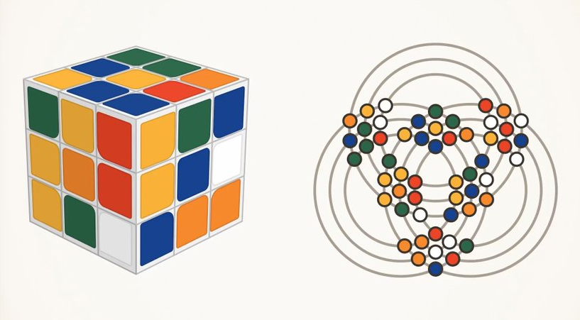
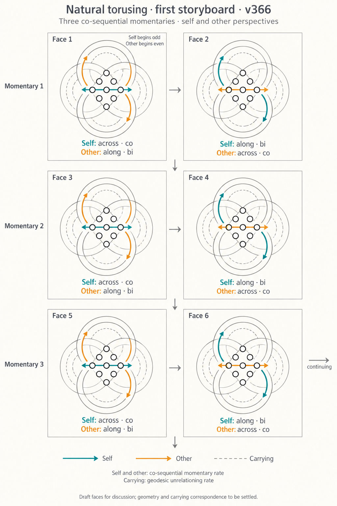
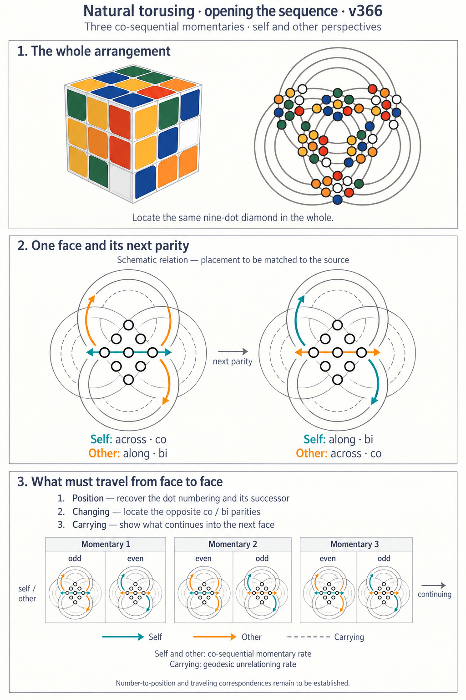
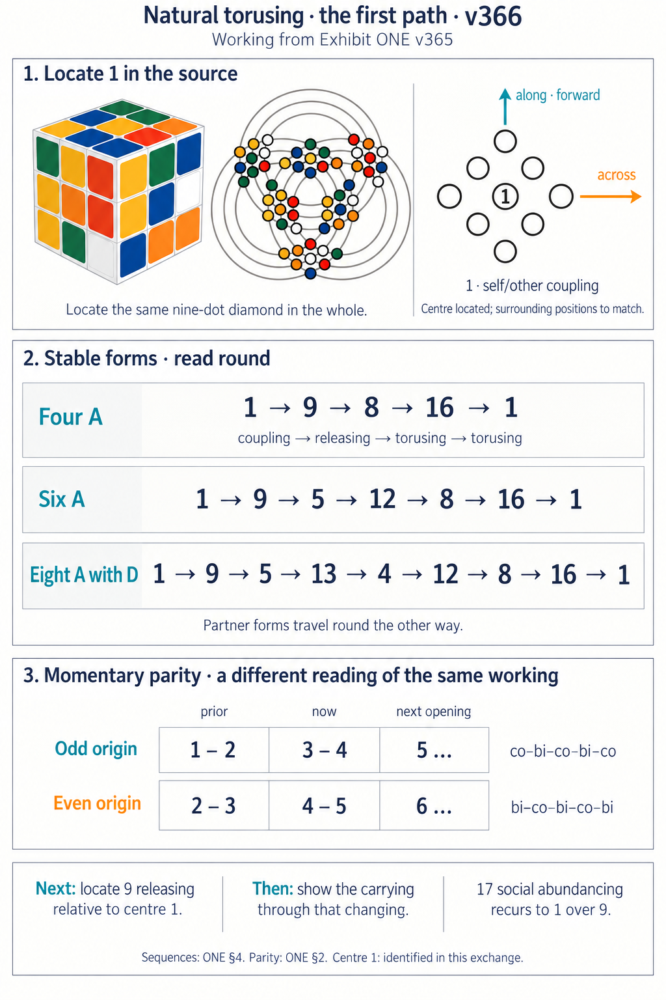
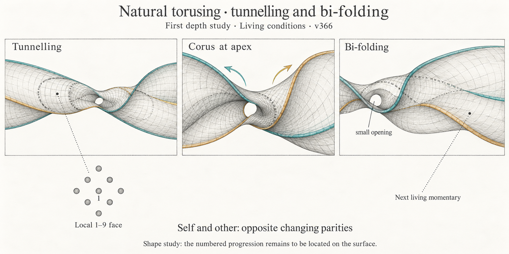

# Natural Illustrating · Illustration Kit · v366

**Discovering Intelligent Stable Forms**

This kit gathers the original image, every visual study generated in this session, the current exhibit, and the supporting material needed for further illustrating. New images can join this kit with their source and the relation they contribute.

Open [Natural Illustrating](Exhibit_TWENTY-NINE_Natural_Illustrating_v366.md) for the concepts and [the session report](Session_Report_v366.md) for what this session added and where it belongs. The exhibit here is a snapshot of the current working file, not a separate editorial branch. Continue improving the living exhibit and refresh the kit snapshot when gathering the next handoff.

## Images in their order of development

| File | Contribution | Present standing |
| --- | --- | --- |
| [00 · Original cube and open rings](images/00_Rubiks_Cube_and_Open_Rings_Origin.png) | The original Rubik’s cube beside the open circle-and-dot arrangement | Source image, unchanged; center 1 is identified by the session, not printed into this original |
| [01 · Opposite parity storyboard](images/01_Opposite_Parity_Storyboard_Draft.png) | Six schematic faces through three momentaries | Early study; circling and carrying’s distinct traveling remain to express |
| [02 · Opening study, superseded labels](images/02_Opening_Study_Superseded_Parity_Labels.png) | Starter, local enlargement and parity strip | Retained for its composition; bottom parity labels are superseded by image 03 |
| [03 · Opening study, corrected labels](images/03_Opening_Study_Corrected_Parity_Labels.png) | Corrected odd/even and even/odd labeling | Corrected schematic, not a completed numbered transition model |
| [04 · Expanded resolver cycles](images/04_Expanded_Resolver_Cycles_Study.png) | Expanded Four A, Six A and Eight A beside the local face | Expanded society numbering must not be read as the local nine-dot itinerary |
| [05 · Tunneling, corus and bi-folding](images/05_Tunneling_Corus_Bifolding_Depth_Study.png) | Twisting surface, central opening and local diamond | Proposed depth form; six-diamond surface correspondence remains to express |

All six images are copied byte-for-byte. No image has been redrawn, repaired, renumbered or recropped in this packaging pass. Repeated original attachments and repeated edit-target attachments have identical hashes and are represented once. Five generated studies and one original are six distinct images, not six verified stages of one animation.

### Original

### Opposite parity study

### Superseded opening labels

### Corrected opening labels

### Expanded society cycles

### Depth study

## Sources and inherited support

- [Latest supplied working ONE](sources/Exhibit_ONE_Natural_Resolver_v365_latest_supplied.md) and [earlier supplied working ONE](sources/Exhibit_ONE_Natural_Resolver_v365_earlier_supplied.md) retain both arrivals. Their v365 names identify source editions; the kit is v366.
- [Recovered session transcript](sources/Session_Transcript_Recovered_v366.md) contains all 101 user and assistant messages on the shared active branch, including redacted tool placeholders. Those placeholders cannot reproduce missing tool output. The session report carries the later packaging pass.
- [Supplied biology transcript](sources/Biology_Transcript_Supplied.md) supports the comparison carried in the session report.
- [Inherited Rings in Motion](inherited/Kit_Rings_in_Motion_v365/Kit_Rings_in_Motion_v365.md) retains its existing images, geometry data, scripts, outputs and moving-view material. These arrived before this session. Earlier 0/9 center conventions and “two journeys” wording must be read beside this session’s center-1 and one-continuing corrections; do not silently combine them.
- `session_evidence/resolver_checks/` retains the exact conservation-scope script, outputs and dependencies. These support the report’s resolver finding; they are not new illustration code.
- `session_evidence/Source_Inventory_v366.json` records the repository basis inspected at the opening pass. `Conformance_Check_v366.json` records the earlier five-narrative retention check, not a claim that every later exchange had already entered that earlier consolidation.
- `session_evidence/image_provenance.json` records original session paths and image hashes. `SHA256SUMS.txt` covers every other file in this kit.

## Continuing the kit

Receive a further image with a meaningful filename, its source, the concept it expresses, and the part still needing expression. Add its entry here and place its learning in Natural Illustrating or the session report for its intended living file. A correction can supersede a label while preserving an image’s useful composition. Keep that relation explicit.

The next visual work remains available through the exhibit’s concepts. This packaging pass creates no additional animation and performs no GitHub publication. The lockstitch source correction recovered while reviewing the session is in the report, ready to enter the living exhibit.
